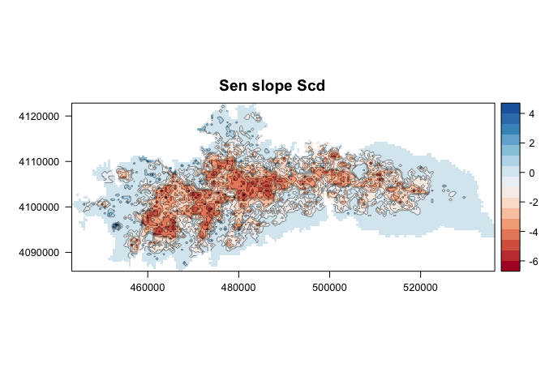

``` r
################################################################
# Load packages 
library("rgdal")
```

    ## Loading required package: sp
    ## rgdal: version: 1.0-4, (SVN revision 548)
    ##  Geospatial Data Abstraction Library extensions to R successfully loaded
    ##  Loaded GDAL runtime: GDAL 1.11.2, released 2015/02/10
    ##  Path to GDAL shared files: /Library/Frameworks/R.framework/Versions/3.2/Resources/library/rgdal/gdal
    ##  Loaded PROJ.4 runtime: Rel. 4.9.1, 04 March 2015, [PJ_VERSION: 491]
    ##  Path to PROJ.4 shared files: /Library/Frameworks/R.framework/Versions/3.2/Resources/library/rgdal/proj
    ##  Linking to sp version: 1.1-1

``` r
library("sp")
library("raster")
library("rasterVis") 
```

    ## Loading required package: lattice
    ## Loading required package: latticeExtra
    ## Loading required package: RColorBrewer

``` r
# Tool https://geoscripting-wur.github.io/ 
################################################################
```

En primer lugar leemos los datos

``` r
################################################################
# Read data

# Define name of indicators (see variables names)
indicadores <- c("scd", "scod", "scmd", "scmc", "pre", "pre_snow", "pre_snow_per", "temp")

# Loop to read files 
for (j in indicadores){ 
  aux <- read.csv(file=paste(di, "/data/derived/", j, ".csv", sep= ""),
              header = TRUE,
              sep = ',')
  assign(j, aux)
}

### Spatial Data
# Read spatial data
# centroides
centroides <- rgdal::readOGR(dsn=paste(di, "/data/geoinfo", sep=""),
                             layer = "centroides_selected", verbose = FALSE)

# Reproject to utm and m
centroides <- spTransform(centroides, CRS("+init=epsg:23030"))

# Get projection 
projection(centroides) 
```

    ## [1] "+init=epsg:23030 +proj=utm +zone=30 +ellps=intl +towgs84=-87,-98,-121,0,0,0,0 +units=m +no_defs"

``` r
# Select only attributes of interest and rename them
centroides <- centroides[c("id")]
names(centroides) <-"nie_malla_modi_id"

# Which pixels are in the MKTrends objet
pix_comunes <- match(scd$nie_malla_modi_id, centroides$nie_malla_modi_id)

# Create spatial objetc with centroid of Sierra Nevada
centroides_sn <- centroides[pix_comunes,]


# Loop to create raster map 
for (i in indicadores) { 
  trend <- get(i)
  
  # merge MKT and spatial pixel 
  aux_spatial <- sp::merge(x=centroides_sn, y=trend, by="nie_malla_modi_id")
  
  # raster auxiliar 
  aux_rast <- raster(aux_spatial, resolution=500)
  
  # variable z
  ztau <- paste("tau_",i, sep="")
  zsen <- paste("sen_slope_", i, sep="")
  
  # raster_tau 
  tau_raster <- rasterize(aux_spatial, aux_rast, ztau, fun=mean)
  names(tau_raster) <- i 
  sen_raster <- rasterize(aux_spatial, aux_rast, zsen, fun=mean)
  names(sen_raster) <- i 
  
  # assign 
  name_tau <- paste("r_tau_",i, sep="")
  name_sen <- paste("r_sen_",i, sep="")
  
  assign(name_tau, tau_raster)
  writeRaster(tau_raster, file=paste(di, "/data/derived/r_tau_", i, ".asc", sep=""), overwrite=TRUE)
  
  
  assign(name_sen, sen_raster)
  writeRaster(sen_raster, file=paste(di, "/data/derived/r_sen_", i, ".asc", sep=""), overwrite=TRUE)
  }

# Create stack of raster and save them 
# Tau stack 
stack_tau <- stack(r_tau_pre, r_tau_pre_snow, r_tau_pre_snow_per, r_tau_temp, 
                   r_tau_scd, r_tau_scod, r_tau_scmd, r_tau_scmc)

# Sen stack
stack_sen <- stack(r_sen_pre, r_sen_pre_snow, r_sen_pre_snow_per, r_sen_temp, 
                   r_sen_scd, r_sen_scod, r_sen_scmd, r_sen_scmc)
```

``` r
# Map raster
# See https://github.com/oscarperpinan/spacetime-vis/blob/master/raster.R 

## Hillshade 
# Read HillShade Andalusia 
hs <- raster(paste('/Users/', machine, '/Dropbox/carto_public/sombra/sombra_Andalusia.tif', sep=''))
projection(hs) <- "+proj=utm +ellps=WGS84"

# Crop hillshade 
# as.vector(extent(r_sen_pre))
# create an extent object 
my_extent <- c(442000, 542000, 4070000, 4130000)

# Crop hillshade 
hs_sn <- crop(hs, my_extent)

## Boundaries SN 
enp <- rgdal::readOGR(dsn=paste("/Users/", machine, "/Dropbox/carto_public/EENNPP/InfGeografica/InfVectorial/Shapes/ED50_30", sep=""),
                      layer = "EENNPP", verbose = FALSE)
# Subset limits of SN                      
sn <- subset(enp, NOMBRE == 'SIERRA NEVADA' & FIGURA == 'Espacio Natural')


levelplot(r_sen_pre, 
          par.settings=RdBuTheme, margin=FALSE, colorkey=TRUE, 
          contour=TRUE, 
          main="Sen slope Pre")
```


``` r
levelplot(r_sen_temp, 
          par.settings=RdBuTheme, margin=FALSE, colorkey=TRUE, 
          contour=TRUE, 
          main="Sen slope Temp")
```


``` r
levelplot(r_sen_pre_snow, 
          par.settings=RdBuTheme, margin=FALSE, colorkey=TRUE, 
          contour=TRUE, 
          main="Sen slope Pre snow")
```


``` r
levelplot(r_sen_pre_snow_per, 
          par.settings=RdBuTheme, margin=FALSE, colorkey=TRUE, 
          contour=TRUE, 
          main="Sen slope Pre snow")
```


``` r
levelplot(r_sen_scd, 
          par.settings=RdBuTheme, margin=FALSE, colorkey=TRUE, 
          contour=TRUE, 
          main="Sen slope Scd")
```



``` r
levelplot(r_sen_scod, 
          par.settings=RdBuTheme, margin=FALSE, colorkey=TRUE, 
          contour=TRUE, 
          main="Sen slope Scod")
```


``` r
levelplot(r_sen_scmd, 
          par.settings=RdBuTheme, margin=FALSE, colorkey=TRUE, 
          contour=TRUE, 
          main="Sen slope Scmd")
```


``` r
levelplot(r_sen_scmc, 
          par.settings=RdBuTheme, margin=FALSE, colorkey=TRUE, 
          contour=TRUE, 
          main="Sen slope Scmc")
```


``` r
levelplot(r_tau_pre, 
          margin=FALSE, colorkey=TRUE, 
          contour=TRUE, 
          main="Tau  Pre")
```


``` r
levelplot(r_tau_temp, 
          margin=FALSE, colorkey=TRUE, 
          contour=TRUE, 
          main="Tau  Temp")
```


``` r
levelplot(r_tau_pre_snow, 
          margin=FALSE, colorkey=TRUE, 
          contour=TRUE, 
          main="Tau  Pre snow")
```


``` r
levelplot(r_tau_pre_snow_per, 
          margin=FALSE, colorkey=TRUE, 
          contour=TRUE, 
          main="Tau  Pre snow")
```


``` r
levelplot(r_tau_scd, 
          margin=FALSE, colorkey=TRUE, 
          contour=TRUE, 
          main="Tau  Scd")
```


``` r
levelplot(r_tau_scod, 
          margin=FALSE, colorkey=TRUE, 
          contour=TRUE, 
          main="Tau  Scod")
```


``` r
levelplot(r_tau_scmd, 
          margin=FALSE, colorkey=TRUE, 
          contour=TRUE, 
          main="Tau  Scmd")
```


``` r
levelplot(r_tau_scmc, 
          margin=FALSE, colorkey=TRUE, 
          contour=TRUE, 
          main="Tau  Scmc")
```


