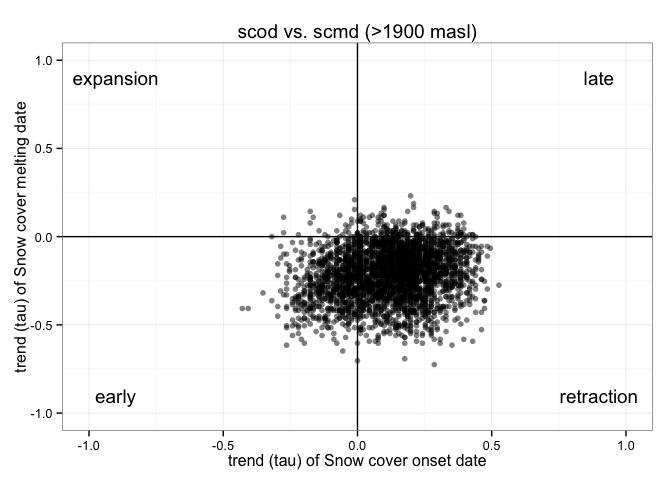

Prepare Data
------------

-   Read data of Mann-Kendal Sen-Slope for each pixels and each indicator: snow-cover related (scd, scod, scmd, scmc) and hydrological model (pre, pre\_snow, pre\_snow\_per, temp). See :red\_circle: (`$TODO`: include link to analysis)
-   Read data of topographic variable :red\_circle: (`$TODO`: Document script)
-   Create two dataframes:
-   Full Dataframe with all variables and all pixels
-   Dataframe with all variables and filter by pixels above 1900 *m.a.s.l.*

``` r
# Read data

# Define name of indicators (see variables names)
indicadores <- c("scd", "scod", "scmd", "scmc", "pre", "pre_snow", "pre_snow_per", "temp")

# Loop to read files 
for (j in indicadores){ 
  aux <- read.csv(file=paste(di, "/data/derived/", j, ".csv", sep= ""),
              header = TRUE,
              sep = ',')
  assign(j, aux)
}


# Read Topographic data 
rawtopo <- read.csv(file=paste(di, "/data/topo_nie_malla_modis.csv", sep=""),
                 header=TRUE,
                 sep = ",") 
```

Explore Snow-cover related indicators
-------------------------------------

We explore the pattern of the trend (*tau*) of the snow-cover indicators (see figure 1)


We applied this exploratory analysis for all pixels and for all pixels above 1900 m asl.

``` r
# Exploratory for all pixels 
ggplot(fulldf, aes(x=tau_scod, y=tau_scmd)) + 
  geom_point(alpha=0.5) + 
  xlim(-1,1) + ylim(-1,1) + 
  geom_vline(xintercept=0) +
  geom_hline(yintercept=0) + 
  annotate('text', label='early',  x=-.9, y=-.9) + 
  annotate('text', label='late', x=.9, y=.9)+
  annotate('text', label='contraction', x=.9, y=-.9)+
  annotate('text', label='expansion', x=-.9, y=.9) + 
  theme_bw() + 
  labs(title= 'scod vs. scmd',
    x= 'trend (tau) of Snow cover onset date',
    y='trend (tau) of Snow cover melting date') 
```


``` r
# Exploratory for pixels >1900
ggplot(fulldf1900, aes(x=tau_scod, y=tau_scmd)) + 
  geom_point(alpha=0.5) + 
  xlim(-1,1) + ylim(-1,1) + 
  geom_vline(xintercept=0) +
  geom_hline(yintercept=0) + 
  annotate('text', label='early',  x=-.9, y=-.9) + 
  annotate('text', label='late', x=.9, y=.9)+
  annotate('text', label='retraction', x=.9, y=-.9)+
  annotate('text', label='expansion', x=-.9, y=.9) + 
  theme_bw() + 
  labs(title= 'scod vs. scmd (>1900 masl)',
    x= 'trend (tau) of Snow cover onset date',
    y='trend (tau) of Snow cover melting date') 
```


