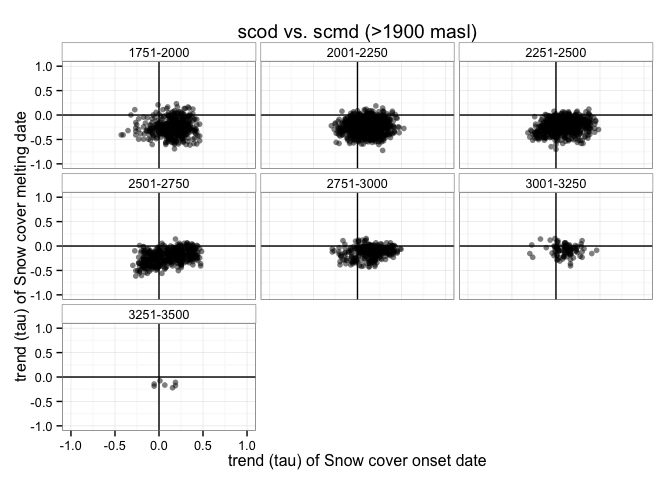

``` r
# Load packages 
library("dplyr")
```

    ## 
    ## Attaching package: 'dplyr'

    ## The following objects are masked from 'package:stats':
    ## 
    ##     filter, lag

    ## The following objects are masked from 'package:base':
    ## 
    ##     intersect, setdiff, setequal, union

``` r
library("ggplot2")
```

``` r
# Read data

# Define name of indicators (see variables names)
indicadores <- c("scd", "scod", "scmd", "scmc", "pre", "pre_snow", "pre_snow_per", "temp")

# Loop to read files 
for (j in indicadores){ 
  aux <- read.csv(file=paste(di, "/data/derived/", j, ".csv", sep= ""),
              header = TRUE,
              sep = ',')
  assign(j, aux)
}


# Read Topographic data 
rawtopo <- read.csv(file=paste(di, "/data/topo_nie_malla_modis.csv", sep=""),
                 header=TRUE,
                 sep = ",") 
```

Select topographic attributes and create a raw dataframe with all variables
---------------------------------------------------------------------------

``` r
# function to convert radian to degree 
rad2deg <- function(rad) {(rad * 180) / (pi)} 


# Select only pixels of interest and convert radians to degree
topo <- rawtopo %>% 
  filter(id %in% scd$nie_malla_modi_id) %>% 
  mutate(nie_malla_modi_id = id, 
         slope50mean_deg = rad2deg(slope50mean),
         slope50median_deg = rad2deg(slope50median),
         aspect50mean_deg = rad2deg(aspect50mean),
         aspect50median_deg = rad2deg(aspect50median)) %>%
  select(nie_malla_modi_id, dem50mean, dem50median, slope50mean_deg, 
         slope50median_deg, aspect50mean_deg, aspect50median_deg) 

## Create interval variables (250 m) for dem 
topo <- topo %>% 
  mutate(dem50mean_group = cut(dem50mean, 
                         breaks = seq(from=0, to=3500, by=250),
                         labels = c("0-250", "251-500","501-750","751-1000",
                                    "1001-1250","1251-1500","1501-1750","1751-2000",
                                    "2001-2250","2251-2500","2501-2750", "2751-3000",
                                    "3001-3250", "3251-3500")),
         dem50median_group = cut(dem50median, 
                         breaks = seq(from=0, to=3500, by=250),
                         labels = c("0-250", "251-500","501-750","751-1000",
                                    "1001-1250","1251-1500","1501-1750","1751-2000",
                                    "2001-2250","2251-2500","2501-2750", "2751-3000",
                                    "3001-3250", "3251-3500"))) 

# Create un dataframe con todos los datos
fulldf <- topo %>% 
  inner_join(scod,  by=c("nie_malla_modi_id")) %>% 
  inner_join(scd,  by=c("nie_malla_modi_id")) %>% 
  inner_join(scmd,  by=c("nie_malla_modi_id")) %>% 
  inner_join(scmc,  by=c("nie_malla_modi_id")) %>% 
  inner_join(pre,  by=c("nie_malla_modi_id")) %>% 
  inner_join(pre_snow,  by=c("nie_malla_modi_id")) %>% 
  inner_join(pre_snow_per,  by=c("nie_malla_modi_id")) %>% 
  inner_join(temp,  by=c("nie_malla_modi_id")) 
```

Analysis of the correlation between taus.
-----------------------------------------

### Relation between *scod* and *scmd*

-   See blackboard figure

``` r
# Exploratory for all pixels 
ggplot(fulldf, aes(x=tau_scod, y=tau_scmd)) + 
  geom_point(alpha=0.5) + 
  xlim(-1,1) + ylim(-1,1) + 
  geom_vline(xintercept=0) +
  geom_hline(yintercept=0) + 
  annotate('text', label='early',  x=-.9, y=-.9) + 
  annotate('text', label='late', x=.9, y=.9)+
  annotate('text', label='contraction', x=.9, y=-.9)+
  annotate('text', label='expansion', x=-.9, y=.9) + 
  theme_bw() + 
  labs(title= 'scod vs. scmd',
    x= 'trend (tau) of Snow cover onset date',
    y='trend (tau) of Snow cover melting date') 
```


``` r
## Remove below 1900 
fulldf1900 <- fulldf %>% 
  filter(dem50mean > 1900)  

# Exploratory for pixels >1900
ggplot(fulldf1900, aes(x=tau_scod, y=tau_scmd)) + 
  geom_point(alpha=0.5) + 
  xlim(-1,1) + ylim(-1,1) + 
  geom_vline(xintercept=0) +
  geom_hline(yintercept=0) + 
  annotate('text', label='early',  x=-.9, y=-.9) + 
  annotate('text', label='late', x=.9, y=.9)+
  annotate('text', label='contraction', x=.9, y=-.9)+
  annotate('text', label='expansion', x=-.9, y=.9) + 
  theme_bw() + 
  labs(title= 'scod vs. scmd (>1900 masl)',
    x= 'trend (tau) of Snow cover onset date',
    y='trend (tau) of Snow cover melting date') 
```


``` r
# Exploratory by elevatin groups 
ggplot(fulldf1900, aes(x=tau_scod, y=tau_scmd)) + 
  geom_point(alpha=0.5) + 
  xlim(-1,1) + ylim(-1,1) + 
  geom_vline(xintercept=0) +
  geom_hline(yintercept=0) + 
  facet_wrap(~dem50mean_group) + 
  theme_bw() + 
  xlab('trend (tau) of Snow cover onset date')+ 
  ylab('trend (tau) of Snow cover melting date') + 
  labs(title= 'scod vs. scmd (>1900 masl)',
       x= 'trend (tau) of Snow cover onset date',
       y='trend (tau) of Snow cover melting date') +
  theme(strip.background = element_rect(fill = "white"))
```


