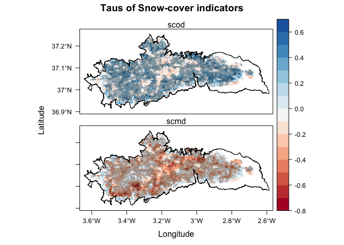
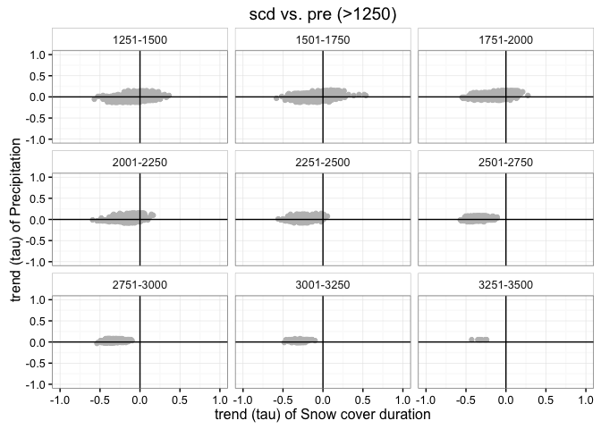
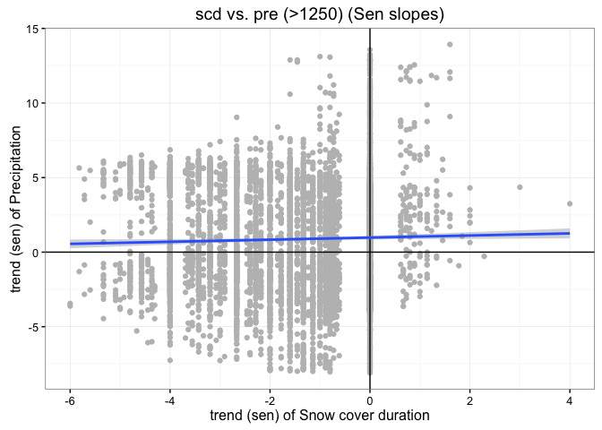
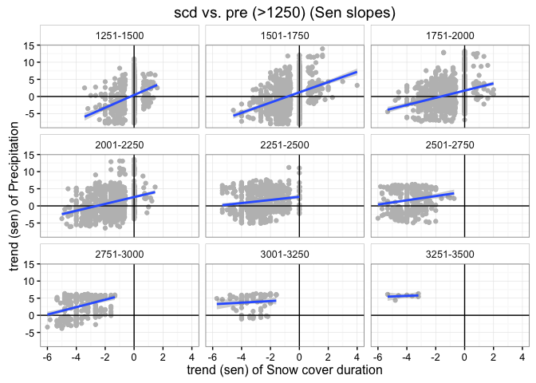
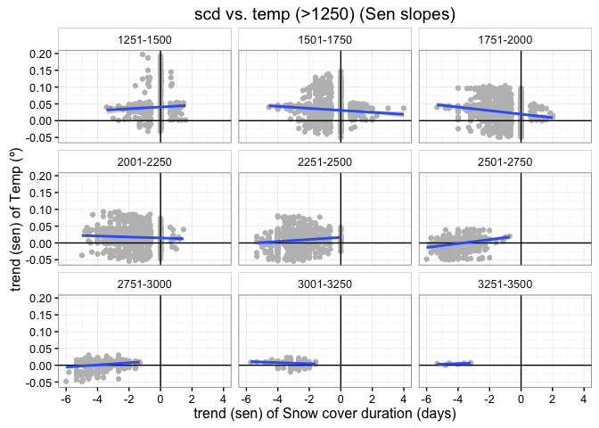
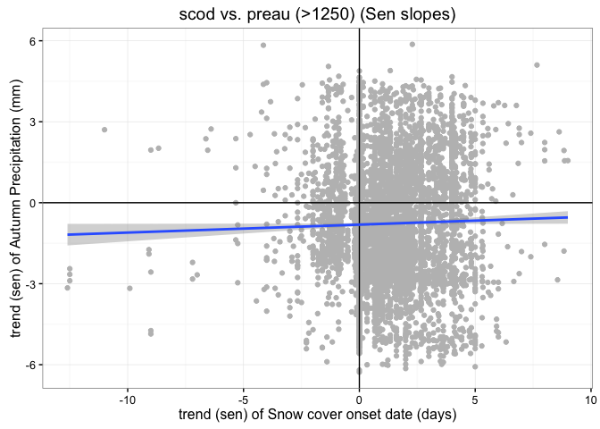
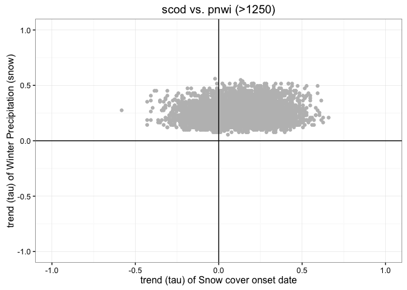
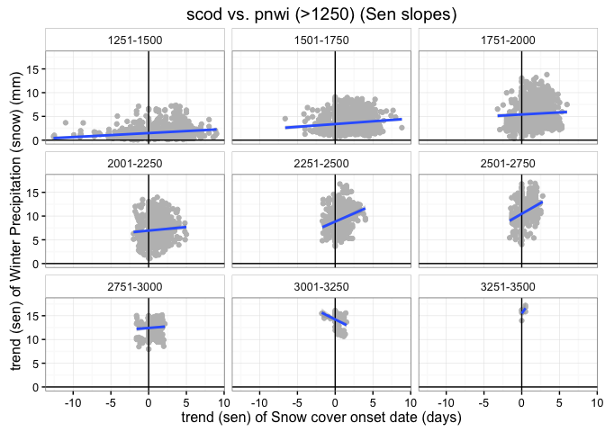

Prepare Data
------------

-   Read data of Mann-Kendal Sen-Slope for each pixels and each indicator: snow-cover related (scd, scod, scmd, scmc) and hydrological model (annual pre, pre\_snow, pre\_snow\_per, temp; and seasonal pre, pn and temp).
-   Read data of topographic variable :red\_circle: (`$TODO`: Document script)
-   Create two dataframes:
-   Full Dataframe with all variables and all pixels
-   Dataframe with all variables and filter by pixels above 1250 *m.a.s.l.*

``` r
# Read Trend analysis data
# Define name of indicators (see variables names)

indicadores <- c("scd", "scod", "scmd", "scmc",
                 "pre", "pre_snow", "pre_snow_per", "temp", 
                 "pnau", "pnsp", "pnsu", "pnwi",
                 "preau", "presp", "presu", "prewi",
                 "tempau", "tempsp", "tempsu", "tempwi")

# Loop to read files 
for (j in indicadores){ 
  aux <- read.csv(file=paste(di, "/data/derived/", j, ".csv", sep= ""),
              header = TRUE,
              sep = ',')
  assign(j, aux)
}
# --

# Define pixels of interes 
pixels_interes <- pre$nie_malla_modi_id

# Read Topographic data 
rawtopo <- read.csv(file=paste(di, "/data/topo_nie_malla_modis.csv", sep=""),
                    header=TRUE,
                    sep = ",") 

# function to convert radian to degree 
rad2deg <- function(rad) {(rad * 180) / (pi)} 


topo <- rawtopo %>% 
  filter(id %in% pixels_interes) %>% 
  mutate(nie_malla_modi_id = id, 
         slope50mean_deg = rad2deg(slope50mean),
         slope50median_deg = rad2deg(slope50median),
         aspect50mean_deg = rad2deg(aspect50mean),
         aspect50median_deg = rad2deg(aspect50median)) %>%
  dplyr::select(nie_malla_modi_id, dem50mean, dem50median, slope50mean_deg, 
                slope50median_deg, aspect50mean_deg, aspect50median_deg) 

## Create interval variables (250 m) for dem; and classify aspect into 8 categories 
topo <- topo %>% 
  mutate(dem50mean_group = cut(dem50mean, 
                         breaks = seq(from=0, to=3500, by=250),
                         labels = c("0-250", "251-500","501-750","751-1000",
                                    "1001-1250","1251-1500","1501-1750","1751-2000",
                                    "2001-2250","2251-2500","2501-2750", "2751-3000",
                                    "3001-3250", "3251-3500")),
         aspect50mean_deg_group = cut(aspect50mean_deg, 
                                      breaks= c(22.5, 67.5, 112.5, 157.5, 202.5, 247.5, 292.5, 337.5, 359.5),
                                      labels = c("N", "NE", "E", "SE", "S", "SW", "W", "NW")))


# --

# Read spatial data and Get lat/long
centroides <- rgdal::readOGR(dsn=paste(di, "/data/geoinfo", sep=""),
                             layer = "centroides_selected", verbose = FALSE)
# Select only attributes of interest and rename them
centroides <- centroides[c("id")]

# Create lat/lng by id 
xycentroides <- cbind(centroides@data, coordinates(centroides))
names(xycentroides) <- c("nie_malla_modi_id", "lon","lat")

xycentroides <- filter(xycentroides, nie_malla_modi_id %in% pixels_interes)
# -- 

# Hydrological basin 
basin <- read.csv(file=paste(di, "/data/derived/pixel_region.csv", sep=""),
                    header=TRUE,
                    sep = ",") 
# --


# Create un dataframe con todos los datos
fulldf <- topo %>% 
  inner_join(scd,  by=c("nie_malla_modi_id")) %>% 
  inner_join(scod,  by=c("nie_malla_modi_id")) %>% 
  inner_join(scmd,  by=c("nie_malla_modi_id")) %>% 
  inner_join(scmc,  by=c("nie_malla_modi_id")) %>%
  inner_join(pre,  by=c("nie_malla_modi_id")) %>% 
  inner_join(pre_snow,  by=c("nie_malla_modi_id")) %>% 
  inner_join(pre_snow_per,  by=c("nie_malla_modi_id")) %>% 
  inner_join(temp,  by=c("nie_malla_modi_id")) %>% 
  inner_join(pnau,  by=c("nie_malla_modi_id")) %>% 
  inner_join(pnsp,  by=c("nie_malla_modi_id")) %>% 
  inner_join(pnsu,  by=c("nie_malla_modi_id")) %>% 
  inner_join(pnwi,  by=c("nie_malla_modi_id")) %>% 
  inner_join(preau,  by=c("nie_malla_modi_id")) %>% 
  inner_join(presp,  by=c("nie_malla_modi_id")) %>% 
  inner_join(presu,  by=c("nie_malla_modi_id")) %>% 
  inner_join(prewi,  by=c("nie_malla_modi_id")) %>% 
  inner_join(tempau,  by=c("nie_malla_modi_id")) %>% 
  inner_join(tempsp,  by=c("nie_malla_modi_id")) %>% 
  inner_join(tempsu,  by=c("nie_malla_modi_id")) %>% 
  inner_join(tempwi,  by=c("nie_malla_modi_id")) %>% 
  inner_join(xycentroides, by="nie_malla_modi_id") %>%
  inner_join(basin, by="nie_malla_modi_id")


# Create subset of pixels above 1250 
fulldf1250 <- fulldf %>% 
  filter(dem50mean > 1250)  
```

Explore Snow-cover related indicators
-------------------------------------

We explore the pattern of the trend (*tau*) of the snow-cover indicators (see figure 1).

By exploring the relationship between the trend of two indicators of snow cover (scod: snow cover onset date; and scmd: snow cover melting date) we can describe the temporal evolution of snow cover in Sierra Nevada from 2000-2014. This relationship is evaluated at pixel scale (figure 1c) and we have four potential scenarios:

-   Expansion
-   Contraction
-   Shift (delay and advance)

**Figure 1** 

We applied this exploratory analysis for all pixels and for all pixels above 1900 *m asl*.


``` r
aux <- round(((df %>% filter(tau_scod > 0) %>% filter(tau_scmd < 0) %>% count()) / df %>% count())*100, 2)
```

A total of 63.55 % of pixels (of all above 1250) showed a positive trend in snow cover onset date (late onset) and a negative trend in snow cover melting date (earlier melting date). It means that of 63.55 % of the pixels above 1250 m, have suffered a trend to rectraction of the snow cover period in the last years (Figure 3).

We also can explore this relationship by elevation (Figure 4), and we obtanied that the *retraction pattern* is more evident at low elevations


``` r
# Compute percentage of pixels (tau scod > 0, tau_scmd < 0)   
aux <- df %>% group_by(dem50mean_group) %>% 
  summarise(total=n())

aux1 <- df %>% group_by(dem50mean_group) %>% 
  filter(tau_scod > 0) %>% 
  filter(tau_scmd < 0) %>% 
  summarise(n=n()) %>%
  inner_join(aux, by="dem50mean_group") %>%
  mutate(freq = round((n / total)*100,2))
pander(aux1, caption = '% pixels scod tau_scod > 0 & tau_scmd < 0')
```

<table style="width:53%;">
<caption>% pixels scod tau_scod &gt; 0 &amp; tau_scmd &lt; 0</caption>
<colgroup>
<col width="25%" />
<col width="5%" />
<col width="11%" />
<col width="11%" />
</colgroup>
<thead>
<tr class="header">
<th align="center">dem50mean_group</th>
<th align="center">n</th>
<th align="center">total</th>
<th align="center">freq</th>
</tr>
</thead>
<tbody>
<tr class="odd">
<td align="center">1251-1500</td>
<td align="center">419</td>
<td align="center">1235</td>
<td align="center">33.93</td>
</tr>
<tr class="even">
<td align="center">1501-1750</td>
<td align="center">910</td>
<td align="center">1377</td>
<td align="center">66.09</td>
</tr>
<tr class="odd">
<td align="center">1751-2000</td>
<td align="center">964</td>
<td align="center">1211</td>
<td align="center">79.60</td>
</tr>
<tr class="even">
<td align="center">2001-2250</td>
<td align="center">738</td>
<td align="center">977</td>
<td align="center">75.54</td>
</tr>
<tr class="odd">
<td align="center">2251-2500</td>
<td align="center">456</td>
<td align="center">704</td>
<td align="center">64.77</td>
</tr>
<tr class="even">
<td align="center">2501-2750</td>
<td align="center">278</td>
<td align="center">470</td>
<td align="center">59.15</td>
</tr>
<tr class="odd">
<td align="center">2751-3000</td>
<td align="center">227</td>
<td align="center">314</td>
<td align="center">72.29</td>
</tr>
<tr class="even">
<td align="center">3001-3250</td>
<td align="center">64</td>
<td align="center">95</td>
<td align="center">67.37</td>
</tr>
<tr class="odd">
<td align="center">3251-3500</td>
<td align="center">5</td>
<td align="center">7</td>
<td align="center">71.43</td>
</tr>
</tbody>
</table>

``` r
aux2 <- df %>% group_by(dem50mean_group) %>% 
  filter(tau_scod > 0.25) %>% 
  filter(tau_scmd < -0.25) %>% 
  summarise(n=n()) %>%
  inner_join(aux, by="dem50mean_group") %>%
  mutate(freq = round((n / total)*100,2))
pander(aux2, caption = '% pixels scod tau_scod > 0.25 & tau_scmd < -0.25')
```

<table style="width:53%;">
<caption>% pixels scod tau_scod &gt; 0.25 &amp; tau_scmd &lt; -0.25</caption>
<colgroup>
<col width="25%" />
<col width="5%" />
<col width="11%" />
<col width="11%" />
</colgroup>
<thead>
<tr class="header">
<th align="center">dem50mean_group</th>
<th align="center">n</th>
<th align="center">total</th>
<th align="center">freq</th>
</tr>
</thead>
<tbody>
<tr class="odd">
<td align="center">1251-1500</td>
<td align="center">12</td>
<td align="center">1235</td>
<td align="center">0.97</td>
</tr>
<tr class="even">
<td align="center">1501-1750</td>
<td align="center">136</td>
<td align="center">1377</td>
<td align="center">9.88</td>
</tr>
<tr class="odd">
<td align="center">1751-2000</td>
<td align="center">225</td>
<td align="center">1211</td>
<td align="center">18.58</td>
</tr>
<tr class="even">
<td align="center">2001-2250</td>
<td align="center">75</td>
<td align="center">977</td>
<td align="center">7.68</td>
</tr>
<tr class="odd">
<td align="center">2251-2500</td>
<td align="center">36</td>
<td align="center">704</td>
<td align="center">5.11</td>
</tr>
<tr class="even">
<td align="center">2501-2750</td>
<td align="center">29</td>
<td align="center">470</td>
<td align="center">6.17</td>
</tr>
<tr class="odd">
<td align="center">2751-3000</td>
<td align="center">3</td>
<td align="center">314</td>
<td align="center">0.96</td>
</tr>
</tbody>
</table>

``` r
# Map of pixels with negative trend tau in scod and scmd 
dfauxmap <- dfaux %>%
  dplyr::select(nie_malla_modi_id)


dfauxmap <- df %>% 
  dplyr::select(nie_malla_modi_id, tau_scod, tau_scmd) %>%
  mutate(retraction = ifelse(tau_scod > 0 & tau_scmd < 0, 1, 0))   

table(dfauxmap$retraction) 
```

    ## 
    ##    0    1 
    ## 2329 4061

``` r
centroides <- rgdal::readOGR(dsn=paste(di, "/data/geoinfo", sep=""),
                             layer = "centroides_selected", verbose = FALSE)
# Select only attributes of interest and rename them
centroides <- centroides[c("id")]
names(centroides) <-"nie_malla_modi_id"
# Reproject to utm and m
centroides <- spTransform(centroides, CRS("+init=epsg:23030"))

# Get projection 
projection(centroides) 
```

    ## [1] "+init=epsg:23030 +proj=utm +zone=30 +ellps=intl +towgs84=-87,-98,-121,0,0,0,0 +units=m +no_defs"

``` r
# Which pixels are in the dfauxmap objet
pix_comunes <- match(dfauxmap$nie_malla_modi_id, centroides$nie_malla_modi_id)

# Create spatial objetc with centroid of Sierra Nevada
centroides_sn <- centroides[pix_comunes,] 


# merge dfauxmap and spatial pixel 
aux_spatial <- sp::merge(x=centroides_sn, y=dfauxmap, by="nie_malla_modi_id")

# raster auxiliar 
aux_rast <- raster(aux_spatial, resolution=500)

  # Rasterize 
raster_retraction <- rasterize(aux_spatial, aux_rast, 'retraction')

# convert to polygon
pol <- rasterToPolygons(raster_retraction, fun=function(x){x==1})


# Read stack of trends
myfilename <- paste0(di, "/data/derived/r_tau_stack_1250.grd")

r_stack_tau_1250 <- stack(myfilename)
# system.file("/data/derived/r_tau_stack_1250.grd", package="raster"))

# Auxiliar layer for Reproject the maps 
aux_project <- rgdal::readOGR(dsn=paste(di, "/data/geoinfo", sep=""),
                             layer = "centroides_selected", verbose = FALSE)

crs_aux_project <- projection(aux_project)

## Boundaries SN 
enp <- rgdal::readOGR(dsn=paste("/Users/", machine, "/Dropbox/carto_public/EENNPP/InfGeografica/InfVectorial/Shapes/ED50_30", sep=""),
                      layer = "EENNPP", verbose = FALSE)
# Subset limits of SN                      
sn <- subset(enp, NOMBRE == 'SIERRA NEVADA' & FIGURA == 'Espacio Natural')

# Reproject limits
sn_re <- spTransform(sn, CRS(crs_aux_project))


# Reproject Raster stack
r_stack_tau_1250_re <- projectRaster(r_stack_tau_1250, crs=crs(aux_project))


# Reproject pol 
pol_re <- spTransform(pol, CRS(crs_aux_project))


lp <- levelplot(r_stack_tau_1250_re, 
          layer=c("scod","scmd"), 
          par.settings=RdBuTheme,
          pretty=TRUE,
          #contour=TRUE,  
          #at=seq(-1,1, by=.1),
          main= 'Taus of Snow-cover indicators', 
          layout=c(1,2)) + 
  latticeExtra::layer(sp.polygons(pol_re, col='black', lwd=0.5, alpha=.5)) +
  latticeExtra::layer(sp.polygons(sn_re))


print(lp)
```



``` r
exportpdf(mypdf=paste0(di, '/images/raster_maps/r_retraction.pdf'), lp) 
```

    ## quartz_off_screen 
    ##                 2

Table of relationships
======================

``` r
indicadores <- c("pre", "pre_snow", "pre_snow_per", "temp", 
                 "pnau", "pnsp", "pnsu", "pnwi",
                 "preau", "presp", "presu", "prewi",
                 "tempau", "tempsp", "tempsu", "tempwi")

d <- data.frame(variable = indicadores, 
                scd = c(1,1,1,1, rep(0,12)),
                scod = c(rep(0,4),1,1,0,0,1,1,0,0,1,1,0,0),
                scmd = c(rep(0,5),1,1,0,0,1,1,0,0,1,1,0))
pander(d, caption = 'Potential relationships')
```

<table style="width:46%;">
<caption>Potential relationships</caption>
<colgroup>
<col width="18%" />
<col width="8%" />
<col width="9%" />
<col width="9%" />
</colgroup>
<thead>
<tr class="header">
<th align="center">variable</th>
<th align="center">scd</th>
<th align="center">scod</th>
<th align="center">scmd</th>
</tr>
</thead>
<tbody>
<tr class="odd">
<td align="center">pre</td>
<td align="center">1</td>
<td align="center">0</td>
<td align="center">0</td>
</tr>
<tr class="even">
<td align="center">pre_snow</td>
<td align="center">1</td>
<td align="center">0</td>
<td align="center">0</td>
</tr>
<tr class="odd">
<td align="center">pre_snow_per</td>
<td align="center">1</td>
<td align="center">0</td>
<td align="center">0</td>
</tr>
<tr class="even">
<td align="center">temp</td>
<td align="center">1</td>
<td align="center">0</td>
<td align="center">0</td>
</tr>
<tr class="odd">
<td align="center">pnau</td>
<td align="center">0</td>
<td align="center">1</td>
<td align="center">0</td>
</tr>
<tr class="even">
<td align="center">pnsp</td>
<td align="center">0</td>
<td align="center">1</td>
<td align="center">1</td>
</tr>
<tr class="odd">
<td align="center">pnsu</td>
<td align="center">0</td>
<td align="center">0</td>
<td align="center">1</td>
</tr>
<tr class="even">
<td align="center">pnwi</td>
<td align="center">0</td>
<td align="center">0</td>
<td align="center">0</td>
</tr>
<tr class="odd">
<td align="center">preau</td>
<td align="center">0</td>
<td align="center">1</td>
<td align="center">0</td>
</tr>
<tr class="even">
<td align="center">presp</td>
<td align="center">0</td>
<td align="center">1</td>
<td align="center">1</td>
</tr>
<tr class="odd">
<td align="center">presu</td>
<td align="center">0</td>
<td align="center">0</td>
<td align="center">1</td>
</tr>
<tr class="even">
<td align="center">prewi</td>
<td align="center">0</td>
<td align="center">0</td>
<td align="center">0</td>
</tr>
<tr class="odd">
<td align="center">tempau</td>
<td align="center">0</td>
<td align="center">1</td>
<td align="center">0</td>
</tr>
<tr class="even">
<td align="center">tempsp</td>
<td align="center">0</td>
<td align="center">1</td>
<td align="center">1</td>
</tr>
<tr class="odd">
<td align="center">tempsu</td>
<td align="center">0</td>
<td align="center">0</td>
<td align="center">1</td>
</tr>
<tr class="even">
<td align="center">tempwi</td>
<td align="center">0</td>
<td align="center">0</td>
<td align="center">0</td>
</tr>
</tbody>
</table>

Snow cover duration relationships
=================================

SCD and PRE
-----------

``` r
mytitle<- "scd vs. pre (>1250)"
myxlab <- "trend (tau) of Snow cover duration"
myylab <- "trend (tau) of Precipitation"

xvar <- 'tau_scd'
yvar <- 'tau_pre'

# Taus  
gt <- ggplot(df, aes_string(x=xvar, y=yvar)) + 
  geom_point(col='gray') + 
  xlim(-1,1) + ylim(-1,1) + 
  geom_vline(xintercept=0) +
  geom_hline(yintercept=0) + 
  theme_bw() + ggtitle(mytitle) + xlab(myxlab) + ylab(myylab) +
  theme(strip.background = element_rect(fill = "white"))
gt
```


``` r
gt + facet_wrap(~dem50mean_group)
```



``` r
# Sen 
mytitle <- 'scd vs. pre (>1250) (Sen slopes)' 
myxlab <- 'trend (sen) of Snow cover duration'
myylab <- 'trend (sen) of Precipitation'


xvar <- 'sen_slope_scd'
yvar <- 'sen_slope_pre'

gs <- ggplot(df, aes_string(x=xvar, y=yvar)) + 
  geom_point(col='gray') + 
  geom_vline(xintercept=0) +
  geom_hline(yintercept=0) + 
  theme_bw() + ggtitle(mytitle) + xlab(myxlab) + ylab(myylab) +
  theme(strip.background = element_rect(fill = "white")) + 
  geom_smooth(method='lm')
gs
```



``` r
## by elevation
gs + facet_wrap(~dem50mean_group)
```



SCD and PRE\_SNOW
-----------------

``` r
mytitle<- "scd vs. pre_snow (>1250)"
myxlab <- "trend (tau) of Snow cover duration"
myylab <- "trend (tau) of Snow Precipitation"

xvar <- 'tau_scd'
yvar <- 'tau_pre_snow'

# Taus  
gt <- ggplot(df, aes_string(x=xvar, y=yvar)) + 
  geom_point(col='gray') + 
  xlim(-1,1) + ylim(-1,1) + 
  geom_vline(xintercept=0) +
  geom_hline(yintercept=0) + 
  theme_bw() + ggtitle(mytitle) + xlab(myxlab) + ylab(myylab) +
  theme(strip.background = element_rect(fill = "white"))
gt
```


``` r
gt + facet_wrap(~dem50mean_group)
```


``` r
# Sen 
mytitle <- 'scd vs. pre_snow (>1250) (Sen slopes)' 
myxlab <- 'trend (sen) of Snow cover duration (days)'
myylab <- 'trend (sen) of Snow Precipitation (mm) '


xvar <- 'sen_slope_scd'
yvar <- 'sen_slope_pre_snow'

gs <- ggplot(df, aes_string(x=xvar, y=yvar)) + 
  geom_point(col='gray') + 
  geom_vline(xintercept=0) +
  geom_hline(yintercept=0) + 
  theme_bw() + ggtitle(mytitle) + xlab(myxlab) + ylab(myylab) +
  theme(strip.background = element_rect(fill = "white")) + 
  geom_smooth(method='lm')
gs
```


``` r
## by elevation
gs + facet_wrap(~dem50mean_group)
```


SCD and PRE\_SNOW\_PER
----------------------

``` r
mytitle<- "scd vs. pre_snow_per (>1250)"
myxlab <- "trend (tau) of Snow cover duration"
myylab <- "trend (tau) of Snow Precipitation (%)"

xvar <- 'tau_scd'
yvar <- 'tau_pre_snow_per'

# Taus  
gt <- ggplot(df, aes_string(x=xvar, y=yvar)) + 
  geom_point(col='gray') + 
  xlim(-1,1) + ylim(-1,1) + 
  geom_vline(xintercept=0) +
  geom_hline(yintercept=0) + 
  theme_bw() + ggtitle(mytitle) + xlab(myxlab) + ylab(myylab) +
  theme(strip.background = element_rect(fill = "white"))
gt
```


``` r
gt + facet_wrap(~dem50mean_group)
```


``` r
# Sen 
mytitle <- 'scd vs. pre_snow_per (>1250) (Sen slopes)' 
myxlab <- 'trend (sen) of Snow cover duration (days)'
myylab <- 'trend (sen) of % of Snow Precipitation (%) '


xvar <- 'sen_slope_scd'
yvar <- 'sen_slope_pre_snow_per'

gs <- ggplot(df, aes_string(x=xvar, y=yvar)) + 
  geom_point(col='gray') + 
  geom_vline(xintercept=0) +
  geom_hline(yintercept=0) + 
  theme_bw() + ggtitle(mytitle) + xlab(myxlab) + ylab(myylab) +
  theme(strip.background = element_rect(fill = "white")) + 
  geom_smooth(method='lm')
gs
```


``` r
## by elevation
gs + facet_wrap(~dem50mean_group)
```


SCD and TEMP
------------

``` r
mytitle<- "scd vs. temp (>1250)"
myxlab <- "trend (tau) of Snow cover duration"
myylab <- "trend (tau) of Temperature"

xvar <- 'tau_scd'
yvar <- 'tau_temp'

# Taus  
gt <- ggplot(df, aes_string(x=xvar, y=yvar)) + 
  geom_point(col='gray') + 
  xlim(-1,1) + ylim(-1,1) + 
  geom_vline(xintercept=0) +
  geom_hline(yintercept=0) + 
  theme_bw() + ggtitle(mytitle) + xlab(myxlab) + ylab(myylab) +
  theme(strip.background = element_rect(fill = "white"))
gt
```


``` r
gt + facet_wrap(~dem50mean_group)
```


``` r
# Sen 
mytitle <- 'scd vs. temp (>1250) (Sen slopes)' 
myxlab <- 'trend (sen) of Snow cover duration (days)'
myylab <- 'trend (sen) of Temp (º)'


xvar <- 'sen_slope_scd'
yvar <- 'sen_slope_temp'

gs <- ggplot(df, aes_string(x=xvar, y=yvar)) + 
  geom_point(col='gray') + 
  geom_vline(xintercept=0) +
  geom_hline(yintercept=0) + 
  theme_bw() + ggtitle(mytitle) + xlab(myxlab) + ylab(myylab) +
  theme(strip.background = element_rect(fill = "white")) + 
  geom_smooth(method='lm')
gs
```


``` r
## by elevation
gs + facet_wrap(~dem50mean_group)
```



Snow cover onset dates relationships
====================================

SCOD and PRE AUTUMN
-------------------

``` r
mytitle<- "scod vs. preau (>1250)"
myxlab <- "trend (tau) of Snow cover onset date"
myylab <- "trend (tau) of Autumn Precipitation"

xvar <- 'tau_scod'
yvar <- 'tau_preau'

# Taus  
gt <- ggplot(df, aes_string(x=xvar, y=yvar)) + 
  geom_point(col='gray') + 
  xlim(-1,1) + ylim(-1,1) + 
  geom_vline(xintercept=0) +
  geom_hline(yintercept=0) + 
  theme_bw() + ggtitle(mytitle) + xlab(myxlab) + ylab(myylab) +
  theme(strip.background = element_rect(fill = "white"))
gt
```


``` r
gt + facet_wrap(~dem50mean_group)
```


``` r
# Sen 
mytitle <- 'scod vs. preau (>1250) (Sen slopes)' 
myxlab <- 'trend (sen) of Snow cover onset date (days)'
myylab <- 'trend (sen) of Autumn Precipitation (mm)'


xvar <- 'sen_slope_scod'
yvar <- 'sen_slope_preau'

gs <- ggplot(df, aes_string(x=xvar, y=yvar)) + 
  geom_point(col='gray') + 
  geom_vline(xintercept=0) +
  geom_hline(yintercept=0) + 
  theme_bw() + ggtitle(mytitle) + xlab(myxlab) + ylab(myylab) +
  theme(strip.background = element_rect(fill = "white")) + 
  geom_smooth(method='lm')
gs
```



``` r
## by elevation
gs + facet_wrap(~dem50mean_group)
```


SCOD and PRE WINTER
-------------------

``` r
mytitle<- "scod vs. prewi (>1250)"
myxlab <- "trend (tau) of Snow cover onset date"
myylab <- "trend (tau) of Winter Precipitation"

xvar <- 'tau_scod'
yvar <- 'tau_prewi'

# Taus  
gt <- ggplot(df, aes_string(x=xvar, y=yvar)) + 
  geom_point(col='gray') + 
  xlim(-1,1) + ylim(-1,1) + 
  geom_vline(xintercept=0) +
  geom_hline(yintercept=0) + 
  theme_bw() + ggtitle(mytitle) + xlab(myxlab) + ylab(myylab) +
  theme(strip.background = element_rect(fill = "white"))
gt
```


``` r
gt + facet_wrap(~dem50mean_group)
```


``` r
# Sen 
mytitle <- 'scod vs. prewi (>1250) (Sen slopes)' 
myxlab <- 'trend (sen) of Snow cover onset date (days)'
myylab <- 'trend (sen) of Winter Precipitation (mm)'


xvar <- 'sen_slope_scod'
yvar <- 'sen_slope_prewi'

gs <- ggplot(df, aes_string(x=xvar, y=yvar)) + 
  geom_point(col='gray') + 
  geom_vline(xintercept=0) +
  geom_hline(yintercept=0) + 
  theme_bw() + ggtitle(mytitle) + xlab(myxlab) + ylab(myylab) +
  theme(strip.background = element_rect(fill = "white")) + 
  geom_smooth(method='lm')
gs
```


``` r
## by elevation
gs + facet_wrap(~dem50mean_group)
```


SCOD and PN AUTUMN
------------------

``` r
mytitle<- "scod vs. pnau (>1250)"
myxlab <- "trend (tau) of Snow cover onset date"
myylab <- "trend (tau) of Autumn Precipitation (snow)"

xvar <- 'tau_scod'
yvar <- 'tau_pnau'

# Taus  
gt <- ggplot(df, aes_string(x=xvar, y=yvar)) + 
  geom_point(col='gray') + 
  xlim(-1,1) + ylim(-1,1) + 
  geom_vline(xintercept=0) +
  geom_hline(yintercept=0) + 
  theme_bw() + ggtitle(mytitle) + xlab(myxlab) + ylab(myylab) +
  theme(strip.background = element_rect(fill = "white"))
gt
```


``` r
gt + facet_wrap(~dem50mean_group)
```


``` r
# Sen 
mytitle <- 'scod vs. pnau (>1250) (Sen slopes)' 
myxlab <- 'trend (sen) of Snow cover onset date (days)'
myylab <- 'trend (sen) of Autumn Precipitation (snow) (mm)'


xvar <- 'sen_slope_scod'
yvar <- 'sen_slope_pnau'

gs <- ggplot(df, aes_string(x=xvar, y=yvar)) + 
  geom_point(col='gray') + 
  geom_vline(xintercept=0) +
  geom_hline(yintercept=0) + 
  theme_bw() + ggtitle(mytitle) + xlab(myxlab) + ylab(myylab) +
  theme(strip.background = element_rect(fill = "white")) + 
  geom_smooth(method='lm')
gs
```


``` r
## by elevation
gs + facet_wrap(~dem50mean_group)
```


SCOD and PN WINTER
------------------

``` r
mytitle<- "scod vs. pnwi (>1250)"
myxlab <- "trend (tau) of Snow cover onset date"
myylab <- "trend (tau) of Winter Precipitation (snow)"

xvar <- 'tau_scod'
yvar <- 'tau_pnwi'

# Taus  
gt <- ggplot(df, aes_string(x=xvar, y=yvar)) + 
  geom_point(col='gray') + 
  xlim(-1,1) + ylim(-1,1) + 
  geom_vline(xintercept=0) +
  geom_hline(yintercept=0) + 
  theme_bw() + ggtitle(mytitle) + xlab(myxlab) + ylab(myylab) +
  theme(strip.background = element_rect(fill = "white"))
gt
```



``` r
gt + facet_wrap(~dem50mean_group)
```


``` r
# Sen 
mytitle <- 'scod vs. pnwi (>1250) (Sen slopes)' 
myxlab <- 'trend (sen) of Snow cover onset date (days)'
myylab <- 'trend (sen) of Winter Precipitation (snow) (mm)'


xvar <- 'sen_slope_scod'
yvar <- 'sen_slope_pnwi'

gs <- ggplot(df, aes_string(x=xvar, y=yvar)) + 
  geom_point(col='gray') + 
  geom_vline(xintercept=0) +
  geom_hline(yintercept=0) + 
  theme_bw() + ggtitle(mytitle) + xlab(myxlab) + ylab(myylab) +
  theme(strip.background = element_rect(fill = "white")) + 
  geom_smooth(method='lm')
gs
```


``` r
## by elevation
gs + facet_wrap(~dem50mean_group)
```



SCOD and TEMP AUTUMN
--------------------

``` r
mytitle<- "scod vs. tempau (>1250)"
myxlab <- "trend (tau) of Snow cover onset date"
myylab <- "trend (tau) of Autumn Temp"

xvar <- 'tau_scod'
yvar <- 'tau_tempau'

# Taus  
gt <- ggplot(df, aes_string(x=xvar, y=yvar)) + 
  geom_point(col='gray') + 
  xlim(-1,1) + ylim(-1,1) + 
  geom_vline(xintercept=0) +
  geom_hline(yintercept=0) + 
  theme_bw() + ggtitle(mytitle) + xlab(myxlab) + ylab(myylab) +
  theme(strip.background = element_rect(fill = "white"))
gt
```


``` r
gt + facet_wrap(~dem50mean_group)
```


``` r
# Sen 
mytitle <- 'scod vs. tempau (>1250) (Sen slopes)' 
myxlab <- 'trend (sen) of Snow cover onset date (days)'
myylab <- 'trend (sen) of Autumn Temp (º)'


xvar <- 'sen_slope_scod'
yvar <- 'sen_slope_tempau'

gs <- ggplot(df, aes_string(x=xvar, y=yvar)) + 
  geom_point(col='gray') + 
  geom_vline(xintercept=0) +
  geom_hline(yintercept=0) + 
  theme_bw() + ggtitle(mytitle) + xlab(myxlab) + ylab(myylab) +
  theme(strip.background = element_rect(fill = "white")) + 
  geom_smooth(method='lm')
gs
```


``` r
## by elevation
gs + facet_wrap(~dem50mean_group)
```


SCOD and TEMP WINTER
--------------------

``` r
mytitle<- "scod vs. tempwi (>1250)"
myxlab <- "trend (tau) of Snow cover onset date"
myylab <- "trend (tau) of Winter Temp"

xvar <- 'tau_scod'
yvar <- 'tau_tempwi'

# Taus  
gt <- ggplot(df, aes_string(x=xvar, y=yvar)) + 
  geom_point(col='gray') + 
  xlim(-1,1) + ylim(-1,1) + 
  geom_vline(xintercept=0) +
  geom_hline(yintercept=0) + 
  theme_bw() + ggtitle(mytitle) + xlab(myxlab) + ylab(myylab) +
  theme(strip.background = element_rect(fill = "white"))
gt
```


``` r
gt + facet_wrap(~dem50mean_group)
```


``` r
# Sen 
mytitle <- 'scod vs. tempwi (>1250) (Sen slopes)' 
myxlab <- 'trend (sen) of Snow cover onset date (days)'
myylab <- 'trend (sen) of Winter Temp (º)'


xvar <- 'sen_slope_scod'
yvar <- 'sen_slope_tempwi'

gs <- ggplot(df, aes_string(x=xvar, y=yvar)) + 
  geom_point(col='gray') + 
  geom_vline(xintercept=0) +
  geom_hline(yintercept=0) + 
  theme_bw() + ggtitle(mytitle) + xlab(myxlab) + ylab(myylab) +
  theme(strip.background = element_rect(fill = "white")) + 
  geom_smooth(method='lm') + 
  annotate('text', label='early',  x=-.9, y=-.9) 
gs
```


``` r
## by elevation
gs + facet_wrap(~dem50mean_group)
```


``` r
lm_eqn <- function(df){
    m <- lm(y ~ x, df);
    eq <- substitute(italic(y) == a + b %.% italic(x)*","~~italic(r)^2~"="~r2, 
         list(a = format(coef(m)[1], digits = 2), 
              b = format(coef(m)[2], digits = 2), 
             r2 = format(summary(m)$r.squared, digits = 3)))
    as.character(as.expression(eq));                 
}


mylmeq <- function(midata){
  mod <- lm(y ~ x, midata);
  sumod <- summary(mod);
  eq <- substitute(~~italic(r)^2~"="~r2, " p="~pvalue, 
                 list(r2 = format(summary(mod)$r.squared, digits = 3),
                      pvalue = coef(sumod)[2,4])))
  as.character(as.expression(eq));
} 

                      


gs <- ggplot(df, aes_string(x=xvar, y=yvar)) + 
  geom_point(col='gray') + 
  geom_vline(xintercept=0) +
  geom_hline(yintercept=0) + 
  theme_bw() + ggtitle(mytitle) + xlab(myxlab) + ylab(myylab) +
  theme(strip.background = element_rect(fill = "white")) + 
  geom_smooth(method='lm')

gs + geom_text(x = 2, y = 10, label = mylmeq(lm(sen_slope_scd ~sen_slope_pre_snow, df)), parse = TRUE)                 
  


# Compute mean, sd, se of tau variables by elevation interval and plot them 
taus <- fulldf1900 %>% 
  select(contains("tau"), dem50mean_group) 
taus <- melt(taus, id=c("dem50mean_group"))

taus <- taus %>% 
  group_by(dem50mean_group, variable) %>% 
  summarise(mean = mean(value),
            sd = sd(value),
            se=sd(value)/sqrt(length(value)))

ggplot(taus, aes(x=dem50mean_group, y=mean, group=variable)) +
  geom_line() + geom_errorbar(aes(ymax = mean + se, ymin= mean - se), width=.15) +
  geom_point(size=3, shape=21, fill="white") +
  facet_wrap(~variable) +
  theme_bw() + xlab('elevation') + ylab('tau (average value)') +
  theme(axis.text.x=element_text(angle = -90, hjust = 0))


# Explore trends of temperatures and snow-cover indicators potentially related with temperature
df <- taus %>% filter(variable %in% c("tau_scod","tau_scmd", "tau_scd", "tau_temp"))

ggplot(df, aes(x=dem50mean_group, y=mean, group=variable)) +
  geom_line(aes(col=variable)) + 
  geom_errorbar(aes(col=variable, ymax = mean + se, ymin= mean - se), width=.15) +
  geom_point(aes(col=variable), size=3, shape=21, fill="white") + 
  theme_bw() + xlab('elevation') + ylab('tau (average value)') +
  theme(axis.text.x=element_text(angle = -90, hjust = 0))
 

# Explore trends of temperatures and snow-cover indicators potentially related with temperature
df <- taus %>% filter(variable %in% c("tau_scod","tau_scmd", "tau_scd", "tau_pre_snow"))

ggplot(df, aes(x=dem50mean_group, y=mean, group=variable)) +
  geom_line(aes(col=variable)) + 
  geom_errorbar(aes(col=variable, ymax = mean + se, ymin= mean - se), width=.15) +
  geom_point(aes(col=variable), size=3, shape=21, fill="white") + 
  theme_bw() + xlab('elevation') + ylab('tau (average value)') +
  theme(axis.text.x=element_text(angle = -90, hjust = 0))


####

# Compute mean, sd, se of tau variables by elevation interval and plot them 
sen <- fulldf1900 %>% 
  select(contains("sen_slope"), aspect50mean_deg) %>%
  select(-contains("slope_per")) %>% 
  mutate(aspect50mean_deg_group = cut(aspect50mean_deg, 
    breaks= c(22.5, 67.5, 112.5, 157.5, 202.5, 247.5, 292.5, 337.5, 359.5),
    labels = c("N", "NE", "E", "SE", "S", "SW", "W", "NW")))

taus <- fulldf1900 %>% 
  select(contains("tau"), aspect50mean_deg) %>%
  mutate(aspect50mean_deg_group = cut(aspect50mean_deg, 
    breaks= c(22.5, 67.5, 112.5, 157.5, 202.5, 247.5, 292.5, 337.5, 359.5),
    labels = c("N", "NE", "E", "SE", "S", "SW", "W", "NW")))

plot(taus$tau_scmd~taus$aspect50mean_deg_group, col='grey')
abline(lm(taus$tau_scod~taus$aspect50mean_deg))

plot(taus$tau_scd~taus$aspect50mean_deg, col='grey')
abline(lm(taus$tau_scd~taus$aspect50mean_deg))


sen <- melt(sen, id=c("dem50mean_group"))

sen <- sen %>% 
  group_by(dem50mean_group, variable) %>% 
  summarise(mean = mean(value),
            sd = sd(value),
            se=sd(value)/sqrt(length(value)))

ggplot(sen, aes(x=dem50mean_group, y=mean, group=variable)) +
  geom_line() + geom_errorbar(aes(ymax = mean + se, ymin= mean - se), width=.15) +
  geom_point(size=3, shape=21, fill="white") +
  facet_wrap(~variable) +
  theme_bw() + xlab('elevation') + ylab('tau (average value)') +
  theme(axis.text.x=element_text(angle = -90, hjust = 0))


)## Analysis of the correlation between taus. 

### Relation between *scod* and *scmd* 


## Explore Slopes 
```

``` r
# Exploratory for pixels >1900
ggplot(fulldf1900, aes(x=sen_slope_scod, y=sen_slope_scmd)) +
  geom_point(alpha=0.5) + 
  xlim(-7.5,7.5) + ylim(-7.5,7) + 
  geom_vline(xintercept=0) + geom_hline(yintercept=0) + 
  theme_bw() + 
  labs(title= 'scod vs. scmd (>1900 masl)',
       x= 'Slope (days) of Snow cover onset date',
       y='Slope (days) of Snow cover melting date') 

# by elevation group 
ggplot(fulldf1900, aes(x=sen_slope_scod, y=sen_slope_scmd)) + 
  geom_point(alpha=0.5) + 
  xlim(-7.5,7.5) + ylim(-7.5,7) +
  geom_vline(xintercept=0) +
  geom_hline(yintercept=0) +
  labs(title= 'scod vs. scmd (>1900 masl)',
       x= 'Slope (days) of Snow cover onset date',
       y='Slope (days) of Snow cover melting date') +
  theme_bw() + 
  theme(strip.background = element_rect(fill = "white")) +
  facet_wrap(~dem50mean_group)
```
