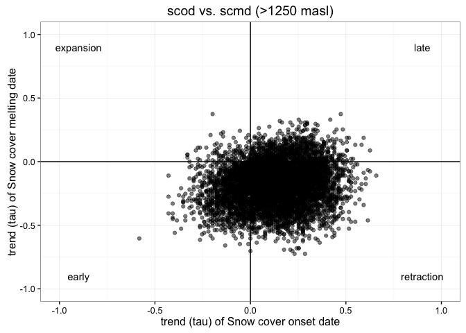

Prepare Data
------------

-   Read data of Mann-Kendal Sen-Slope for each pixels and each indicator: snow-cover related (scd, scod, scmd, scmc) and hydrological model (pre, pre\_snow, pre\_snow\_per, temp). See :red\_circle: (`$TODO`: include link to analysis)
-   Read data of topographic variable :red\_circle: (`$TODO`: Document script)
-   Create two dataframes:
-   Full Dataframe with all variables and all pixels
-   Dataframe with all variables and filter by pixels above 1900 *m.a.s.l.*

``` r
# Read data

# Define name of indicators (see variables names)
indicadores <- c("scd", "scod", "scmd", "scmc", "pre", "pre_snow", "pre_snow_per", "temp")

# Loop to read files 
for (j in indicadores){ 
  aux <- read.csv(file=paste(di, "/data/derived/", j, ".csv", sep= ""),
              header = TRUE,
              sep = ',')
  assign(j, aux)
}


# Read Topographic data 
rawtopo <- read.csv(file=paste(di, "/data/topo_nie_malla_modis.csv", sep=""),
                 header=TRUE,
                 sep = ",") 
```

Explore Snow-cover related indicators
-------------------------------------

We explore the pattern of the trend (*tau*) of the snow-cover indicators (see figure 1).

By exploring the relationship between the trend of two indicators of snow cover (scod: snow cover onset date; and scmd: snow cover melting date) we can describe the temporal evolution of snow cover in Sierra Nevada from 2000-2014. This relationship is evaluated at pixel scale (figure 1c) and we have four potential scenarios:

-   Expansion
-   Contraction
-   Shift (delay and advance)

**Figure 1** 

We applied this exploratory analysis for all pixels and for all pixels above 1900 *m asl*.


<p class="caption">
Figure 2
</p>


<p class="caption">
Figure 3
</p>

A total of 70.31 % of pixels (of all above 1900) showed a positive trend in snow cover onset date (late onset) and a negative trend in snow cover melting date (earlier melting date). It means that of 70.31 % of the pixels above 1900 m, have suffered a trend to rectraction of the snow cover period in the last years (Figure 3).

We also can explore this relationship by elevation (Figure 4), and we obtanied that the *retraction pattern* is more evident at low elevations

``` r
# Exploratory by elevatin groups 
ggplot(fulldf1900, aes(x=tau_scod, y=tau_scmd)) + 
  geom_point(alpha=0.5) + 
  xlim(-1,1) + ylim(-1,1) + 
  geom_vline(xintercept=0) +
  geom_hline(yintercept=0) + 
  facet_wrap(~dem50mean_group) + 
  theme_bw() + 
  labs(title= 'scod vs. scmd (>1900 masl)',
       x= 'trend (tau) of Snow cover onset date',
       y='trend (tau) of Snow cover melting date') +
  theme(strip.background = element_rect(fill = "white"))
```


<p class="caption">
Figure 4
</p>

``` r
# Compute percentage of pixels (tau scod > 0, tau_scmd < 0)   
aux <- fulldf1900 %>% group_by(dem50mean_group) %>% 
  summarise(total=n())

aux1 <- fulldf1900 %>% group_by(dem50mean_group) %>% 
  filter(tau_scod > 0) %>% 
  filter(tau_scmd < 0) %>% 
  summarise(n=n()) %>%
  inner_join(aux, by="dem50mean_group") %>%
  mutate(freq = n / total)

pander(aux1)
```

<table style="width:54%;">
<colgroup>
<col width="25%" />
<col width="5%" />
<col width="11%" />
<col width="12%" />
</colgroup>
<thead>
<tr class="header">
<th align="center">dem50mean_group</th>
<th align="center">n</th>
<th align="center">total</th>
<th align="center">freq</th>
</tr>
</thead>
<tbody>
<tr class="odd">
<td align="center">1751-2000</td>
<td align="center">354</td>
<td align="center">451</td>
<td align="center">0.7849224</td>
</tr>
<tr class="even">
<td align="center">2001-2250</td>
<td align="center">738</td>
<td align="center">977</td>
<td align="center">0.7553736</td>
</tr>
<tr class="odd">
<td align="center">2251-2500</td>
<td align="center">456</td>
<td align="center">704</td>
<td align="center">0.6477273</td>
</tr>
<tr class="even">
<td align="center">2501-2750</td>
<td align="center">278</td>
<td align="center">470</td>
<td align="center">0.5914894</td>
</tr>
<tr class="odd">
<td align="center">2751-3000</td>
<td align="center">227</td>
<td align="center">314</td>
<td align="center">0.7229299</td>
</tr>
<tr class="even">
<td align="center">3001-3250</td>
<td align="center">64</td>
<td align="center">95</td>
<td align="center">0.6736842</td>
</tr>
<tr class="odd">
<td align="center">3251-3500</td>
<td align="center">5</td>
<td align="center">7</td>
<td align="center">0.7142857</td>
</tr>
</tbody>
</table>
