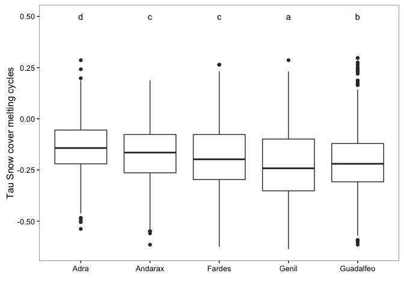

Prepare Data
------------

1.  Read data of Mann-Kendal Sen-Slope for each pixels and snow-cover related indicators (scd, scod, scmd, scmc).
2.  Read data of topographic variable:
    -   Convert radian to deg.
    -   Create categorical variable for elevation (250 m)
    -   Classify aspect into 8 categories

3.  Read data from hydrological basin
4.  Read spatial data:
    -   Select only centroides of interest

5.  Create two dataframes:
    -   **Full Dataframe** with all variables and all pixels (`fulldf`)
    -   **Filter dataframe** with all variables and filter by pixels above 1250 *m.a.s.l.* (`fulldf1250`)

``` r
# Trend analysis data
# Define name of indicators (see variables names)
indicadores <- c("scd", "scod", "scmd", "scmc")

# Loop to read files 
for (j in indicadores){ 
  aux <- read.csv(file=paste(di, "/data/derived/", j, ".csv", sep= ""),
              header = TRUE,
              sep = ',')
  assign(j, aux)
}
# --

# Define pixels of interes 
pixels_interes <- scd$nie_malla_modi_id

# Read Topographic data 
rawtopo <- read.csv(file=paste(di, "/data/topo_nie_malla_modis.csv", sep=""),
                    header=TRUE,
                    sep = ",") 

# function to convert radian to degree 
rad2deg <- function(rad) {(rad * 180) / (pi)} 


topo <- rawtopo %>% 
  filter(id %in% pixels_interes) %>% 
  mutate(nie_malla_modi_id = id, 
         slope50mean_deg = rad2deg(slope50mean),
         slope50median_deg = rad2deg(slope50median),
         aspect50mean_deg = rad2deg(aspect50mean),
         aspect50median_deg = rad2deg(aspect50median)) %>%
  dplyr::select(nie_malla_modi_id, dem50mean, dem50median, slope50mean_deg, 
                slope50median_deg, aspect50mean_deg, aspect50median_deg) 

## Create interval variables (250 m) for dem; and classify aspect into 8 categories 
topo <- topo %>% 
  mutate(dem50mean_group = cut(dem50mean, 
                         breaks = seq(from=0, to=3500, by=250),
                         labels = c("0-250", "251-500","501-750","751-1000",
                                    "1001-1250","1251-1500","1501-1750","1751-2000",
                                    "2001-2250","2251-2500","2501-2750", "2751-3000",
                                    "3001-3250", "3251-3500")),
         aspect50mean_deg_group = cut(aspect50mean_deg, 
                                      breaks= c(22.5, 67.5, 112.5, 157.5, 202.5, 247.5, 292.5, 337.5, 359.5),
                                      labels = c("N", "NE", "E", "SE", "S", "SW", "W", "NW")))


# --

# Read spatial data and Get lat/long
centroides <- rgdal::readOGR(dsn=paste(di, "/data/geoinfo", sep=""),
                             layer = "centroides_selected", verbose = FALSE)
# Select only attributes of interest and rename them
centroides <- centroides[c("id")]

# Create lat/lng by id 
xycentroides <- cbind(centroides@data, coordinates(centroides))
names(xycentroides) <- c("nie_malla_modi_id", "lon","lat")

xycentroides <- filter(xycentroides, nie_malla_modi_id %in% pixels_interes)
# -- 

# Hydrological basin 
basin <- read.csv(file=paste(di, "/data/derived/pixel_region.csv", sep=""),
                    header=TRUE,
                    sep = ",") 
# --


# Create un dataframe con todos los datos
fulldf <- topo %>% 
  inner_join(scod,  by=c("nie_malla_modi_id")) %>% 
  inner_join(scd,  by=c("nie_malla_modi_id")) %>% 
  inner_join(scmd,  by=c("nie_malla_modi_id")) %>% 
  inner_join(scmc,  by=c("nie_malla_modi_id")) %>% 
  inner_join(xycentroides, by="nie_malla_modi_id") %>%
  inner_join(basin, by="nie_malla_modi_id")

# Create subset of pixels above 1250 
fulldf1250 <- fulldf %>% 
  filter(dem50mean > 1250)  
```

Explor general pattern of snow-cover
====================================

``` r
exp_scd <- exploreMKTS(scd, alpha=0.05)
exp_scod <- exploreMKTS(scod, alpha=0.05)
exp_scmd <- exploreMKTS(scmd, alpha=0.05)
exp_scmc <- exploreMKTS(scmc, alpha=0.05)

# Create table with all resuls 
# tau_pos
tau_pos <- rbind(
cbind(exp_scd$summary[1,c(2,3)],variable='scd'),
cbind(exp_scod$summary[1,c(2,3)],variable='scod'),
cbind(exp_scmd$summary[1,c(2,3)],variable='scmd'),
cbind(exp_scmc$summary[1,c(2,3)],variable='scmc'))
names(tau_pos) <- c('tau_pos_n','tau_pos_%','variable')

# tau_pos_sig
tau_pos_sig <- rbind(
  cbind(exp_scd$summary[2,c(2,3)],variable='scd'),
  cbind(exp_scod$summary[2,c(2,3)],variable='scod'),
  cbind(exp_scmd$summary[2,c(2,3)],variable='scmd'),
  cbind(exp_scmc$summary[2,c(2,3)],variable='scmc'))
names(tau_pos_sig) <- c('tau_pos_sig_n','tau_pos_sig_%','variable')

# tau_neg
tau_neg <- rbind(
  cbind(exp_scd$summary[3,c(2,3)],variable='scd'),
  cbind(exp_scod$summary[3,c(2,3)],variable='scod'),
  cbind(exp_scmd$summary[3,c(2,3)],variable='scmd'),
  cbind(exp_scmc$summary[3,c(2,3)],variable='scmc'))
names(tau_neg) <- c('tau_neg_n','tau_neg_%','variable')

# tau_pos_sig
tau_neg_sig <- rbind(
  cbind(exp_scd$summary[4,c(2,3)],variable='scd'),
  cbind(exp_scod$summary[4,c(2,3)],variable='scod'),
  cbind(exp_scmd$summary[4,c(2,3)],variable='scmd'),
  cbind(exp_scmc$summary[4,c(2,3)],variable='scmc'))
names(tau_neg_sig) <- c('tau_neg_sig_n','tau_neg_sig_%','variable')

# Table with all the results 
summ_explore <- join(join(tau_pos, tau_pos_sig, by='variable'),
     join(tau_neg, tau_neg_sig, by='variable'), by='variable')
# Reorder variables
summ_explore <- summ_explore[,c(3,1:2,4:9)]
summ_explore
```

    ##   variable tau_pos_n tau_pos_% tau_pos_sig_n tau_pos_sig_% tau_neg_n
    ## 1      scd      1455      18.2             6          0.41      6319
    ## 2     scod      5438     68.03           332          6.11      2380
    ## 3     scmd      1326     16.59             5          0.38      6453
    ## 4     scmc      1055      13.2             0             0      6750
    ##   tau_neg_% tau_neg_sig_n tau_neg_sig_%
    ## 1     79.05           372          5.89
    ## 2     29.77            59          2.48
    ## 3     80.72           717         11.11
    ## 4     84.44           677         10.03

``` r
pander(summ_explore, caption= 'Summary trends all Sierra Nevada')
```

<table>
<caption>Summary trends all Sierra Nevada (continued below)</caption>
<colgroup>
<col width="14%" />
<col width="15%" />
<col width="15%" />
<col width="20%" />
<col width="20%" />
<col width="14%" />
</colgroup>
<thead>
<tr class="header">
<th align="center">variable</th>
<th align="center">tau_pos_n</th>
<th align="center">tau_pos_%</th>
<th align="center">tau_pos_sig_n</th>
<th align="center">tau_pos_sig_%</th>
<th align="center">tau_neg_n</th>
</tr>
</thead>
<tbody>
<tr class="odd">
<td align="center">scd</td>
<td align="center">1455</td>
<td align="center">18.2</td>
<td align="center">6</td>
<td align="center">0.41</td>
<td align="center">6319</td>
</tr>
<tr class="even">
<td align="center">scod</td>
<td align="center">5438</td>
<td align="center">68.03</td>
<td align="center">332</td>
<td align="center">6.11</td>
<td align="center">2380</td>
</tr>
<tr class="odd">
<td align="center">scmd</td>
<td align="center">1326</td>
<td align="center">16.59</td>
<td align="center">5</td>
<td align="center">0.38</td>
<td align="center">6453</td>
</tr>
<tr class="even">
<td align="center">scmc</td>
<td align="center">1055</td>
<td align="center">13.2</td>
<td align="center">0</td>
<td align="center">0</td>
<td align="center">6750</td>
</tr>
</tbody>
</table>

<table style="width:61%;">
<colgroup>
<col width="16%" />
<col width="22%" />
<col width="22%" />
</colgroup>
<thead>
<tr class="header">
<th align="center">tau_neg_%</th>
<th align="center">tau_neg_sig_n</th>
<th align="center">tau_neg_sig_%</th>
</tr>
</thead>
<tbody>
<tr class="odd">
<td align="center">79.05</td>
<td align="center">372</td>
<td align="center">5.89</td>
</tr>
<tr class="even">
<td align="center">29.77</td>
<td align="center">59</td>
<td align="center">2.48</td>
</tr>
<tr class="odd">
<td align="center">80.72</td>
<td align="center">717</td>
<td align="center">11.11</td>
</tr>
<tr class="even">
<td align="center">84.44</td>
<td align="center">677</td>
<td align="center">10.03</td>
</tr>
</tbody>
</table>

``` r
# Get nie_malla_modi_id + elev
topo_elev <- topo %>% 
  select(nie_malla_modi_id, dem50mean)

scd1250 <- scd %>% 
  inner_join(topo_elev, by = 'nie_malla_modi_id') %>% 
  filter(dem50mean > 1250)

scod1250 <- scod %>% 
  inner_join(topo_elev, by = 'nie_malla_modi_id') %>% 
  filter(dem50mean > 1250)

scmd1250 <- scmd %>% 
  inner_join(topo_elev, by = 'nie_malla_modi_id') %>% 
  filter(dem50mean > 1250)

scmc1250 <- scmc %>% 
  inner_join(topo_elev, by = 'nie_malla_modi_id') %>% 
  filter(dem50mean > 1250)

# summary trends 
exp_scd1250 <- exploreMKTS(scd1250, alpha=0.05)
exp_scod1250 <- exploreMKTS(scod1250, alpha=0.05)
exp_scmd1250 <- exploreMKTS(scmd1250, alpha=0.05)
exp_scmc1250 <- exploreMKTS(scmc1250, alpha=0.05)

# Create table with all resuls 
# tau_pos
tau_pos1250 <- rbind(
cbind(exp_scd1250$summary[1,c(2,3)],variable='scd'),
cbind(exp_scod1250$summary[1,c(2,3)],variable='scod'),
cbind(exp_scmd1250$summary[1,c(2,3)],variable='scmd'),
cbind(exp_scmc1250$summary[1,c(2,3)],variable='scmc'))
names(tau_pos1250) <- c('tau_pos_n','tau_pos_%','variable')

# tau_pos_sig
tau_pos_sig1250 <- rbind(
  cbind(exp_scd1250$summary[2,c(2,3)],variable='scd'),
  cbind(exp_scod1250$summary[2,c(2,3)],variable='scod'),
  cbind(exp_scmd1250$summary[2,c(2,3)],variable='scmd'),
  cbind(exp_scmc1250$summary[2,c(2,3)],variable='scmc'))
names(tau_pos_sig1250) <- c('tau_pos_sig_n','tau_pos_sig_%','variable')

# tau_neg
tau_neg1250 <- rbind(
  cbind(exp_scd1250$summary[3,c(2,3)],variable='scd'),
  cbind(exp_scod1250$summary[3,c(2,3)],variable='scod'),
  cbind(exp_scmd1250$summary[3,c(2,3)],variable='scmd'),
  cbind(exp_scmc1250$summary[3,c(2,3)],variable='scmc'))
names(tau_neg1250) <- c('tau_neg_n','tau_neg_%','variable')

# tau_pos_sig
tau_neg_sig1250 <- rbind(
  cbind(exp_scd1250$summary[4,c(2,3)],variable='scd'),
  cbind(exp_scod1250$summary[4,c(2,3)],variable='scod'),
  cbind(exp_scmd1250$summary[4,c(2,3)],variable='scmd'),
  cbind(exp_scmc1250$summary[4,c(2,3)],variable='scmc'))
names(tau_neg_sig1250) <- c('tau_neg_sig_n','tau_neg_sig_%','variable')

# Table with all the results 
summ_explore1250 <- join(join(tau_pos1250, tau_pos_sig1250, by='variable'),
     join(tau_neg1250, tau_neg_sig1250, by='variable'), by='variable')
# Reorder variables
summ_explore1250 <- summ_explore1250[,c(3,1:2,4:9)]
pander(summ_explore1250, caption= 'Summary trends all Sierra Nevada')
```

<table>
<caption>Summary trends all Sierra Nevada (continued below)</caption>
<colgroup>
<col width="14%" />
<col width="15%" />
<col width="15%" />
<col width="20%" />
<col width="20%" />
<col width="14%" />
</colgroup>
<thead>
<tr class="header">
<th align="center">variable</th>
<th align="center">tau_pos_n</th>
<th align="center">tau_pos_%</th>
<th align="center">tau_pos_sig_n</th>
<th align="center">tau_pos_sig_%</th>
<th align="center">tau_neg_n</th>
</tr>
</thead>
<tbody>
<tr class="odd">
<td align="center">scd</td>
<td align="center">970</td>
<td align="center">15.18</td>
<td align="center">3</td>
<td align="center">0.31</td>
<td align="center">5297</td>
</tr>
<tr class="even">
<td align="center">scod</td>
<td align="center">4913</td>
<td align="center">76.89</td>
<td align="center">325</td>
<td align="center">6.62</td>
<td align="center">1400</td>
</tr>
<tr class="odd">
<td align="center">scmd</td>
<td align="center">862</td>
<td align="center">13.49</td>
<td align="center">0</td>
<td align="center">0</td>
<td align="center">5424</td>
</tr>
<tr class="even">
<td align="center">scmc</td>
<td align="center">635</td>
<td align="center">9.94</td>
<td align="center">0</td>
<td align="center">0</td>
<td align="center">5655</td>
</tr>
</tbody>
</table>

<table style="width:61%;">
<colgroup>
<col width="16%" />
<col width="22%" />
<col width="22%" />
</colgroup>
<thead>
<tr class="header">
<th align="center">tau_neg_%</th>
<th align="center">tau_neg_sig_n</th>
<th align="center">tau_neg_sig_%</th>
</tr>
</thead>
<tbody>
<tr class="odd">
<td align="center">82.9</td>
<td align="center">337</td>
<td align="center">6.36</td>
</tr>
<tr class="even">
<td align="center">21.91</td>
<td align="center">8</td>
<td align="center">0.57</td>
</tr>
<tr class="odd">
<td align="center">84.88</td>
<td align="center">658</td>
<td align="center">12.13</td>
</tr>
<tr class="even">
<td align="center">88.5</td>
<td align="center">632</td>
<td align="center">11.18</td>
</tr>
</tbody>
</table>

Explore Snow-Cover trends by basin
==================================

We explore the pattern of snow-cover indicators trends by hydrological basin.

``` r
## Summary statistics 
misvariables<- c('tau_scd', 'sen_slope_scd', 'tau_scod', 'sen_slope_scod',
                 'tau_scmd', 'sen_slope_scmd', 'tau_scmc', 'sen_slope_scmc')
variable_agrupa <- 'basin_name' 
prefijo  <- 'basin_' 
df <- fulldf1250

stats_basin <- data.frame() 
  
for (i in misvariables){
  vnames <- c(variable_agrupa, i)
  aux <- df %>%
    dplyr::select(one_of(vnames)) %>%
    mutate_(vinterest = i) %>%
    group_by_(.dots=variable_agrupa) %>%
    summarise(mean=mean(vinterest),
              sd = sd(vinterest),
              se = sd / sqrt (length(vinterest)))
  aux <- aux %>% 
    mutate(variable = i)
  
  stats_basin <- rbind(stats_basin, aux)
  # assign(paste0(prefijo,i), aux)
   
}
```

### Snow cover duration

``` r
df_letter_aux <- data.frame() 
df <- fulldf1250
```

``` r
# Tau scd 
# ANOVA 
variable <- 'tau_scd'
my_ylab <- 'Tau Snow cover duration'
mod <- aov(tau_scd ~ basin_name, data=df)
pander(tidy(mod), caption= my_ylab)
```

<table style="width:75%;">
<caption>Tau Snow cover duration</caption>
<colgroup>
<col width="15%" />
<col width="6%" />
<col width="11%" />
<col width="12%" />
<col width="16%" />
<col width="12%" />
</colgroup>
<thead>
<tr class="header">
<th align="center">term</th>
<th align="center">df</th>
<th align="center">sumsq</th>
<th align="center">meansq</th>
<th align="center">statistic</th>
<th align="center">p.value</th>
</tr>
</thead>
<tbody>
<tr class="odd">
<td align="center">basin_name</td>
<td align="center">4</td>
<td align="center">2.326</td>
<td align="center">0.5814</td>
<td align="center">25.07</td>
<td align="center">1.239e-20</td>
</tr>
<tr class="even">
<td align="center">Residuals</td>
<td align="center">6385</td>
<td align="center">148.1</td>
<td align="center">0.02319</td>
<td align="center">NA</td>
<td align="center">NA</td>
</tr>
</tbody>
</table>

``` r
## Multiple comparisons 
tuk <- glht(mod, linfct = mcp(basin_name = "Tukey"))
# Convert comparisons into letters 
df_letter <- fortify(cld(tuk)) %>%
  transmute(basin_name = as.factor(lhs),
         tukey_basin_name = letters) %>%
  mutate(variable = variable)

df_letter_aux <- rbind(df_letter_aux, df_letter)

## ANOVA plots
ggplot(df, aes_string(x='basin_name', y=variable)) + 
  geom_boxplot() +
  geom_text(data=df_letter, aes(label = tukey_basin_name, x=basin_name, y=0.5),
           position = position_dodge(width=0.9)) +
  theme_bw() + mythemeggplot + 
  ylab(my_ylab) + xlab('')
```


``` r
# Sen scd 
# ANOVA 
variable <- 'sen_slope_scd'
my_ylab <- 'Sen slope Snow cover duration'
mod <- aov(sen_slope_scd ~ basin_name, data=df)
pander(tidy(mod), caption= my_ylab)
```

<table style="width:75%;">
<caption>Sen slope Snow cover duration</caption>
<colgroup>
<col width="15%" />
<col width="6%" />
<col width="11%" />
<col width="12%" />
<col width="16%" />
<col width="12%" />
</colgroup>
<thead>
<tr class="header">
<th align="center">term</th>
<th align="center">df</th>
<th align="center">sumsq</th>
<th align="center">meansq</th>
<th align="center">statistic</th>
<th align="center">p.value</th>
</tr>
</thead>
<tbody>
<tr class="odd">
<td align="center">basin_name</td>
<td align="center">4</td>
<td align="center">369.5</td>
<td align="center">92.38</td>
<td align="center">40.67</td>
<td align="center">1.056e-33</td>
</tr>
<tr class="even">
<td align="center">Residuals</td>
<td align="center">6385</td>
<td align="center">14503</td>
<td align="center">2.271</td>
<td align="center">NA</td>
<td align="center">NA</td>
</tr>
</tbody>
</table>

``` r
## Multiple comparisons 
tuk <- glht(mod, linfct = mcp(basin_name = "Tukey"))
# Convert comparisons into letters 
df_letter <- fortify(cld(tuk)) %>%
  transmute(basin_name = as.factor(lhs),
         tukey_basin_name = letters) %>%
  mutate(variable = variable)

df_letter_aux <- rbind(df_letter_aux, df_letter)

## ANOVA plots
ggplot(df, aes_string(x='basin_name', y=variable)) + 
  geom_boxplot() +
  geom_text(data=df_letter, aes(label = tukey_basin_name, x=basin_name, y=4.5),
           position = position_dodge(width=0.9)) +
  theme_bw() + mythemeggplot + 
  ylab(my_ylab) + xlab('')
```


Snow cover onset date
=====================

``` r
# Tau scod 
# ANOVA 
variable <- 'tau_scod'
my_ylab <- 'Tau Snow cover onset date'
mod <- aov(tau_scod ~ basin_name, data=df)
pander(tidy(mod), caption= my_ylab)
```

<table style="width:75%;">
<caption>Tau Snow cover onset date</caption>
<colgroup>
<col width="15%" />
<col width="6%" />
<col width="11%" />
<col width="12%" />
<col width="16%" />
<col width="12%" />
</colgroup>
<thead>
<tr class="header">
<th align="center">term</th>
<th align="center">df</th>
<th align="center">sumsq</th>
<th align="center">meansq</th>
<th align="center">statistic</th>
<th align="center">p.value</th>
</tr>
</thead>
<tbody>
<tr class="odd">
<td align="center">basin_name</td>
<td align="center">4</td>
<td align="center">6.29</td>
<td align="center">1.573</td>
<td align="center">55.62</td>
<td align="center">3.55e-46</td>
</tr>
<tr class="even">
<td align="center">Residuals</td>
<td align="center">6385</td>
<td align="center">180.5</td>
<td align="center">0.02827</td>
<td align="center">NA</td>
<td align="center">NA</td>
</tr>
</tbody>
</table>

``` r
## Multiple comparisons 
tuk <- glht(mod, linfct = mcp(basin_name = "Tukey"))
# Convert comparisons into letters 
df_letter <- fortify(cld(tuk)) %>%
  transmute(basin_name = as.factor(lhs),
         tukey_basin_name = letters) %>%
  mutate(variable = variable)

df_letter_aux <- rbind(df_letter_aux, df_letter)

## ANOVA plots
ggplot(df, aes_string(x='basin_name', y=variable)) + 
  geom_boxplot() +
  geom_text(data=df_letter, aes(label = tukey_basin_name, x=basin_name, y=0.7),
           position = position_dodge(width=0.9)) +
  theme_bw() + mythemeggplot + 
  ylab(my_ylab) + xlab('')
```


``` r
# Sen scod 
# ANOVA 
variable <- 'sen_slope_scod'
my_ylab <- 'Sen slope Snow cover onset date'
mod <- aov(sen_slope_scod ~ basin_name, data=df)
pander(tidy(mod), caption= my_ylab)
```

<table style="width:75%;">
<caption>Sen slope Snow cover onset date</caption>
<colgroup>
<col width="15%" />
<col width="6%" />
<col width="11%" />
<col width="12%" />
<col width="16%" />
<col width="12%" />
</colgroup>
<thead>
<tr class="header">
<th align="center">term</th>
<th align="center">df</th>
<th align="center">sumsq</th>
<th align="center">meansq</th>
<th align="center">statistic</th>
<th align="center">p.value</th>
</tr>
</thead>
<tbody>
<tr class="odd">
<td align="center">basin_name</td>
<td align="center">4</td>
<td align="center">334</td>
<td align="center">83.49</td>
<td align="center">26.76</td>
<td align="center">4.745e-22</td>
</tr>
<tr class="even">
<td align="center">Residuals</td>
<td align="center">6385</td>
<td align="center">19919</td>
<td align="center">3.12</td>
<td align="center">NA</td>
<td align="center">NA</td>
</tr>
</tbody>
</table>

``` r
## Multiple comparisons 
tuk <- glht(mod, linfct = mcp(basin_name = "Tukey"))
# Convert comparisons into letters 
df_letter <- fortify(cld(tuk)) %>%
  transmute(basin_name = as.factor(lhs),
         tukey_basin_name = letters) %>%
  mutate(variable = variable)

df_letter_aux <- rbind(df_letter_aux, df_letter)

## ANOVA plots
ggplot(df, aes_string(x='basin_name', y=variable)) + 
  geom_boxplot() +
  geom_text(data=df_letter, aes(label = tukey_basin_name, x=basin_name, y=10),
           position = position_dodge(width=0.9)) +
  theme_bw() + mythemeggplot + 
  ylab(my_ylab) + xlab('')
```


Snow cover melting date
=======================

``` r
# Tau scmd 
# ANOVA 
variable <- 'tau_scmd'
my_ylab <- 'Tau Snow cover melting date'
mod <- aov(tau_scmd ~ basin_name, data=df)
pander(tidy(mod), caption= my_ylab)
```

<table style="width:75%;">
<caption>Tau Snow cover melting date</caption>
<colgroup>
<col width="15%" />
<col width="6%" />
<col width="11%" />
<col width="12%" />
<col width="16%" />
<col width="12%" />
</colgroup>
<thead>
<tr class="header">
<th align="center">term</th>
<th align="center">df</th>
<th align="center">sumsq</th>
<th align="center">meansq</th>
<th align="center">statistic</th>
<th align="center">p.value</th>
</tr>
</thead>
<tbody>
<tr class="odd">
<td align="center">basin_name</td>
<td align="center">4</td>
<td align="center">5.153</td>
<td align="center">1.288</td>
<td align="center">47.14</td>
<td align="center">4.112e-39</td>
</tr>
<tr class="even">
<td align="center">Residuals</td>
<td align="center">6385</td>
<td align="center">174.5</td>
<td align="center">0.02733</td>
<td align="center">NA</td>
<td align="center">NA</td>
</tr>
</tbody>
</table>

``` r
## Multiple comparisons 
tuk <- glht(mod, linfct = mcp(basin_name = "Tukey"))
# Convert comparisons into letters 
df_letter <- fortify(cld(tuk)) %>%
  transmute(basin_name = as.factor(lhs),
         tukey_basin_name = letters) %>%
  mutate(variable = variable)

df_letter_aux <- rbind(df_letter_aux, df_letter)

## ANOVA plots
ggplot(df, aes_string(x='basin_name', y=variable)) + 
  geom_boxplot() +
  geom_text(data=df_letter, aes(label = tukey_basin_name, x=basin_name, y=0.5),
           position = position_dodge(width=0.9)) +
  theme_bw() + mythemeggplot + 
  ylab(my_ylab) + xlab('')
```


``` r
# Sen scmd 
# ANOVA 
variable <- 'sen_slope_scmd'
my_ylab <- 'Sen slope Snow cover melting date'
mod <- aov(sen_slope_scmd ~ basin_name, data=df)
pander(tidy(mod), caption= my_ylab)
```

<table style="width:75%;">
<caption>Sen slope Snow cover melting date</caption>
<colgroup>
<col width="15%" />
<col width="6%" />
<col width="11%" />
<col width="12%" />
<col width="16%" />
<col width="12%" />
</colgroup>
<thead>
<tr class="header">
<th align="center">term</th>
<th align="center">df</th>
<th align="center">sumsq</th>
<th align="center">meansq</th>
<th align="center">statistic</th>
<th align="center">p.value</th>
</tr>
</thead>
<tbody>
<tr class="odd">
<td align="center">basin_name</td>
<td align="center">4</td>
<td align="center">555.2</td>
<td align="center">138.8</td>
<td align="center">39.15</td>
<td align="center">1.982e-32</td>
</tr>
<tr class="even">
<td align="center">Residuals</td>
<td align="center">6385</td>
<td align="center">22638</td>
<td align="center">3.545</td>
<td align="center">NA</td>
<td align="center">NA</td>
</tr>
</tbody>
</table>

``` r
## Multiple comparisons 
tuk <- glht(mod, linfct = mcp(basin_name = "Tukey"))
# Convert comparisons into letters 
df_letter <- fortify(cld(tuk)) %>%
  transmute(basin_name = as.factor(lhs),
         tukey_basin_name = letters) %>%
  mutate(variable = variable)

df_letter_aux <- rbind(df_letter_aux, df_letter)

## ANOVA plots
ggplot(df, aes_string(x='basin_name', y=variable)) + 
  geom_boxplot() +
  geom_text(data=df_letter, aes(label = tukey_basin_name, x=basin_name, y=10),
           position = position_dodge(width=0.9)) +
  theme_bw() + mythemeggplot + 
  ylab(my_ylab) + xlab('')
```


Snow cover melting cycles
=========================

``` r
# Tau scmc 
# ANOVA 
variable <- 'tau_scmc'
my_ylab <- 'Tau Snow cover melting cycles'
mod <- aov(tau_scmc ~ basin_name, data=df)
pander(tidy(mod), caption= my_ylab)
```

<table style="width:75%;">
<caption>Tau Snow cover melting cycles</caption>
<colgroup>
<col width="15%" />
<col width="6%" />
<col width="11%" />
<col width="12%" />
<col width="16%" />
<col width="12%" />
</colgroup>
<thead>
<tr class="header">
<th align="center">term</th>
<th align="center">df</th>
<th align="center">sumsq</th>
<th align="center">meansq</th>
<th align="center">statistic</th>
<th align="center">p.value</th>
</tr>
</thead>
<tbody>
<tr class="odd">
<td align="center">basin_name</td>
<td align="center">4</td>
<td align="center">4.83</td>
<td align="center">1.207</td>
<td align="center">54.49</td>
<td align="center">3.053e-45</td>
</tr>
<tr class="even">
<td align="center">Residuals</td>
<td align="center">6385</td>
<td align="center">141.5</td>
<td align="center">0.02216</td>
<td align="center">NA</td>
<td align="center">NA</td>
</tr>
</tbody>
</table>

``` r
## Multiple comparisons 
tuk <- glht(mod, linfct = mcp(basin_name = "Tukey"))
# Convert comparisons into letters 
df_letter <- fortify(cld(tuk)) %>%
  transmute(basin_name = as.factor(lhs),
         tukey_basin_name = letters) %>%
  mutate(variable = variable)

df_letter_aux <- rbind(df_letter_aux, df_letter)

## ANOVA plots
ggplot(df, aes_string(x='basin_name', y=variable)) + 
  geom_boxplot() +
  geom_text(data=df_letter, aes(label = tukey_basin_name, x=basin_name, y=0.5),
           position = position_dodge(width=0.9)) +
  theme_bw() + mythemeggplot + 
  ylab(my_ylab) + xlab('')
```



``` r
# Sen scmc 
# ANOVA 
variable <- 'sen_slope_scmc'
my_ylab <- 'Sen slope Snow cover melting cycles'
mod <- aov(sen_slope_scmc ~ basin_name, data=df)
pander(tidy(mod), caption= my_ylab)
```

<table style="width:75%;">
<caption>Sen slope Snow cover melting cycles</caption>
<colgroup>
<col width="15%" />
<col width="6%" />
<col width="11%" />
<col width="12%" />
<col width="16%" />
<col width="12%" />
</colgroup>
<thead>
<tr class="header">
<th align="center">term</th>
<th align="center">df</th>
<th align="center">sumsq</th>
<th align="center">meansq</th>
<th align="center">statistic</th>
<th align="center">p.value</th>
</tr>
</thead>
<tbody>
<tr class="odd">
<td align="center">basin_name</td>
<td align="center">4</td>
<td align="center">2.331</td>
<td align="center">0.5827</td>
<td align="center">77.78</td>
<td align="center">1.63e-64</td>
</tr>
<tr class="even">
<td align="center">Residuals</td>
<td align="center">6385</td>
<td align="center">47.83</td>
<td align="center">0.007492</td>
<td align="center">NA</td>
<td align="center">NA</td>
</tr>
</tbody>
</table>

``` r
## Multiple comparisons 
tuk <- glht(mod, linfct = mcp(basin_name = "Tukey"))
# Convert comparisons into letters 
df_letter <- fortify(cld(tuk)) %>%
  transmute(basin_name = as.factor(lhs),
         tukey_basin_name = letters) %>%
  mutate(variable = variable)

df_letter_aux <- rbind(df_letter_aux, df_letter)

## ANOVA plots
ggplot(df, aes_string(x='basin_name', y=variable)) + 
  geom_boxplot() +
  geom_text(data=df_letter, aes(label = tukey_basin_name, x=basin_name, y=.5),
           position = position_dodge(width=0.9)) +
  theme_bw() + mythemeggplot + 
  ylab(my_ylab) + xlab('')
```


``` r
# Create a df with letter and variables
df_basin <- stats_basin %>%
  dplyr::inner_join(df_letter_aux, by=c('basin_name', 'variable'))

df_basin_tau <- df_basin %>%
  dplyr::filter(grepl("tau", variable))


ggplot(df_basin_tau, aes(x=basin_name, y=mean)) + 
  geom_point(stat='identity', size=3, fill='#222943') + 
  geom_errorbar(aes(ymin=mean - sd, ymax= mean + sd), 
                width=0.1,
                colour='#222943',
                position=position_dodge(.9)) +
  facet_wrap(~variable) + 
  geom_text(aes(label = tukey_basin_name, x=basin_name, y=mean),
           hjust=0, nudge_x = 0.2) + mythemeggplot +
  xlab('') + ylab('Taus')
```


``` r
# Create a df with letter and variables
df_basin_sen <- df_basin %>%
  dplyr::filter(grepl("sen", variable))


ggplot(df_basin_sen, aes(x=basin_name, y=mean)) + 
  geom_point(stat='identity', size=3, fill='#222943') + 
  geom_errorbar(aes(ymin=mean - sd, ymax= mean + sd), 
                width=0.1,
                colour='#222943',
                position=position_dodge(.9)) +
  facet_wrap(~variable) + 
  geom_text(aes(label = tukey_basin_name, x=basin_name, y=mean),
           hjust=0, nudge_x = 0.2) + mythemeggplot +
  xlab('') + ylab('Sen Slopes')
```


#### Tau Snow cover duration

``` r
pander(filter(df_basin_tau, variable=="tau_scd")) 
```

<table>
<colgroup>
<col width="17%" />
<col width="14%" />
<col width="13%" />
<col width="16%" />
<col width="14%" />
<col width="24%" />
</colgroup>
<thead>
<tr class="header">
<th align="center">basin_name</th>
<th align="center">mean</th>
<th align="center">sd</th>
<th align="center">se</th>
<th align="center">variable</th>
<th align="center">tukey_basin_name</th>
</tr>
</thead>
<tbody>
<tr class="odd">
<td align="center">Adra</td>
<td align="center">-0.1539916</td>
<td align="center">0.1299276</td>
<td align="center">0.004217628</td>
<td align="center">tau_scd</td>
<td align="center">b</td>
</tr>
<tr class="even">
<td align="center">Andarax</td>
<td align="center">-0.1781580</td>
<td align="center">0.1347095</td>
<td align="center">0.003958622</td>
<td align="center">tau_scd</td>
<td align="center">a</td>
</tr>
<tr class="odd">
<td align="center">Fardes</td>
<td align="center">-0.1509319</td>
<td align="center">0.1552694</td>
<td align="center">0.004588631</td>
<td align="center">tau_scd</td>
<td align="center">b</td>
</tr>
<tr class="even">
<td align="center">Genil</td>
<td align="center">-0.1164561</td>
<td align="center">0.1748347</td>
<td align="center">0.005312675</td>
<td align="center">tau_scd</td>
<td align="center">c</td>
</tr>
<tr class="odd">
<td align="center">Guadalfeo</td>
<td align="center">-0.1614019</td>
<td align="center">0.1566468</td>
<td align="center">0.003455537</td>
<td align="center">tau_scd</td>
<td align="center">b</td>
</tr>
</tbody>
</table>

#### Sen Slope Snow cover duration

``` r
pander(filter(df_basin_sen, variable=="sen_slope_scd")) 
```

<table style="width:100%;">
<colgroup>
<col width="17%" />
<col width="13%" />
<col width="12%" />
<col width="14%" />
<col width="18%" />
<col width="24%" />
</colgroup>
<thead>
<tr class="header">
<th align="center">basin_name</th>
<th align="center">mean</th>
<th align="center">sd</th>
<th align="center">se</th>
<th align="center">variable</th>
<th align="center">tukey_basin_name</th>
</tr>
</thead>
<tbody>
<tr class="odd">
<td align="center">Adra</td>
<td align="center">-1.212126</td>
<td align="center">1.330570</td>
<td align="center">0.04319214</td>
<td align="center">sen_slope_scd</td>
<td align="center">b</td>
</tr>
<tr class="even">
<td align="center">Andarax</td>
<td align="center">-1.165116</td>
<td align="center">1.187804</td>
<td align="center">0.03490522</td>
<td align="center">sen_slope_scd</td>
<td align="center">b</td>
</tr>
<tr class="odd">
<td align="center">Fardes</td>
<td align="center">-1.256298</td>
<td align="center">1.450748</td>
<td align="center">0.04287353</td>
<td align="center">sen_slope_scd</td>
<td align="center">b</td>
</tr>
<tr class="even">
<td align="center">Genil</td>
<td align="center">-1.227084</td>
<td align="center">1.616166</td>
<td align="center">0.04911019</td>
<td align="center">sen_slope_scd</td>
<td align="center">b</td>
</tr>
<tr class="odd">
<td align="center">Guadalfeo</td>
<td align="center">-1.726302</td>
<td align="center">1.703237</td>
<td align="center">0.03757242</td>
<td align="center">sen_slope_scd</td>
<td align="center">a</td>
</tr>
</tbody>
</table>

#### Tau Snow cover onset date

``` r
pander(filter(df_basin_tau, variable=="tau_scod")) 
```

<table>
<colgroup>
<col width="17%" />
<col width="14%" />
<col width="13%" />
<col width="16%" />
<col width="14%" />
<col width="24%" />
</colgroup>
<thead>
<tr class="header">
<th align="center">basin_name</th>
<th align="center">mean</th>
<th align="center">sd</th>
<th align="center">se</th>
<th align="center">variable</th>
<th align="center">tukey_basin_name</th>
</tr>
</thead>
<tbody>
<tr class="odd">
<td align="center">Adra</td>
<td align="center">0.13508641</td>
<td align="center">0.1661481</td>
<td align="center">0.005393396</td>
<td align="center">tau_scod</td>
<td align="center">c</td>
</tr>
<tr class="even">
<td align="center">Andarax</td>
<td align="center">0.16170725</td>
<td align="center">0.1799857</td>
<td align="center">0.005289125</td>
<td align="center">tau_scod</td>
<td align="center">d</td>
</tr>
<tr class="odd">
<td align="center">Fardes</td>
<td align="center">0.08508559</td>
<td align="center">0.1760358</td>
<td align="center">0.005202333</td>
<td align="center">tau_scod</td>
<td align="center">a</td>
</tr>
<tr class="even">
<td align="center">Genil</td>
<td align="center">0.17786334</td>
<td align="center">0.1532622</td>
<td align="center">0.004657156</td>
<td align="center">tau_scod</td>
<td align="center">d</td>
</tr>
<tr class="odd">
<td align="center">Guadalfeo</td>
<td align="center">0.11700681</td>
<td align="center">0.1651432</td>
<td align="center">0.003642962</td>
<td align="center">tau_scod</td>
<td align="center">b</td>
</tr>
</tbody>
</table>

#### Sen Slope Snow onset date

``` r
pander(filter(df_basin_sen, variable=="sen_slope_scod")) 
```

<table style="width:100%;">
<colgroup>
<col width="17%" />
<col width="13%" />
<col width="11%" />
<col width="14%" />
<col width="19%" />
<col width="23%" />
</colgroup>
<thead>
<tr class="header">
<th align="center">basin_name</th>
<th align="center">mean</th>
<th align="center">sd</th>
<th align="center">se</th>
<th align="center">variable</th>
<th align="center">tukey_basin_name</th>
</tr>
</thead>
<tbody>
<tr class="odd">
<td align="center">Adra</td>
<td align="center">1.3561486</td>
<td align="center">1.880254</td>
<td align="center">0.06103564</td>
<td align="center">sen_slope_scod</td>
<td align="center">c</td>
</tr>
<tr class="even">
<td align="center">Andarax</td>
<td align="center">1.2622073</td>
<td align="center">2.081075</td>
<td align="center">0.06115520</td>
<td align="center">sen_slope_scod</td>
<td align="center">c</td>
</tr>
<tr class="odd">
<td align="center">Fardes</td>
<td align="center">0.7328856</td>
<td align="center">1.579219</td>
<td align="center">0.04667019</td>
<td align="center">sen_slope_scod</td>
<td align="center">a</td>
</tr>
<tr class="even">
<td align="center">Genil</td>
<td align="center">1.3788957</td>
<td align="center">1.519216</td>
<td align="center">0.04616421</td>
<td align="center">sen_slope_scod</td>
<td align="center">c</td>
</tr>
<tr class="odd">
<td align="center">Guadalfeo</td>
<td align="center">1.0376273</td>
<td align="center">1.738225</td>
<td align="center">0.03834423</td>
<td align="center">sen_slope_scod</td>
<td align="center">b</td>
</tr>
</tbody>
</table>

#### Tau Snow cover melting date

``` r
pander(filter(df_basin_tau, variable=="tau_scmd")) 
```

<table>
<colgroup>
<col width="17%" />
<col width="14%" />
<col width="13%" />
<col width="16%" />
<col width="14%" />
<col width="24%" />
</colgroup>
<thead>
<tr class="header">
<th align="center">basin_name</th>
<th align="center">mean</th>
<th align="center">sd</th>
<th align="center">se</th>
<th align="center">variable</th>
<th align="center">tukey_basin_name</th>
</tr>
</thead>
<tbody>
<tr class="odd">
<td align="center">Adra</td>
<td align="center">-0.1833962</td>
<td align="center">0.1688657</td>
<td align="center">0.005481613</td>
<td align="center">tau_scmd</td>
<td align="center">b</td>
</tr>
<tr class="even">
<td align="center">Andarax</td>
<td align="center">-0.1440147</td>
<td align="center">0.1583987</td>
<td align="center">0.004654762</td>
<td align="center">tau_scmd</td>
<td align="center">c</td>
</tr>
<tr class="odd">
<td align="center">Fardes</td>
<td align="center">-0.2067694</td>
<td align="center">0.1745326</td>
<td align="center">0.005157911</td>
<td align="center">tau_scmd</td>
<td align="center">a</td>
</tr>
<tr class="even">
<td align="center">Genil</td>
<td align="center">-0.1384146</td>
<td align="center">0.1364387</td>
<td align="center">0.004145942</td>
<td align="center">tau_scmd</td>
<td align="center">c</td>
</tr>
<tr class="odd">
<td align="center">Guadalfeo</td>
<td align="center">-0.2016161</td>
<td align="center">0.1757420</td>
<td align="center">0.003876768</td>
<td align="center">tau_scmd</td>
<td align="center">a</td>
</tr>
</tbody>
</table>

#### Sen Slope Snow melting date

``` r
pander(filter(df_basin_sen, variable=="sen_slope_scmd")) 
```

<table style="width:100%;">
<colgroup>
<col width="17%" />
<col width="13%" />
<col width="11%" />
<col width="14%" />
<col width="19%" />
<col width="23%" />
</colgroup>
<thead>
<tr class="header">
<th align="center">basin_name</th>
<th align="center">mean</th>
<th align="center">sd</th>
<th align="center">se</th>
<th align="center">variable</th>
<th align="center">tukey_basin_name</th>
</tr>
</thead>
<tbody>
<tr class="odd">
<td align="center">Adra</td>
<td align="center">-1.632706</td>
<td align="center">1.907522</td>
<td align="center">0.06192079</td>
<td align="center">sen_slope_scmd</td>
<td align="center">b</td>
</tr>
<tr class="even">
<td align="center">Andarax</td>
<td align="center">-1.399011</td>
<td align="center">1.984965</td>
<td align="center">0.05833088</td>
<td align="center">sen_slope_scmd</td>
<td align="center">c</td>
</tr>
<tr class="odd">
<td align="center">Fardes</td>
<td align="center">-1.968318</td>
<td align="center">2.106212</td>
<td align="center">0.06224426</td>
<td align="center">sen_slope_scmd</td>
<td align="center">a</td>
</tr>
<tr class="even">
<td align="center">Genil</td>
<td align="center">-1.111770</td>
<td align="center">1.399082</td>
<td align="center">0.04251370</td>
<td align="center">sen_slope_scmd</td>
<td align="center">d</td>
</tr>
<tr class="odd">
<td align="center">Guadalfeo</td>
<td align="center">-1.817089</td>
<td align="center">1.902809</td>
<td align="center">0.04197486</td>
<td align="center">sen_slope_scmd</td>
<td align="center">ab</td>
</tr>
</tbody>
</table>

#### Tau Snow cover melting cycles

``` r
pander(filter(df_basin_tau, variable=="tau_scmc")) 
```

<table>
<colgroup>
<col width="17%" />
<col width="14%" />
<col width="13%" />
<col width="16%" />
<col width="14%" />
<col width="24%" />
</colgroup>
<thead>
<tr class="header">
<th align="center">basin_name</th>
<th align="center">mean</th>
<th align="center">sd</th>
<th align="center">se</th>
<th align="center">variable</th>
<th align="center">tukey_basin_name</th>
</tr>
</thead>
<tbody>
<tr class="odd">
<td align="center">Adra</td>
<td align="center">-0.1399842</td>
<td align="center">0.1235027</td>
<td align="center">0.004009066</td>
<td align="center">tau_scmc</td>
<td align="center">d</td>
</tr>
<tr class="even">
<td align="center">Andarax</td>
<td align="center">-0.1745829</td>
<td align="center">0.1393072</td>
<td align="center">0.004093732</td>
<td align="center">tau_scmc</td>
<td align="center">c</td>
</tr>
<tr class="odd">
<td align="center">Fardes</td>
<td align="center">-0.1879328</td>
<td align="center">0.1565802</td>
<td align="center">0.004627370</td>
<td align="center">tau_scmc</td>
<td align="center">c</td>
</tr>
<tr class="even">
<td align="center">Genil</td>
<td align="center">-0.2266741</td>
<td align="center">0.1757618</td>
<td align="center">0.005340850</td>
<td align="center">tau_scmc</td>
<td align="center">a</td>
</tr>
<tr class="odd">
<td align="center">Guadalfeo</td>
<td align="center">-0.2089504</td>
<td align="center">0.1448464</td>
<td align="center">0.003195228</td>
<td align="center">tau_scmc</td>
<td align="center">b</td>
</tr>
</tbody>
</table>

#### Sen Slope Snow melting date

``` r
pander(filter(df_basin_sen, variable=="sen_slope_scmc")) 
```

<table style="width:100%;">
<colgroup>
<col width="16%" />
<col width="14%" />
<col width="13%" />
<col width="14%" />
<col width="18%" />
<col width="22%" />
</colgroup>
<thead>
<tr class="header">
<th align="center">basin_name</th>
<th align="center">mean</th>
<th align="center">sd</th>
<th align="center">se</th>
<th align="center">variable</th>
<th align="center">tukey_basin_name</th>
</tr>
</thead>
<tbody>
<tr class="odd">
<td align="center">Adra</td>
<td align="center">-0.04459536</td>
<td align="center">0.06725779</td>
<td align="center">0.002183280</td>
<td align="center">sen_slope_scmc</td>
<td align="center">c</td>
</tr>
<tr class="even">
<td align="center">Andarax</td>
<td align="center">-0.05264162</td>
<td align="center">0.07425655</td>
<td align="center">0.002182129</td>
<td align="center">sen_slope_scmc</td>
<td align="center">c</td>
</tr>
<tr class="odd">
<td align="center">Fardes</td>
<td align="center">-0.07982009</td>
<td align="center">0.09181152</td>
<td align="center">0.002713279</td>
<td align="center">sen_slope_scmc</td>
<td align="center">b</td>
</tr>
<tr class="even">
<td align="center">Genil</td>
<td align="center">-0.09900277</td>
<td align="center">0.10182727</td>
<td align="center">0.003094211</td>
<td align="center">sen_slope_scmc</td>
<td align="center">a</td>
</tr>
<tr class="odd">
<td align="center">Guadalfeo</td>
<td align="center">-0.08545109</td>
<td align="center">0.08909295</td>
<td align="center">0.001965339</td>
<td align="center">sen_slope_scmc</td>
<td align="center">b</td>
</tr>
</tbody>
</table>


Explore Snow-Cover trends by elevation
======================================

Taus
----

``` r
myvariable <- 'tau_scd'
myylab <- 'Tau Snow Cover Duration'

# GAM 
myformula <- formula(paste(myvariable, '~ s(dem50mean)', sep=''))
modgam <- mgcv::gam(formula = myformula, 
                    data= df)
anova(modgam)
```

    ## 
    ## Family: gaussian 
    ## Link function: identity 
    ## 
    ## Formula:
    ## tau_scd ~ s(dem50mean)
    ## 
    ## Approximate significance of smooth terms:
    ##                edf Ref.df     F p-value
    ## s(dem50mean) 8.263  8.854 410.4  <2e-16

``` r
mygam_summ <- summary(modgam)
mygam_summ
```

    ## 
    ## Family: gaussian 
    ## Link function: identity 
    ## 
    ## Formula:
    ## tau_scd ~ s(dem50mean)
    ## 
    ## Parametric coefficients:
    ##              Estimate Std. Error t value Pr(>|t|)    
    ## (Intercept) -0.153844   0.001532  -100.4   <2e-16 ***
    ## ---
    ## Signif. codes:  0 '***' 0.001 '**' 0.01 '*' 0.05 '.' 0.1 ' ' 1
    ## 
    ## Approximate significance of smooth terms:
    ##                edf Ref.df     F p-value    
    ## s(dem50mean) 8.263  8.854 410.4  <2e-16 ***
    ## ---
    ## Signif. codes:  0 '***' 0.001 '**' 0.01 '*' 0.05 '.' 0.1 ' ' 1
    ## 
    ## R-sq.(adj) =  0.363   Deviance explained = 36.3%
    ## GCV = 0.015024  Scale est. = 0.015002  n = 6390

``` r
# Plot GAM
a <-ggplot(df, aes_string(x='dem50mean', y=myvariable)) + geom_point(col='grey') + 
  geom_smooth(method="gam", formula = y ~ s(x), fill='red', col='red') + 
  annotate("text", x = 3000, y=0.3, 
           label= paste0("Dev. exp. = ", round((mygam_summ$dev.expl)*100, 2), " %")) + 
  mythemeggplot + 
  xlab('Elevation') + ylab(myylab)
  


myvariable <- 'tau_scod'
myylab <- 'Tau Snow Cover Onset Date'

# GAM 
myformula <- formula(paste(myvariable, '~ s(dem50mean)', sep=''))
modgam <- mgcv::gam(formula = myformula, 
                    data= df)
anova(modgam)
```

    ## 
    ## Family: gaussian 
    ## Link function: identity 
    ## 
    ## Formula:
    ## tau_scod ~ s(dem50mean)
    ## 
    ## Approximate significance of smooth terms:
    ##                edf Ref.df     F p-value
    ## s(dem50mean) 8.282  8.861 52.02  <2e-16

``` r
mygam_summ <- summary(modgam)
mygam_summ
```

    ## 
    ## Family: gaussian 
    ## Link function: identity 
    ## 
    ## Formula:
    ## tau_scod ~ s(dem50mean)
    ## 
    ## Parametric coefficients:
    ##             Estimate Std. Error t value Pr(>|t|)    
    ## (Intercept) 0.132387   0.002066   64.07   <2e-16 ***
    ## ---
    ## Signif. codes:  0 '***' 0.001 '**' 0.01 '*' 0.05 '.' 0.1 ' ' 1
    ## 
    ## Approximate significance of smooth terms:
    ##                edf Ref.df     F p-value    
    ## s(dem50mean) 8.282  8.861 52.02  <2e-16 ***
    ## ---
    ## Signif. codes:  0 '***' 0.001 '**' 0.01 '*' 0.05 '.' 0.1 ' ' 1
    ## 
    ## R-sq.(adj) =  0.0671   Deviance explained = 6.83%
    ## GCV = 0.02732  Scale est. = 0.027281  n = 6390

``` r
# Plot GAM
b <- ggplot(df, aes_string(x='dem50mean', y=myvariable)) + geom_point(col='grey') + 
  geom_smooth(method="gam", formula = y ~ s(x), fill='red', col='red') + 
  annotate("text", x = 3000, y=0.6, 
           label= paste0("Dev. exp. = ", round((mygam_summ$dev.expl)*100, 2), " %")) + 
  mythemeggplot + 
  xlab('Elevation') + ylab(myylab)


myvariable <- 'tau_scmd'
myylab <- 'Tau Snow Cover Melting Date'

# GAM 
myformula <- formula(paste(myvariable, '~ s(dem50mean)', sep=''))
modgam <- mgcv::gam(formula = myformula, 
                    data= df)
anova(modgam)
```

    ## 
    ## Family: gaussian 
    ## Link function: identity 
    ## 
    ## Formula:
    ## tau_scmd ~ s(dem50mean)
    ## 
    ## Approximate significance of smooth terms:
    ##                edf Ref.df     F p-value
    ## s(dem50mean) 8.597  8.954 193.7  <2e-16

``` r
mygam_summ <- summary(modgam)
mygam_summ
```

    ## 
    ## Family: gaussian 
    ## Link function: identity 
    ## 
    ## Formula:
    ## tau_scmd ~ s(dem50mean)
    ## 
    ## Parametric coefficients:
    ##             Estimate Std. Error t value Pr(>|t|)    
    ## (Intercept) -0.17868    0.00186  -96.05   <2e-16 ***
    ## ---
    ## Signif. codes:  0 '***' 0.001 '**' 0.01 '*' 0.05 '.' 0.1 ' ' 1
    ## 
    ## Approximate significance of smooth terms:
    ##                edf Ref.df     F p-value    
    ## s(dem50mean) 8.597  8.954 193.7  <2e-16 ***
    ## ---
    ## Signif. codes:  0 '***' 0.001 '**' 0.01 '*' 0.05 '.' 0.1 ' ' 1
    ## 
    ## R-sq.(adj) =  0.213   Deviance explained = 21.4%
    ## GCV = 0.02215  Scale est. = 0.022116  n = 6390

``` r
# Plot GAM
c <- ggplot(df, aes_string(x='dem50mean', y=myvariable)) + geom_point(col='grey') + 
  geom_smooth(method="gam", formula = y ~ s(x), fill='red', col='red') + 
  annotate("text", x = 3000, y=0.4, 
           label= paste0("Dev. exp. = ", round((mygam_summ$dev.expl)*100, 2), " %")) + 
  mythemeggplot + 
  xlab('Elevation') + ylab(myylab)


myvariable <- 'tau_scmc'
myylab <- 'Tau Snow Cover Melting Cycles'

# GAM 
myformula <- formula(paste(myvariable, '~ s(dem50mean)', sep=''))
modgam <- mgcv::gam(formula = myformula, 
                    data= df)
anova(modgam)
```

    ## 
    ## Family: gaussian 
    ## Link function: identity 
    ## 
    ## Formula:
    ## tau_scmc ~ s(dem50mean)
    ## 
    ## Approximate significance of smooth terms:
    ##                edf Ref.df     F p-value
    ## s(dem50mean) 8.211  8.834 104.2  <2e-16

``` r
mygam_summ <- summary(modgam)
mygam_summ
```

    ## 
    ## Family: gaussian 
    ## Link function: identity 
    ## 
    ## Formula:
    ## tau_scmc ~ s(dem50mean)
    ## 
    ## Parametric coefficients:
    ##             Estimate Std. Error t value Pr(>|t|)    
    ## (Intercept) -0.19172    0.00177  -108.3   <2e-16 ***
    ## ---
    ## Signif. codes:  0 '***' 0.001 '**' 0.01 '*' 0.05 '.' 0.1 ' ' 1
    ## 
    ## Approximate significance of smooth terms:
    ##                edf Ref.df     F p-value    
    ## s(dem50mean) 8.211  8.834 104.2  <2e-16 ***
    ## ---
    ## Signif. codes:  0 '***' 0.001 '**' 0.01 '*' 0.05 '.' 0.1 ' ' 1
    ## 
    ## R-sq.(adj) =  0.126   Deviance explained = 12.7%
    ## GCV = 0.020053  Scale est. = 0.020024  n = 6390

``` r
# Plot GAM
d <- ggplot(df, aes_string(x='dem50mean', y=myvariable)) + geom_point(col='grey') + 
  geom_smooth(method="gam", formula = y ~ s(x), fill='red', col='red') + 
  annotate("text", x = 3000, y=0.4, 
           label= paste0("Dev. exp. = ", round((mygam_summ$dev.expl)*100, 2), " %")) + 
  mythemeggplot + 
  xlab('Elevation') + ylab(myylab)


grid.arrange(a, d, b, c, nrow=2)
```


Sen
---

``` r
myvariable <- 'sen_slope_scd'
myylab <- 'Sen Slope Snow Cover Duration'

# GAM 
myformula <- formula(paste(myvariable, '~ s(dem50mean)', sep=''))
modgam <- mgcv::gam(formula = myformula, 
                    data= df)
anova(modgam)
```

    ## 
    ## Family: gaussian 
    ## Link function: identity 
    ## 
    ## Formula:
    ## sen_slope_scd ~ s(dem50mean)
    ## 
    ## Approximate significance of smooth terms:
    ##                edf Ref.df    F p-value
    ## s(dem50mean) 8.592  8.953 1115  <2e-16

``` r
mygam_summ <- summary(modgam)
mygam_summ
```

    ## 
    ## Family: gaussian 
    ## Link function: identity 
    ## 
    ## Formula:
    ## sen_slope_scd ~ s(dem50mean)
    ## 
    ## Parametric coefficients:
    ##             Estimate Std. Error t value Pr(>|t|)    
    ## (Intercept) -1.37941    0.01193  -115.7   <2e-16 ***
    ## ---
    ## Signif. codes:  0 '***' 0.001 '**' 0.01 '*' 0.05 '.' 0.1 ' ' 1
    ## 
    ## Approximate significance of smooth terms:
    ##                edf Ref.df    F p-value    
    ## s(dem50mean) 8.592  8.953 1115  <2e-16 ***
    ## ---
    ## Signif. codes:  0 '***' 0.001 '**' 0.01 '*' 0.05 '.' 0.1 ' ' 1
    ## 
    ## R-sq.(adj) =   0.61   Deviance explained =   61%
    ## GCV = 0.91018  Scale est. = 0.90881   n = 6390

``` r
# Plot GAM
a <-ggplot(df, aes_string(x='dem50mean', y=myvariable)) + geom_point(col='grey') + 
  geom_smooth(method="gam", formula = y ~ s(x), fill='red', col='red') + 
  annotate("text", x = 3000, y=2, 
           label= paste0("Dev. exp. = ", round((mygam_summ$dev.expl)*100, 2), " %")) + 
  mythemeggplot + 
  xlab('Elevation') + ylab(myylab)
  


myvariable <- 'sen_slope_scod'
myylab <- 'Sen Slope Snow Cover Onset Date'

# GAM 
myformula <- formula(paste(myvariable, '~ s(dem50mean)', sep=''))
modgam <- mgcv::gam(formula = myformula, 
                    data= df)
anova(modgam)
```

    ## 
    ## Family: gaussian 
    ## Link function: identity 
    ## 
    ## Formula:
    ## sen_slope_scod ~ s(dem50mean)
    ## 
    ## Approximate significance of smooth terms:
    ##                edf Ref.df     F p-value
    ## s(dem50mean) 6.788  7.914 87.92  <2e-16

``` r
mygam_summ <- summary(modgam)
mygam_summ
```

    ## 
    ## Family: gaussian 
    ## Link function: identity 
    ## 
    ## Formula:
    ## sen_slope_scod ~ s(dem50mean)
    ## 
    ## Parametric coefficients:
    ##             Estimate Std. Error t value Pr(>|t|)    
    ## (Intercept)  1.12886    0.02114    53.4   <2e-16 ***
    ## ---
    ## Signif. codes:  0 '***' 0.001 '**' 0.01 '*' 0.05 '.' 0.1 ' ' 1
    ## 
    ## Approximate significance of smooth terms:
    ##                edf Ref.df     F p-value    
    ## s(dem50mean) 6.788  7.914 87.92  <2e-16 ***
    ## ---
    ## Signif. codes:  0 '***' 0.001 '**' 0.01 '*' 0.05 '.' 0.1 ' ' 1
    ## 
    ## R-sq.(adj) =  0.0993   Deviance explained =   10%
    ## GCV = 2.8587  Scale est. = 2.8552    n = 6390

``` r
# Plot GAM
b <- ggplot(df, aes_string(x='dem50mean', y=myvariable)) + geom_point(col='grey') + 
  geom_smooth(method="gam", formula = y ~ s(x), fill='red', col='red') + 
  annotate("text", x = 3000, y=5, 
           label= paste0("Dev. exp. = ", round((mygam_summ$dev.expl)*100, 2), " %")) + 
  mythemeggplot + 
  xlab('Elevation') + ylab(myylab)


myvariable <- 'sen_slope_scmd'
myylab <- 'Sen slope Snow Cover Melting Date'

# GAM 
myformula <- formula(paste(myvariable, '~ s(dem50mean)', sep=''))
modgam <- mgcv::gam(formula = myformula, 
                    data= df)
anova(modgam)
```

    ## 
    ## Family: gaussian 
    ## Link function: identity 
    ## 
    ## Formula:
    ## sen_slope_scmd ~ s(dem50mean)
    ## 
    ## Approximate significance of smooth terms:
    ##                edf Ref.df     F p-value
    ## s(dem50mean) 8.444  8.915 125.8  <2e-16

``` r
mygam_summ <- summary(modgam)
mygam_summ
```

    ## 
    ## Family: gaussian 
    ## Link function: identity 
    ## 
    ## Formula:
    ## sen_slope_scmd ~ s(dem50mean)
    ## 
    ## Parametric coefficients:
    ##             Estimate Std. Error t value Pr(>|t|)    
    ## (Intercept) -1.62150    0.02199  -73.75   <2e-16 ***
    ## ---
    ## Signif. codes:  0 '***' 0.001 '**' 0.01 '*' 0.05 '.' 0.1 ' ' 1
    ## 
    ## Approximate significance of smooth terms:
    ##                edf Ref.df     F p-value    
    ## s(dem50mean) 8.444  8.915 125.8  <2e-16 ***
    ## ---
    ## Signif. codes:  0 '***' 0.001 '**' 0.01 '*' 0.05 '.' 0.1 ' ' 1
    ## 
    ## R-sq.(adj) =  0.149   Deviance explained =   15%
    ## GCV = 3.0936  Scale est. = 3.089     n = 6390

``` r
# Plot GAM
c <- ggplot(df, aes_string(x='dem50mean', y=myvariable)) + geom_point(col='grey') + 
  geom_smooth(method="gam", formula = y ~ s(x), fill='red', col='red') + 
  annotate("text", x = 3000, y=5, 
           label= paste0("Dev. exp. = ", round((mygam_summ$dev.expl)*100, 2), " %")) + 
  mythemeggplot + 
  xlab('Elevation') + ylab(myylab)


myvariable <- 'sen_slope_scmc'
myylab <- 'Sen Slope Snow Cover Melting Cycles'

# GAM 
myformula <- formula(paste(myvariable, '~ s(dem50mean)', sep=''))
modgam <- mgcv::gam(formula = myformula, 
                    data= df)
anova(modgam)
```

    ## 
    ## Family: gaussian 
    ## Link function: identity 
    ## 
    ## Formula:
    ## sen_slope_scmc ~ s(dem50mean)
    ## 
    ## Approximate significance of smooth terms:
    ##                edf Ref.df     F p-value
    ## s(dem50mean) 7.828  8.651 137.6  <2e-16

``` r
mygam_summ <- summary(modgam)
mygam_summ
```

    ## 
    ## Family: gaussian 
    ## Link function: identity 
    ## 
    ## Formula:
    ## sen_slope_scmc ~ s(dem50mean)
    ## 
    ## Parametric coefficients:
    ##              Estimate Std. Error t value Pr(>|t|)    
    ## (Intercept) -0.074726   0.001018  -73.42   <2e-16 ***
    ## ---
    ## Signif. codes:  0 '***' 0.001 '**' 0.01 '*' 0.05 '.' 0.1 ' ' 1
    ## 
    ## Approximate significance of smooth terms:
    ##                edf Ref.df     F p-value    
    ## s(dem50mean) 7.828  8.651 137.6  <2e-16 ***
    ## ---
    ## Signif. codes:  0 '***' 0.001 '**' 0.01 '*' 0.05 '.' 0.1 ' ' 1
    ## 
    ## R-sq.(adj) =  0.157   Deviance explained = 15.8%
    ## GCV = 0.0066283  Scale est. = 0.0066191  n = 6390

``` r
# Plot GAM
d <- ggplot(df, aes_string(x='dem50mean', y=myvariable)) + geom_point(col='grey') + 
  geom_smooth(method="gam", formula = y ~ s(x), fill='red', col='red') + 
  annotate("text", x = 3000, y=0.1, 
           label= paste0("Dev. exp. = ", round((mygam_summ$dev.expl)*100, 2), " %")) + 
  mythemeggplot + 
  xlab('Elevation') + ylab(myylab)


grid.arrange(a, d, b, c, nrow=2)
```


