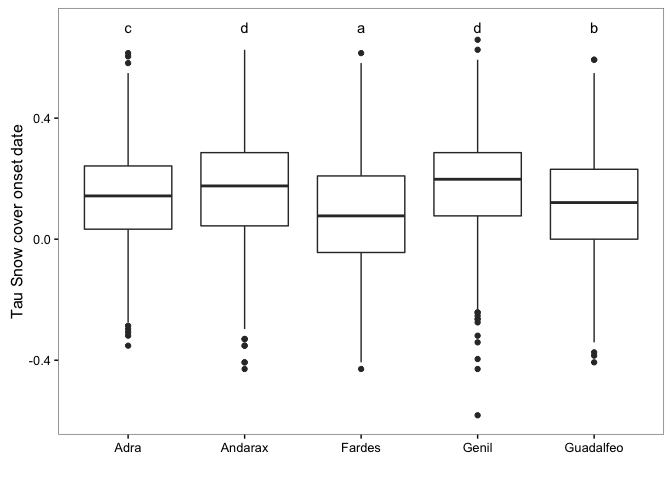

Prepare Data
------------

1.  Read data of Mann-Kendal Sen-Slope for each pixels and snow-cover related indicators (scd, scod, scmd, scmc).
2.  Read data of topographic variable:
    -   Convert radian to deg.
    -   Create categorical variable for elevation (250 m)
    -   Classify aspect into 8 categories

3.  Read data from hydrological basin
4.  Read spatial data:
    -   Select only centroides of interest

5.  Create two dataframes:
    -   **Full Dataframe** with all variables and all pixels (`fulldf`)
    -   **Filter dataframe** with all variables and filter by pixels above 1250 *m.a.s.l.* (`fulldf1250`)

``` r
# Trend analysis data
# Define name of indicators (see variables names)
indicadores <- c("scd", "scod", "scmd", "scmc")

# Loop to read files 
for (j in indicadores){ 
  aux <- read.csv(file=paste(di, "/data/derived/", j, ".csv", sep= ""),
              header = TRUE,
              sep = ',')
  assign(j, aux)
}
# --

# Define pixels of interes 
pixels_interes <- scd$nie_malla_modi_id

# Read Topographic data 
rawtopo <- read.csv(file=paste(di, "/data/topo_nie_malla_modis.csv", sep=""),
                    header=TRUE,
                    sep = ",") 

# function to convert radian to degree 
rad2deg <- function(rad) {(rad * 180) / (pi)} 


topo <- rawtopo %>% 
  filter(id %in% pixels_interes) %>% 
  mutate(nie_malla_modi_id = id, 
         slope50mean_deg = rad2deg(slope50mean),
         slope50median_deg = rad2deg(slope50median),
         aspect50mean_deg = rad2deg(aspect50mean),
         aspect50median_deg = rad2deg(aspect50median)) %>%
  dplyr::select(nie_malla_modi_id, dem50mean, dem50median, slope50mean_deg, 
                slope50median_deg, aspect50mean_deg, aspect50median_deg) 

## Create interval variables (250 m) for dem; and classify aspect into 8 categories 
topo <- topo %>% 
  mutate(dem50mean_group = cut(dem50mean, 
                         breaks = seq(from=0, to=3500, by=250),
                         labels = c("0-250", "251-500","501-750","751-1000",
                                    "1001-1250","1251-1500","1501-1750","1751-2000",
                                    "2001-2250","2251-2500","2501-2750", "2751-3000",
                                    "3001-3250", "3251-3500")),
         aspect50mean_deg_group = cut(aspect50mean_deg, 
                                      breaks= c(22.5, 67.5, 112.5, 157.5, 202.5, 247.5, 292.5, 337.5, 359.5),
                                      labels = c("N", "NE", "E", "SE", "S", "SW", "W", "NW")))


# --

# Read spatial data and Get lat/long
centroides <- rgdal::readOGR(dsn=paste(di, "/data/geoinfo", sep=""),
                             layer = "centroides_selected", verbose = FALSE)
# Select only attributes of interest and rename them
centroides <- centroides[c("id")]

# Create lat/lng by id 
xycentroides <- cbind(centroides@data, coordinates(centroides))
names(xycentroides) <- c("nie_malla_modi_id", "lon","lat")

xycentroides <- filter(xycentroides, nie_malla_modi_id %in% pixels_interes)
# -- 

# Hydrological basin 
basin <- read.csv(file=paste(di, "/data/derived/pixel_region.csv", sep=""),
                    header=TRUE,
                    sep = ",") 
# --


# Create un dataframe con todos los datos
fulldf <- topo %>% 
  inner_join(scod,  by=c("nie_malla_modi_id")) %>% 
  inner_join(scd,  by=c("nie_malla_modi_id")) %>% 
  inner_join(scmd,  by=c("nie_malla_modi_id")) %>% 
  inner_join(scmc,  by=c("nie_malla_modi_id")) %>% 
  inner_join(xycentroides, by="nie_malla_modi_id") %>%
  inner_join(basin, by="nie_malla_modi_id")

# Create subset of pixels above 1250 
fulldf1250 <- fulldf %>% 
  filter(dem50mean > 1250)  
```

Explore Snow-Cover trends by basin
==================================

We explore the pattern of snow-cover indicators trends by hydrological basin.

``` r
## Summary statistics 
misvariables<- c('tau_scd', 'sen_slope_scd', 'tau_scod', 'sen_slope_scod',
                 'tau_scmd', 'sen_slope_scmd', 'tau_scmc', 'sen_slope_scmc')
variable_agrupa <- 'basin_name' 
prefijo  <- 'basin_' 
df <- fulldf1250

stats_basin <- data.frame() 
  
for (i in misvariables){
  vnames <- c(variable_agrupa, i)
  aux <- df %>%
    dplyr::select(one_of(vnames)) %>%
    mutate_(vinterest = i) %>%
    group_by_(.dots=variable_agrupa) %>%
    summarise(mean=mean(vinterest),
              sd = sd(vinterest),
              se = sd / sqrt (length(vinterest)))
  aux <- aux %>% 
    mutate(variable = i)
  
  stats_basin <- rbind(stats_basin, aux)
  # assign(paste0(prefijo,i), aux)
   
}
```

### Snow cover duration

``` r
df_letter_aux <- data.frame() 
df <- fulldf1250
```

``` r
# Tau scd 
# ANOVA 
variable <- 'tau_scd'
my_ylab <- 'Tau Snow cover duration'
mod <- aov(tau_scd ~ basin_name, data=df)
pander(tidy(mod))
```

<table style="width:75%;">
<colgroup>
<col width="15%" />
<col width="6%" />
<col width="11%" />
<col width="12%" />
<col width="16%" />
<col width="12%" />
</colgroup>
<thead>
<tr class="header">
<th align="center">term</th>
<th align="center">df</th>
<th align="center">sumsq</th>
<th align="center">meansq</th>
<th align="center">statistic</th>
<th align="center">p.value</th>
</tr>
</thead>
<tbody>
<tr class="odd">
<td align="center">basin_name</td>
<td align="center">4</td>
<td align="center">2.326</td>
<td align="center">0.5814</td>
<td align="center">25.07</td>
<td align="center">1.239e-20</td>
</tr>
<tr class="even">
<td align="center">Residuals</td>
<td align="center">6385</td>
<td align="center">148.1</td>
<td align="center">0.02319</td>
<td align="center">NA</td>
<td align="center">NA</td>
</tr>
</tbody>
</table>

``` r
## Multiple comparisons 
tuk <- glht(mod, linfct = mcp(basin_name = "Tukey"))
# Convert comparisons into letters 
df_letter <- fortify(cld(tuk)) %>%
  transmute(basin_name = as.factor(lhs),
         tukey_basin_name = letters) %>%
  mutate(variable = variable)

df_letter_aux <- rbind(df_letter_aux, df_letter)

## ANOVA plots
ggplot(df, aes_string(x='basin_name', y=variable)) + 
  geom_boxplot() +
  geom_text(data=df_letter, aes(label = tukey_basin_name, x=basin_name, y=0.5),
           position = position_dodge(width=0.9)) +
  theme_bw() + mythemeggplot + 
  ylab(my_ylab) + xlab('')
```


``` r
# Sen scd 
# ANOVA 
variable <- 'sen_slope_scd'
my_ylab <- 'Sen slope Snow cover duration'
mod <- aov(sen_slope_scd ~ basin_name, data=df)
tidy(mod)
```

    ##         term   df      sumsq    meansq statistic      p.value
    ## 1 basin_name    4   369.5038 92.375948  40.66789 1.055819e-33
    ## 2  Residuals 6385 14503.3443  2.271471        NA           NA

``` r
## Multiple comparisons 
tuk <- glht(mod, linfct = mcp(basin_name = "Tukey"))
# Convert comparisons into letters 
df_letter <- fortify(cld(tuk)) %>%
  transmute(basin_name = as.factor(lhs),
         tukey_basin_name = letters) %>%
  mutate(variable = variable)

df_letter_aux <- rbind(df_letter_aux, df_letter)

## ANOVA plots
ggplot(df, aes_string(x='basin_name', y=variable)) + 
  geom_boxplot() +
  geom_text(data=df_letter, aes(label = tukey_basin_name, x=basin_name, y=4.5),
           position = position_dodge(width=0.9)) +
  theme_bw() + mythemeggplot + 
  ylab(my_ylab) + xlab('')
```


Snow cover onset date
=====================

``` r
# Tau scod 
# ANOVA 
variable <- 'tau_scod'
my_ylab <- 'Tau Snow cover onset date'
mod <- aov(tau_scod ~ basin_name, data=df)
tidy(mod)
```

    ##         term   df      sumsq     meansq statistic      p.value
    ## 1 basin_name    4   6.290132 1.57253293  55.61619 3.550453e-46
    ## 2  Residuals 6385 180.534182 0.02827473        NA           NA

``` r
## Multiple comparisons 
tuk <- glht(mod, linfct = mcp(basin_name = "Tukey"))
# Convert comparisons into letters 
df_letter <- fortify(cld(tuk)) %>%
  transmute(basin_name = as.factor(lhs),
         tukey_basin_name = letters) %>%
  mutate(variable = variable)

df_letter_aux <- rbind(df_letter_aux, df_letter)

## ANOVA plots
ggplot(df, aes_string(x='basin_name', y=variable)) + 
  geom_boxplot() +
  geom_text(data=df_letter, aes(label = tukey_basin_name, x=basin_name, y=0.7),
           position = position_dodge(width=0.9)) +
  theme_bw() + mythemeggplot + 
  ylab(my_ylab) + xlab('')
```


``` r
# Sen scod 
# ANOVA 
variable <- 'sen_slope_scod'
my_ylab <- 'Sen slope Snow cover onset date'
mod <- aov(sen_slope_scod ~ basin_name, data=df)
tidy(mod)
```

    ##         term   df      sumsq    meansq statistic      p.value
    ## 1 basin_name    4   333.9589 83.489735  26.76292 4.745272e-22
    ## 2  Residuals 6385 19918.6788  3.119605        NA           NA

``` r
## Multiple comparisons 
tuk <- glht(mod, linfct = mcp(basin_name = "Tukey"))
# Convert comparisons into letters 
df_letter <- fortify(cld(tuk)) %>%
  transmute(basin_name = as.factor(lhs),
         tukey_basin_name = letters) %>%
  mutate(variable = variable)

df_letter_aux <- rbind(df_letter_aux, df_letter)

## ANOVA plots
ggplot(df, aes_string(x='basin_name', y=variable)) + 
  geom_boxplot() +
  geom_text(data=df_letter, aes(label = tukey_basin_name, x=basin_name, y=10),
           position = position_dodge(width=0.9)) +
  theme_bw() + mythemeggplot + 
  ylab(my_ylab) + xlab('')
```


Snow cover melting date
=======================

``` r
# Tau scmd 
# ANOVA 
variable <- 'tau_scmd'
my_ylab <- 'Tau Snow cover melting date'
mod <- aov(tau_scmd ~ basin_name, data=df)
tidy(mod)
```

    ##         term   df      sumsq    meansq statistic      p.value
    ## 1 basin_name    4   5.153013 1.2882532  47.14007 4.112493e-39
    ## 2  Residuals 6385 174.490564 0.0273282        NA           NA

``` r
## Multiple comparisons 
tuk <- glht(mod, linfct = mcp(basin_name = "Tukey"))
# Convert comparisons into letters 
df_letter <- fortify(cld(tuk)) %>%
  transmute(basin_name = as.factor(lhs),
         tukey_basin_name = letters) %>%
  mutate(variable = variable)

df_letter_aux <- rbind(df_letter_aux, df_letter)

## ANOVA plots
ggplot(df, aes_string(x='basin_name', y=variable)) + 
  geom_boxplot() +
  geom_text(data=df_letter, aes(label = tukey_basin_name, x=basin_name, y=0.5),
           position = position_dodge(width=0.9)) +
  theme_bw() + mythemeggplot + 
  ylab(my_ylab) + xlab('')
```



``` r
# Sen scmd 
# ANOVA 
variable <- 'sen_slope_scmd'
my_ylab <- 'Sen slope Snow cover melting date'
mod <- aov(sen_slope_scmd ~ basin_name, data=df)
tidy(mod)
```

    ##         term   df      sumsq     meansq statistic      p.value
    ## 1 basin_name    4   555.1691 138.792272  39.14631 1.981672e-32
    ## 2  Residuals 6385 22637.8603   3.545475        NA           NA

``` r
## Multiple comparisons 
tuk <- glht(mod, linfct = mcp(basin_name = "Tukey"))
# Convert comparisons into letters 
df_letter <- fortify(cld(tuk)) %>%
  transmute(basin_name = as.factor(lhs),
         tukey_basin_name = letters) %>%
  mutate(variable = variable)

df_letter_aux <- rbind(df_letter_aux, df_letter)

## ANOVA plots
ggplot(df, aes_string(x='basin_name', y=variable)) + 
  geom_boxplot() +
  geom_text(data=df_letter, aes(label = tukey_basin_name, x=basin_name, y=10),
           position = position_dodge(width=0.9)) +
  theme_bw() + mythemeggplot + 
  ylab(my_ylab) + xlab('')
```


Snow cover melting cycles
=========================

``` r
# Tau scmc 
# ANOVA 
variable <- 'tau_scmc'
my_ylab <- 'Tau Snow cover melting cycles'
mod <- aov(tau_scmc ~ basin_name, data=df)
tidy(mod)
```

    ##         term   df      sumsq     meansq statistic      p.value
    ## 1 basin_name    4   4.829886 1.20747142  54.49315 3.053059e-45
    ## 2  Residuals 6385 141.480261 0.02215822        NA           NA

``` r
## Multiple comparisons 
tuk <- glht(mod, linfct = mcp(basin_name = "Tukey"))
# Convert comparisons into letters 
df_letter <- fortify(cld(tuk)) %>%
  transmute(basin_name = as.factor(lhs),
         tukey_basin_name = letters) %>%
  mutate(variable = variable)

df_letter_aux <- rbind(df_letter_aux, df_letter)

## ANOVA plots
ggplot(df, aes_string(x='basin_name', y=variable)) + 
  geom_boxplot() +
  geom_text(data=df_letter, aes(label = tukey_basin_name, x=basin_name, y=0.5),
           position = position_dodge(width=0.9)) +
  theme_bw() + mythemeggplot + 
  ylab(my_ylab) + xlab('')
```


``` r
# Sen scmc 
# ANOVA 
variable <- 'sen_slope_scmc'
my_ylab <- 'Sen slope Snow cover melting cycles'
mod <- aov(sen_slope_scmc ~ basin_name, data=df)
tidy(mod)
```

    ##         term   df     sumsq      meansq statistic      p.value
    ## 1 basin_name    4  2.330707 0.582676721    77.777 1.629835e-64
    ## 2  Residuals 6385 47.834074 0.007491633        NA           NA

``` r
## Multiple comparisons 
tuk <- glht(mod, linfct = mcp(basin_name = "Tukey"))
# Convert comparisons into letters 
df_letter <- fortify(cld(tuk)) %>%
  transmute(basin_name = as.factor(lhs),
         tukey_basin_name = letters) %>%
  mutate(variable = variable)

df_letter_aux <- rbind(df_letter_aux, df_letter)

## ANOVA plots
ggplot(df, aes_string(x='basin_name', y=variable)) + 
  geom_boxplot() +
  geom_text(data=df_letter, aes(label = tukey_basin_name, x=basin_name, y=.5),
           position = position_dodge(width=0.9)) +
  theme_bw() + mythemeggplot + 
  ylab(my_ylab) + xlab('')
```


``` r
# Create a df with letter and variables
df_basin <- stats_basin %>%
  dplyr::inner_join(df_letter_aux, by=c('basin_name', 'variable'))

df_basin_tau <- df_basin %>%
  dplyr::filter(grepl("tau", variable))


ggplot(df_basin_tau, aes(x=basin_name, y=mean)) + 
  geom_point(stat='identity', size=3, fill='#222943') + 
  geom_errorbar(aes(ymin=mean - sd, ymax= mean + sd), 
                width=0.1,
                colour='#222943',
                position=position_dodge(.9)) +
  facet_wrap(~variable) + 
  geom_text(aes(label = tukey_basin_name, x=basin_name, y=mean),
           hjust=0, nudge_x = 0.2) + mythemeggplot +
  xlab('') + ylab('Taus')
```


``` r
# Create a df with letter and variables
df_basin_sen <- df_basin %>%
  dplyr::filter(grepl("sen", variable))


ggplot(df_basin_sen, aes(x=basin_name, y=mean)) + 
  geom_point(stat='identity', size=3, fill='#222943') + 
  geom_errorbar(aes(ymin=mean - sd, ymax= mean + sd), 
                width=0.1,
                colour='#222943',
                position=position_dodge(.9)) +
  facet_wrap(~variable) + 
  geom_text(aes(label = tukey_basin_name, x=basin_name, y=mean),
           hjust=0, nudge_x = 0.2) + mythemeggplot +
  xlab('') + ylab('Sen Slopes')
```


#### Tau Snow cover duration

``` r
pander(filter(df_basin_tau, variable=="tau_scd")) 
```

<table>
<colgroup>
<col width="17%" />
<col width="14%" />
<col width="13%" />
<col width="16%" />
<col width="14%" />
<col width="24%" />
</colgroup>
<thead>
<tr class="header">
<th align="center">basin_name</th>
<th align="center">mean</th>
<th align="center">sd</th>
<th align="center">se</th>
<th align="center">variable</th>
<th align="center">tukey_basin_name</th>
</tr>
</thead>
<tbody>
<tr class="odd">
<td align="center">Adra</td>
<td align="center">-0.1539916</td>
<td align="center">0.1299276</td>
<td align="center">0.004217628</td>
<td align="center">tau_scd</td>
<td align="center">b</td>
</tr>
<tr class="even">
<td align="center">Andarax</td>
<td align="center">-0.1781580</td>
<td align="center">0.1347095</td>
<td align="center">0.003958622</td>
<td align="center">tau_scd</td>
<td align="center">a</td>
</tr>
<tr class="odd">
<td align="center">Fardes</td>
<td align="center">-0.1509319</td>
<td align="center">0.1552694</td>
<td align="center">0.004588631</td>
<td align="center">tau_scd</td>
<td align="center">b</td>
</tr>
<tr class="even">
<td align="center">Genil</td>
<td align="center">-0.1164561</td>
<td align="center">0.1748347</td>
<td align="center">0.005312675</td>
<td align="center">tau_scd</td>
<td align="center">c</td>
</tr>
<tr class="odd">
<td align="center">Guadalfeo</td>
<td align="center">-0.1614019</td>
<td align="center">0.1566468</td>
<td align="center">0.003455537</td>
<td align="center">tau_scd</td>
<td align="center">b</td>
</tr>
</tbody>
</table>

#### Sen Slope Snow cover duration

``` r
pander(filter(df_basin_sen, variable=="sen_slope_scd")) 
```

<table style="width:100%;">
<colgroup>
<col width="17%" />
<col width="13%" />
<col width="12%" />
<col width="14%" />
<col width="18%" />
<col width="24%" />
</colgroup>
<thead>
<tr class="header">
<th align="center">basin_name</th>
<th align="center">mean</th>
<th align="center">sd</th>
<th align="center">se</th>
<th align="center">variable</th>
<th align="center">tukey_basin_name</th>
</tr>
</thead>
<tbody>
<tr class="odd">
<td align="center">Adra</td>
<td align="center">-1.212126</td>
<td align="center">1.330570</td>
<td align="center">0.04319214</td>
<td align="center">sen_slope_scd</td>
<td align="center">b</td>
</tr>
<tr class="even">
<td align="center">Andarax</td>
<td align="center">-1.165116</td>
<td align="center">1.187804</td>
<td align="center">0.03490522</td>
<td align="center">sen_slope_scd</td>
<td align="center">b</td>
</tr>
<tr class="odd">
<td align="center">Fardes</td>
<td align="center">-1.256298</td>
<td align="center">1.450748</td>
<td align="center">0.04287353</td>
<td align="center">sen_slope_scd</td>
<td align="center">b</td>
</tr>
<tr class="even">
<td align="center">Genil</td>
<td align="center">-1.227084</td>
<td align="center">1.616166</td>
<td align="center">0.04911019</td>
<td align="center">sen_slope_scd</td>
<td align="center">b</td>
</tr>
<tr class="odd">
<td align="center">Guadalfeo</td>
<td align="center">-1.726302</td>
<td align="center">1.703237</td>
<td align="center">0.03757242</td>
<td align="center">sen_slope_scd</td>
<td align="center">a</td>
</tr>
</tbody>
</table>

#### Tau Snow cover onset date

``` r
pander(filter(df_basin_tau, variable=="tau_scod")) 
```

<table>
<colgroup>
<col width="17%" />
<col width="14%" />
<col width="13%" />
<col width="16%" />
<col width="14%" />
<col width="24%" />
</colgroup>
<thead>
<tr class="header">
<th align="center">basin_name</th>
<th align="center">mean</th>
<th align="center">sd</th>
<th align="center">se</th>
<th align="center">variable</th>
<th align="center">tukey_basin_name</th>
</tr>
</thead>
<tbody>
<tr class="odd">
<td align="center">Adra</td>
<td align="center">0.13508641</td>
<td align="center">0.1661481</td>
<td align="center">0.005393396</td>
<td align="center">tau_scod</td>
<td align="center">c</td>
</tr>
<tr class="even">
<td align="center">Andarax</td>
<td align="center">0.16170725</td>
<td align="center">0.1799857</td>
<td align="center">0.005289125</td>
<td align="center">tau_scod</td>
<td align="center">d</td>
</tr>
<tr class="odd">
<td align="center">Fardes</td>
<td align="center">0.08508559</td>
<td align="center">0.1760358</td>
<td align="center">0.005202333</td>
<td align="center">tau_scod</td>
<td align="center">a</td>
</tr>
<tr class="even">
<td align="center">Genil</td>
<td align="center">0.17786334</td>
<td align="center">0.1532622</td>
<td align="center">0.004657156</td>
<td align="center">tau_scod</td>
<td align="center">d</td>
</tr>
<tr class="odd">
<td align="center">Guadalfeo</td>
<td align="center">0.11700681</td>
<td align="center">0.1651432</td>
<td align="center">0.003642962</td>
<td align="center">tau_scod</td>
<td align="center">b</td>
</tr>
</tbody>
</table>

#### Sen Slope Snow onset date

``` r
pander(filter(df_basin_sen, variable=="sen_slope_scod")) 
```

<table style="width:100%;">
<colgroup>
<col width="17%" />
<col width="13%" />
<col width="11%" />
<col width="14%" />
<col width="19%" />
<col width="23%" />
</colgroup>
<thead>
<tr class="header">
<th align="center">basin_name</th>
<th align="center">mean</th>
<th align="center">sd</th>
<th align="center">se</th>
<th align="center">variable</th>
<th align="center">tukey_basin_name</th>
</tr>
</thead>
<tbody>
<tr class="odd">
<td align="center">Adra</td>
<td align="center">1.3561486</td>
<td align="center">1.880254</td>
<td align="center">0.06103564</td>
<td align="center">sen_slope_scod</td>
<td align="center">c</td>
</tr>
<tr class="even">
<td align="center">Andarax</td>
<td align="center">1.2622073</td>
<td align="center">2.081075</td>
<td align="center">0.06115520</td>
<td align="center">sen_slope_scod</td>
<td align="center">c</td>
</tr>
<tr class="odd">
<td align="center">Fardes</td>
<td align="center">0.7328856</td>
<td align="center">1.579219</td>
<td align="center">0.04667019</td>
<td align="center">sen_slope_scod</td>
<td align="center">a</td>
</tr>
<tr class="even">
<td align="center">Genil</td>
<td align="center">1.3788957</td>
<td align="center">1.519216</td>
<td align="center">0.04616421</td>
<td align="center">sen_slope_scod</td>
<td align="center">c</td>
</tr>
<tr class="odd">
<td align="center">Guadalfeo</td>
<td align="center">1.0376273</td>
<td align="center">1.738225</td>
<td align="center">0.03834423</td>
<td align="center">sen_slope_scod</td>
<td align="center">b</td>
</tr>
</tbody>
</table>

#### Tau Snow cover melting date

``` r
pander(filter(df_basin_tau, variable=="tau_scmd")) 
```

<table>
<colgroup>
<col width="17%" />
<col width="14%" />
<col width="13%" />
<col width="16%" />
<col width="14%" />
<col width="24%" />
</colgroup>
<thead>
<tr class="header">
<th align="center">basin_name</th>
<th align="center">mean</th>
<th align="center">sd</th>
<th align="center">se</th>
<th align="center">variable</th>
<th align="center">tukey_basin_name</th>
</tr>
</thead>
<tbody>
<tr class="odd">
<td align="center">Adra</td>
<td align="center">-0.1833962</td>
<td align="center">0.1688657</td>
<td align="center">0.005481613</td>
<td align="center">tau_scmd</td>
<td align="center">b</td>
</tr>
<tr class="even">
<td align="center">Andarax</td>
<td align="center">-0.1440147</td>
<td align="center">0.1583987</td>
<td align="center">0.004654762</td>
<td align="center">tau_scmd</td>
<td align="center">c</td>
</tr>
<tr class="odd">
<td align="center">Fardes</td>
<td align="center">-0.2067694</td>
<td align="center">0.1745326</td>
<td align="center">0.005157911</td>
<td align="center">tau_scmd</td>
<td align="center">a</td>
</tr>
<tr class="even">
<td align="center">Genil</td>
<td align="center">-0.1384146</td>
<td align="center">0.1364387</td>
<td align="center">0.004145942</td>
<td align="center">tau_scmd</td>
<td align="center">c</td>
</tr>
<tr class="odd">
<td align="center">Guadalfeo</td>
<td align="center">-0.2016161</td>
<td align="center">0.1757420</td>
<td align="center">0.003876768</td>
<td align="center">tau_scmd</td>
<td align="center">a</td>
</tr>
</tbody>
</table>

#### Sen Slope Snow melting date

``` r
pander(filter(df_basin_sen, variable=="sen_slope_scmd")) 
```

<table style="width:100%;">
<colgroup>
<col width="17%" />
<col width="13%" />
<col width="11%" />
<col width="14%" />
<col width="19%" />
<col width="23%" />
</colgroup>
<thead>
<tr class="header">
<th align="center">basin_name</th>
<th align="center">mean</th>
<th align="center">sd</th>
<th align="center">se</th>
<th align="center">variable</th>
<th align="center">tukey_basin_name</th>
</tr>
</thead>
<tbody>
<tr class="odd">
<td align="center">Adra</td>
<td align="center">-1.632706</td>
<td align="center">1.907522</td>
<td align="center">0.06192079</td>
<td align="center">sen_slope_scmd</td>
<td align="center">b</td>
</tr>
<tr class="even">
<td align="center">Andarax</td>
<td align="center">-1.399011</td>
<td align="center">1.984965</td>
<td align="center">0.05833088</td>
<td align="center">sen_slope_scmd</td>
<td align="center">c</td>
</tr>
<tr class="odd">
<td align="center">Fardes</td>
<td align="center">-1.968318</td>
<td align="center">2.106212</td>
<td align="center">0.06224426</td>
<td align="center">sen_slope_scmd</td>
<td align="center">a</td>
</tr>
<tr class="even">
<td align="center">Genil</td>
<td align="center">-1.111770</td>
<td align="center">1.399082</td>
<td align="center">0.04251370</td>
<td align="center">sen_slope_scmd</td>
<td align="center">d</td>
</tr>
<tr class="odd">
<td align="center">Guadalfeo</td>
<td align="center">-1.817089</td>
<td align="center">1.902809</td>
<td align="center">0.04197486</td>
<td align="center">sen_slope_scmd</td>
<td align="center">ab</td>
</tr>
</tbody>
</table>

#### Tau Snow cover melting cycles

``` r
pander(filter(df_basin_tau, variable=="tau_scmc")) 
```

<table>
<colgroup>
<col width="17%" />
<col width="14%" />
<col width="13%" />
<col width="16%" />
<col width="14%" />
<col width="24%" />
</colgroup>
<thead>
<tr class="header">
<th align="center">basin_name</th>
<th align="center">mean</th>
<th align="center">sd</th>
<th align="center">se</th>
<th align="center">variable</th>
<th align="center">tukey_basin_name</th>
</tr>
</thead>
<tbody>
<tr class="odd">
<td align="center">Adra</td>
<td align="center">-0.1399842</td>
<td align="center">0.1235027</td>
<td align="center">0.004009066</td>
<td align="center">tau_scmc</td>
<td align="center">d</td>
</tr>
<tr class="even">
<td align="center">Andarax</td>
<td align="center">-0.1745829</td>
<td align="center">0.1393072</td>
<td align="center">0.004093732</td>
<td align="center">tau_scmc</td>
<td align="center">c</td>
</tr>
<tr class="odd">
<td align="center">Fardes</td>
<td align="center">-0.1879328</td>
<td align="center">0.1565802</td>
<td align="center">0.004627370</td>
<td align="center">tau_scmc</td>
<td align="center">c</td>
</tr>
<tr class="even">
<td align="center">Genil</td>
<td align="center">-0.2266741</td>
<td align="center">0.1757618</td>
<td align="center">0.005340850</td>
<td align="center">tau_scmc</td>
<td align="center">a</td>
</tr>
<tr class="odd">
<td align="center">Guadalfeo</td>
<td align="center">-0.2089504</td>
<td align="center">0.1448464</td>
<td align="center">0.003195228</td>
<td align="center">tau_scmc</td>
<td align="center">b</td>
</tr>
</tbody>
</table>

#### Sen Slope Snow melting date

``` r
pander(filter(df_basin_sen, variable=="sen_slope_scmc")) 
```

<table style="width:100%;">
<colgroup>
<col width="16%" />
<col width="14%" />
<col width="13%" />
<col width="14%" />
<col width="18%" />
<col width="22%" />
</colgroup>
<thead>
<tr class="header">
<th align="center">basin_name</th>
<th align="center">mean</th>
<th align="center">sd</th>
<th align="center">se</th>
<th align="center">variable</th>
<th align="center">tukey_basin_name</th>
</tr>
</thead>
<tbody>
<tr class="odd">
<td align="center">Adra</td>
<td align="center">-0.04459536</td>
<td align="center">0.06725779</td>
<td align="center">0.002183280</td>
<td align="center">sen_slope_scmc</td>
<td align="center">c</td>
</tr>
<tr class="even">
<td align="center">Andarax</td>
<td align="center">-0.05264162</td>
<td align="center">0.07425655</td>
<td align="center">0.002182129</td>
<td align="center">sen_slope_scmc</td>
<td align="center">c</td>
</tr>
<tr class="odd">
<td align="center">Fardes</td>
<td align="center">-0.07982009</td>
<td align="center">0.09181152</td>
<td align="center">0.002713279</td>
<td align="center">sen_slope_scmc</td>
<td align="center">b</td>
</tr>
<tr class="even">
<td align="center">Genil</td>
<td align="center">-0.09900277</td>
<td align="center">0.10182727</td>
<td align="center">0.003094211</td>
<td align="center">sen_slope_scmc</td>
<td align="center">a</td>
</tr>
<tr class="odd">
<td align="center">Guadalfeo</td>
<td align="center">-0.08545109</td>
<td align="center">0.08909295</td>
<td align="center">0.001965339</td>
<td align="center">sen_slope_scmc</td>
<td align="center">b</td>
</tr>
</tbody>
</table>
