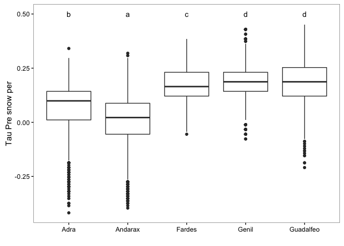
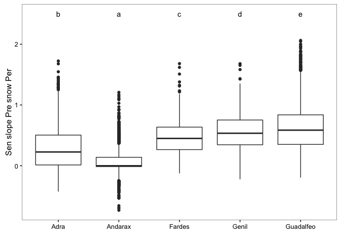

Prepare Data
------------

1.  Read data of Mann-Kendal Sen-Slope for each pixels and WiMMed indicators
2.  Read data of topographic variable:
    -   Convert radian to deg.
    -   Create categorical variable for elevation (250 m)
    -   Classify aspect into 8 categories

3.  Read data from hydrological basin
4.  Read spatial data:
    -   Select only centroides of interest

5.  Create two dataframes:
    -   **Full Dataframe** with all variables and all pixels (`fulldf`)
    -   :red\_circle: In this exploration we don't filter the data by elevation

``` r
# Trend analysis data
# Define name of indicators (see variables names)
# Use annual and season aggregation 
indicadores <- c("pre", "pre_snow", "pre_snow_per", "temp", 
                 "pnau", "pnsp", "pnsu", "pnwi",
                 "preau", "presp", "presu", "prewi",
                 "tempau", "tempsp", "tempsu", "tempwi")

# Loop to read files 
for (j in indicadores){ 
  aux <- read.csv(file=paste(di, "/data/derived/", j, ".csv", sep= ""),
              header = TRUE,
              sep = ',')
  assign(j, aux)
}
# --

# Define pixels of interes 
pixels_interes <- pre$nie_malla_modi_id

# Read Topographic data 
rawtopo <- read.csv(file=paste(di, "/data/topo_nie_malla_modis.csv", sep=""),
                    header=TRUE,
                    sep = ",") 

# function to convert radian to degree 
rad2deg <- function(rad) {(rad * 180) / (pi)} 


topo <- rawtopo %>% 
  filter(id %in% pixels_interes) %>% 
  mutate(nie_malla_modi_id = id, 
         slope50mean_deg = rad2deg(slope50mean),
         slope50median_deg = rad2deg(slope50median),
         aspect50mean_deg = rad2deg(aspect50mean),
         aspect50median_deg = rad2deg(aspect50median)) %>%
  dplyr::select(nie_malla_modi_id, dem50mean, dem50median, slope50mean_deg, 
                slope50median_deg, aspect50mean_deg, aspect50median_deg) 

## Create interval variables (250 m) for dem; and classify aspect into 8 categories 
topo <- topo %>% 
  mutate(dem50mean_group = cut(dem50mean, 
                         breaks = seq(from=0, to=3500, by=250),
                         labels = c("0-250", "251-500","501-750","751-1000",
                                    "1001-1250","1251-1500","1501-1750","1751-2000",
                                    "2001-2250","2251-2500","2501-2750", "2751-3000",
                                    "3001-3250", "3251-3500")),
         aspect50mean_deg_group = cut(aspect50mean_deg, 
                                      breaks= c(22.5, 67.5, 112.5, 157.5, 202.5, 247.5, 292.5, 337.5, 359.5),
                                      labels = c("N", "NE", "E", "SE", "S", "SW", "W", "NW")))


# --

# Read spatial data and Get lat/long
centroides <- rgdal::readOGR(dsn=paste(di, "/data/geoinfo", sep=""),
                             layer = "centroides_selected", verbose = FALSE)
# Select only attributes of interest and rename them
centroides <- centroides[c("id")]

# Create lat/lng by id 
xycentroides <- cbind(centroides@data, coordinates(centroides))
names(xycentroides) <- c("nie_malla_modi_id", "lon","lat")

xycentroides <- filter(xycentroides, nie_malla_modi_id %in% pixels_interes)
# -- 

# Hydrological basin 
basin <- read.csv(file=paste(di, "/data/derived/pixel_region.csv", sep=""),
                    header=TRUE,
                    sep = ",") 
# --


# Create un dataframe con todos los datos
fulldf <- topo %>% 
  inner_join(pre,  by=c("nie_malla_modi_id")) %>% 
  inner_join(pre_snow,  by=c("nie_malla_modi_id")) %>% 
  inner_join(pre_snow_per,  by=c("nie_malla_modi_id")) %>% 
  inner_join(temp,  by=c("nie_malla_modi_id")) %>% 
  inner_join(pnau,  by=c("nie_malla_modi_id")) %>% 
  inner_join(pnsp,  by=c("nie_malla_modi_id")) %>% 
  inner_join(pnsu,  by=c("nie_malla_modi_id")) %>% 
  inner_join(pnwi,  by=c("nie_malla_modi_id")) %>% 
  inner_join(preau,  by=c("nie_malla_modi_id")) %>% 
  inner_join(presp,  by=c("nie_malla_modi_id")) %>% 
  inner_join(presu,  by=c("nie_malla_modi_id")) %>% 
  inner_join(prewi,  by=c("nie_malla_modi_id")) %>% 
  inner_join(tempau,  by=c("nie_malla_modi_id")) %>% 
  inner_join(tempsp,  by=c("nie_malla_modi_id")) %>% 
  inner_join(tempsu,  by=c("nie_malla_modi_id")) %>% 
  inner_join(tempwi,  by=c("nie_malla_modi_id")) %>% 
  inner_join(xycentroides, by="nie_malla_modi_id") %>%
  inner_join(basin, by="nie_malla_modi_id")


# Create subset of pixels above 1250 
fulldf1250 <- fulldf %>% 
  filter(dem50mean > 1250)  
```

Explore trends of annual variables by basin
===========================================

We explore the pattern of snow-cover indicators trends by hydrological basin.

``` r
## Summary statistics 
misvariables<- c('tau_pre', 'sen_slope_pre', 'tau_pre_snow', 'sen_slope_pre_snow',
                 'tau_pre_snow_per', 'sen_slope_pre_snow_per', 'tau_temp', 'sen_slope_temp')

variable_agrupa <- 'basin_name' 
prefijo  <- 'basin_' 
df <- fulldf

stats_basin <- data.frame() 
  
for (i in misvariables){
  vnames <- c(variable_agrupa, i)
  aux <- df %>%
    dplyr::select(one_of(vnames)) %>%
    mutate_(vinterest = i) %>%
    group_by_(.dots=variable_agrupa) %>%
    summarise(mean=mean(vinterest),
              sd = sd(vinterest),
              se = sd / sqrt (length(vinterest)))
  aux <- aux %>% 
    mutate(variable = i)
  
  stats_basin <- rbind(stats_basin, aux)
  # assign(paste0(prefijo,i), aux)
   
}
```

### Pre

``` r
df_letter_aux <- data.frame() 
df <- fulldf
```

``` r
# Tau pre 
# ANOVA 
variable <- 'tau_pre'
my_ylab <- 'Tau Pre'


myformula <- formula(paste(variable, '~ basin_name', sep=''))
mod <- aov(myformula, data=df)
pander(tidy(mod), caption=my_ylab)
```

<table style="width:75%;">
<caption>Tau Pre</caption>
<colgroup>
<col width="15%" />
<col width="6%" />
<col width="11%" />
<col width="12%" />
<col width="16%" />
<col width="12%" />
</colgroup>
<thead>
<tr class="header">
<th align="center">term</th>
<th align="center">df</th>
<th align="center">sumsq</th>
<th align="center">meansq</th>
<th align="center">statistic</th>
<th align="center">p.value</th>
</tr>
</thead>
<tbody>
<tr class="odd">
<td align="center">basin_name</td>
<td align="center">4</td>
<td align="center">9.865</td>
<td align="center">2.466</td>
<td align="center">947.2</td>
<td align="center">0</td>
</tr>
<tr class="even">
<td align="center">Residuals</td>
<td align="center">7989</td>
<td align="center">20.8</td>
<td align="center">0.002604</td>
<td align="center">NA</td>
<td align="center">NA</td>
</tr>
</tbody>
</table>

``` r
## Multiple comparisons 
tuk <- glht(mod, linfct = mcp(basin_name = "Tukey"))
# Convert comparisons into letters 
df_letter <- fortify(cld(tuk)) %>%
  transmute(basin_name = as.factor(lhs),
         tukey_basin_name = letters) %>%
  mutate(variable = variable)

df_letter_aux <- rbind(df_letter_aux, df_letter)

## ANOVA plots
ggplot(df, aes_string(x='basin_name', y=variable)) + 
  geom_boxplot() +
  geom_text(data=df_letter, aes(label = tukey_basin_name, x=basin_name, y=0.5),
           position = position_dodge(width=0.9)) +
  theme_bw() + mythemeggplot + 
  ylab(my_ylab) + xlab('')
```


``` r
# Sen Pre
# ANOVA 
variable <- 'sen_slope_pre'
my_ylab <- 'Sen slope Pre'

myformula <- formula(paste(variable, '~ basin_name', sep=''))
mod <- aov(myformula, data=df)
pander(tidy(mod), caption=my_ylab)
```

<table style="width:75%;">
<caption>Sen slope Pre</caption>
<colgroup>
<col width="15%" />
<col width="6%" />
<col width="11%" />
<col width="12%" />
<col width="16%" />
<col width="12%" />
</colgroup>
<thead>
<tr class="header">
<th align="center">term</th>
<th align="center">df</th>
<th align="center">sumsq</th>
<th align="center">meansq</th>
<th align="center">statistic</th>
<th align="center">p.value</th>
</tr>
</thead>
<tbody>
<tr class="odd">
<td align="center">basin_name</td>
<td align="center">4</td>
<td align="center">36119</td>
<td align="center">9030</td>
<td align="center">1028</td>
<td align="center">0</td>
</tr>
<tr class="even">
<td align="center">Residuals</td>
<td align="center">7989</td>
<td align="center">70192</td>
<td align="center">8.786</td>
<td align="center">NA</td>
<td align="center">NA</td>
</tr>
</tbody>
</table>

``` r
## Multiple comparisons 
tuk <- glht(mod, linfct = mcp(basin_name = "Tukey"))
# Convert comparisons into letters 
df_letter <- fortify(cld(tuk)) %>%
  transmute(basin_name = as.factor(lhs),
         tukey_basin_name = letters) %>%
  mutate(variable = variable)

df_letter_aux <- rbind(df_letter_aux, df_letter)

## ANOVA plots
ggplot(df, aes_string(x='basin_name', y=variable)) + 
  geom_boxplot() +
  geom_text(data=df_letter, aes(label = tukey_basin_name, x=basin_name, y=15),
           position = position_dodge(width=0.9)) +
  theme_bw() + mythemeggplot + 
  ylab(my_ylab) + xlab('')
```


Pre Snow
========

``` r
# Tau Pre Snow  
# ANOVA 
variable <- 'tau_pre_snow'
my_ylab <- 'Tau Pre Snow'

myformula <- formula(paste(variable, '~ basin_name', sep=''))
mod <- aov(myformula, data=df)
pander(tidy(mod), caption=my_ylab)
```

<table style="width:75%;">
<caption>Tau Pre Snow</caption>
<colgroup>
<col width="15%" />
<col width="6%" />
<col width="11%" />
<col width="12%" />
<col width="16%" />
<col width="12%" />
</colgroup>
<thead>
<tr class="header">
<th align="center">term</th>
<th align="center">df</th>
<th align="center">sumsq</th>
<th align="center">meansq</th>
<th align="center">statistic</th>
<th align="center">p.value</th>
</tr>
</thead>
<tbody>
<tr class="odd">
<td align="center">basin_name</td>
<td align="center">4</td>
<td align="center">33.34</td>
<td align="center">8.335</td>
<td align="center">656.9</td>
<td align="center">0</td>
</tr>
<tr class="even">
<td align="center">Residuals</td>
<td align="center">7989</td>
<td align="center">101.4</td>
<td align="center">0.01269</td>
<td align="center">NA</td>
<td align="center">NA</td>
</tr>
</tbody>
</table>

``` r
## Multiple comparisons 
tuk <- glht(mod, linfct = mcp(basin_name = "Tukey"))
# Convert comparisons into letters 
df_letter <- fortify(cld(tuk)) %>%
  transmute(basin_name = as.factor(lhs),
         tukey_basin_name = letters) %>%
  mutate(variable = variable)

df_letter_aux <- rbind(df_letter_aux, df_letter)

## ANOVA plots
ggplot(df, aes_string(x='basin_name', y=variable)) + 
  geom_boxplot() +
  geom_text(data=df_letter, aes(label = tukey_basin_name, x=basin_name, y=0.7),
           position = position_dodge(width=0.9)) +
  theme_bw() + mythemeggplot + 
  ylab(my_ylab) + xlab('')
```


``` r
# Sen Pre Snow 
# ANOVA 
variable <- 'sen_slope_pre_snow'
my_ylab <- 'Sen slope Pre Snow'

myformula <- formula(paste(variable, '~ basin_name', sep=''))
mod <- aov(myformula, data=df)
pander(tidy(mod), caption=my_ylab)
```

<table style="width:75%;">
<caption>Sen slope Pre Snow</caption>
<colgroup>
<col width="15%" />
<col width="6%" />
<col width="11%" />
<col width="12%" />
<col width="16%" />
<col width="12%" />
</colgroup>
<thead>
<tr class="header">
<th align="center">term</th>
<th align="center">df</th>
<th align="center">sumsq</th>
<th align="center">meansq</th>
<th align="center">statistic</th>
<th align="center">p.value</th>
</tr>
</thead>
<tbody>
<tr class="odd">
<td align="center">basin_name</td>
<td align="center">4</td>
<td align="center">26876</td>
<td align="center">6719</td>
<td align="center">660.3</td>
<td align="center">0</td>
</tr>
<tr class="even">
<td align="center">Residuals</td>
<td align="center">7989</td>
<td align="center">81287</td>
<td align="center">10.17</td>
<td align="center">NA</td>
<td align="center">NA</td>
</tr>
</tbody>
</table>

``` r
## Multiple comparisons 
tuk <- glht(mod, linfct = mcp(basin_name = "Tukey"))
# Convert comparisons into letters 
df_letter <- fortify(cld(tuk)) %>%
  transmute(basin_name = as.factor(lhs),
         tukey_basin_name = letters) %>%
  mutate(variable = variable)

df_letter_aux <- rbind(df_letter_aux, df_letter)

## ANOVA plots
ggplot(df, aes_string(x='basin_name', y=variable)) + 
  geom_boxplot() +
  geom_text(data=df_letter, aes(label = tukey_basin_name, x=basin_name, y=20),
           position = position_dodge(width=0.9)) +
  theme_bw() + mythemeggplot + 
  ylab(my_ylab) + xlab('')
```


Pre Snow per
============

``` r
# Pre Snow per
# ANOVA 
variable <- 'tau_pre_snow_per'
my_ylab <- 'Tau Pre snow per'

myformula <- formula(paste(variable, '~ basin_name', sep=''))
mod <- aov(myformula, data=df)
pander(tidy(mod), caption=my_ylab)
```

<table style="width:75%;">
<caption>Tau Pre snow per</caption>
<colgroup>
<col width="15%" />
<col width="6%" />
<col width="11%" />
<col width="12%" />
<col width="16%" />
<col width="12%" />
</colgroup>
<thead>
<tr class="header">
<th align="center">term</th>
<th align="center">df</th>
<th align="center">sumsq</th>
<th align="center">meansq</th>
<th align="center">statistic</th>
<th align="center">p.value</th>
</tr>
</thead>
<tbody>
<tr class="odd">
<td align="center">basin_name</td>
<td align="center">4</td>
<td align="center">51.26</td>
<td align="center">12.82</td>
<td align="center">1172</td>
<td align="center">0</td>
</tr>
<tr class="even">
<td align="center">Residuals</td>
<td align="center">7989</td>
<td align="center">87.34</td>
<td align="center">0.01093</td>
<td align="center">NA</td>
<td align="center">NA</td>
</tr>
</tbody>
</table>

``` r
## Multiple comparisons 
tuk <- glht(mod, linfct = mcp(basin_name = "Tukey"))
# Convert comparisons into letters 
df_letter <- fortify(cld(tuk)) %>%
  transmute(basin_name = as.factor(lhs),
         tukey_basin_name = letters) %>%
  mutate(variable = variable)

df_letter_aux <- rbind(df_letter_aux, df_letter)

## ANOVA plots
ggplot(df, aes_string(x='basin_name', y=variable)) + 
  geom_boxplot() +
  geom_text(data=df_letter, aes(label = tukey_basin_name, x=basin_name, y=0.5),
           position = position_dodge(width=0.9)) +
  theme_bw() + mythemeggplot + 
  ylab(my_ylab) + xlab('')
```


``` r
# Sen Pre snow per 
# ANOVA 
variable <- 'sen_slope_pre_snow_per'
my_ylab <- 'Sen slope Pre snow Per'

myformula <- formula(paste(variable, '~ basin_name', sep=''))
mod <- aov(myformula, data=df)
pander(tidy(mod), caption=my_ylab)
```

<table style="width:75%;">
<caption>Sen slope Pre snow Per</caption>
<colgroup>
<col width="15%" />
<col width="6%" />
<col width="11%" />
<col width="12%" />
<col width="16%" />
<col width="12%" />
</colgroup>
<thead>
<tr class="header">
<th align="center">term</th>
<th align="center">df</th>
<th align="center">sumsq</th>
<th align="center">meansq</th>
<th align="center">statistic</th>
<th align="center">p.value</th>
</tr>
</thead>
<tbody>
<tr class="odd">
<td align="center">basin_name</td>
<td align="center">4</td>
<td align="center">408.9</td>
<td align="center">102.2</td>
<td align="center">990.7</td>
<td align="center">0</td>
</tr>
<tr class="even">
<td align="center">Residuals</td>
<td align="center">7989</td>
<td align="center">824.2</td>
<td align="center">0.1032</td>
<td align="center">NA</td>
<td align="center">NA</td>
</tr>
</tbody>
</table>

``` r
## Multiple comparisons 
tuk <- glht(mod, linfct = mcp(basin_name = "Tukey"))
# Convert comparisons into letters 
df_letter <- fortify(cld(tuk)) %>%
  transmute(basin_name = as.factor(lhs),
         tukey_basin_name = letters) %>%
  mutate(variable = variable)

df_letter_aux <- rbind(df_letter_aux, df_letter)

## ANOVA plots
ggplot(df, aes_string(x='basin_name', y=variable)) + 
  geom_boxplot() +
  geom_text(data=df_letter, aes(label = tukey_basin_name, x=basin_name, y=2.5),
           position = position_dodge(width=0.9)) +
  theme_bw() + mythemeggplot + 
  ylab(my_ylab) + xlab('')
```


Temp
====

``` r
# Tau temp 
# ANOVA 
variable <- 'tau_temp'
my_ylab <- 'Tau Temp'

myformula <- formula(paste(variable, '~ basin_name', sep=''))
mod <- aov(myformula, data=df)
pander(tidy(mod), caption=my_ylab)
```

<table style="width:75%;">
<caption>Tau Temp</caption>
<colgroup>
<col width="15%" />
<col width="6%" />
<col width="11%" />
<col width="12%" />
<col width="16%" />
<col width="12%" />
</colgroup>
<thead>
<tr class="header">
<th align="center">term</th>
<th align="center">df</th>
<th align="center">sumsq</th>
<th align="center">meansq</th>
<th align="center">statistic</th>
<th align="center">p.value</th>
</tr>
</thead>
<tbody>
<tr class="odd">
<td align="center">basin_name</td>
<td align="center">4</td>
<td align="center">77.58</td>
<td align="center">19.39</td>
<td align="center">1073</td>
<td align="center">0</td>
</tr>
<tr class="even">
<td align="center">Residuals</td>
<td align="center">7989</td>
<td align="center">144.4</td>
<td align="center">0.01807</td>
<td align="center">NA</td>
<td align="center">NA</td>
</tr>
</tbody>
</table>

``` r
## Multiple comparisons 
tuk <- glht(mod, linfct = mcp(basin_name = "Tukey"))
# Convert comparisons into letters 
df_letter <- fortify(cld(tuk)) %>%
  transmute(basin_name = as.factor(lhs),
         tukey_basin_name = letters) %>%
  mutate(variable = variable)

df_letter_aux <- rbind(df_letter_aux, df_letter)

## ANOVA plots
ggplot(df, aes_string(x='basin_name', y=variable)) + 
  geom_boxplot() +
  geom_text(data=df_letter, aes(label = tukey_basin_name, x=basin_name, y=0.7),
           position = position_dodge(width=0.9)) +
  theme_bw() + mythemeggplot + 
  ylab(my_ylab) + xlab('')
```



``` r
# Sen temp 
# ANOVA 
variable <- 'sen_slope_temp'
my_ylab <- 'Sen slope Temp'

myformula <- formula(paste(variable, '~ basin_name', sep=''))
mod <- aov(myformula, data=df)
pander(tidy(mod), caption=my_ylab)
```

<table style="width:76%;">
<caption>Sen slope Temp</caption>
<colgroup>
<col width="15%" />
<col width="6%" />
<col width="11%" />
<col width="13%" />
<col width="16%" />
<col width="12%" />
</colgroup>
<thead>
<tr class="header">
<th align="center">term</th>
<th align="center">df</th>
<th align="center">sumsq</th>
<th align="center">meansq</th>
<th align="center">statistic</th>
<th align="center">p.value</th>
</tr>
</thead>
<tbody>
<tr class="odd">
<td align="center">basin_name</td>
<td align="center">4</td>
<td align="center">3.186</td>
<td align="center">0.7965</td>
<td align="center">1087</td>
<td align="center">0</td>
</tr>
<tr class="even">
<td align="center">Residuals</td>
<td align="center">7989</td>
<td align="center">5.854</td>
<td align="center">0.0007328</td>
<td align="center">NA</td>
<td align="center">NA</td>
</tr>
</tbody>
</table>

``` r
## Multiple comparisons 
tuk <- glht(mod, linfct = mcp(basin_name = "Tukey"))
# Convert comparisons into letters 
df_letter <- fortify(cld(tuk)) %>%
  transmute(basin_name = as.factor(lhs),
         tukey_basin_name = letters) %>%
  mutate(variable = variable)

df_letter_aux <- rbind(df_letter_aux, df_letter)

## ANOVA plots
ggplot(df, aes_string(x='basin_name', y=variable)) + 
  geom_boxplot() +
  geom_text(data=df_letter, aes(label = tukey_basin_name, x=basin_name, y=.3),
           position = position_dodge(width=0.9)) +
  theme_bw() + mythemeggplot + 
  ylab(my_ylab) + xlab('')
```



``` r
# Create a df with letter and variables
df_basin <- stats_basin %>%
  dplyr::inner_join(df_letter_aux, by=c('basin_name', 'variable'))

df_basin_tau <- df_basin %>%
  dplyr::filter(grepl("tau", variable))


ggplot(df_basin_tau, aes(x=basin_name, y=mean)) + 
  geom_point(stat='identity', size=3, fill='#222943') + 
  geom_errorbar(aes(ymin=mean - sd, ymax= mean + sd), 
                width=0.1,
                colour='#222943',
                position=position_dodge(.9)) +
  facet_wrap(~variable) + 
  geom_text(aes(label = tukey_basin_name, x=basin_name, y=mean),
           hjust=0, nudge_x = 0.2) + mythemeggplot +
  xlab('') + ylab('Taus')
```


``` r
# Create a df with letter and variables
df_basin_sen <- df_basin %>%
  dplyr::filter(grepl("sen", variable))


ggplot(df_basin_sen, aes(x=basin_name, y=mean)) + 
  geom_point(stat='identity', size=3, fill='#222943') + 
  geom_errorbar(aes(ymin=mean - sd, ymax= mean + sd), 
                width=0.1,
                colour='#222943',
                position=position_dodge(.9)) +
  facet_wrap(~variable, scales="free") + 
  geom_text(aes(label = tukey_basin_name, x=basin_name, y=mean),
           hjust=0, nudge_x = 0.2) + mythemeggplot +
  xlab('') + ylab('Sen Slopes')
```


#### Tau Pre

``` r
pander(filter(df_basin_tau, variable=="tau_pre")) 
```

<table>
<colgroup>
<col width="16%" />
<col width="15%" />
<col width="14%" />
<col width="16%" />
<col width="14%" />
<col width="23%" />
</colgroup>
<thead>
<tr class="header">
<th align="center">basin_name</th>
<th align="center">mean</th>
<th align="center">sd</th>
<th align="center">se</th>
<th align="center">variable</th>
<th align="center">tukey_basin_name</th>
</tr>
</thead>
<tbody>
<tr class="odd">
<td align="center">Adra</td>
<td align="center">-0.01098937</td>
<td align="center">0.02939731</td>
<td align="center">0.0009137712</td>
<td align="center">tau_pre</td>
<td align="center">c</td>
</tr>
<tr class="even">
<td align="center">Andarax</td>
<td align="center">-0.04696509</td>
<td align="center">0.06439582</td>
<td align="center">0.0013536781</td>
<td align="center">tau_pre</td>
<td align="center">a</td>
</tr>
<tr class="odd">
<td align="center">Fardes</td>
<td align="center">-0.01735042</td>
<td align="center">0.06803209</td>
<td align="center">0.0019721519</td>
<td align="center">tau_pre</td>
<td align="center">b</td>
</tr>
<tr class="even">
<td align="center">Genil</td>
<td align="center">0.04294557</td>
<td align="center">0.04032604</td>
<td align="center">0.0011493613</td>
<td align="center">tau_pre</td>
<td align="center">e</td>
</tr>
<tr class="odd">
<td align="center">Guadalfeo</td>
<td align="center">0.03074198</td>
<td align="center">0.03646328</td>
<td align="center">0.0007644780</td>
<td align="center">tau_pre</td>
<td align="center">d</td>
</tr>
</tbody>
</table>

#### Sen Slope Pre

``` r
pander(filter(df_basin_sen, variable=="sen_slope_pre")) 
```

<table>
<colgroup>
<col width="17%" />
<col width="14%" />
<col width="11%" />
<col width="14%" />
<col width="18%" />
<col width="23%" />
</colgroup>
<thead>
<tr class="header">
<th align="center">basin_name</th>
<th align="center">mean</th>
<th align="center">sd</th>
<th align="center">se</th>
<th align="center">variable</th>
<th align="center">tukey_basin_name</th>
</tr>
</thead>
<tbody>
<tr class="odd">
<td align="center">Adra</td>
<td align="center">-0.7765169</td>
<td align="center">2.689399</td>
<td align="center">0.08359592</td>
<td align="center">sen_slope_pre</td>
<td align="center">b</td>
</tr>
<tr class="even">
<td align="center">Andarax</td>
<td align="center">-1.8775444</td>
<td align="center">2.294969</td>
<td align="center">0.04824303</td>
<td align="center">sen_slope_pre</td>
<td align="center">a</td>
</tr>
<tr class="odd">
<td align="center">Fardes</td>
<td align="center">-0.9828429</td>
<td align="center">4.127396</td>
<td align="center">0.11964723</td>
<td align="center">sen_slope_pre</td>
<td align="center">b</td>
</tr>
<tr class="even">
<td align="center">Genil</td>
<td align="center">3.3436109</td>
<td align="center">2.994633</td>
<td align="center">0.08535218</td>
<td align="center">sen_slope_pre</td>
<td align="center">d</td>
</tr>
<tr class="odd">
<td align="center">Guadalfeo</td>
<td align="center">2.4990914</td>
<td align="center">2.929432</td>
<td align="center">0.06141758</td>
<td align="center">sen_slope_pre</td>
<td align="center">c</td>
</tr>
</tbody>
</table>

#### Tau Pre Snow

``` r
pander(filter(df_basin_tau, variable=="tau_pre_snow")) 
```

<table>
<colgroup>
<col width="16%" />
<col width="15%" />
<col width="13%" />
<col width="15%" />
<col width="16%" />
<col width="22%" />
</colgroup>
<thead>
<tr class="header">
<th align="center">basin_name</th>
<th align="center">mean</th>
<th align="center">sd</th>
<th align="center">se</th>
<th align="center">variable</th>
<th align="center">tukey_basin_name</th>
</tr>
</thead>
<tbody>
<tr class="odd">
<td align="center">Adra</td>
<td align="center">0.037144928</td>
<td align="center">0.09847796</td>
<td align="center">0.003061039</td>
<td align="center">tau_pre_snow</td>
<td align="center">b</td>
</tr>
<tr class="even">
<td align="center">Andarax</td>
<td align="center">0.007602298</td>
<td align="center">0.11102690</td>
<td align="center">0.002333920</td>
<td align="center">tau_pre_snow</td>
<td align="center">a</td>
</tr>
<tr class="odd">
<td align="center">Fardes</td>
<td align="center">0.141271429</td>
<td align="center">0.10960964</td>
<td align="center">0.003177425</td>
<td align="center">tau_pre_snow</td>
<td align="center">d</td>
</tr>
<tr class="even">
<td align="center">Genil</td>
<td align="center">0.097918765</td>
<td align="center">0.10568860</td>
<td align="center">0.003012306</td>
<td align="center">tau_pre_snow</td>
<td align="center">c</td>
</tr>
<tr class="odd">
<td align="center">Guadalfeo</td>
<td align="center">0.162268132</td>
<td align="center">0.12482449</td>
<td align="center">0.002617032</td>
<td align="center">tau_pre_snow</td>
<td align="center">e</td>
</tr>
</tbody>
</table>

#### Sen Slope Pre Snow

``` r
pander(filter(df_basin_sen, variable=="sen_slope_pre_snow")) 
```

<table style="width:100%;">
<colgroup>
<col width="16%" />
<col width="12%" />
<col width="11%" />
<col width="13%" />
<col width="23%" />
<col width="23%" />
</colgroup>
<thead>
<tr class="header">
<th align="center">basin_name</th>
<th align="center">mean</th>
<th align="center">sd</th>
<th align="center">se</th>
<th align="center">variable</th>
<th align="center">tukey_basin_name</th>
</tr>
</thead>
<tbody>
<tr class="odd">
<td align="center">Adra</td>
<td align="center">1.4374705</td>
<td align="center">2.444580</td>
<td align="center">0.07598609</td>
<td align="center">sen_slope_pre_snow</td>
<td align="center">b</td>
</tr>
<tr class="even">
<td align="center">Andarax</td>
<td align="center">0.1435996</td>
<td align="center">1.016705</td>
<td align="center">0.02137237</td>
<td align="center">sen_slope_pre_snow</td>
<td align="center">a</td>
</tr>
<tr class="odd">
<td align="center">Fardes</td>
<td align="center">2.0264252</td>
<td align="center">1.981475</td>
<td align="center">0.05744009</td>
<td align="center">sen_slope_pre_snow</td>
<td align="center">c</td>
</tr>
<tr class="even">
<td align="center">Genil</td>
<td align="center">3.7799163</td>
<td align="center">4.679172</td>
<td align="center">0.13336441</td>
<td align="center">sen_slope_pre_snow</td>
<td align="center">d</td>
</tr>
<tr class="odd">
<td align="center">Guadalfeo</td>
<td align="center">4.6871486</td>
<td align="center">4.255009</td>
<td align="center">0.08920922</td>
<td align="center">sen_slope_pre_snow</td>
<td align="center">e</td>
</tr>
</tbody>
</table>

#### Tau Pre Snow per

``` r
pander(filter(df_basin_tau, variable=="tau_pre_snow_per")) 
```

<table>
<colgroup>
<col width="15%" />
<col width="14%" />
<col width="13%" />
<col width="14%" />
<col width="20%" />
<col width="21%" />
</colgroup>
<thead>
<tr class="header">
<th align="center">basin_name</th>
<th align="center">mean</th>
<th align="center">sd</th>
<th align="center">se</th>
<th align="center">variable</th>
<th align="center">tukey_basin_name</th>
</tr>
</thead>
<tbody>
<tr class="odd">
<td align="center">Adra</td>
<td align="center">0.068837681</td>
<td align="center">0.11937209</td>
<td align="center">0.003710501</td>
<td align="center">tau_pre_snow_per</td>
<td align="center">b</td>
</tr>
<tr class="even">
<td align="center">Andarax</td>
<td align="center">0.006970393</td>
<td align="center">0.12092334</td>
<td align="center">0.002541955</td>
<td align="center">tau_pre_snow_per</td>
<td align="center">a</td>
</tr>
<tr class="odd">
<td align="center">Fardes</td>
<td align="center">0.171544538</td>
<td align="center">0.07978442</td>
<td align="center">0.002312835</td>
<td align="center">tau_pre_snow_per</td>
<td align="center">c</td>
</tr>
<tr class="even">
<td align="center">Genil</td>
<td align="center">0.186624695</td>
<td align="center">0.08944616</td>
<td align="center">0.002549369</td>
<td align="center">tau_pre_snow_per</td>
<td align="center">d</td>
</tr>
<tr class="odd">
<td align="center">Guadalfeo</td>
<td align="center">0.189606154</td>
<td align="center">0.09862933</td>
<td align="center">0.002067833</td>
<td align="center">tau_pre_snow_per</td>
<td align="center">d</td>
</tr>
</tbody>
</table>

#### Sen Slope Pre Snow per

``` r
pander(filter(df_basin_sen, variable=="sen_slope_pre_snow_per")) 
```

<table style="width:94%;">
<caption>Table continues below</caption>
<colgroup>
<col width="18%" />
<col width="15%" />
<col width="13%" />
<col width="16%" />
<col width="30%" />
</colgroup>
<thead>
<tr class="header">
<th align="center">basin_name</th>
<th align="center">mean</th>
<th align="center">sd</th>
<th align="center">se</th>
<th align="center">variable</th>
</tr>
</thead>
<tbody>
<tr class="odd">
<td align="center">Adra</td>
<td align="center">0.31071787</td>
<td align="center">0.3701305</td>
<td align="center">0.011504951</td>
<td align="center">sen_slope_pre_snow_per</td>
</tr>
<tr class="even">
<td align="center">Andarax</td>
<td align="center">0.06940831</td>
<td align="center">0.2129421</td>
<td align="center">0.004476300</td>
<td align="center">sen_slope_pre_snow_per</td>
</tr>
<tr class="odd">
<td align="center">Fardes</td>
<td align="center">0.47031681</td>
<td align="center">0.2729192</td>
<td align="center">0.007911532</td>
<td align="center">sen_slope_pre_snow_per</td>
</tr>
<tr class="even">
<td align="center">Genil</td>
<td align="center">0.55064663</td>
<td align="center">0.3149000</td>
<td align="center">0.008975190</td>
<td align="center">sen_slope_pre_snow_per</td>
</tr>
<tr class="odd">
<td align="center">Guadalfeo</td>
<td align="center">0.62944747</td>
<td align="center">0.4030842</td>
<td align="center">0.008450941</td>
<td align="center">sen_slope_pre_snow_per</td>
</tr>
</tbody>
</table>

<table style="width:25%;">
<colgroup>
<col width="25%" />
</colgroup>
<thead>
<tr class="header">
<th align="center">tukey_basin_name</th>
</tr>
</thead>
<tbody>
<tr class="odd">
<td align="center">b</td>
</tr>
<tr class="even">
<td align="center">a</td>
</tr>
<tr class="odd">
<td align="center">c</td>
</tr>
<tr class="even">
<td align="center">d</td>
</tr>
<tr class="odd">
<td align="center">e</td>
</tr>
</tbody>
</table>

#### Tau Temp

``` r
pander(filter(df_basin_tau, variable=="tau_temp")) 
```

<table>
<colgroup>
<col width="17%" />
<col width="14%" />
<col width="14%" />
<col width="15%" />
<col width="14%" />
<col width="23%" />
</colgroup>
<thead>
<tr class="header">
<th align="center">basin_name</th>
<th align="center">mean</th>
<th align="center">sd</th>
<th align="center">se</th>
<th align="center">variable</th>
<th align="center">tukey_basin_name</th>
</tr>
</thead>
<tbody>
<tr class="odd">
<td align="center">Adra</td>
<td align="center">0.07298647</td>
<td align="center">0.20477850</td>
<td align="center">0.006365231</td>
<td align="center">tau_temp</td>
<td align="center">a</td>
</tr>
<tr class="even">
<td align="center">Andarax</td>
<td align="center">0.29805435</td>
<td align="center">0.09032576</td>
<td align="center">0.001898757</td>
<td align="center">tau_temp</td>
<td align="center">d</td>
</tr>
<tr class="odd">
<td align="center">Fardes</td>
<td align="center">0.21952857</td>
<td align="center">0.09781271</td>
<td align="center">0.002835449</td>
<td align="center">tau_temp</td>
<td align="center">c</td>
</tr>
<tr class="even">
<td align="center">Genil</td>
<td align="center">0.13181235</td>
<td align="center">0.09761136</td>
<td align="center">0.002782091</td>
<td align="center">tau_temp</td>
<td align="center">b</td>
</tr>
<tr class="odd">
<td align="center">Guadalfeo</td>
<td align="center">0.06259604</td>
<td align="center">0.16174236</td>
<td align="center">0.003391041</td>
<td align="center">tau_temp</td>
<td align="center">a</td>
</tr>
</tbody>
</table>

#### Sen Slope Temp

``` r
pander(filter(df_basin_sen, variable=="sen_slope_temp")) 
```

<table>
<colgroup>
<col width="15%" />
<col width="14%" />
<col width="13%" />
<col width="15%" />
<col width="18%" />
<col width="21%" />
</colgroup>
<thead>
<tr class="header">
<th align="center">basin_name</th>
<th align="center">mean</th>
<th align="center">sd</th>
<th align="center">se</th>
<th align="center">variable</th>
<th align="center">tukey_basin_name</th>
</tr>
</thead>
<tbody>
<tr class="odd">
<td align="center">Adra</td>
<td align="center">0.014535266</td>
<td align="center">0.04125712</td>
<td align="center">0.0012824156</td>
<td align="center">sen_slope_temp</td>
<td align="center">b</td>
</tr>
<tr class="even">
<td align="center">Andarax</td>
<td align="center">0.056003977</td>
<td align="center">0.03183629</td>
<td align="center">0.0006692374</td>
<td align="center">sen_slope_temp</td>
<td align="center">e</td>
</tr>
<tr class="odd">
<td align="center">Fardes</td>
<td align="center">0.033536975</td>
<td align="center">0.01538286</td>
<td align="center">0.0004459268</td>
<td align="center">sen_slope_temp</td>
<td align="center">d</td>
</tr>
<tr class="even">
<td align="center">Genil</td>
<td align="center">0.019424045</td>
<td align="center">0.01397369</td>
<td align="center">0.0003982740</td>
<td align="center">sen_slope_temp</td>
<td align="center">c</td>
</tr>
<tr class="odd">
<td align="center">Guadalfeo</td>
<td align="center">0.006018462</td>
<td align="center">0.02372294</td>
<td align="center">0.0004973680</td>
<td align="center">sen_slope_temp</td>
<td align="center">a</td>
</tr>
</tbody>
</table>

Explore trends by elevation
===========================

Taus
----

``` r
myvariable <- 'tau_pre'
myylab <- 'Tau Pre'

# GAM 
myformula <- formula(paste(myvariable, '~ s(dem50mean)', sep=''))
modgam <- mgcv::gam(formula = myformula, 
                    data= df)
anova(modgam)
```

    ## 
    ## Family: gaussian 
    ## Link function: identity 
    ## 
    ## Formula:
    ## tau_pre ~ s(dem50mean)
    ## 
    ## Approximate significance of smooth terms:
    ##                edf Ref.df     F p-value
    ## s(dem50mean) 8.442  8.914 421.1  <2e-16

``` r
mygam_summ <- summary(modgam)
mygam_summ
```

    ## 
    ## Family: gaussian 
    ## Link function: identity 
    ## 
    ## Formula:
    ## tau_pre ~ s(dem50mean)
    ## 
    ## Parametric coefficients:
    ##               Estimate Std. Error t value Pr(>|t|)    
    ## (Intercept) -0.0019388  0.0005714  -3.393 0.000695 ***
    ## ---
    ## Signif. codes:  0 '***' 0.001 '**' 0.01 '*' 0.05 '.' 0.1 ' ' 1
    ## 
    ## Approximate significance of smooth terms:
    ##                edf Ref.df     F p-value    
    ## s(dem50mean) 8.442  8.914 421.1  <2e-16 ***
    ## ---
    ## Signif. codes:  0 '***' 0.001 '**' 0.01 '*' 0.05 '.' 0.1 ' ' 1
    ## 
    ## R-sq.(adj) =   0.32   Deviance explained =   32%
    ## GCV = 0.0026134  Scale est. = 0.0026103  n = 7994

``` r
# Plot GAM
a <-ggplot(df, aes_string(x='dem50mean', y=myvariable)) + geom_point(col='grey') + 
  geom_smooth(method="gam", formula = y ~ s(x), fill='red', col='red') + 
  annotate("text", x = 3000, y=0.3, 
           label= paste0("Dev. exp. = ", round((mygam_summ$dev.expl)*100, 2), " %")) + 
  mythemeggplot + 
  xlab('Elevation') + ylab(myylab)
  


myvariable <- 'tau_pre_snow'
myylab <- 'Tau Pre Snow'

# GAM 
myformula <- formula(paste(myvariable, '~ s(dem50mean)', sep=''))
modgam <- mgcv::gam(formula = myformula, 
                    data= df)
anova(modgam)
```

    ## 
    ## Family: gaussian 
    ## Link function: identity 
    ## 
    ## Formula:
    ## tau_pre_snow ~ s(dem50mean)
    ## 
    ## Approximate significance of smooth terms:
    ##                edf Ref.df     F p-value
    ## s(dem50mean) 8.801  8.989 189.5  <2e-16

``` r
mygam_summ <- summary(modgam)
mygam_summ
```

    ## 
    ## Family: gaussian 
    ## Link function: identity 
    ## 
    ## Formula:
    ## tau_pre_snow ~ s(dem50mean)
    ## 
    ## Parametric coefficients:
    ##             Estimate Std. Error t value Pr(>|t|)    
    ## (Intercept) 0.089249   0.001318   67.71   <2e-16 ***
    ## ---
    ## Signif. codes:  0 '***' 0.001 '**' 0.01 '*' 0.05 '.' 0.1 ' ' 1
    ## 
    ## Approximate significance of smooth terms:
    ##                edf Ref.df     F p-value    
    ## s(dem50mean) 8.801  8.989 189.5  <2e-16 ***
    ## ---
    ## Signif. codes:  0 '***' 0.001 '**' 0.01 '*' 0.05 '.' 0.1 ' ' 1
    ## 
    ## R-sq.(adj) =  0.176   Deviance explained = 17.7%
    ## GCV = 0.013908  Scale est. = 0.013891  n = 7994

``` r
# Plot GAM
b <- ggplot(df, aes_string(x='dem50mean', y=myvariable)) + geom_point(col='grey') + 
  geom_smooth(method="gam", formula = y ~ s(x), fill='red', col='red') + 
  annotate("text", x = 3000, y=0.6, 
           label= paste0("Dev. exp. = ", round((mygam_summ$dev.expl)*100, 2), " %")) + 
  mythemeggplot + 
  xlab('Elevation') + ylab(myylab)


myvariable <- 'tau_pre_snow_per'
myylab <- 'Tau Pre Snow per'

# GAM 
myformula <- formula(paste(myvariable, '~ s(dem50mean)', sep=''))
modgam <- mgcv::gam(formula = myformula, 
                    data= df)
anova(modgam)
```

    ## 
    ## Family: gaussian 
    ## Link function: identity 
    ## 
    ## Formula:
    ## tau_pre_snow_per ~ s(dem50mean)
    ## 
    ## Approximate significance of smooth terms:
    ##                edf Ref.df     F p-value
    ## s(dem50mean) 8.863  8.995 241.2  <2e-16

``` r
mygam_summ <- summary(modgam)
mygam_summ
```

    ## 
    ## Family: gaussian 
    ## Link function: identity 
    ## 
    ## Formula:
    ## tau_pre_snow_per ~ s(dem50mean)
    ## 
    ## Parametric coefficients:
    ##             Estimate Std. Error t value Pr(>|t|)    
    ## (Intercept) 0.119120   0.001306   91.19   <2e-16 ***
    ## ---
    ## Signif. codes:  0 '***' 0.001 '**' 0.01 '*' 0.05 '.' 0.1 ' ' 1
    ## 
    ## Approximate significance of smooth terms:
    ##                edf Ref.df     F p-value    
    ## s(dem50mean) 8.863  8.995 241.2  <2e-16 ***
    ## ---
    ## Signif. codes:  0 '***' 0.001 '**' 0.01 '*' 0.05 '.' 0.1 ' ' 1
    ## 
    ## R-sq.(adj) =  0.213   Deviance explained = 21.4%
    ## GCV = 0.013658  Scale est. = 0.013641  n = 7994

``` r
# Plot GAM
c <- ggplot(df, aes_string(x='dem50mean', y=myvariable)) + geom_point(col='grey') + 
  geom_smooth(method="gam", formula = y ~ s(x), fill='red', col='red') + 
  annotate("text", x = 3000, y=-0.25, 
           label= paste0("Dev. exp. = ", round((mygam_summ$dev.expl)*100, 2), " %")) + 
  mythemeggplot + 
  xlab('Elevation') + ylab(myylab)


myvariable <- 'tau_temp'
myylab <- 'Tau temp'

# GAM 
myformula <- formula(paste(myvariable, '~ s(dem50mean)', sep=''))
modgam <- mgcv::gam(formula = myformula, 
                    data= df)
anova(modgam)
```

    ## 
    ## Family: gaussian 
    ## Link function: identity 
    ## 
    ## Formula:
    ## tau_temp ~ s(dem50mean)
    ## 
    ## Approximate significance of smooth terms:
    ##                edf Ref.df     F p-value
    ## s(dem50mean) 7.872  8.675 333.6  <2e-16

``` r
mygam_summ <- summary(modgam)
mygam_summ
```

    ## 
    ## Family: gaussian 
    ## Link function: identity 
    ## 
    ## Formula:
    ## tau_temp ~ s(dem50mean)
    ## 
    ## Parametric coefficients:
    ##             Estimate Std. Error t value Pr(>|t|)    
    ## (Intercept) 0.164616   0.001597   103.1   <2e-16 ***
    ## ---
    ## Signif. codes:  0 '***' 0.001 '**' 0.01 '*' 0.05 '.' 0.1 ' ' 1
    ## 
    ## Approximate significance of smooth terms:
    ##                edf Ref.df     F p-value    
    ## s(dem50mean) 7.872  8.675 333.6  <2e-16 ***
    ## ---
    ## Signif. codes:  0 '***' 0.001 '**' 0.01 '*' 0.05 '.' 0.1 ' ' 1
    ## 
    ## R-sq.(adj) =  0.266   Deviance explained = 26.6%
    ## GCV = 0.020417  Scale est. = 0.020394  n = 7994

``` r
# Plot GAM
d <- ggplot(df, aes_string(x='dem50mean', y=myvariable)) + geom_point(col='grey') + 
  geom_smooth(method="gam", formula = y ~ s(x), fill='red', col='red') + 
  annotate("text", x = 3000, y=0.4, 
           label= paste0("Dev. exp. = ", round((mygam_summ$dev.expl)*100, 2), " %")) + 
  mythemeggplot + 
  xlab('Elevation') + ylab(myylab)


grid.arrange(a, d, b, c, nrow=2)
```


Sen
---

``` r
myvariable <- 'sen_slope_pre'
myylab <- 'Sen Slope pre'

# GAM 
myformula <- formula(paste(myvariable, '~ s(dem50mean)', sep=''))
modgam <- mgcv::gam(formula = myformula, 
                    data= df)
anova(modgam)
```

    ## 
    ## Family: gaussian 
    ## Link function: identity 
    ## 
    ## Formula:
    ## sen_slope_pre ~ s(dem50mean)
    ## 
    ## Approximate significance of smooth terms:
    ##                edf Ref.df     F p-value
    ## s(dem50mean) 6.991  8.081 124.4  <2e-16

``` r
mygam_summ <- summary(modgam)
mygam_summ
```

    ## 
    ## Family: gaussian 
    ## Link function: identity 
    ## 
    ## Formula:
    ## sen_slope_pre ~ s(dem50mean)
    ## 
    ## Parametric coefficients:
    ##             Estimate Std. Error t value Pr(>|t|)    
    ## (Intercept)  0.44774    0.03845   11.64   <2e-16 ***
    ## ---
    ## Signif. codes:  0 '***' 0.001 '**' 0.01 '*' 0.05 '.' 0.1 ' ' 1
    ## 
    ## Approximate significance of smooth terms:
    ##                edf Ref.df     F p-value    
    ## s(dem50mean) 6.991  8.081 124.4  <2e-16 ***
    ## ---
    ## Signif. codes:  0 '***' 0.001 '**' 0.01 '*' 0.05 '.' 0.1 ' ' 1
    ## 
    ## R-sq.(adj) =  0.111   Deviance explained = 11.2%
    ## GCV =  11.83  Scale est. = 11.818    n = 7994

``` r
# Plot GAM
a <-ggplot(df, aes_string(x='dem50mean', y=myvariable)) + geom_point(col='grey') + 
  geom_smooth(method="gam", formula = y ~ s(x), fill='red', col='red') + 
  annotate("text", x = 3000, y=10, 
           label= paste0("Dev. exp. = ", round((mygam_summ$dev.expl)*100, 2), " %")) + 
  mythemeggplot + 
  xlab('Elevation') + ylab(myylab)
  


myvariable <- 'sen_slope_pre_snow'
myylab <- 'Sen Slope Pre snow'

# GAM 
myformula <- formula(paste(myvariable, '~ s(dem50mean)', sep=''))
modgam <- mgcv::gam(formula = myformula, 
                    data= df)
anova(modgam)
```

    ## 
    ## Family: gaussian 
    ## Link function: identity 
    ## 
    ## Formula:
    ## sen_slope_pre_snow ~ s(dem50mean)
    ## 
    ## Approximate significance of smooth terms:
    ##                edf Ref.df     F p-value
    ## s(dem50mean) 8.440  8.914 790.3  <2e-16

``` r
mygam_summ <- summary(modgam)
mygam_summ
```

    ## 
    ## Family: gaussian 
    ## Link function: identity 
    ## 
    ## Formula:
    ## sen_slope_pre_snow ~ s(dem50mean)
    ## 
    ## Parametric coefficients:
    ##             Estimate Std. Error t value Pr(>|t|)    
    ## (Intercept)  2.44440    0.02999   81.51   <2e-16 ***
    ## ---
    ## Signif. codes:  0 '***' 0.001 '**' 0.01 '*' 0.05 '.' 0.1 ' ' 1
    ## 
    ## Approximate significance of smooth terms:
    ##               edf Ref.df     F p-value    
    ## s(dem50mean) 8.44  8.914 790.3  <2e-16 ***
    ## ---
    ## Signif. codes:  0 '***' 0.001 '**' 0.01 '*' 0.05 '.' 0.1 ' ' 1
    ## 
    ## R-sq.(adj) =  0.469   Deviance explained = 46.9%
    ## GCV =  7.198  Scale est. = 7.1895    n = 7994

``` r
# Plot GAM
b <- ggplot(df, aes_string(x='dem50mean', y=myvariable)) + geom_point(col='grey') + 
  geom_smooth(method="gam", formula = y ~ s(x), fill='red', col='red') + 
  annotate("text", x = 3000, y=0, 
           label= paste0("Dev. exp. = ", round((mygam_summ$dev.expl)*100, 2), " %")) + 
  mythemeggplot + 
  xlab('Elevation') + ylab(myylab)


myvariable <- 'sen_slope_pre_snow_per'
myylab <- 'Sen slope Pre snow per'

# GAM 
myformula <- formula(paste(myvariable, '~ s(dem50mean)', sep=''))
modgam <- mgcv::gam(formula = myformula, 
                    data= df)
anova(modgam)
```

    ## 
    ## Family: gaussian 
    ## Link function: identity 
    ## 
    ## Formula:
    ## sen_slope_pre_snow_per ~ s(dem50mean)
    ## 
    ## Approximate significance of smooth terms:
    ##                edf Ref.df     F p-value
    ## s(dem50mean) 8.367  8.891 436.9  <2e-16

``` r
mygam_summ <- summary(modgam)
mygam_summ
```

    ## 
    ## Family: gaussian 
    ## Link function: identity 
    ## 
    ## Formula:
    ## sen_slope_pre_snow_per ~ s(dem50mean)
    ## 
    ## Parametric coefficients:
    ##             Estimate Std. Error t value Pr(>|t|)    
    ## (Intercept) 0.393818   0.003604   109.3   <2e-16 ***
    ## ---
    ## Signif. codes:  0 '***' 0.001 '**' 0.01 '*' 0.05 '.' 0.1 ' ' 1
    ## 
    ## Approximate significance of smooth terms:
    ##                edf Ref.df     F p-value    
    ## s(dem50mean) 8.367  8.891 436.9  <2e-16 ***
    ## ---
    ## Signif. codes:  0 '***' 0.001 '**' 0.01 '*' 0.05 '.' 0.1 ' ' 1
    ## 
    ## R-sq.(adj) =  0.327   Deviance explained = 32.8%
    ## GCV = 0.10394  Scale est. = 0.10381   n = 7994

``` r
# Plot GAM
c <- ggplot(df, aes_string(x='dem50mean', y=myvariable)) + geom_point(col='grey') + 
  geom_smooth(method="gam", formula = y ~ s(x), fill='red', col='red') + 
  annotate("text", x = 3000, y=2, 
           label= paste0("Dev. exp. = ", round((mygam_summ$dev.expl)*100, 2), " %")) + 
  mythemeggplot + 
  xlab('Elevation') + ylab(myylab)


myvariable <- 'sen_slope_temp'
myylab <- 'Sen Slope Temp'

# GAM 
myformula <- formula(paste(myvariable, '~ s(dem50mean)', sep=''))
modgam <- mgcv::gam(formula = myformula, 
                    data= df)
anova(modgam)
```

    ## 
    ## Family: gaussian 
    ## Link function: identity 
    ## 
    ## Formula:
    ## sen_slope_temp ~ s(dem50mean)
    ## 
    ## Approximate significance of smooth terms:
    ##                edf Ref.df     F p-value
    ## s(dem50mean) 7.688  8.571 227.4  <2e-16

``` r
mygam_summ <- summary(modgam)
mygam_summ
```

    ## 
    ## Family: gaussian 
    ## Link function: identity 
    ## 
    ## Formula:
    ## sen_slope_temp ~ s(dem50mean)
    ## 
    ## Parametric coefficients:
    ##              Estimate Std. Error t value Pr(>|t|)    
    ## (Intercept) 0.0274322  0.0003373   81.33   <2e-16 ***
    ## ---
    ## Signif. codes:  0 '***' 0.001 '**' 0.01 '*' 0.05 '.' 0.1 ' ' 1
    ## 
    ## Approximate significance of smooth terms:
    ##                edf Ref.df     F p-value    
    ## s(dem50mean) 7.688  8.571 227.4  <2e-16 ***
    ## ---
    ## Signif. codes:  0 '***' 0.001 '**' 0.01 '*' 0.05 '.' 0.1 ' ' 1
    ## 
    ## R-sq.(adj) =  0.196   Deviance explained = 19.7%
    ## GCV = 0.00091034  Scale est. = 0.00090935  n = 7994

``` r
# Plot GAM
d <- ggplot(df, aes_string(x='dem50mean', y=myvariable)) + geom_point(col='grey') + 
  geom_smooth(method="gam", formula = y ~ s(x), fill='red', col='red') + 
  annotate("text", x = 3000, y=0.1, 
           label= paste0("Dev. exp. = ", round((mygam_summ$dev.expl)*100, 2), " %")) + 
  mythemeggplot + 
  xlab('Elevation') + ylab(myylab)


grid.arrange(a, d, b, c, nrow=2)
```


