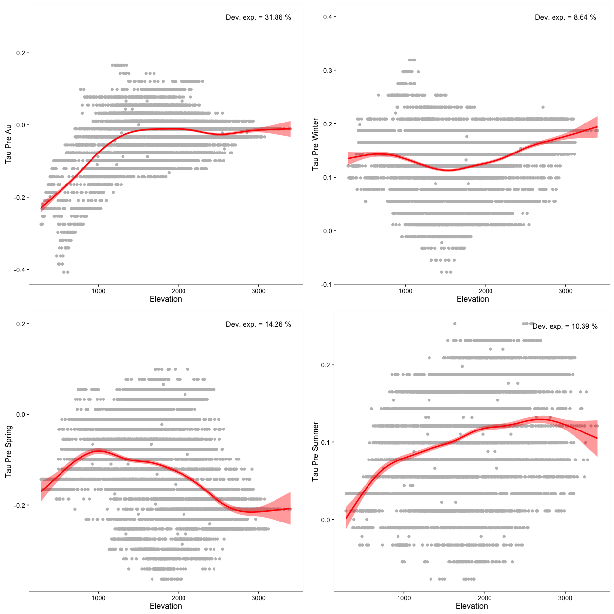

Prepare Data
------------

1.  Read data of Mann-Kendal Sen-Slope for each pixels and WiMMed indicators (season)
2.  Read data of topographic variable:
    -   Convert radian to deg.
    -   Create categorical variable for elevation (250 m)
    -   Classify aspect into 8 categories

3.  Read data from hydrological basin
4.  Read spatial data:
    -   Select only centroides of interest

5.  Create two dataframes:
    -   **Full Dataframe** with all variables and all pixels (`fulldf`)
    -   :red\_circle: In this exploration we don't filter the data by elevation

``` r
# Trend analysis data
# Define name of indicators (see variables names)
# Use annual and season aggregation 
indicadores <- c("pre", "pre_snow", "pre_snow_per", "temp", 
                 "pnau", "pnsp", "pnsu", "pnwi",
                 "preau", "presp", "presu", "prewi",
                 "tempau", "tempsp", "tempsu", "tempwi")

# Loop to read files 
for (j in indicadores){ 
  aux <- read.csv(file=paste(di, "/data/derived/", j, ".csv", sep= ""),
              header = TRUE,
              sep = ',')
  assign(j, aux)
}
# --

# Define pixels of interes 
pixels_interes <- pre$nie_malla_modi_id

# Read Topographic data 
rawtopo <- read.csv(file=paste(di, "/data/topo_nie_malla_modis.csv", sep=""),
                    header=TRUE,
                    sep = ",") 

# function to convert radian to degree 
rad2deg <- function(rad) {(rad * 180) / (pi)} 


topo <- rawtopo %>% 
  filter(id %in% pixels_interes) %>% 
  mutate(nie_malla_modi_id = id, 
         slope50mean_deg = rad2deg(slope50mean),
         slope50median_deg = rad2deg(slope50median),
         aspect50mean_deg = rad2deg(aspect50mean),
         aspect50median_deg = rad2deg(aspect50median)) %>%
  dplyr::select(nie_malla_modi_id, dem50mean, dem50median, slope50mean_deg, 
                slope50median_deg, aspect50mean_deg, aspect50median_deg) 

## Create interval variables (250 m) for dem; and classify aspect into 8 categories 
topo <- topo %>% 
  mutate(dem50mean_group = cut(dem50mean, 
                         breaks = seq(from=0, to=3500, by=250),
                         labels = c("0-250", "251-500","501-750","751-1000",
                                    "1001-1250","1251-1500","1501-1750","1751-2000",
                                    "2001-2250","2251-2500","2501-2750", "2751-3000",
                                    "3001-3250", "3251-3500")),
         aspect50mean_deg_group = cut(aspect50mean_deg, 
                                      breaks= c(22.5, 67.5, 112.5, 157.5, 202.5, 247.5, 292.5, 337.5, 359.5),
                                      labels = c("N", "NE", "E", "SE", "S", "SW", "W", "NW")))


# --

# Read spatial data and Get lat/long
centroides <- rgdal::readOGR(dsn=paste(di, "/data/geoinfo", sep=""),
                             layer = "centroides_selected", verbose = FALSE)
# Select only attributes of interest and rename them
centroides <- centroides[c("id")]

# Create lat/lng by id 
xycentroides <- cbind(centroides@data, coordinates(centroides))
names(xycentroides) <- c("nie_malla_modi_id", "lon","lat")

xycentroides <- filter(xycentroides, nie_malla_modi_id %in% pixels_interes)
# -- 

# Hydrological basin 
basin <- read.csv(file=paste(di, "/data/derived/pixel_region.csv", sep=""),
                    header=TRUE,
                    sep = ",") 
# --


# Create un dataframe con todos los datos
fulldf <- topo %>% 
  inner_join(pre,  by=c("nie_malla_modi_id")) %>% 
  inner_join(pre_snow,  by=c("nie_malla_modi_id")) %>% 
  inner_join(pre_snow_per,  by=c("nie_malla_modi_id")) %>% 
  inner_join(temp,  by=c("nie_malla_modi_id")) %>% 
  inner_join(pnau,  by=c("nie_malla_modi_id")) %>% 
  inner_join(pnsp,  by=c("nie_malla_modi_id")) %>% 
  inner_join(pnsu,  by=c("nie_malla_modi_id")) %>% 
  inner_join(pnwi,  by=c("nie_malla_modi_id")) %>% 
  inner_join(preau,  by=c("nie_malla_modi_id")) %>% 
  inner_join(presp,  by=c("nie_malla_modi_id")) %>% 
  inner_join(presu,  by=c("nie_malla_modi_id")) %>% 
  inner_join(prewi,  by=c("nie_malla_modi_id")) %>% 
  inner_join(tempau,  by=c("nie_malla_modi_id")) %>% 
  inner_join(tempsp,  by=c("nie_malla_modi_id")) %>% 
  inner_join(tempsu,  by=c("nie_malla_modi_id")) %>% 
  inner_join(tempwi,  by=c("nie_malla_modi_id")) %>% 
  inner_join(xycentroides, by="nie_malla_modi_id") %>%
  inner_join(basin, by="nie_malla_modi_id")


# Create subset of pixels above 1250 
fulldf1250 <- fulldf %>% 
  filter(dem50mean > 1250)  
```

Explore trends of annual variables by basin
===========================================

We explore the pattern of snow-cover indicators trends by hydrological basin.

Precipitation
=============

Autunm
------

<table style="width:75%;">
<colgroup>
<col width="15%" />
<col width="6%" />
<col width="11%" />
<col width="12%" />
<col width="16%" />
<col width="12%" />
</colgroup>
<thead>
<tr class="header">
<th align="center">term</th>
<th align="center">df</th>
<th align="center">sumsq</th>
<th align="center">meansq</th>
<th align="center">statistic</th>
<th align="center">p.value</th>
</tr>
</thead>
<tbody>
<tr class="odd">
<td align="center">basin_name</td>
<td align="center">4</td>
<td align="center">20.6</td>
<td align="center">5.151</td>
<td align="center">2487</td>
<td align="center">0</td>
</tr>
<tr class="even">
<td align="center">Residuals</td>
<td align="center">7989</td>
<td align="center">16.54</td>
<td align="center">0.002071</td>
<td align="center">NA</td>
<td align="center">NA</td>
</tr>
</tbody>
</table>


<table style="width:75%;">
<colgroup>
<col width="15%" />
<col width="6%" />
<col width="11%" />
<col width="12%" />
<col width="16%" />
<col width="12%" />
</colgroup>
<thead>
<tr class="header">
<th align="center">term</th>
<th align="center">df</th>
<th align="center">sumsq</th>
<th align="center">meansq</th>
<th align="center">statistic</th>
<th align="center">p.value</th>
</tr>
</thead>
<tbody>
<tr class="odd">
<td align="center">basin_name</td>
<td align="center">4</td>
<td align="center">17199</td>
<td align="center">4300</td>
<td align="center">1632</td>
<td align="center">0</td>
</tr>
<tr class="even">
<td align="center">Residuals</td>
<td align="center">7989</td>
<td align="center">21050</td>
<td align="center">2.635</td>
<td align="center">NA</td>
<td align="center">NA</td>
</tr>
</tbody>
</table>


Pre Spring
==========

<table style="width:75%;">
<colgroup>
<col width="15%" />
<col width="6%" />
<col width="11%" />
<col width="12%" />
<col width="16%" />
<col width="12%" />
</colgroup>
<thead>
<tr class="header">
<th align="center">term</th>
<th align="center">df</th>
<th align="center">sumsq</th>
<th align="center">meansq</th>
<th align="center">statistic</th>
<th align="center">p.value</th>
</tr>
</thead>
<tbody>
<tr class="odd">
<td align="center">basin_name</td>
<td align="center">4</td>
<td align="center">36.11</td>
<td align="center">9.028</td>
<td align="center">1580</td>
<td align="center">0</td>
</tr>
<tr class="even">
<td align="center">Residuals</td>
<td align="center">7989</td>
<td align="center">45.65</td>
<td align="center">0.005714</td>
<td align="center">NA</td>
<td align="center">NA</td>
</tr>
</tbody>
</table>


<table style="width:75%;">
<colgroup>
<col width="15%" />
<col width="6%" />
<col width="11%" />
<col width="12%" />
<col width="16%" />
<col width="12%" />
</colgroup>
<thead>
<tr class="header">
<th align="center">term</th>
<th align="center">df</th>
<th align="center">sumsq</th>
<th align="center">meansq</th>
<th align="center">statistic</th>
<th align="center">p.value</th>
</tr>
</thead>
<tbody>
<tr class="odd">
<td align="center">basin_name</td>
<td align="center">4</td>
<td align="center">10254</td>
<td align="center">2564</td>
<td align="center">1827</td>
<td align="center">0</td>
</tr>
<tr class="even">
<td align="center">Residuals</td>
<td align="center">7989</td>
<td align="center">11210</td>
<td align="center">1.403</td>
<td align="center">NA</td>
<td align="center">NA</td>
</tr>
</tbody>
</table>


Pre Summer
==========

<table style="width:79%;">
<colgroup>
<col width="15%" />
<col width="6%" />
<col width="11%" />
<col width="12%" />
<col width="16%" />
<col width="16%" />
</colgroup>
<thead>
<tr class="header">
<th align="center">term</th>
<th align="center">df</th>
<th align="center">sumsq</th>
<th align="center">meansq</th>
<th align="center">statistic</th>
<th align="center">p.value</th>
</tr>
</thead>
<tbody>
<tr class="odd">
<td align="center">basin_name</td>
<td align="center">4</td>
<td align="center">5.17</td>
<td align="center">1.292</td>
<td align="center">366.9</td>
<td align="center">1.707e-290</td>
</tr>
<tr class="even">
<td align="center">Residuals</td>
<td align="center">7989</td>
<td align="center">28.14</td>
<td align="center">0.003523</td>
<td align="center">NA</td>
<td align="center">NA</td>
</tr>
</tbody>
</table>


<table style="width:75%;">
<colgroup>
<col width="15%" />
<col width="6%" />
<col width="11%" />
<col width="12%" />
<col width="16%" />
<col width="12%" />
</colgroup>
<thead>
<tr class="header">
<th align="center">term</th>
<th align="center">df</th>
<th align="center">sumsq</th>
<th align="center">meansq</th>
<th align="center">statistic</th>
<th align="center">p.value</th>
</tr>
</thead>
<tbody>
<tr class="odd">
<td align="center">basin_name</td>
<td align="center">4</td>
<td align="center">958.1</td>
<td align="center">239.5</td>
<td align="center">441.4</td>
<td align="center">0</td>
</tr>
<tr class="even">
<td align="center">Residuals</td>
<td align="center">7989</td>
<td align="center">4335</td>
<td align="center">0.5426</td>
<td align="center">NA</td>
<td align="center">NA</td>
</tr>
</tbody>
</table>


Pre Winter
==========

<table style="width:75%;">
<colgroup>
<col width="15%" />
<col width="6%" />
<col width="11%" />
<col width="12%" />
<col width="16%" />
<col width="12%" />
</colgroup>
<thead>
<tr class="header">
<th align="center">term</th>
<th align="center">df</th>
<th align="center">sumsq</th>
<th align="center">meansq</th>
<th align="center">statistic</th>
<th align="center">p.value</th>
</tr>
</thead>
<tbody>
<tr class="odd">
<td align="center">basin_name</td>
<td align="center">4</td>
<td align="center">4.591</td>
<td align="center">1.148</td>
<td align="center">427.7</td>
<td align="center">0</td>
</tr>
<tr class="even">
<td align="center">Residuals</td>
<td align="center">7989</td>
<td align="center">21.44</td>
<td align="center">0.002684</td>
<td align="center">NA</td>
<td align="center">NA</td>
</tr>
</tbody>
</table>


<table style="width:79%;">
<colgroup>
<col width="15%" />
<col width="6%" />
<col width="11%" />
<col width="12%" />
<col width="16%" />
<col width="16%" />
</colgroup>
<thead>
<tr class="header">
<th align="center">term</th>
<th align="center">df</th>
<th align="center">sumsq</th>
<th align="center">meansq</th>
<th align="center">statistic</th>
<th align="center">p.value</th>
</tr>
</thead>
<tbody>
<tr class="odd">
<td align="center">basin_name</td>
<td align="center">4</td>
<td align="center">11086</td>
<td align="center">2771</td>
<td align="center">303.3</td>
<td align="center">2.999e-243</td>
</tr>
<tr class="even">
<td align="center">Residuals</td>
<td align="center">7989</td>
<td align="center">73004</td>
<td align="center">9.138</td>
<td align="center">NA</td>
<td align="center">NA</td>
</tr>
</tbody>
</table>


#### Tau Pre Au

<table style="width:100%;">
<colgroup>
<col width="16%" />
<col width="16%" />
<col width="13%" />
<col width="16%" />
<col width="13%" />
<col width="22%" />
</colgroup>
<thead>
<tr class="header">
<th align="center">basin_name</th>
<th align="center">mean</th>
<th align="center">sd</th>
<th align="center">se</th>
<th align="center">variable</th>
<th align="center">tukey_basin_name</th>
</tr>
</thead>
<tbody>
<tr class="odd">
<td align="center">Adra</td>
<td align="center">-0.025082126</td>
<td align="center">0.04015186</td>
<td align="center">0.0012480602</td>
<td align="center">tau_preau</td>
<td align="center">b</td>
</tr>
<tr class="even">
<td align="center">Andarax</td>
<td align="center">-0.109786125</td>
<td align="center">0.06234441</td>
<td align="center">0.0013105549</td>
<td align="center">tau_preau</td>
<td align="center">a</td>
</tr>
<tr class="odd">
<td align="center">Fardes</td>
<td align="center">0.012793277</td>
<td align="center">0.04342071</td>
<td align="center">0.0012587036</td>
<td align="center">tau_preau</td>
<td align="center">d</td>
</tr>
<tr class="even">
<td align="center">Genil</td>
<td align="center">0.019256702</td>
<td align="center">0.04228114</td>
<td align="center">0.0012050850</td>
<td align="center">tau_preau</td>
<td align="center">e</td>
</tr>
<tr class="odd">
<td align="center">Guadalfeo</td>
<td align="center">-0.008654945</td>
<td align="center">0.02689062</td>
<td align="center">0.0005637806</td>
<td align="center">tau_preau</td>
<td align="center">c</td>
</tr>
</tbody>
</table>

#### Sen Slope Pre Au

<table>
<colgroup>
<col width="16%" />
<col width="14%" />
<col width="11%" />
<col width="14%" />
<col width="20%" />
<col width="23%" />
</colgroup>
<thead>
<tr class="header">
<th align="center">basin_name</th>
<th align="center">mean</th>
<th align="center">sd</th>
<th align="center">se</th>
<th align="center">variable</th>
<th align="center">tukey_basin_name</th>
</tr>
</thead>
<tbody>
<tr class="odd">
<td align="center">Adra</td>
<td align="center">-1.0598889</td>
<td align="center">1.782749</td>
<td align="center">0.05541408</td>
<td align="center">sen_slope_preau</td>
<td align="center">b</td>
</tr>
<tr class="even">
<td align="center">Andarax</td>
<td align="center">-3.2190574</td>
<td align="center">1.313425</td>
<td align="center">0.02760978</td>
<td align="center">sen_slope_preau</td>
<td align="center">a</td>
</tr>
<tr class="odd">
<td align="center">Fardes</td>
<td align="center">0.5571454</td>
<td align="center">1.481361</td>
<td align="center">0.04294252</td>
<td align="center">sen_slope_preau</td>
<td align="center">d</td>
</tr>
<tr class="even">
<td align="center">Genil</td>
<td align="center">0.5454622</td>
<td align="center">1.863962</td>
<td align="center">0.05312610</td>
<td align="center">sen_slope_preau</td>
<td align="center">d</td>
</tr>
<tr class="odd">
<td align="center">Guadalfeo</td>
<td align="center">-0.6588180</td>
<td align="center">1.751861</td>
<td align="center">0.03672898</td>
<td align="center">sen_slope_preau</td>
<td align="center">c</td>
</tr>
</tbody>
</table>

#### Tau Pre Sp

<table style="width:100%;">
<colgroup>
<col width="16%" />
<col width="15%" />
<col width="14%" />
<col width="15%" />
<col width="14%" />
<col width="23%" />
</colgroup>
<thead>
<tr class="header">
<th align="center">basin_name</th>
<th align="center">mean</th>
<th align="center">sd</th>
<th align="center">se</th>
<th align="center">variable</th>
<th align="center">tukey_basin_name</th>
</tr>
</thead>
<tbody>
<tr class="odd">
<td align="center">Adra</td>
<td align="center">-0.09600290</td>
<td align="center">0.10132677</td>
<td align="center">0.003149590</td>
<td align="center">tau_presp</td>
<td align="center">d</td>
</tr>
<tr class="even">
<td align="center">Andarax</td>
<td align="center">-0.04566726</td>
<td align="center">0.07282669</td>
<td align="center">0.001530905</td>
<td align="center">tau_presp</td>
<td align="center">e</td>
</tr>
<tr class="odd">
<td align="center">Fardes</td>
<td align="center">-0.24768487</td>
<td align="center">0.08001902</td>
<td align="center">0.002319636</td>
<td align="center">tau_presp</td>
<td align="center">a</td>
</tr>
<tr class="even">
<td align="center">Genil</td>
<td align="center">-0.11602275</td>
<td align="center">0.07264075</td>
<td align="center">0.002070386</td>
<td align="center">tau_presp</td>
<td align="center">c</td>
</tr>
<tr class="odd">
<td align="center">Guadalfeo</td>
<td align="center">-0.16129143</td>
<td align="center">0.06268139</td>
<td align="center">0.001314159</td>
<td align="center">tau_presp</td>
<td align="center">b</td>
</tr>
</tbody>
</table>

#### Sen Slope Pre Sp

<table style="width:100%;">
<colgroup>
<col width="16%" />
<col width="13%" />
<col width="12%" />
<col width="13%" />
<col width="20%" />
<col width="22%" />
</colgroup>
<thead>
<tr class="header">
<th align="center">basin_name</th>
<th align="center">mean</th>
<th align="center">sd</th>
<th align="center">se</th>
<th align="center">variable</th>
<th align="center">tukey_basin_name</th>
</tr>
</thead>
<tbody>
<tr class="odd">
<td align="center">Adra</td>
<td align="center">-1.5837952</td>
<td align="center">1.9238990</td>
<td align="center">0.05980150</td>
<td align="center">sen_slope_presp</td>
<td align="center">d</td>
</tr>
<tr class="even">
<td align="center">Andarax</td>
<td align="center">-0.4240473</td>
<td align="center">1.0937713</td>
<td align="center">0.02299240</td>
<td align="center">sen_slope_presp</td>
<td align="center">e</td>
</tr>
<tr class="odd">
<td align="center">Fardes</td>
<td align="center">-3.8687924</td>
<td align="center">1.1727348</td>
<td align="center">0.03399588</td>
<td align="center">sen_slope_presp</td>
<td align="center">a</td>
</tr>
<tr class="even">
<td align="center">Genil</td>
<td align="center">-1.9022819</td>
<td align="center">0.8934289</td>
<td align="center">0.02546425</td>
<td align="center">sen_slope_presp</td>
<td align="center">c</td>
</tr>
<tr class="odd">
<td align="center">Guadalfeo</td>
<td align="center">-2.4182536</td>
<td align="center">0.9517110</td>
<td align="center">0.01995328</td>
<td align="center">sen_slope_presp</td>
<td align="center">b</td>
</tr>
</tbody>
</table>

#### Tau Pre Su

<table>
<colgroup>
<col width="17%" />
<col width="14%" />
<col width="14%" />
<col width="15%" />
<col width="14%" />
<col width="23%" />
</colgroup>
<thead>
<tr class="header">
<th align="center">basin_name</th>
<th align="center">mean</th>
<th align="center">sd</th>
<th align="center">se</th>
<th align="center">variable</th>
<th align="center">tukey_basin_name</th>
</tr>
</thead>
<tbody>
<tr class="odd">
<td align="center">Adra</td>
<td align="center">0.12580386</td>
<td align="center">0.05790883</td>
<td align="center">0.001800009</td>
<td align="center">tau_presu</td>
<td align="center">c</td>
</tr>
<tr class="even">
<td align="center">Andarax</td>
<td align="center">0.08952143</td>
<td align="center">0.06076036</td>
<td align="center">0.001277256</td>
<td align="center">tau_presu</td>
<td align="center">b</td>
</tr>
<tr class="odd">
<td align="center">Fardes</td>
<td align="center">0.15564538</td>
<td align="center">0.05136464</td>
<td align="center">0.001488987</td>
<td align="center">tau_presu</td>
<td align="center">d</td>
</tr>
<tr class="even">
<td align="center">Genil</td>
<td align="center">0.08114622</td>
<td align="center">0.03850461</td>
<td align="center">0.001097447</td>
<td align="center">tau_presu</td>
<td align="center">a</td>
</tr>
<tr class="odd">
<td align="center">Guadalfeo</td>
<td align="center">0.09087692</td>
<td align="center">0.07068751</td>
<td align="center">0.001482013</td>
<td align="center">tau_presu</td>
<td align="center">b</td>
</tr>
</tbody>
</table>

#### Sen Slope Pre Su

<table>
<colgroup>
<col width="16%" />
<col width="12%" />
<col width="12%" />
<col width="15%" />
<col width="20%" />
<col width="22%" />
</colgroup>
<thead>
<tr class="header">
<th align="center">basin_name</th>
<th align="center">mean</th>
<th align="center">sd</th>
<th align="center">se</th>
<th align="center">variable</th>
<th align="center">tukey_basin_name</th>
</tr>
</thead>
<tbody>
<tr class="odd">
<td align="center">Adra</td>
<td align="center">1.3066841</td>
<td align="center">0.6304934</td>
<td align="center">0.019597938</td>
<td align="center">sen_slope_presu</td>
<td align="center">c</td>
</tr>
<tr class="even">
<td align="center">Andarax</td>
<td align="center">0.6771295</td>
<td align="center">0.4642255</td>
<td align="center">0.009758582</td>
<td align="center">sen_slope_presu</td>
<td align="center">a</td>
</tr>
<tr class="odd">
<td align="center">Fardes</td>
<td align="center">1.7106395</td>
<td align="center">0.6489900</td>
<td align="center">0.018813281</td>
<td align="center">sen_slope_presu</td>
<td align="center">d</td>
</tr>
<tr class="even">
<td align="center">Genil</td>
<td align="center">1.1111292</td>
<td align="center">0.7119951</td>
<td align="center">0.020293081</td>
<td align="center">sen_slope_presu</td>
<td align="center">b</td>
</tr>
<tr class="odd">
<td align="center">Guadalfeo</td>
<td align="center">1.2998835</td>
<td align="center">1.0083803</td>
<td align="center">0.021141395</td>
<td align="center">sen_slope_presu</td>
<td align="center">c</td>
</tr>
</tbody>
</table>

#### Tau Pre Wi

<table style="width:100%;">
<colgroup>
<col width="16%" />
<col width="14%" />
<col width="14%" />
<col width="16%" />
<col width="14%" />
<col width="23%" />
</colgroup>
<thead>
<tr class="header">
<th align="center">basin_name</th>
<th align="center">mean</th>
<th align="center">sd</th>
<th align="center">se</th>
<th align="center">variable</th>
<th align="center">tukey_basin_name</th>
</tr>
</thead>
<tbody>
<tr class="odd">
<td align="center">Adra</td>
<td align="center">0.13236135</td>
<td align="center">0.02547751</td>
<td align="center">0.0007919299</td>
<td align="center">tau_prewi</td>
<td align="center">d</td>
</tr>
<tr class="even">
<td align="center">Andarax</td>
<td align="center">0.16122316</td>
<td align="center">0.04459186</td>
<td align="center">0.0009373749</td>
<td align="center">tau_prewi</td>
<td align="center">e</td>
</tr>
<tr class="odd">
<td align="center">Fardes</td>
<td align="center">0.11902185</td>
<td align="center">0.04054983</td>
<td align="center">0.0011754809</td>
<td align="center">tau_prewi</td>
<td align="center">b</td>
</tr>
<tr class="even">
<td align="center">Genil</td>
<td align="center">0.08759789</td>
<td align="center">0.07388574</td>
<td align="center">0.0021058702</td>
<td align="center">tau_prewi</td>
<td align="center">a</td>
</tr>
<tr class="odd">
<td align="center">Guadalfeo</td>
<td align="center">0.12685055</td>
<td align="center">0.05781138</td>
<td align="center">0.0012120560</td>
<td align="center">tau_prewi</td>
<td align="center">c</td>
</tr>
</tbody>
</table>

#### Sen Slope Pre Wi

<table style="width:100%;">
<colgroup>
<col width="17%" />
<col width="11%" />
<col width="11%" />
<col width="14%" />
<col width="21%" />
<col width="23%" />
</colgroup>
<thead>
<tr class="header">
<th align="center">basin_name</th>
<th align="center">mean</th>
<th align="center">sd</th>
<th align="center">se</th>
<th align="center">variable</th>
<th align="center">tukey_basin_name</th>
</tr>
</thead>
<tbody>
<tr class="odd">
<td align="center">Adra</td>
<td align="center">6.007626</td>
<td align="center">1.412031</td>
<td align="center">0.04389087</td>
<td align="center">sen_slope_prewi</td>
<td align="center">c</td>
</tr>
<tr class="even">
<td align="center">Andarax</td>
<td align="center">4.429882</td>
<td align="center">2.188979</td>
<td align="center">0.04601500</td>
<td align="center">sen_slope_prewi</td>
<td align="center">a</td>
</tr>
<tr class="odd">
<td align="center">Fardes</td>
<td align="center">4.674043</td>
<td align="center">2.163412</td>
<td align="center">0.06271419</td>
<td align="center">sen_slope_prewi</td>
<td align="center">a</td>
</tr>
<tr class="even">
<td align="center">Genil</td>
<td align="center">5.188393</td>
<td align="center">4.445629</td>
<td align="center">0.12670805</td>
<td align="center">sen_slope_prewi</td>
<td align="center">b</td>
</tr>
<tr class="odd">
<td align="center">Guadalfeo</td>
<td align="center">7.301517</td>
<td align="center">3.646020</td>
<td align="center">0.07644136</td>
<td align="center">sen_slope_prewi</td>
<td align="center">d</td>
</tr>
</tbody>
</table>

Explore trends by elevation
===========================

Taus
----

    ## 
    ## Family: gaussian 
    ## Link function: identity 
    ## 
    ## Formula:
    ## tau_preau ~ s(dem50mean)
    ## 
    ## Approximate significance of smooth terms:
    ##                edf Ref.df     F p-value
    ## s(dem50mean) 7.805  8.639 431.2  <2e-16

    ## 
    ## Family: gaussian 
    ## Link function: identity 
    ## 
    ## Formula:
    ## tau_preau ~ s(dem50mean)
    ## 
    ## Parametric coefficients:
    ##               Estimate Std. Error t value Pr(>|t|)    
    ## (Intercept) -0.0319198  0.0006297  -50.69   <2e-16 ***
    ## ---
    ## Signif. codes:  0 '***' 0.001 '**' 0.01 '*' 0.05 '.' 0.1 ' ' 1
    ## 
    ## Approximate significance of smooth terms:
    ##                edf Ref.df     F p-value    
    ## s(dem50mean) 7.805  8.639 431.2  <2e-16 ***
    ## ---
    ## Signif. codes:  0 '***' 0.001 '**' 0.01 '*' 0.05 '.' 0.1 ' ' 1
    ## 
    ## R-sq.(adj) =  0.318   Deviance explained = 31.9%
    ## GCV = 0.0031735  Scale est. = 0.00317   n = 7994

    ## 
    ## Family: gaussian 
    ## Link function: identity 
    ## 
    ## Formula:
    ## tau_presp ~ s(dem50mean)
    ## 
    ## Approximate significance of smooth terms:
    ##                edf Ref.df     F p-value
    ## s(dem50mean) 7.574  8.501 155.2  <2e-16

    ## 
    ## Family: gaussian 
    ## Link function: identity 
    ## 
    ## Formula:
    ## tau_presp ~ s(dem50mean)
    ## 
    ## Parametric coefficients:
    ##              Estimate Std. Error t value Pr(>|t|)    
    ## (Intercept) -0.125996   0.001048  -120.2   <2e-16 ***
    ## ---
    ## Signif. codes:  0 '***' 0.001 '**' 0.01 '*' 0.05 '.' 0.1 ' ' 1
    ## 
    ## Approximate significance of smooth terms:
    ##                edf Ref.df     F p-value    
    ## s(dem50mean) 7.574  8.501 155.2  <2e-16 ***
    ## ---
    ## Signif. codes:  0 '***' 0.001 '**' 0.01 '*' 0.05 '.' 0.1 ' ' 1
    ## 
    ## R-sq.(adj) =  0.142   Deviance explained = 14.3%
    ## GCV = 0.0087889  Scale est. = 0.0087794  n = 7994

    ## 
    ## Family: gaussian 
    ## Link function: identity 
    ## 
    ## Formula:
    ## tau_presu ~ s(dem50mean)
    ## 
    ## Approximate significance of smooth terms:
    ##                edf Ref.df     F p-value
    ## s(dem50mean) 7.625  8.533 107.9  <2e-16

    ## 
    ## Family: gaussian 
    ## Link function: identity 
    ## 
    ## Formula:
    ## tau_presu ~ s(dem50mean)
    ## 
    ## Parametric coefficients:
    ##              Estimate Std. Error t value Pr(>|t|)    
    ## (Intercept) 0.1031584  0.0006838   150.9   <2e-16 ***
    ## ---
    ## Signif. codes:  0 '***' 0.001 '**' 0.01 '*' 0.05 '.' 0.1 ' ' 1
    ## 
    ## Approximate significance of smooth terms:
    ##                edf Ref.df     F p-value    
    ## s(dem50mean) 7.625  8.533 107.9  <2e-16 ***
    ## ---
    ## Signif. codes:  0 '***' 0.001 '**' 0.01 '*' 0.05 '.' 0.1 ' ' 1
    ## 
    ## R-sq.(adj) =  0.103   Deviance explained = 10.4%
    ## GCV = 0.003742  Scale est. = 0.0037379  n = 7994

    ## 
    ## Family: gaussian 
    ## Link function: identity 
    ## 
    ## Formula:
    ## tau_prewi ~ s(dem50mean)
    ## 
    ## Approximate significance of smooth terms:
    ##                edf Ref.df     F p-value
    ## s(dem50mean) 7.246  8.276 90.46  <2e-16

    ## 
    ## Family: gaussian 
    ## Link function: identity 
    ## 
    ## Formula:
    ## tau_prewi ~ s(dem50mean)
    ## 
    ## Parametric coefficients:
    ##              Estimate Std. Error t value Pr(>|t|)    
    ## (Intercept) 0.1300846  0.0006104   213.1   <2e-16 ***
    ## ---
    ## Signif. codes:  0 '***' 0.001 '**' 0.01 '*' 0.05 '.' 0.1 ' ' 1
    ## 
    ## Approximate significance of smooth terms:
    ##                edf Ref.df     F p-value    
    ## s(dem50mean) 7.246  8.276 90.46  <2e-16 ***
    ## ---
    ## Signif. codes:  0 '***' 0.001 '**' 0.01 '*' 0.05 '.' 0.1 ' ' 1
    ## 
    ## R-sq.(adj) =  0.0856   Deviance explained = 8.64%
    ## GCV = 0.0029811  Scale est. = 0.002978  n = 7994



Sen
---

    ## 
    ## Family: gaussian 
    ## Link function: identity 
    ## 
    ## Formula:
    ## sen_slope_preau ~ s(dem50mean)
    ## 
    ## Approximate significance of smooth terms:
    ##                edf Ref.df     F p-value
    ## s(dem50mean) 7.875  8.677 117.9  <2e-16

    ## 
    ## Family: gaussian 
    ## Link function: identity 
    ## 
    ## Formula:
    ## sen_slope_preau ~ s(dem50mean)
    ## 
    ## Parametric coefficients:
    ##             Estimate Std. Error t value Pr(>|t|)    
    ## (Intercept) -1.06906    0.02304  -46.41   <2e-16 ***
    ## ---
    ## Signif. codes:  0 '***' 0.001 '**' 0.01 '*' 0.05 '.' 0.1 ' ' 1
    ## 
    ## Approximate significance of smooth terms:
    ##                edf Ref.df     F p-value    
    ## s(dem50mean) 7.875  8.677 117.9  <2e-16 ***
    ## ---
    ## Signif. codes:  0 '***' 0.001 '**' 0.01 '*' 0.05 '.' 0.1 ' ' 1
    ## 
    ## R-sq.(adj) =  0.113   Deviance explained = 11.4%
    ## GCV = 4.2472  Scale est. = 4.2425    n = 7994

    ## 
    ## Family: gaussian 
    ## Link function: identity 
    ## 
    ## Formula:
    ## sen_slope_presp ~ s(dem50mean)
    ## 
    ## Approximate significance of smooth terms:
    ##                edf Ref.df     F p-value
    ## s(dem50mean) 7.502  8.454 191.5  <2e-16

    ## 
    ## Family: gaussian 
    ## Link function: identity 
    ## 
    ## Formula:
    ## sen_slope_presp ~ s(dem50mean)
    ## 
    ## Parametric coefficients:
    ##             Estimate Std. Error t value Pr(>|t|)    
    ## (Intercept) -1.88215    0.01671  -112.6   <2e-16 ***
    ## ---
    ## Signif. codes:  0 '***' 0.001 '**' 0.01 '*' 0.05 '.' 0.1 ' ' 1
    ## 
    ## Approximate significance of smooth terms:
    ##                edf Ref.df     F p-value    
    ## s(dem50mean) 7.502  8.454 191.5  <2e-16 ***
    ## ---
    ## Signif. codes:  0 '***' 0.001 '**' 0.01 '*' 0.05 '.' 0.1 ' ' 1
    ## 
    ## R-sq.(adj) =  0.168   Deviance explained = 16.9%
    ## GCV = 2.2354  Scale est. = 2.233     n = 7994

    ## 
    ## Family: gaussian 
    ## Link function: identity 
    ## 
    ## Formula:
    ## sen_slope_presu ~ s(dem50mean)
    ## 
    ## Approximate significance of smooth terms:
    ##                edf Ref.df     F p-value
    ## s(dem50mean) 8.141  8.805 222.7  <2e-16

    ## 
    ## Family: gaussian 
    ## Link function: identity 
    ## 
    ## Formula:
    ## sen_slope_presu ~ s(dem50mean)
    ## 
    ## Parametric coefficients:
    ##             Estimate Std. Error t value Pr(>|t|)    
    ## (Intercept) 1.156550   0.008158   141.8   <2e-16 ***
    ## ---
    ## Signif. codes:  0 '***' 0.001 '**' 0.01 '*' 0.05 '.' 0.1 ' ' 1
    ## 
    ## Approximate significance of smooth terms:
    ##                edf Ref.df     F p-value    
    ## s(dem50mean) 8.141  8.805 222.7  <2e-16 ***
    ## ---
    ## Signif. codes:  0 '***' 0.001 '**' 0.01 '*' 0.05 '.' 0.1 ' ' 1
    ## 
    ## R-sq.(adj) =  0.197   Deviance explained = 19.8%
    ## GCV = 0.53257  Scale est. = 0.53196   n = 7994

    ## 
    ## Family: gaussian 
    ## Link function: identity 
    ## 
    ## Formula:
    ## sen_slope_prewi ~ s(dem50mean)
    ## 
    ## Approximate significance of smooth terms:
    ##                edf Ref.df    F p-value
    ## s(dem50mean) 7.320  8.329 1305  <2e-16

    ## 
    ## Family: gaussian 
    ## Link function: identity 
    ## 
    ## Formula:
    ## sen_slope_prewi ~ s(dem50mean)
    ## 
    ## Parametric coefficients:
    ##             Estimate Std. Error t value Pr(>|t|)    
    ## (Intercept)  5.60454    0.02362   237.3   <2e-16 ***
    ## ---
    ## Signif. codes:  0 '***' 0.001 '**' 0.01 '*' 0.05 '.' 0.1 ' ' 1
    ## 
    ## Approximate significance of smooth terms:
    ##               edf Ref.df    F p-value    
    ## s(dem50mean) 7.32  8.329 1305  <2e-16 ***
    ## ---
    ## Signif. codes:  0 '***' 0.001 '**' 0.01 '*' 0.05 '.' 0.1 ' ' 1
    ## 
    ## R-sq.(adj) =  0.576   Deviance explained = 57.7%
    ## GCV = 4.4636  Scale est. = 4.4589    n = 7994


Pre Snow
========

Autunm
------

<table style="width:75%;">
<colgroup>
<col width="15%" />
<col width="6%" />
<col width="11%" />
<col width="12%" />
<col width="16%" />
<col width="12%" />
</colgroup>
<thead>
<tr class="header">
<th align="center">term</th>
<th align="center">df</th>
<th align="center">sumsq</th>
<th align="center">meansq</th>
<th align="center">statistic</th>
<th align="center">p.value</th>
</tr>
</thead>
<tbody>
<tr class="odd">
<td align="center">basin_name</td>
<td align="center">4</td>
<td align="center">30.36</td>
<td align="center">7.591</td>
<td align="center">720.5</td>
<td align="center">0</td>
</tr>
<tr class="even">
<td align="center">Residuals</td>
<td align="center">7989</td>
<td align="center">84.17</td>
<td align="center">0.01054</td>
<td align="center">NA</td>
<td align="center">NA</td>
</tr>
</tbody>
</table>


<table style="width:79%;">
<colgroup>
<col width="15%" />
<col width="6%" />
<col width="11%" />
<col width="12%" />
<col width="16%" />
<col width="16%" />
</colgroup>
<thead>
<tr class="header">
<th align="center">term</th>
<th align="center">df</th>
<th align="center">sumsq</th>
<th align="center">meansq</th>
<th align="center">statistic</th>
<th align="center">p.value</th>
</tr>
</thead>
<tbody>
<tr class="odd">
<td align="center">basin_name</td>
<td align="center">4</td>
<td align="center">2772</td>
<td align="center">692.9</td>
<td align="center">378.5</td>
<td align="center">5.258e-299</td>
</tr>
<tr class="even">
<td align="center">Residuals</td>
<td align="center">7989</td>
<td align="center">14625</td>
<td align="center">1.831</td>
<td align="center">NA</td>
<td align="center">NA</td>
</tr>
</tbody>
</table>


Pn Spring
=========

<table style="width:75%;">
<colgroup>
<col width="15%" />
<col width="6%" />
<col width="11%" />
<col width="12%" />
<col width="16%" />
<col width="12%" />
</colgroup>
<thead>
<tr class="header">
<th align="center">term</th>
<th align="center">df</th>
<th align="center">sumsq</th>
<th align="center">meansq</th>
<th align="center">statistic</th>
<th align="center">p.value</th>
</tr>
</thead>
<tbody>
<tr class="odd">
<td align="center">basin_name</td>
<td align="center">4</td>
<td align="center">10.56</td>
<td align="center">2.639</td>
<td align="center">416.2</td>
<td align="center">0</td>
</tr>
<tr class="even">
<td align="center">Residuals</td>
<td align="center">7989</td>
<td align="center">50.67</td>
<td align="center">0.006342</td>
<td align="center">NA</td>
<td align="center">NA</td>
</tr>
</tbody>
</table>


<table style="width:75%;">
<colgroup>
<col width="15%" />
<col width="6%" />
<col width="11%" />
<col width="12%" />
<col width="16%" />
<col width="12%" />
</colgroup>
<thead>
<tr class="header">
<th align="center">term</th>
<th align="center">df</th>
<th align="center">sumsq</th>
<th align="center">meansq</th>
<th align="center">statistic</th>
<th align="center">p.value</th>
</tr>
</thead>
<tbody>
<tr class="odd">
<td align="center">basin_name</td>
<td align="center">4</td>
<td align="center">1014</td>
<td align="center">253.6</td>
<td align="center">443</td>
<td align="center">0</td>
</tr>
<tr class="even">
<td align="center">Residuals</td>
<td align="center">7989</td>
<td align="center">4573</td>
<td align="center">0.5724</td>
<td align="center">NA</td>
<td align="center">NA</td>
</tr>
</tbody>
</table>


Pn Summer
=========

<table style="width:79%;">
<colgroup>
<col width="15%" />
<col width="6%" />
<col width="11%" />
<col width="12%" />
<col width="16%" />
<col width="16%" />
</colgroup>
<thead>
<tr class="header">
<th align="center">term</th>
<th align="center">df</th>
<th align="center">sumsq</th>
<th align="center">meansq</th>
<th align="center">statistic</th>
<th align="center">p.value</th>
</tr>
</thead>
<tbody>
<tr class="odd">
<td align="center">basin_name</td>
<td align="center">4</td>
<td align="center">1.758</td>
<td align="center">0.4394</td>
<td align="center">180.1</td>
<td align="center">5.304e-148</td>
</tr>
<tr class="even">
<td align="center">Residuals</td>
<td align="center">7989</td>
<td align="center">19.49</td>
<td align="center">0.002439</td>
<td align="center">NA</td>
<td align="center">NA</td>
</tr>
</tbody>
</table>


<table style="width:75%;">
<colgroup>
<col width="15%" />
<col width="6%" />
<col width="11%" />
<col width="12%" />
<col width="16%" />
<col width="12%" />
</colgroup>
<thead>
<tr class="header">
<th align="center">term</th>
<th align="center">df</th>
<th align="center">sumsq</th>
<th align="center">meansq</th>
<th align="center">statistic</th>
<th align="center">p.value</th>
</tr>
</thead>
<tbody>
<tr class="odd">
<td align="center">basin_name</td>
<td align="center">4</td>
<td align="center">0.01048</td>
<td align="center">0.002619</td>
<td align="center">2.434</td>
<td align="center">0.04523</td>
</tr>
<tr class="even">
<td align="center">Residuals</td>
<td align="center">7989</td>
<td align="center">8.599</td>
<td align="center">0.001076</td>
<td align="center">NA</td>
<td align="center">NA</td>
</tr>
</tbody>
</table>

    ## Warning in RET$pfunction("adjusted", ...): lower == upper

    ## Warning in RET$pfunction("adjusted", ...): lower == upper

    ## Warning in RET$pfunction("adjusted", ...): lower == upper


Pn Winter
=========

<table style="width:79%;">
<colgroup>
<col width="15%" />
<col width="6%" />
<col width="11%" />
<col width="12%" />
<col width="16%" />
<col width="16%" />
</colgroup>
<thead>
<tr class="header">
<th align="center">term</th>
<th align="center">df</th>
<th align="center">sumsq</th>
<th align="center">meansq</th>
<th align="center">statistic</th>
<th align="center">p.value</th>
</tr>
</thead>
<tbody>
<tr class="odd">
<td align="center">basin_name</td>
<td align="center">4</td>
<td align="center">10.91</td>
<td align="center">2.727</td>
<td align="center">307.2</td>
<td align="center">3.546e-246</td>
</tr>
<tr class="even">
<td align="center">Residuals</td>
<td align="center">7989</td>
<td align="center">70.94</td>
<td align="center">0.008879</td>
<td align="center">NA</td>
<td align="center">NA</td>
</tr>
</tbody>
</table>


<table style="width:75%;">
<colgroup>
<col width="15%" />
<col width="6%" />
<col width="11%" />
<col width="12%" />
<col width="16%" />
<col width="12%" />
</colgroup>
<thead>
<tr class="header">
<th align="center">term</th>
<th align="center">df</th>
<th align="center">sumsq</th>
<th align="center">meansq</th>
<th align="center">statistic</th>
<th align="center">p.value</th>
</tr>
</thead>
<tbody>
<tr class="odd">
<td align="center">basin_name</td>
<td align="center">4</td>
<td align="center">45340</td>
<td align="center">11335</td>
<td align="center">955.6</td>
<td align="center">0</td>
</tr>
<tr class="even">
<td align="center">Residuals</td>
<td align="center">7989</td>
<td align="center">94762</td>
<td align="center">11.86</td>
<td align="center">NA</td>
<td align="center">NA</td>
</tr>
</tbody>
</table>


#### Tau Pn Au

<table>
<colgroup>
<col width="16%" />
<col width="16%" />
<col width="14%" />
<col width="15%" />
<col width="14%" />
<col width="23%" />
</colgroup>
<thead>
<tr class="header">
<th align="center">basin_name</th>
<th align="center">mean</th>
<th align="center">sd</th>
<th align="center">se</th>
<th align="center">variable</th>
<th align="center">tukey_basin_name</th>
</tr>
</thead>
<tbody>
<tr class="odd">
<td align="center">Adra</td>
<td align="center">-0.107810628</td>
<td align="center">0.14513343</td>
<td align="center">0.004511254</td>
<td align="center">tau_pnau</td>
<td align="center">a</td>
</tr>
<tr class="even">
<td align="center">Andarax</td>
<td align="center">-0.041700840</td>
<td align="center">0.10127515</td>
<td align="center">0.002128926</td>
<td align="center">tau_pnau</td>
<td align="center">b</td>
</tr>
<tr class="odd">
<td align="center">Fardes</td>
<td align="center">0.107263866</td>
<td align="center">0.08071245</td>
<td align="center">0.002339737</td>
<td align="center">tau_pnau</td>
<td align="center">e</td>
</tr>
<tr class="even">
<td align="center">Genil</td>
<td align="center">0.025413485</td>
<td align="center">0.07672961</td>
<td align="center">0.002186925</td>
<td align="center">tau_pnau</td>
<td align="center">d</td>
</tr>
<tr class="odd">
<td align="center">Guadalfeo</td>
<td align="center">0.005313846</td>
<td align="center">0.10316700</td>
<td align="center">0.002162968</td>
<td align="center">tau_pnau</td>
<td align="center">c</td>
</tr>
</tbody>
</table>

#### Sen Slope Pn Au

<table>
<colgroup>
<col width="16%" />
<col width="14%" />
<col width="12%" />
<col width="14%" />
<col width="19%" />
<col width="23%" />
</colgroup>
<thead>
<tr class="header">
<th align="center">basin_name</th>
<th align="center">mean</th>
<th align="center">sd</th>
<th align="center">se</th>
<th align="center">variable</th>
<th align="center">tukey_basin_name</th>
</tr>
</thead>
<tbody>
<tr class="odd">
<td align="center">Adra</td>
<td align="center">-0.1144937</td>
<td align="center">1.8291879</td>
<td align="center">0.05685755</td>
<td align="center">sen_slope_pnau</td>
<td align="center">b</td>
</tr>
<tr class="even">
<td align="center">Andarax</td>
<td align="center">-0.2851551</td>
<td align="center">0.8123157</td>
<td align="center">0.01707586</td>
<td align="center">sen_slope_pnau</td>
<td align="center">a</td>
</tr>
<tr class="odd">
<td align="center">Fardes</td>
<td align="center">0.8673034</td>
<td align="center">1.0908006</td>
<td align="center">0.03162073</td>
<td align="center">sen_slope_pnau</td>
<td align="center">c</td>
</tr>
<tr class="even">
<td align="center">Genil</td>
<td align="center">0.9050788</td>
<td align="center">1.5084745</td>
<td align="center">0.04299411</td>
<td align="center">sen_slope_pnau</td>
<td align="center">cd</td>
</tr>
<tr class="odd">
<td align="center">Guadalfeo</td>
<td align="center">1.0274567</td>
<td align="center">1.5493408</td>
<td align="center">0.03248301</td>
<td align="center">sen_slope_pnau</td>
<td align="center">d</td>
</tr>
</tbody>
</table>

#### Tau Pn Sp

<table style="width:100%;">
<colgroup>
<col width="16%" />
<col width="15%" />
<col width="14%" />
<col width="15%" />
<col width="14%" />
<col width="23%" />
</colgroup>
<thead>
<tr class="header">
<th align="center">basin_name</th>
<th align="center">mean</th>
<th align="center">sd</th>
<th align="center">se</th>
<th align="center">variable</th>
<th align="center">tukey_basin_name</th>
</tr>
</thead>
<tbody>
<tr class="odd">
<td align="center">Adra</td>
<td align="center">-0.06027150</td>
<td align="center">0.08240051</td>
<td align="center">0.002561296</td>
<td align="center">tau_pnsp</td>
<td align="center">a</td>
</tr>
<tr class="even">
<td align="center">Andarax</td>
<td align="center">0.03813787</td>
<td align="center">0.06842631</td>
<td align="center">0.001438404</td>
<td align="center">tau_pnsp</td>
<td align="center">d</td>
</tr>
<tr class="odd">
<td align="center">Fardes</td>
<td align="center">-0.02833193</td>
<td align="center">0.11128799</td>
<td align="center">0.003226078</td>
<td align="center">tau_pnsp</td>
<td align="center">c</td>
</tr>
<tr class="even">
<td align="center">Genil</td>
<td align="center">-0.04705605</td>
<td align="center">0.06863981</td>
<td align="center">0.001956352</td>
<td align="center">tau_pnsp</td>
<td align="center">b</td>
</tr>
<tr class="odd">
<td align="center">Guadalfeo</td>
<td align="center">-0.03146242</td>
<td align="center">0.07424299</td>
<td align="center">0.001556556</td>
<td align="center">tau_pnsp</td>
<td align="center">c</td>
</tr>
</tbody>
</table>

#### Sen Slope Pn Sp

<table>
<colgroup>
<col width="16%" />
<col width="15%" />
<col width="12%" />
<col width="15%" />
<col width="18%" />
<col width="22%" />
</colgroup>
<thead>
<tr class="header">
<th align="center">basin_name</th>
<th align="center">mean</th>
<th align="center">sd</th>
<th align="center">se</th>
<th align="center">variable</th>
<th align="center">tukey_basin_name</th>
</tr>
</thead>
<tbody>
<tr class="odd">
<td align="center">Adra</td>
<td align="center">-0.29852271</td>
<td align="center">0.5281719</td>
<td align="center">0.016417428</td>
<td align="center">sen_slope_pnsp</td>
<td align="center">c</td>
</tr>
<tr class="even">
<td align="center">Andarax</td>
<td align="center">-0.03259081</td>
<td align="center">0.1988411</td>
<td align="center">0.004179881</td>
<td align="center">sen_slope_pnsp</td>
<td align="center">d</td>
</tr>
<tr class="odd">
<td align="center">Fardes</td>
<td align="center">-0.31329076</td>
<td align="center">0.6438147</td>
<td align="center">0.018663255</td>
<td align="center">sen_slope_pnsp</td>
<td align="center">c</td>
</tr>
<tr class="even">
<td align="center">Genil</td>
<td align="center">-0.99368481</td>
<td align="center">1.0321631</td>
<td align="center">0.029418418</td>
<td align="center">sen_slope_pnsp</td>
<td align="center">a</td>
</tr>
<tr class="odd">
<td align="center">Guadalfeo</td>
<td align="center">-0.75476659</td>
<td align="center">1.0256277</td>
<td align="center">0.021502999</td>
<td align="center">sen_slope_pnsp</td>
<td align="center">b</td>
</tr>
</tbody>
</table>

#### Tau Pn Su

<table style="width:100%;">
<colgroup>
<col width="16%" />
<col width="16%" />
<col width="15%" />
<col width="16%" />
<col width="13%" />
<col width="22%" />
</colgroup>
<thead>
<tr class="header">
<th align="center">basin_name</th>
<th align="center">mean</th>
<th align="center">sd</th>
<th align="center">se</th>
<th align="center">variable</th>
<th align="center">tukey_basin_name</th>
</tr>
</thead>
<tbody>
<tr class="odd">
<td align="center">Adra</td>
<td align="center">0.0161439614</td>
<td align="center">0.038513927</td>
<td align="center">0.0011971474</td>
<td align="center">tau_pnsu</td>
<td align="center">b</td>
</tr>
<tr class="even">
<td align="center">Andarax</td>
<td align="center">0.0003596995</td>
<td align="center">0.005064972</td>
<td align="center">0.0001064718</td>
<td align="center">tau_pnsu</td>
<td align="center">a</td>
</tr>
<tr class="odd">
<td align="center">Fardes</td>
<td align="center">0.0202067227</td>
<td align="center">0.045184857</td>
<td align="center">0.0013098436</td>
<td align="center">tau_pnsu</td>
<td align="center">b</td>
</tr>
<tr class="even">
<td align="center">Genil</td>
<td align="center">0.0400056864</td>
<td align="center">0.066150881</td>
<td align="center">0.0018854135</td>
<td align="center">tau_pnsu</td>
<td align="center">d</td>
</tr>
<tr class="odd">
<td align="center">Guadalfeo</td>
<td align="center">0.0329371429</td>
<td align="center">0.066598292</td>
<td align="center">0.0013962796</td>
<td align="center">tau_pnsu</td>
<td align="center">c</td>
</tr>
</tbody>
</table>

#### Sen Slope Pn Su

<table>
<colgroup>
<col width="15%" />
<col width="15%" />
<col width="13%" />
<col width="15%" />
<col width="18%" />
<col width="21%" />
</colgroup>
<thead>
<tr class="header">
<th align="center">basin_name</th>
<th align="center">mean</th>
<th align="center">sd</th>
<th align="center">se</th>
<th align="center">variable</th>
<th align="center">tukey_basin_name</th>
</tr>
</thead>
<tbody>
<tr class="odd">
<td align="center">Adra</td>
<td align="center">0.0000000000</td>
<td align="center">0.00000000</td>
<td align="center">0.0000000000</td>
<td align="center">sen_slope_pnsu</td>
<td align="center">a</td>
</tr>
<tr class="even">
<td align="center">Andarax</td>
<td align="center">0.0000000000</td>
<td align="center">0.00000000</td>
<td align="center">0.0000000000</td>
<td align="center">sen_slope_pnsu</td>
<td align="center">a</td>
</tr>
<tr class="odd">
<td align="center">Fardes</td>
<td align="center">0.0000000000</td>
<td align="center">0.00000000</td>
<td align="center">0.0000000000</td>
<td align="center">sen_slope_pnsu</td>
<td align="center">a</td>
</tr>
<tr class="even">
<td align="center">Genil</td>
<td align="center">0.0008537774</td>
<td align="center">0.01709984</td>
<td align="center">0.0004873748</td>
<td align="center">sen_slope_pnsu</td>
<td align="center">a</td>
</tr>
<tr class="odd">
<td align="center">Guadalfeo</td>
<td align="center">0.0026342857</td>
<td align="center">0.06019260</td>
<td align="center">0.0012619797</td>
<td align="center">sen_slope_pnsu</td>
<td align="center">a</td>
</tr>
</tbody>
</table>

#### Tau Pn Wi

<table>
<colgroup>
<col width="17%" />
<col width="13%" />
<col width="14%" />
<col width="16%" />
<col width="14%" />
<col width="24%" />
</colgroup>
<thead>
<tr class="header">
<th align="center">basin_name</th>
<th align="center">mean</th>
<th align="center">sd</th>
<th align="center">se</th>
<th align="center">variable</th>
<th align="center">tukey_basin_name</th>
</tr>
</thead>
<tbody>
<tr class="odd">
<td align="center">Adra</td>
<td align="center">0.2609285</td>
<td align="center">0.08186479</td>
<td align="center">0.002544644</td>
<td align="center">tau_pnwi</td>
<td align="center">c</td>
</tr>
<tr class="even">
<td align="center">Andarax</td>
<td align="center">0.1749549</td>
<td align="center">0.10640305</td>
<td align="center">0.002236721</td>
<td align="center">tau_pnwi</td>
<td align="center">a</td>
</tr>
<tr class="odd">
<td align="center">Fardes</td>
<td align="center">0.2275706</td>
<td align="center">0.07858701</td>
<td align="center">0.002278124</td>
<td align="center">tau_pnwi</td>
<td align="center">b</td>
</tr>
<tr class="even">
<td align="center">Genil</td>
<td align="center">0.2227969</td>
<td align="center">0.07133327</td>
<td align="center">0.002033120</td>
<td align="center">tau_pnwi</td>
<td align="center">b</td>
</tr>
<tr class="odd">
<td align="center">Guadalfeo</td>
<td align="center">0.2666009</td>
<td align="center">0.10442275</td>
<td align="center">0.002189296</td>
<td align="center">tau_pnwi</td>
<td align="center">c</td>
</tr>
</tbody>
</table>

#### Sen Slope Pn Wi

<table>
<colgroup>
<col width="17%" />
<col width="12%" />
<col width="12%" />
<col width="14%" />
<col width="20%" />
<col width="24%" />
</colgroup>
<thead>
<tr class="header">
<th align="center">basin_name</th>
<th align="center">mean</th>
<th align="center">sd</th>
<th align="center">se</th>
<th align="center">variable</th>
<th align="center">tukey_basin_name</th>
</tr>
</thead>
<tbody>
<tr class="odd">
<td align="center">Adra</td>
<td align="center">4.564333</td>
<td align="center">2.955708</td>
<td align="center">0.09187373</td>
<td align="center">sen_slope_pnwi</td>
<td align="center">c</td>
</tr>
<tr class="even">
<td align="center">Andarax</td>
<td align="center">1.663647</td>
<td align="center">2.384145</td>
<td align="center">0.05011762</td>
<td align="center">sen_slope_pnwi</td>
<td align="center">a</td>
</tr>
<tr class="odd">
<td align="center">Fardes</td>
<td align="center">3.376589</td>
<td align="center">2.681564</td>
<td align="center">0.07773466</td>
<td align="center">sen_slope_pnwi</td>
<td align="center">b</td>
</tr>
<tr class="even">
<td align="center">Genil</td>
<td align="center">7.326321</td>
<td align="center">4.010848</td>
<td align="center">0.11431603</td>
<td align="center">sen_slope_pnwi</td>
<td align="center">d</td>
</tr>
<tr class="odd">
<td align="center">Guadalfeo</td>
<td align="center">7.171021</td>
<td align="center">4.425388</td>
<td align="center">0.09278134</td>
<td align="center">sen_slope_pnwi</td>
<td align="center">d</td>
</tr>
</tbody>
</table>

Explore trends by elevation
===========================

Taus
----

    ## 
    ## Family: gaussian 
    ## Link function: identity 
    ## 
    ## Formula:
    ## tau_pnau ~ s(dem50mean)
    ## 
    ## Approximate significance of smooth terms:
    ##                edf Ref.df     F p-value
    ## s(dem50mean) 8.523  8.937 123.5  <2e-16

    ## 
    ## Family: gaussian 
    ## Link function: identity 
    ## 
    ## Formula:
    ## tau_pnau ~ s(dem50mean)
    ## 
    ## Parametric coefficients:
    ##              Estimate Std. Error t value Pr(>|t|)    
    ## (Intercept) -0.004370   0.001255  -3.482    5e-04 ***
    ## ---
    ## Signif. codes:  0 '***' 0.001 '**' 0.01 '*' 0.05 '.' 0.1 ' ' 1
    ## 
    ## Approximate significance of smooth terms:
    ##                edf Ref.df     F p-value    
    ## s(dem50mean) 8.523  8.937 123.5  <2e-16 ***
    ## ---
    ## Signif. codes:  0 '***' 0.001 '**' 0.01 '*' 0.05 '.' 0.1 ' ' 1
    ## 
    ## R-sq.(adj) =  0.121   Deviance explained = 12.2%
    ## GCV = 0.012608  Scale est. = 0.012593  n = 7994

    ## 
    ## Family: gaussian 
    ## Link function: identity 
    ## 
    ## Formula:
    ## tau_pnsp ~ s(dem50mean)
    ## 
    ## Approximate significance of smooth terms:
    ##                edf Ref.df     F p-value
    ## s(dem50mean) 8.988  9.000 344.4  <2e-16

    ## 
    ## Family: gaussian 
    ## Link function: identity 
    ## 
    ## Formula:
    ## tau_pnsp ~ s(dem50mean)
    ## 
    ## Parametric coefficients:
    ##               Estimate Std. Error t value Pr(>|t|)    
    ## (Intercept) -0.0174247  0.0008312  -20.96   <2e-16 ***
    ## ---
    ## Signif. codes:  0 '***' 0.001 '**' 0.01 '*' 0.05 '.' 0.1 ' ' 1
    ## 
    ## Approximate significance of smooth terms:
    ##                edf Ref.df     F p-value    
    ## s(dem50mean) 8.988      9 344.4  <2e-16 ***
    ## ---
    ## Signif. codes:  0 '***' 0.001 '**' 0.01 '*' 0.05 '.' 0.1 ' ' 1
    ## 
    ## R-sq.(adj) =  0.279   Deviance explained =   28%
    ## GCV = 0.0055303  Scale est. = 0.0055234  n = 7994

    ## 
    ## Family: gaussian 
    ## Link function: identity 
    ## 
    ## Formula:
    ## tau_pnsu ~ s(dem50mean)
    ## 
    ## Approximate significance of smooth terms:
    ##                edf Ref.df    F p-value
    ## s(dem50mean) 8.971  9.000 2632  <2e-16

    ## 
    ## Family: gaussian 
    ## Link function: identity 
    ## 
    ## Formula:
    ## tau_pnsu ~ s(dem50mean)
    ## 
    ## Parametric coefficients:
    ##              Estimate Std. Error t value Pr(>|t|)    
    ## (Intercept) 0.0207341  0.0002897   71.58   <2e-16 ***
    ## ---
    ## Signif. codes:  0 '***' 0.001 '**' 0.01 '*' 0.05 '.' 0.1 ' ' 1
    ## 
    ## Approximate significance of smooth terms:
    ##                edf Ref.df    F p-value    
    ## s(dem50mean) 8.971      9 2632  <2e-16 ***
    ## ---
    ## Signif. codes:  0 '***' 0.001 '**' 0.01 '*' 0.05 '.' 0.1 ' ' 1
    ## 
    ## R-sq.(adj) =  0.748   Deviance explained = 74.8%
    ## GCV = 0.00067156  Scale est. = 0.00067072  n = 7994

    ## 
    ## Family: gaussian 
    ## Link function: identity 
    ## 
    ## Formula:
    ## tau_pnwi ~ s(dem50mean)
    ## 
    ## Approximate significance of smooth terms:
    ##                edf Ref.df     F p-value
    ## s(dem50mean) 8.548  8.943 616.2  <2e-16

    ## 
    ## Family: gaussian 
    ## Link function: identity 
    ## 
    ## Formula:
    ## tau_pnwi ~ s(dem50mean)
    ## 
    ## Parametric coefficients:
    ##              Estimate Std. Error t value Pr(>|t|)    
    ## (Intercept) 0.2273672  0.0008706   261.2   <2e-16 ***
    ## ---
    ## Signif. codes:  0 '***' 0.001 '**' 0.01 '*' 0.05 '.' 0.1 ' ' 1
    ## 
    ## Approximate significance of smooth terms:
    ##                edf Ref.df     F p-value    
    ## s(dem50mean) 8.548  8.943 616.2  <2e-16 ***
    ## ---
    ## Signif. codes:  0 '***' 0.001 '**' 0.01 '*' 0.05 '.' 0.1 ' ' 1
    ## 
    ## R-sq.(adj) =  0.408   Deviance explained = 40.9%
    ## GCV = 0.0060656  Scale est. = 0.0060583  n = 7994


Sen
---

    ## 
    ## Family: gaussian 
    ## Link function: identity 
    ## 
    ## Formula:
    ## sen_slope_pnau ~ s(dem50mean)
    ## 
    ## Approximate significance of smooth terms:
    ##                edf Ref.df   F p-value
    ## s(dem50mean) 8.828  8.991 914  <2e-16

    ## 
    ## Family: gaussian 
    ## Link function: identity 
    ## 
    ## Formula:
    ## sen_slope_pnau ~ s(dem50mean)
    ## 
    ## Parametric coefficients:
    ##             Estimate Std. Error t value Pr(>|t|)    
    ## (Intercept)  0.46534    0.01159   40.16   <2e-16 ***
    ## ---
    ## Signif. codes:  0 '***' 0.001 '**' 0.01 '*' 0.05 '.' 0.1 ' ' 1
    ## 
    ## Approximate significance of smooth terms:
    ##                edf Ref.df   F p-value    
    ## s(dem50mean) 8.828  8.991 914  <2e-16 ***
    ## ---
    ## Signif. codes:  0 '***' 0.001 '**' 0.01 '*' 0.05 '.' 0.1 ' ' 1
    ## 
    ## R-sq.(adj) =  0.507   Deviance explained = 50.7%
    ## GCV = 1.0748  Scale est. = 1.0735    n = 7994

    ## 
    ## Family: gaussian 
    ## Link function: identity 
    ## 
    ## Formula:
    ## sen_slope_pnsp ~ s(dem50mean)
    ## 
    ## Approximate significance of smooth terms:
    ##                edf Ref.df    F p-value
    ## s(dem50mean) 8.936  8.999 1979  <2e-16

    ## 
    ## Family: gaussian 
    ## Link function: identity 
    ## 
    ## Formula:
    ## sen_slope_pnsp ~ s(dem50mean)
    ## 
    ## Parametric coefficients:
    ##              Estimate Std. Error t value Pr(>|t|)    
    ## (Intercept) -0.462329   0.005205  -88.82   <2e-16 ***
    ## ---
    ## Signif. codes:  0 '***' 0.001 '**' 0.01 '*' 0.05 '.' 0.1 ' ' 1
    ## 
    ## Approximate significance of smooth terms:
    ##                edf Ref.df    F p-value    
    ## s(dem50mean) 8.936  8.999 1979  <2e-16 ***
    ## ---
    ## Signif. codes:  0 '***' 0.001 '**' 0.01 '*' 0.05 '.' 0.1 ' ' 1
    ## 
    ## R-sq.(adj) =   0.69   Deviance explained = 69.1%
    ## GCV = 0.21686  Scale est. = 0.21659   n = 7994

    ## 
    ## Family: gaussian 
    ## Link function: identity 
    ## 
    ## Formula:
    ## sen_slope_pnsu ~ s(dem50mean)
    ## 
    ## Approximate significance of smooth terms:
    ##                edf Ref.df     F p-value
    ## s(dem50mean) 8.995  9.000 220.1  <2e-16

    ## 
    ## Family: gaussian 
    ## Link function: identity 
    ## 
    ## Formula:
    ## sen_slope_pnsu ~ s(dem50mean)
    ## 
    ## Parametric coefficients:
    ##              Estimate Std. Error t value Pr(>|t|)   
    ## (Intercept) 0.0008812  0.0003287    2.68  0.00737 **
    ## ---
    ## Signif. codes:  0 '***' 0.001 '**' 0.01 '*' 0.05 '.' 0.1 ' ' 1
    ## 
    ## Approximate significance of smooth terms:
    ##                edf Ref.df     F p-value    
    ## s(dem50mean) 8.995      9 220.1  <2e-16 ***
    ## ---
    ## Signif. codes:  0 '***' 0.001 '**' 0.01 '*' 0.05 '.' 0.1 ' ' 1
    ## 
    ## R-sq.(adj) =  0.198   Deviance explained = 19.9%
    ## GCV = 0.00086504  Scale est. = 0.00086396  n = 7994

    ## 
    ## Family: gaussian 
    ## Link function: identity 
    ## 
    ## Formula:
    ## sen_slope_pnwi ~ s(dem50mean)
    ## 
    ## Approximate significance of smooth terms:
    ##                edf Ref.df    F p-value
    ## s(dem50mean) 8.585  8.952 4140  <2e-16

    ## 
    ## Family: gaussian 
    ## Link function: identity 
    ## 
    ## Formula:
    ## sen_slope_pnwi ~ s(dem50mean)
    ## 
    ## Parametric coefficients:
    ##             Estimate Std. Error t value Pr(>|t|)    
    ## (Intercept)  4.73353    0.01972     240   <2e-16 ***
    ## ---
    ## Signif. codes:  0 '***' 0.001 '**' 0.01 '*' 0.05 '.' 0.1 ' ' 1
    ## 
    ## Approximate significance of smooth terms:
    ##                edf Ref.df    F p-value    
    ## s(dem50mean) 8.585  8.952 4140  <2e-16 ***
    ## ---
    ## Signif. codes:  0 '***' 0.001 '**' 0.01 '*' 0.05 '.' 0.1 ' ' 1
    ## 
    ## R-sq.(adj) =  0.823   Deviance explained = 82.3%
    ## GCV =  3.114  Scale est. = 3.1103    n = 7994


Temperatures
============

Autunm
------

<table style="width:75%;">
<colgroup>
<col width="15%" />
<col width="6%" />
<col width="11%" />
<col width="12%" />
<col width="16%" />
<col width="12%" />
</colgroup>
<thead>
<tr class="header">
<th align="center">term</th>
<th align="center">df</th>
<th align="center">sumsq</th>
<th align="center">meansq</th>
<th align="center">statistic</th>
<th align="center">p.value</th>
</tr>
</thead>
<tbody>
<tr class="odd">
<td align="center">basin_name</td>
<td align="center">4</td>
<td align="center">7.922</td>
<td align="center">1.98</td>
<td align="center">720.8</td>
<td align="center">0</td>
</tr>
<tr class="even">
<td align="center">Residuals</td>
<td align="center">7989</td>
<td align="center">21.95</td>
<td align="center">0.002747</td>
<td align="center">NA</td>
<td align="center">NA</td>
</tr>
</tbody>
</table>


<table style="width:79%;">
<colgroup>
<col width="15%" />
<col width="6%" />
<col width="11%" />
<col width="12%" />
<col width="16%" />
<col width="16%" />
</colgroup>
<thead>
<tr class="header">
<th align="center">term</th>
<th align="center">df</th>
<th align="center">sumsq</th>
<th align="center">meansq</th>
<th align="center">statistic</th>
<th align="center">p.value</th>
</tr>
</thead>
<tbody>
<tr class="odd">
<td align="center">basin_name</td>
<td align="center">4</td>
<td align="center">1.963</td>
<td align="center">0.4907</td>
<td align="center">329.1</td>
<td align="center">1.292e-262</td>
</tr>
<tr class="even">
<td align="center">Residuals</td>
<td align="center">7989</td>
<td align="center">11.91</td>
<td align="center">0.001491</td>
<td align="center">NA</td>
<td align="center">NA</td>
</tr>
</tbody>
</table>


Temp Spring
===========

<table style="width:75%;">
<colgroup>
<col width="15%" />
<col width="6%" />
<col width="11%" />
<col width="12%" />
<col width="16%" />
<col width="12%" />
</colgroup>
<thead>
<tr class="header">
<th align="center">term</th>
<th align="center">df</th>
<th align="center">sumsq</th>
<th align="center">meansq</th>
<th align="center">statistic</th>
<th align="center">p.value</th>
</tr>
</thead>
<tbody>
<tr class="odd">
<td align="center">basin_name</td>
<td align="center">4</td>
<td align="center">15.69</td>
<td align="center">3.923</td>
<td align="center">1118</td>
<td align="center">0</td>
</tr>
<tr class="even">
<td align="center">Residuals</td>
<td align="center">7989</td>
<td align="center">28.04</td>
<td align="center">0.00351</td>
<td align="center">NA</td>
<td align="center">NA</td>
</tr>
</tbody>
</table>


<table style="width:75%;">
<colgroup>
<col width="15%" />
<col width="6%" />
<col width="11%" />
<col width="12%" />
<col width="16%" />
<col width="12%" />
</colgroup>
<thead>
<tr class="header">
<th align="center">term</th>
<th align="center">df</th>
<th align="center">sumsq</th>
<th align="center">meansq</th>
<th align="center">statistic</th>
<th align="center">p.value</th>
</tr>
</thead>
<tbody>
<tr class="odd">
<td align="center">basin_name</td>
<td align="center">4</td>
<td align="center">2.062</td>
<td align="center">0.5155</td>
<td align="center">481.5</td>
<td align="center">0</td>
</tr>
<tr class="even">
<td align="center">Residuals</td>
<td align="center">7989</td>
<td align="center">8.553</td>
<td align="center">0.001071</td>
<td align="center">NA</td>
<td align="center">NA</td>
</tr>
</tbody>
</table>


Temp Summer
===========

<table style="width:75%;">
<colgroup>
<col width="15%" />
<col width="6%" />
<col width="11%" />
<col width="12%" />
<col width="16%" />
<col width="12%" />
</colgroup>
<thead>
<tr class="header">
<th align="center">term</th>
<th align="center">df</th>
<th align="center">sumsq</th>
<th align="center">meansq</th>
<th align="center">statistic</th>
<th align="center">p.value</th>
</tr>
</thead>
<tbody>
<tr class="odd">
<td align="center">basin_name</td>
<td align="center">4</td>
<td align="center">31.69</td>
<td align="center">7.922</td>
<td align="center">1287</td>
<td align="center">0</td>
</tr>
<tr class="even">
<td align="center">Residuals</td>
<td align="center">7989</td>
<td align="center">49.18</td>
<td align="center">0.006156</td>
<td align="center">NA</td>
<td align="center">NA</td>
</tr>
</tbody>
</table>


<table style="width:75%;">
<colgroup>
<col width="15%" />
<col width="6%" />
<col width="11%" />
<col width="12%" />
<col width="16%" />
<col width="12%" />
</colgroup>
<thead>
<tr class="header">
<th align="center">term</th>
<th align="center">df</th>
<th align="center">sumsq</th>
<th align="center">meansq</th>
<th align="center">statistic</th>
<th align="center">p.value</th>
</tr>
</thead>
<tbody>
<tr class="odd">
<td align="center">basin_name</td>
<td align="center">4</td>
<td align="center">5.744</td>
<td align="center">1.436</td>
<td align="center">1377</td>
<td align="center">0</td>
</tr>
<tr class="even">
<td align="center">Residuals</td>
<td align="center">7989</td>
<td align="center">8.329</td>
<td align="center">0.001043</td>
<td align="center">NA</td>
<td align="center">NA</td>
</tr>
</tbody>
</table>


Temp Winter
===========

<table style="width:75%;">
<colgroup>
<col width="15%" />
<col width="6%" />
<col width="11%" />
<col width="12%" />
<col width="16%" />
<col width="12%" />
</colgroup>
<thead>
<tr class="header">
<th align="center">term</th>
<th align="center">df</th>
<th align="center">sumsq</th>
<th align="center">meansq</th>
<th align="center">statistic</th>
<th align="center">p.value</th>
</tr>
</thead>
<tbody>
<tr class="odd">
<td align="center">basin_name</td>
<td align="center">4</td>
<td align="center">41.76</td>
<td align="center">10.44</td>
<td align="center">1859</td>
<td align="center">0</td>
</tr>
<tr class="even">
<td align="center">Residuals</td>
<td align="center">7989</td>
<td align="center">44.87</td>
<td align="center">0.005617</td>
<td align="center">NA</td>
<td align="center">NA</td>
</tr>
</tbody>
</table>


<table style="width:75%;">
<colgroup>
<col width="15%" />
<col width="6%" />
<col width="11%" />
<col width="12%" />
<col width="16%" />
<col width="12%" />
</colgroup>
<thead>
<tr class="header">
<th align="center">term</th>
<th align="center">df</th>
<th align="center">sumsq</th>
<th align="center">meansq</th>
<th align="center">statistic</th>
<th align="center">p.value</th>
</tr>
</thead>
<tbody>
<tr class="odd">
<td align="center">basin_name</td>
<td align="center">4</td>
<td align="center">8.062</td>
<td align="center">2.015</td>
<td align="center">2113</td>
<td align="center">0</td>
</tr>
<tr class="even">
<td align="center">Residuals</td>
<td align="center">7989</td>
<td align="center">7.622</td>
<td align="center">0.000954</td>
<td align="center">NA</td>
<td align="center">NA</td>
</tr>
</tbody>
</table>


#### Tau Temp Au

<table>
<colgroup>
<col width="17%" />
<col width="13%" />
<col width="14%" />
<col width="17%" />
<col width="14%" />
<col width="23%" />
</colgroup>
<thead>
<tr class="header">
<th align="center">basin_name</th>
<th align="center">mean</th>
<th align="center">sd</th>
<th align="center">se</th>
<th align="center">variable</th>
<th align="center">tukey_basin_name</th>
</tr>
</thead>
<tbody>
<tr class="odd">
<td align="center">Adra</td>
<td align="center">0.1148570</td>
<td align="center">0.10428517</td>
<td align="center">0.0032415475</td>
<td align="center">tau_tempau</td>
<td align="center">a</td>
</tr>
<tr class="even">
<td align="center">Andarax</td>
<td align="center">0.2071140</td>
<td align="center">0.03117065</td>
<td align="center">0.0006552448</td>
<td align="center">tau_tempau</td>
<td align="center">d</td>
</tr>
<tr class="odd">
<td align="center">Fardes</td>
<td align="center">0.1934244</td>
<td align="center">0.04999693</td>
<td align="center">0.0014493385</td>
<td align="center">tau_tempau</td>
<td align="center">c</td>
</tr>
<tr class="even">
<td align="center">Genil</td>
<td align="center">0.2043087</td>
<td align="center">0.03295689</td>
<td align="center">0.0009393279</td>
<td align="center">tau_tempau</td>
<td align="center">d</td>
</tr>
<tr class="odd">
<td align="center">Guadalfeo</td>
<td align="center">0.1597925</td>
<td align="center">0.04296792</td>
<td align="center">0.0009008523</td>
<td align="center">tau_tempau</td>
<td align="center">b</td>
</tr>
</tbody>
</table>

#### Sen Slope Temp Au

<table>
<colgroup>
<col width="15%" />
<col width="13%" />
<col width="13%" />
<col width="15%" />
<col width="20%" />
<col width="21%" />
</colgroup>
<thead>
<tr class="header">
<th align="center">basin_name</th>
<th align="center">mean</th>
<th align="center">sd</th>
<th align="center">se</th>
<th align="center">variable</th>
<th align="center">tukey_basin_name</th>
</tr>
</thead>
<tbody>
<tr class="odd">
<td align="center">Adra</td>
<td align="center">0.07241063</td>
<td align="center">0.06954251</td>
<td align="center">0.0021616242</td>
<td align="center">sen_slope_tempau</td>
<td align="center">a</td>
</tr>
<tr class="even">
<td align="center">Andarax</td>
<td align="center">0.11711180</td>
<td align="center">0.04604862</td>
<td align="center">0.0009679977</td>
<td align="center">sen_slope_tempau</td>
<td align="center">e</td>
</tr>
<tr class="odd">
<td align="center">Fardes</td>
<td align="center">0.09882437</td>
<td align="center">0.01876969</td>
<td align="center">0.0005441062</td>
<td align="center">sen_slope_tempau</td>
<td align="center">d</td>
</tr>
<tr class="even">
<td align="center">Genil</td>
<td align="center">0.08894476</td>
<td align="center">0.01623256</td>
<td align="center">0.0004626559</td>
<td align="center">sen_slope_tempau</td>
<td align="center">c</td>
</tr>
<tr class="odd">
<td align="center">Guadalfeo</td>
<td align="center">0.08419033</td>
<td align="center">0.02454987</td>
<td align="center">0.0005147051</td>
<td align="center">sen_slope_tempau</td>
<td align="center">b</td>
</tr>
</tbody>
</table>

#### Tau Temp Sp

<table>
<colgroup>
<col width="17%" />
<col width="13%" />
<col width="14%" />
<col width="17%" />
<col width="14%" />
<col width="23%" />
</colgroup>
<thead>
<tr class="header">
<th align="center">basin_name</th>
<th align="center">mean</th>
<th align="center">sd</th>
<th align="center">se</th>
<th align="center">variable</th>
<th align="center">tukey_basin_name</th>
</tr>
</thead>
<tbody>
<tr class="odd">
<td align="center">Adra</td>
<td align="center">0.1038145</td>
<td align="center">0.09820290</td>
<td align="center">0.0030524891</td>
<td align="center">tau_tempsp</td>
<td align="center">a</td>
</tr>
<tr class="even">
<td align="center">Andarax</td>
<td align="center">0.2176863</td>
<td align="center">0.07058529</td>
<td align="center">0.0014837883</td>
<td align="center">tau_tempsp</td>
<td align="center">d</td>
</tr>
<tr class="odd">
<td align="center">Fardes</td>
<td align="center">0.1249008</td>
<td align="center">0.04534446</td>
<td align="center">0.0013144701</td>
<td align="center">tau_tempsp</td>
<td align="center">b</td>
</tr>
<tr class="even">
<td align="center">Genil</td>
<td align="center">0.1074354</td>
<td align="center">0.02762597</td>
<td align="center">0.0007873874</td>
<td align="center">tau_tempsp</td>
<td align="center">a</td>
</tr>
<tr class="odd">
<td align="center">Guadalfeo</td>
<td align="center">0.1421055</td>
<td align="center">0.03876957</td>
<td align="center">0.0008128310</td>
<td align="center">tau_tempsp</td>
<td align="center">c</td>
</tr>
</tbody>
</table>

#### Sen Slope Temp Sp

<table>
<colgroup>
<col width="15%" />
<col width="13%" />
<col width="13%" />
<col width="15%" />
<col width="20%" />
<col width="21%" />
</colgroup>
<thead>
<tr class="header">
<th align="center">basin_name</th>
<th align="center">mean</th>
<th align="center">sd</th>
<th align="center">se</th>
<th align="center">variable</th>
<th align="center">tukey_basin_name</th>
</tr>
</thead>
<tbody>
<tr class="odd">
<td align="center">Adra</td>
<td align="center">0.07151884</td>
<td align="center">0.05932599</td>
<td align="center">0.0018440590</td>
<td align="center">sen_slope_tempsp</td>
<td align="center">a</td>
</tr>
<tr class="even">
<td align="center">Andarax</td>
<td align="center">0.11542289</td>
<td align="center">0.03744734</td>
<td align="center">0.0007871885</td>
<td align="center">sen_slope_tempsp</td>
<td align="center">d</td>
</tr>
<tr class="odd">
<td align="center">Fardes</td>
<td align="center">0.09858824</td>
<td align="center">0.01837554</td>
<td align="center">0.0005326803</td>
<td align="center">sen_slope_tempsp</td>
<td align="center">c</td>
</tr>
<tr class="even">
<td align="center">Genil</td>
<td align="center">0.08337855</td>
<td align="center">0.01408890</td>
<td align="center">0.0004015579</td>
<td align="center">sen_slope_tempsp</td>
<td align="center">b</td>
</tr>
<tr class="odd">
<td align="center">Guadalfeo</td>
<td align="center">0.08158549</td>
<td align="center">0.02195784</td>
<td align="center">0.0004603615</td>
<td align="center">sen_slope_tempsp</td>
<td align="center">b</td>
</tr>
</tbody>
</table>

#### Tau Temp Su

<table style="width:100%;">
<colgroup>
<col width="16%" />
<col width="15%" />
<col width="14%" />
<col width="15%" />
<col width="14%" />
<col width="23%" />
</colgroup>
<thead>
<tr class="header">
<th align="center">basin_name</th>
<th align="center">mean</th>
<th align="center">sd</th>
<th align="center">se</th>
<th align="center">variable</th>
<th align="center">tukey_basin_name</th>
</tr>
</thead>
<tbody>
<tr class="odd">
<td align="center">Adra</td>
<td align="center">-0.09893623</td>
<td align="center">0.08721590</td>
<td align="center">0.002710975</td>
<td align="center">tau_tempsu</td>
<td align="center">a</td>
</tr>
<tr class="even">
<td align="center">Andarax</td>
<td align="center">-0.09900972</td>
<td align="center">0.08881984</td>
<td align="center">0.001867101</td>
<td align="center">tau_tempsu</td>
<td align="center">a</td>
</tr>
<tr class="odd">
<td align="center">Fardes</td>
<td align="center">0.01719328</td>
<td align="center">0.05703271</td>
<td align="center">0.001653296</td>
<td align="center">tau_tempsu</td>
<td align="center">b</td>
</tr>
<tr class="even">
<td align="center">Genil</td>
<td align="center">0.05163119</td>
<td align="center">0.08796844</td>
<td align="center">0.002507251</td>
<td align="center">tau_tempsu</td>
<td align="center">c</td>
</tr>
<tr class="odd">
<td align="center">Guadalfeo</td>
<td align="center">-0.10319209</td>
<td align="center">0.06660135</td>
<td align="center">0.001396344</td>
<td align="center">tau_tempsu</td>
<td align="center">a</td>
</tr>
</tbody>
</table>

#### Sen Slope Temp Su

<table style="width:92%;">
<caption>Table continues below</caption>
<colgroup>
<col width="18%" />
<col width="18%" />
<col width="15%" />
<col width="18%" />
<col width="22%" />
</colgroup>
<thead>
<tr class="header">
<th align="center">basin_name</th>
<th align="center">mean</th>
<th align="center">sd</th>
<th align="center">se</th>
<th align="center">variable</th>
</tr>
</thead>
<tbody>
<tr class="odd">
<td align="center">Adra</td>
<td align="center">-0.052918841</td>
<td align="center">0.04172299</td>
<td align="center">0.0012968962</td>
<td align="center">sen_slope_tempsu</td>
</tr>
<tr class="even">
<td align="center">Andarax</td>
<td align="center">-0.033178082</td>
<td align="center">0.02935545</td>
<td align="center">0.0006170871</td>
<td align="center">sen_slope_tempsu</td>
</tr>
<tr class="odd">
<td align="center">Fardes</td>
<td align="center">0.001868908</td>
<td align="center">0.02266481</td>
<td align="center">0.0006570199</td>
<td align="center">sen_slope_tempsu</td>
</tr>
<tr class="even">
<td align="center">Genil</td>
<td align="center">0.013329001</td>
<td align="center">0.02581702</td>
<td align="center">0.0007358293</td>
<td align="center">sen_slope_tempsu</td>
</tr>
<tr class="odd">
<td align="center">Guadalfeo</td>
<td align="center">-0.056992967</td>
<td align="center">0.03721415</td>
<td align="center">0.0007802205</td>
<td align="center">sen_slope_tempsu</td>
</tr>
</tbody>
</table>

<table style="width:25%;">
<colgroup>
<col width="25%" />
</colgroup>
<thead>
<tr class="header">
<th align="center">tukey_basin_name</th>
</tr>
</thead>
<tbody>
<tr class="odd">
<td align="center">b</td>
</tr>
<tr class="even">
<td align="center">c</td>
</tr>
<tr class="odd">
<td align="center">d</td>
</tr>
<tr class="even">
<td align="center">e</td>
</tr>
<tr class="odd">
<td align="center">a</td>
</tr>
</tbody>
</table>

#### Tau Temp Wi

<table style="width:100%;">
<colgroup>
<col width="16%" />
<col width="15%" />
<col width="14%" />
<col width="15%" />
<col width="14%" />
<col width="23%" />
</colgroup>
<thead>
<tr class="header">
<th align="center">basin_name</th>
<th align="center">mean</th>
<th align="center">sd</th>
<th align="center">se</th>
<th align="center">variable</th>
<th align="center">tukey_basin_name</th>
</tr>
</thead>
<tbody>
<tr class="odd">
<td align="center">Adra</td>
<td align="center">-0.12155266</td>
<td align="center">0.09230138</td>
<td align="center">0.002869049</td>
<td align="center">tau_tempwi</td>
<td align="center">b</td>
</tr>
<tr class="even">
<td align="center">Andarax</td>
<td align="center">0.05206407</td>
<td align="center">0.06892927</td>
<td align="center">0.001448977</td>
<td align="center">tau_tempwi</td>
<td align="center">e</td>
</tr>
<tr class="odd">
<td align="center">Fardes</td>
<td align="center">-0.02568824</td>
<td align="center">0.04528255</td>
<td align="center">0.001312675</td>
<td align="center">tau_tempwi</td>
<td align="center">d</td>
</tr>
<tr class="even">
<td align="center">Genil</td>
<td align="center">-0.15065800</td>
<td align="center">0.09746801</td>
<td align="center">0.002778005</td>
<td align="center">tau_tempwi</td>
<td align="center">a</td>
</tr>
<tr class="odd">
<td align="center">Guadalfeo</td>
<td align="center">-0.05446813</td>
<td align="center">0.07015910</td>
<td align="center">0.001470934</td>
<td align="center">tau_tempwi</td>
<td align="center">c</td>
</tr>
</tbody>
</table>

#### Sen Slope Temp Wi

<table>
<colgroup>
<col width="15%" />
<col width="14%" />
<col width="13%" />
<col width="15%" />
<col width="20%" />
<col width="21%" />
</colgroup>
<thead>
<tr class="header">
<th align="center">basin_name</th>
<th align="center">mean</th>
<th align="center">sd</th>
<th align="center">se</th>
<th align="center">variable</th>
<th align="center">tukey_basin_name</th>
</tr>
</thead>
<tbody>
<tr class="odd">
<td align="center">Adra</td>
<td align="center">-0.06198744</td>
<td align="center">0.04535728</td>
<td align="center">0.0014098628</td>
<td align="center">sen_slope_tempwi</td>
<td align="center">a</td>
</tr>
<tr class="even">
<td align="center">Andarax</td>
<td align="center">0.02190278</td>
<td align="center">0.02756785</td>
<td align="center">0.0005795095</td>
<td align="center">sen_slope_tempwi</td>
<td align="center">d</td>
</tr>
<tr class="odd">
<td align="center">Fardes</td>
<td align="center">-0.01219580</td>
<td align="center">0.01994322</td>
<td align="center">0.0005781251</td>
<td align="center">sen_slope_tempwi</td>
<td align="center">c</td>
</tr>
<tr class="even">
<td align="center">Genil</td>
<td align="center">-0.06203006</td>
<td align="center">0.03409124</td>
<td align="center">0.0009716589</td>
<td align="center">sen_slope_tempwi</td>
<td align="center">a</td>
</tr>
<tr class="odd">
<td align="center">Guadalfeo</td>
<td align="center">-0.02277231</td>
<td align="center">0.02869771</td>
<td align="center">0.0006016675</td>
<td align="center">sen_slope_tempwi</td>
<td align="center">b</td>
</tr>
</tbody>
</table>

Explore trends by elevation
===========================

Taus
----

    ## 
    ## Family: gaussian 
    ## Link function: identity 
    ## 
    ## Formula:
    ## tau_tempau ~ s(dem50mean)
    ## 
    ## Approximate significance of smooth terms:
    ##                edf Ref.df     F p-value
    ## s(dem50mean) 8.627  8.961 13.98  <2e-16

    ## 
    ## Family: gaussian 
    ## Link function: identity 
    ## 
    ## Formula:
    ## tau_tempau ~ s(dem50mean)
    ## 
    ## Parametric coefficients:
    ##              Estimate Std. Error t value Pr(>|t|)    
    ## (Intercept) 0.1792323  0.0006786   264.1   <2e-16 ***
    ## ---
    ## Signif. codes:  0 '***' 0.001 '**' 0.01 '*' 0.05 '.' 0.1 ' ' 1
    ## 
    ## Approximate significance of smooth terms:
    ##                edf Ref.df     F p-value    
    ## s(dem50mean) 8.627  8.961 13.98  <2e-16 ***
    ## ---
    ## Signif. codes:  0 '***' 0.001 '**' 0.01 '*' 0.05 '.' 0.1 ' ' 1
    ## 
    ## R-sq.(adj) =  0.0151   Deviance explained = 1.62%
    ## GCV = 0.0036851  Scale est. = 0.0036807  n = 7994

    ## 
    ## Family: gaussian 
    ## Link function: identity 
    ## 
    ## Formula:
    ## tau_tempsp ~ s(dem50mean)
    ## 
    ## Approximate significance of smooth terms:
    ##                edf Ref.df     F p-value
    ## s(dem50mean) 8.408  8.904 195.8  <2e-16

    ## 
    ## Family: gaussian 
    ## Link function: identity 
    ## 
    ## Formula:
    ## tau_tempsp ~ s(dem50mean)
    ## 
    ## Parametric coefficients:
    ##              Estimate Std. Error t value Pr(>|t|)    
    ## (Intercept) 0.1506439  0.0007497   200.9   <2e-16 ***
    ## ---
    ## Signif. codes:  0 '***' 0.001 '**' 0.01 '*' 0.05 '.' 0.1 ' ' 1
    ## 
    ## Approximate significance of smooth terms:
    ##                edf Ref.df     F p-value    
    ## s(dem50mean) 8.408  8.904 195.8  <2e-16 ***
    ## ---
    ## Signif. codes:  0 '***' 0.001 '**' 0.01 '*' 0.05 '.' 0.1 ' ' 1
    ## 
    ## R-sq.(adj) =  0.179   Deviance explained =   18%
    ## GCV = 0.0044983  Scale est. = 0.004493  n = 7994

    ## 
    ## Family: gaussian 
    ## Link function: identity 
    ## 
    ## Formula:
    ## tau_tempsu ~ s(dem50mean)
    ## 
    ## Approximate significance of smooth terms:
    ##                edf Ref.df     F p-value
    ## s(dem50mean) 7.570  8.499 78.52  <2e-16

    ## 
    ## Family: gaussian 
    ## Link function: identity 
    ## 
    ## Formula:
    ## tau_tempsu ~ s(dem50mean)
    ## 
    ## Parametric coefficients:
    ##              Estimate Std. Error t value Pr(>|t|)    
    ## (Intercept) -0.059695   0.001081  -55.22   <2e-16 ***
    ## ---
    ## Signif. codes:  0 '***' 0.001 '**' 0.01 '*' 0.05 '.' 0.1 ' ' 1
    ## 
    ## Approximate significance of smooth terms:
    ##               edf Ref.df     F p-value    
    ## s(dem50mean) 7.57  8.499 78.52  <2e-16 ***
    ## ---
    ## Signif. codes:  0 '***' 0.001 '**' 0.01 '*' 0.05 '.' 0.1 ' ' 1
    ## 
    ## R-sq.(adj) =  0.0766   Deviance explained = 7.75%
    ## GCV = 0.0093527  Scale est. = 0.0093427  n = 7994

    ## 
    ## Family: gaussian 
    ## Link function: identity 
    ## 
    ## Formula:
    ## tau_tempwi ~ s(dem50mean)
    ## 
    ## Approximate significance of smooth terms:
    ##                edf Ref.df     F p-value
    ## s(dem50mean) 8.124  8.798 549.2  <2e-16

    ## 
    ## Family: gaussian 
    ## Link function: identity 
    ## 
    ## Formula:
    ## tau_tempwi ~ s(dem50mean)
    ## 
    ## Parametric coefficients:
    ##               Estimate Std. Error t value Pr(>|t|)    
    ## (Intercept) -0.0435239  0.0009194  -47.34   <2e-16 ***
    ## ---
    ## Signif. codes:  0 '***' 0.001 '**' 0.01 '*' 0.05 '.' 0.1 ' ' 1
    ## 
    ## Approximate significance of smooth terms:
    ##                edf Ref.df     F p-value    
    ## s(dem50mean) 8.124  8.798 549.2  <2e-16 ***
    ## ---
    ## Signif. codes:  0 '***' 0.001 '**' 0.01 '*' 0.05 '.' 0.1 ' ' 1
    ## 
    ## R-sq.(adj) =  0.377   Deviance explained = 37.7%
    ## GCV = 0.0067643  Scale est. = 0.0067566  n = 7994


Sen
---

    ## 
    ## Family: gaussian 
    ## Link function: identity 
    ## 
    ## Formula:
    ## sen_slope_tempau ~ s(dem50mean)
    ## 
    ## Approximate significance of smooth terms:
    ##                edf Ref.df     F p-value
    ## s(dem50mean) 8.211  8.834 38.52  <2e-16

    ## 
    ## Family: gaussian 
    ## Link function: identity 
    ## 
    ## Formula:
    ## sen_slope_tempau ~ s(dem50mean)
    ## 
    ## Parametric coefficients:
    ##              Estimate Std. Error t value Pr(>|t|)    
    ## (Intercept) 0.0948954  0.0004564   207.9   <2e-16 ***
    ## ---
    ## Signif. codes:  0 '***' 0.001 '**' 0.01 '*' 0.05 '.' 0.1 ' ' 1
    ## 
    ## Approximate significance of smooth terms:
    ##                edf Ref.df     F p-value    
    ## s(dem50mean) 8.211  8.834 38.52  <2e-16 ***
    ## ---
    ## Signif. codes:  0 '***' 0.001 '**' 0.01 '*' 0.05 '.' 0.1 ' ' 1
    ## 
    ## R-sq.(adj) =  0.0405   Deviance explained = 4.15%
    ## GCV = 0.0016674  Scale est. = 0.0016655  n = 7994

    ## 
    ## Family: gaussian 
    ## Link function: identity 
    ## 
    ## Formula:
    ## sen_slope_tempsp ~ s(dem50mean)
    ## 
    ## Approximate significance of smooth terms:
    ##                edf Ref.df     F p-value
    ## s(dem50mean) 8.741  8.981 28.19  <2e-16

    ## 
    ## Family: gaussian 
    ## Link function: identity 
    ## 
    ## Formula:
    ## sen_slope_tempsp ~ s(dem50mean)
    ## 
    ## Parametric coefficients:
    ##              Estimate Std. Error t value Pr(>|t|)    
    ## (Intercept) 0.0926683  0.0004013   230.9   <2e-16 ***
    ## ---
    ## Signif. codes:  0 '***' 0.001 '**' 0.01 '*' 0.05 '.' 0.1 ' ' 1
    ## 
    ## Approximate significance of smooth terms:
    ##                edf Ref.df     F p-value    
    ## s(dem50mean) 8.741  8.981 28.19  <2e-16 ***
    ## ---
    ## Signif. codes:  0 '***' 0.001 '**' 0.01 '*' 0.05 '.' 0.1 ' ' 1
    ## 
    ## R-sq.(adj) =  0.0306   Deviance explained = 3.17%
    ## GCV = 0.001289  Scale est. = 0.0012874  n = 7994

    ## 
    ## Family: gaussian 
    ## Link function: identity 
    ## 
    ## Formula:
    ## sen_slope_tempsu ~ s(dem50mean)
    ## 
    ## Approximate significance of smooth terms:
    ##                edf Ref.df     F p-value
    ## s(dem50mean) 8.247  8.848 25.41  <2e-16

    ## 
    ## Family: gaussian 
    ## Link function: identity 
    ## 
    ## Formula:
    ## sen_slope_tempsu ~ s(dem50mean)
    ## 
    ## Parametric coefficients:
    ##              Estimate Std. Error t value Pr(>|t|)    
    ## (Intercept) -0.030133   0.000463  -65.08   <2e-16 ***
    ## ---
    ## Signif. codes:  0 '***' 0.001 '**' 0.01 '*' 0.05 '.' 0.1 ' ' 1
    ## 
    ## Approximate significance of smooth terms:
    ##                edf Ref.df     F p-value    
    ## s(dem50mean) 8.247  8.848 25.41  <2e-16 ***
    ## ---
    ## Signif. codes:  0 '***' 0.001 '**' 0.01 '*' 0.05 '.' 0.1 ' ' 1
    ## 
    ## R-sq.(adj) =  0.0268   Deviance explained = 2.78%
    ## GCV = 0.0017154  Scale est. = 0.0017135  n = 7994

    ## 
    ## Family: gaussian 
    ## Link function: identity 
    ## 
    ## Formula:
    ## sen_slope_tempwi ~ s(dem50mean)
    ## 
    ## Approximate significance of smooth terms:
    ##                edf Ref.df     F p-value
    ## s(dem50mean) 8.706  8.975 620.9  <2e-16

    ## 
    ## Family: gaussian 
    ## Link function: identity 
    ## 
    ## Formula:
    ## sen_slope_tempwi ~ s(dem50mean)
    ## 
    ## Parametric coefficients:
    ##               Estimate Std. Error t value Pr(>|t|)    
    ## (Intercept) -0.0196735  0.0003803  -51.73   <2e-16 ***
    ## ---
    ## Signif. codes:  0 '***' 0.001 '**' 0.01 '*' 0.05 '.' 0.1 ' ' 1
    ## 
    ## Approximate significance of smooth terms:
    ##                edf Ref.df     F p-value    
    ## s(dem50mean) 8.706  8.975 620.9  <2e-16 ***
    ## ---
    ## Signif. codes:  0 '***' 0.001 '**' 0.01 '*' 0.05 '.' 0.1 ' ' 1
    ## 
    ## R-sq.(adj) =  0.411   Deviance explained = 41.1%
    ## GCV = 0.0011576  Scale est. = 0.0011562  n = 7994


