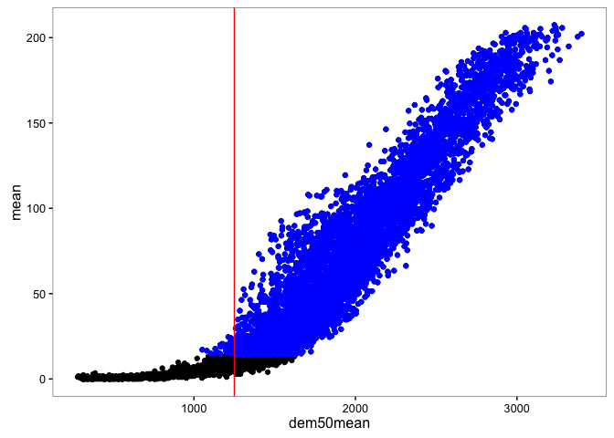
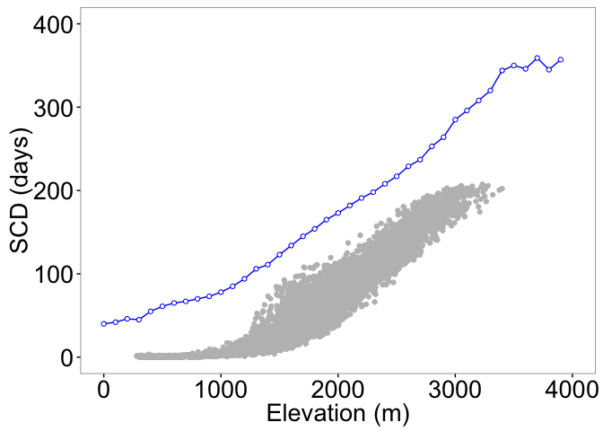

``` r
# Load packages 
library("raster")
library("rgdal")
library("sp")
library("dplyr")
library("rasterVis") 
library("multcomp")
library("broom") # tidy output models
library("grid") # multiple plots
library("gridExtra") # multiple plots
library("ggplot2")
```

Prepare Data
------------

-   Read snow cover indicator data and subset snow cover duration
-   Read topographic data and position (spatial) data

``` r
# Read data (snow cover)
snow <- read.csv(file=paste(di, "/data/raw/snow_sn.csv", sep= ""), header = TRUE) 
# --   

# Read spatial data and Get lat/long
centroides <- rgdal::readOGR(dsn=paste(di, "/data/geoinfo", sep=""),
                             layer = "centroides_selected", verbose = FALSE)
# Select only attributes of interest and rename them
centroides <- centroides[c("id")]

# Create lat/lng by id 
xycentroides <- cbind(centroides@data, coordinates(centroides))
names(xycentroides) <- c("nie_malla_modi_id", "lon","lat")

xycentroides <- filter(xycentroides, nie_malla_modi_id %in% snow$nie_malla_modi_id)

# -- 

# Read Topographic data 
rawtopo <- read.csv(file=paste(di, "/data/topo_nie_malla_modis.csv", sep=""),
                    header=TRUE,
                    sep = ",") 
# function to convert radian to degree 
rad2deg <- function(rad) {(rad * 180) / (pi)} 


topo <- rawtopo %>% 
  filter(id %in% snow$nie_malla_modi_id) %>% 
  mutate(nie_malla_modi_id = id, 
         slope50mean_deg = rad2deg(slope50mean),
         slope50median_deg = rad2deg(slope50median),
         aspect50mean_deg = rad2deg(aspect50mean),
         aspect50median_deg = rad2deg(aspect50median)) %>%
  dplyr::select(nie_malla_modi_id, dem50mean, dem50median, slope50mean_deg, 
                slope50median_deg, aspect50mean_deg, aspect50median_deg) 
# -- 


# Create objects with basis statistics for all indicators 
indicadores <- c("scd", "scod", "scmd", "scmc") 

# Loop to create objects with basis stats
for (i in indicadores) { 
  vnames <- c("nie_malla_modi_id", i) 
  aux <- snow %>%
    dplyr::select(one_of(vnames)) %>%
    mutate_(vinterest = i) %>%
    group_by_("nie_malla_modi_id") %>%
    summarise(mean=mean(vinterest),
              sd = sd(vinterest),
              cv = raster::cv(vinterest),
              se = sd / sqrt (length(vinterest))) %>%
    inner_join(topo, by="nie_malla_modi_id") %>%
    inner_join(xycentroides, by="nie_malla_modi_id") 
  
  assign(i, aux)
} 
```

### Spatial pattern of the snowcover indicators

-   Create raster maps of the summary stats for each indicator (`$indicator$`: `scd`, `scod`, `scmd`, `scmc`). Two raster maps will be created:

-   `r_mean_$indicator$`: mean values of the indicator for the pixel in the temporal serie.
-   `r_cv_$indicator$`: coefficient of variation of the indicator for the pixel in the temporal serie.

-   Two additional raster maps will be created, with a mask of the elevation (those pixels above 1900 *m asl*). The names of the raster are: `r_mean_$indicator$_1900` and `r_cv_$indicator$_1900`. Pixels below 1900 masl show a value of `-1`. This value can be customized (change `updatevalue=-1` argument of the `mask` function).

-   All these rasters are stored at `./data/derived/`

``` r
# Spatial data
# Reproject to utm and m
centroides <- spTransform(centroides, CRS("+init=epsg:23030"))

# Get projection 
projection(centroides) 
```

    ## [1] "+init=epsg:23030 +proj=utm +zone=30 +ellps=intl +towgs84=-87,-98,-121,0,0,0,0 +units=m +no_defs"

``` r
# Select only attributes of interest and rename them
centroides <- centroides[c("id")]
names(centroides) <-"nie_malla_modi_id"

# Which pixels are in the snow object
pix_comunes <- match(snow$nie_malla_modi_id, centroides$nie_malla_modi_id)

# Create spatial objetc with centroid of Sierra Nevada
centroides_sn <- centroides[pix_comunes,]


# Loop to create raster map 
for (i in indicadores) { 
  df <- get(i)
  
  # merge MKT and spatial pixel 
  aux_spatial <- sp::merge(x=centroides_sn, y=df, by="nie_malla_modi_id")
  aux_spatial_elev <- aux_spatial[c("nie_malla_modi_id", "dem50mean")]
  
  # raster auxiliar 
  aux_rast <- raster(aux_spatial, resolution=500)
  
  # raster of Mean values 
  mean_raster <- rasterize(aux_spatial, aux_rast, "mean", fun=mean)
  names(mean_raster) <- i # Set name of the raster layer 
  
  # raster of CV values
  cv_raster <- rasterize(aux_spatial, aux_rast, "cv", fun=mean)
  names(cv_raster) <- i 
  
  # raster of Elevation
  elev_raster <- rasterize(aux_spatial_elev, aux_rast, "dem50mean", fun=mean)
  elev_raster1900 <- elev_raster
  elev_raster1900[elev_raster1900 < 1900] <- NA
  
  # Mask by 1900
  mean_raster1900 <- mask(mean_raster, elev_raster1900, updatevalue=0)
  cv_raster1900 <- mask(cv_raster, elev_raster1900, updatevalue=0)
  
  
  # assign 
  name_mean <- paste("r_mean_",i, sep="")
  name_cv <- paste("r_cv_",i, sep="")
  name_mean1900 <- paste("r_mean_",i,"_1900", sep="")
  name_cv1900 <- paste("r_cv_",i,"_1900", sep="")
  
  assign(name_mean, mean_raster)
  writeRaster(mean_raster, file=paste(di, "/data/derived/r_mean_", i, ".asc", sep=""), overwrite=TRUE)
  
  assign(name_cv, cv_raster)
  writeRaster(cv_raster, file=paste(di, "/data/derived/r_cv_", i, ".asc", sep=""), overwrite=TRUE)
  
  assign(name_mean1900, mean_raster1900)
  writeRaster(mean_raster1900, file=paste(di, "/data/derived/r_mean_", i, "_1900", ".asc", sep=""), overwrite=TRUE)
  
  assign(name_cv1900, cv_raster1900)
  writeRaster(cv_raster1900, file=paste(di, "/data/derived/r_cv_", i, "_1900", ".asc", sep=""), overwrite=TRUE)
}
```

Visualization of the Snow Cover indicators
------------------------------------------

### Snow Cover Duration

<figure>
<a name="scd_mean"></a>
<figcaption>
<span style="color:black; ">Figure 1: Mean values of Snow cover duration</span>
</figcaption>
</figure>
<figure>
<a name="scd_cv"></a>
<figcaption>
<span style="color:black; ">Figure 2: Coefficient of Variation of values of Snow cover duration</span>
</figcaption>
</figure>
### Snow Cover Onset Date

<figure>
<a name="scod_mean"></a>
<figcaption>
</figcaption>
</figure>
<figure>

<figcaption>
<span style="color:black; ">Figure 3: Mean values of Snow cover Onset Date</span>
</figcaption>
</figure>
<figure>
<a name="scod_cv"></a>
<figcaption>
<span style="color:black; ">Figure 4: Coefficient of Variation of values of Snow cover Onset date</span>
</figcaption>
</figure>
### Snow Cover Melting Date

<figure>
<a name="scmd_mean"></a>
<figcaption>
</figcaption>
</figure>
<figure>

<figcaption>
<span style="color:black; ">Figure 5: Mean values of Snow cover Melting Date</span>
</figcaption>
</figure>
<figure>
<a name="scmd_cv"></a>
<figcaption>
<span style="color:black; ">Figure 6: Coefficient of Variation of values of Snow cover Melting date</span>
</figcaption>
</figure>
### Snow Cover Melting Cycles

<figure>
<a name="scmc_mean"></a>
<figcaption>
</figcaption>
</figure>
<figure>

<figcaption>
<span style="color:black; ">Figure 7: Mean values of Snow cover Melting Date</span>
</figcaption>
</figure>
<figure>
<a name="scmc_cv"></a>
<figcaption>
<span style="color:black; ">Figure 8: Coefficient of Variation of values of Snow cover Melting cycles</span>
</figcaption>
</figure>
Explore patterns of raw values
==============================

Snow Cover Onset Dates
----------------------

-   Analyze the effect of aspect, slope and longtitude on snow cover onset date

<!-- -->

    ##                        term    estimate  std.error statistic       p.value
    ## 1               (Intercept) 130.8567712 4.15831407 31.468708 4.229538e-188
    ## 2                       lon  24.6661751 1.28805455 19.149946  3.251691e-77
    ## 3  aspect50mean_deg_groupNE   1.4309457 1.09727864  1.304086  1.923043e-01
    ## 4   aspect50mean_deg_groupE   1.5597641 1.06765354  1.460927  1.441401e-01
    ## 5  aspect50mean_deg_groupSE   2.3445620 1.09375115  2.143597  3.214529e-02
    ## 6   aspect50mean_deg_groupS   3.5721065 1.08303001  3.298253  9.842306e-04
    ## 7  aspect50mean_deg_groupSW   4.7437110 1.11054941  4.271499  2.001932e-05
    ## 8   aspect50mean_deg_groupW   2.4348225 1.23419299  1.972805  4.860937e-02
    ## 9  aspect50mean_deg_groupNW  -4.8064458 4.33730903 -1.108163  2.678802e-01
    ## 10          slope50mean_deg  -0.1417892 0.03813988 -3.717611  2.047899e-04

:red\_circle: broom tidy glm factor level

<figure>
<a name="scod_tukey_aspect"></a>
<figcaption>
<span style="color:black; ">Figure 9: Snow cover onset dates by aspect</span>
</figcaption>
</figure>
    ## Warning in RET$pfunction("adjusted", ...): Completion with error > abseps

    ## Warning in RET$pfunction("adjusted", ...): Completion with error > abseps

    ## Warning in RET$pfunction("adjusted", ...): Completion with error > abseps

    ## Warning in RET$pfunction("adjusted", ...): Completion with error > abseps

<figure>
<a name="scod_tukey_aspect_effects"></a>
<figcaption>
<span style="color:black; ">Figure 10: Snow cover onset dates by aspect (effect sizes</span>
</figcaption>
</figure>
<figure>
<a name="scod_lon_slope"></a>
<figcaption>
<span style="color:black; ">Figure 11: Snow cover onset dates by Longitude and Slope</span>
</figcaption>
</figure>
