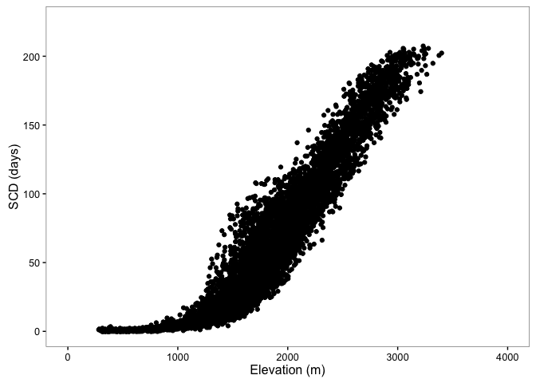
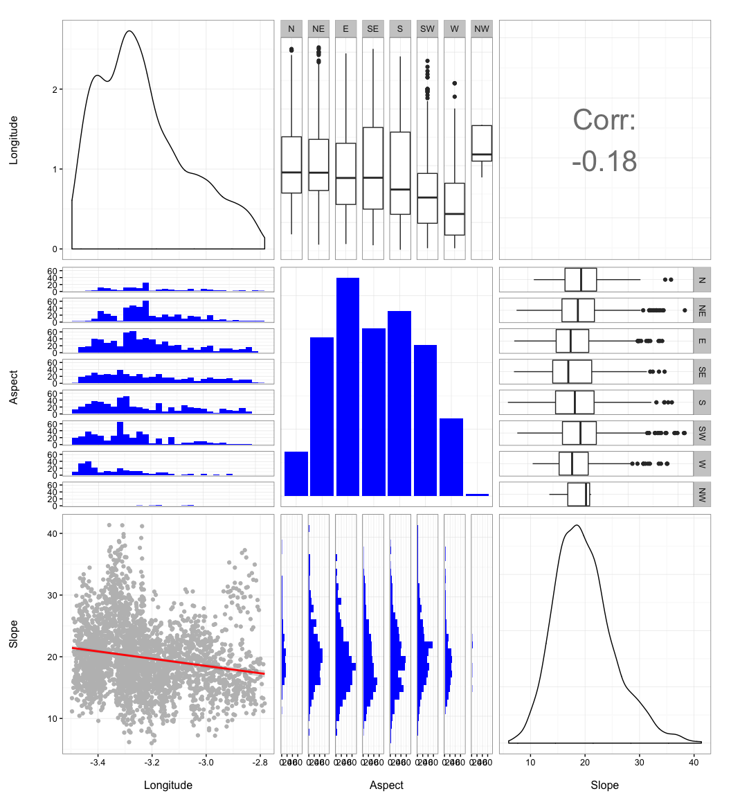

``` r
# Load packages 
library("raster")
library("rgdal")
library("sp")
library("dplyr")
library("rasterVis") 
library("multcomp")
library("broom") # tidy output models
library("grid") # multiple plots
library("gridExtra") # multiple plots
library("ggplot2")
library("GGally")
library("pander")
source("http://www.highstat.com/BGS/GAM/RCode/HighstatLibV8.R")
```

``` r
### Autocaption Script

# https://rpubs.com/ajlyons/autonumfigs

# A function for generating captions and cross-references

fig <- local({
  i <- 0
  list(
    cap=function(refName, text, center=FALSE, col="black", inline=FALSE) {
      i <<- i + 1
      ref[[refName]] <<- i
      css_ctr <- ""
      if (center) css_ctr <- "text-align:center; display:inline-block; width:100%;"
      cap_txt <- paste0("<span style=\"color:", col, "; ", css_ctr, "\">Figure ", i, ": ", text , "</span>")
      anchor <- paste0("<a name=\"", refName, "\"></a>")
      if (inline) {
        paste0(anchor, cap_txt)    
      } else {
        list(anchor=anchor, cap_txt=cap_txt)
      }
    },
    
    ref=function(refName, link=FALSE, checkRef=TRUE) {
      
      ## This function puts in a cross reference to a caption. You refer to the
      ## caption with the refName that was passed to fig$cap() (not the code chunk name).
      ## The cross reference can be hyperlinked.
      
      if (checkRef && !refName %in% names(ref)) stop(paste0("fig$ref() error: ", refName, " not found"))
      if (link) {
        paste0("<A HREF=\"#", refName, "\">Figure ", ref[[refName]], "</A>")
      } else {
        paste0("Figure ", ref[[refName]])
      }
    },
    
    ref_all=function(){
      ## For debugging
      ref
    })
})


## This chunk replaces the default hook for processing plots. It achieves the purposes,
## of laying out auto-numbered captions, but other functionality may be gone.

require("knitr")
```

    ## Loading required package: knitr

    ## Warning: package 'knitr' was built under R version 3.2.3

``` r
knit_hooks$set(plot = function(x, options) {
  sty <- ""
  if (options$fig.align == 'default') {
    sty <- ""
  } else {
    sty <- paste0(" style=\"text-align:", options$fig.align, ";\"")
  }
  
  if (is.list(options$fig.cap)) {
    ## options$fig.cap is a list returned by the function fig$cap()
    str_caption <- options$fig.cap$cap_txt
    str_anchr <- options$fig.cap$anchor
  } else {
    ## options$fig.cap is a character object (hard coded, no anchor)
    str_caption <- options$fig.cap
    str_anchr <- ""
  }
  
  paste('<figure', sty, '>', str_anchr, '<figcaption>', str_caption, '</figcaption></figure>',
        sep = '')
  
})


## This chucnk will read through *this* Rmd file, and attempt to extract all of the 
## labels (not caption text) used for Figure captions. These labels are used
## as anchors, so scanning through the document now will allow us to create cross references
## before the caption actually appears. 

## Get the name of this Rmd file
rmdFn <- knitr::current_input()  # filename of input document

## Read lines and close connection
rmdCon <- file(rmdFn, open = "r")
rmdLines <- readLines(rmdCon)
close(rmdCon)

## Pull out all occurences of at least one back tick, followed 
## by any number of characters, followed by fig$cap (all on one line)
figscap_idx <- grep("`+(.*)fig\\$cap", rmdLines)
rmdLines <- rmdLines[figscap_idx]

## Get rid of everything up until the start of the caption label
## This presumes the caption label is the first argument of fig$cap()
## E.g., fig.cap = fig$cap("my_label", ...)
rmdLinesSansPre <- sub("(.*)fig\\$cap(.*?)[\"']", "", rmdLines)

## Identify everything up until the first quote
match_data <- regexpr("(.*?)[\"']", rmdLinesSansPre)

## Reduce the length by one, because we're not interested in the final quote
attr(match_data, "match.length") <- attr(match_data, "match.length") - 1

## Extract
fig_labels <- regmatches(rmdLinesSansPre, match_data, invert=FALSE)

if (length(fig_labels) > 0) {
  
  ## Test for duplicates
  if (anyDuplicated(fig_labels) > 0) stop("Duplicate caption labels detected")
  
  ## Create a named list of Figure numbers
  ref <- as.list(1:length(fig_labels))
  names(ref) <- fig_labels
}    
```

Prepare Data
------------

-   Read snow cover indicator data and subset snow cover duration
-   Read topographic data and position (spatial) data

``` r
# Read data (snow cover)
snow <- read.csv(file=paste(di, "/data/raw/snow_sn.csv", sep= ""), header = TRUE) 
# --   

# Read spatial data and Get lat/long
centroides <- rgdal::readOGR(dsn=paste(di, "/data/geoinfo", sep=""),
                             layer = "centroides_selected", verbose = FALSE)
# Select only attributes of interest and rename them
centroides <- centroides[c("id")]

# Create lat/lng by id 
xycentroides <- cbind(centroides@data, coordinates(centroides))
names(xycentroides) <- c("nie_malla_modi_id", "lon","lat")

xycentroides <- filter(xycentroides, nie_malla_modi_id %in% snow$nie_malla_modi_id)

# -- 

# Read Topographic data 
rawtopo <- read.csv(file=paste(di, "/data/topo_nie_malla_modis.csv", sep=""),
                    header=TRUE,
                    sep = ",") 
# function to convert radian to degree 
rad2deg <- function(rad) {(rad * 180) / (pi)} 


topo <- rawtopo %>% 
  filter(id %in% snow$nie_malla_modi_id) %>% 
  mutate(nie_malla_modi_id = id, 
         slope50mean_deg = rad2deg(slope50mean),
         slope50median_deg = rad2deg(slope50median),
         aspect50mean_deg = rad2deg(aspect50mean),
         aspect50median_deg = rad2deg(aspect50median)) %>%
  dplyr::select(nie_malla_modi_id, dem50mean, dem50median, slope50mean_deg, 
                slope50median_deg, aspect50mean_deg, aspect50median_deg) 
# -- 


# Create objects with basis statistics for all indicators 
indicadores <- c("scd", "scod", "scmd", "scmc") 

# Loop to create objects with basis stats
for (i in indicadores) { 
  vnames <- c("nie_malla_modi_id", i) 
  aux <- snow %>%
    dplyr::select(one_of(vnames)) %>%
    mutate_(vinterest = i) %>%
    group_by_("nie_malla_modi_id") %>%
    summarise(mean=mean(vinterest),
              sd = sd(vinterest),
              cv = raster::cv(vinterest),
              se = sd / sqrt (length(vinterest))) %>%
    inner_join(topo, by="nie_malla_modi_id") %>%
    inner_join(xycentroides, by="nie_malla_modi_id") 
  
  assign(i, aux)
} 
```

### Spatial pattern of the snowcover indicators

-   Create raster maps of the summary stats for each indicator (`$indicator$`: `scd`, `scod`, `scmd`, `scmc`). Two raster maps will be created:

-   `r_mean_$indicator$`: mean values of the indicator for the pixel in the temporal serie.
-   `r_cv_$indicator$`: coefficient of variation of the indicator for the pixel in the temporal serie.

-   Two additional raster maps will be created, with a mask of the elevation (those pixels above 1900 *m asl*). The names of the raster are: `r_mean_$indicator$_1900` and `r_cv_$indicator$_1900`. Pixels below 1900 masl show a value of `0`. This value can be customized (change `updatevalue=-1` argument of the `mask` function).

-   All these rasters are stored at `./data/derived/`

``` r
# Spatial data
# Reproject to utm and m
centroides <- spTransform(centroides, CRS("+init=epsg:23030"))

# Get projection 
projection(centroides) 
```

    ## [1] "+init=epsg:23030 +proj=utm +zone=30 +ellps=intl +towgs84=-87,-98,-121,0,0,0,0 +units=m +no_defs"

``` r
# Select only attributes of interest and rename them
centroides <- centroides[c("id")]
names(centroides) <-"nie_malla_modi_id"

# Which pixels are in the snow object
pix_comunes <- match(snow$nie_malla_modi_id, centroides$nie_malla_modi_id)

# Create spatial objetc with centroid of Sierra Nevada
centroides_sn <- centroides[pix_comunes,]


# Loop to create raster map 
for (i in indicadores) { 
  df <- get(i)
  
  # merge MKT and spatial pixel 
  aux_spatial <- sp::merge(x=centroides_sn, y=df, by="nie_malla_modi_id")
  aux_spatial_elev <- aux_spatial[c("nie_malla_modi_id", "dem50mean")]
  
  # raster auxiliar 
  aux_rast <- raster(aux_spatial, resolution=500)
  
  # raster of Mean values 
  mean_raster <- rasterize(aux_spatial, aux_rast, "mean", fun=mean)
  names(mean_raster) <- i # Set name of the raster layer 
  
  # raster of CV values
  cv_raster <- rasterize(aux_spatial, aux_rast, "cv", fun=mean)
  names(cv_raster) <- i 
  
  # raster of Elevation
  elev_raster <- rasterize(aux_spatial_elev, aux_rast, "dem50mean", fun=mean)
  elev_raster1900 <- elev_raster
  elev_raster1900[elev_raster1900 < 1900] <- NA
  
  # Mask by 1900
  mean_raster1900 <- mask(mean_raster, elev_raster1900, updatevalue=0)
  cv_raster1900 <- mask(cv_raster, elev_raster1900, updatevalue=0)
  
  
  # assign 
  name_mean <- paste("r_mean_",i, sep="")
  name_cv <- paste("r_cv_",i, sep="")
  name_mean1900 <- paste("r_mean_",i,"_1900", sep="")
  name_cv1900 <- paste("r_cv_",i,"_1900", sep="")
  
  assign(name_mean, mean_raster)
  writeRaster(mean_raster, file=paste(di, "/data/derived/r_mean_", i, ".asc", sep=""), overwrite=TRUE)
  
  assign(name_cv, cv_raster)
  writeRaster(cv_raster, file=paste(di, "/data/derived/r_cv_", i, ".asc", sep=""), overwrite=TRUE)
  
  assign(name_mean1900, mean_raster1900)
  writeRaster(mean_raster1900, file=paste(di, "/data/derived/r_mean_", i, "_1900", ".asc", sep=""), overwrite=TRUE)
  
  assign(name_cv1900, cv_raster1900)
  writeRaster(cv_raster1900, file=paste(di, "/data/derived/r_cv_", i, "_1900", ".asc", sep=""), overwrite=TRUE)
}
```

Visualization of the Snow Cover indicators
------------------------------------------

### Snow Cover Duration

<figure>
<a name="scd_mean"></a>
<figcaption>
<span style="color:black; ">Figure 1: Mean values of Snow cover duration</span>
</figcaption>
</figure>
<figure>
<a name="scd_cv"></a>
<figcaption>
<span style="color:black; ">Figure 2: Coefficient of Variation of values of Snow cover duration</span>
</figcaption>
</figure>
### Snow Cover Onset Date

<figure>
<a name="scod_mean"></a>
<figcaption>
</figcaption>
</figure>
<figure>

<figcaption>
<span style="color:black; ">Figure 3: Mean values of Snow cover Onset Date</span>
</figcaption>
</figure>
<figure>
<a name="scod_cv"></a>
<figcaption>
<span style="color:black; ">Figure 4: Coefficient of Variation of values of Snow cover Onset date</span>
</figcaption>
</figure>
### Snow Cover Melting Date

<figure>
<a name="scmd_mean"></a>
<figcaption>
</figcaption>
</figure>
<figure>

<figcaption>
<span style="color:black; ">Figure 5: Mean values of Snow cover Melting Date</span>
</figcaption>
</figure>
<figure>
<a name="scmd_cv"></a>
<figcaption>
<span style="color:black; ">Figure 6: Coefficient of Variation of values of Snow cover Melting date</span>
</figcaption>
</figure>
### Snow Cover Melting Cycles

<figure>
<a name="scmc_mean"></a>
<figcaption>
</figcaption>
</figure>
<figure>

<figcaption>
<span style="color:black; ">Figure 7: Mean values of Snow cover Melting Date</span>
</figcaption>
</figure>
<figure>
<a name="scmc_cv"></a>
<figcaption>
<span style="color:black; ">Figure 8: Coefficient of Variation of values of Snow cover Melting cycles</span>
</figcaption>
</figure>
Explore patterns of raw values
==============================

Snow Cover Onset Dates
----------------------

-   Analyze the effect of aspect, slope and longtitude on snow cover onset date

<table style="width:92%;">
<colgroup>
<col width="31%" />
<col width="6%" />
<col width="11%" />
<col width="12%" />
<col width="16%" />
<col width="12%" />
</colgroup>
<thead>
<tr class="header">
<th align="center">term</th>
<th align="center">df</th>
<th align="center">sumsq</th>
<th align="center">meansq</th>
<th align="center">statistic</th>
<th align="center">p.value</th>
</tr>
</thead>
<tbody>
<tr class="odd">
<td align="center"><none></td>
<td align="center">NA</td>
<td align="center">375417</td>
<td align="center">23104</td>
<td align="center">NA</td>
<td align="center">NA</td>
</tr>
<tr class="even">
<td align="center">lon</td>
<td align="center">1</td>
<td align="center">421278</td>
<td align="center">23449</td>
<td align="center">347.15</td>
<td align="center">1.773e-77</td>
</tr>
<tr class="odd">
<td align="center">aspect50mean_deg_group</td>
<td align="center">7</td>
<td align="center">380547</td>
<td align="center">23131</td>
<td align="center">40.88</td>
<td align="center">8.547e-07</td>
</tr>
<tr class="even">
<td align="center">slope50mean_deg</td>
<td align="center">1</td>
<td align="center">377146</td>
<td align="center">23116</td>
<td align="center">13.83</td>
<td align="center">1.996e-04</td>
</tr>
</tbody>
</table>

-   What about the Variance Inflation factors?

Variance inflation factors

                           GVIF Df GVIF^(1/2Df)

lon 1.109721 1 1.053433 aspect50mean\_deg\_group 1.091876 7 1.006298 slope50mean\_deg 1.050841 1 1.025106

<table style="width:76%;">
<colgroup>
<col width="40%" />
<col width="9%" />
<col width="6%" />
<col width="19%" />
</colgroup>
<thead>
<tr class="header">
<th align="center"> </th>
<th align="center">GVIF</th>
<th align="center">Df</th>
<th align="center">GVIF^(1/2Df)</th>
</tr>
</thead>
<tbody>
<tr class="odd">
<td align="center"><strong>lon</strong></td>
<td align="center">1.11</td>
<td align="center">1</td>
<td align="center">1.053</td>
</tr>
<tr class="even">
<td align="center"><strong>aspect50mean_deg_group</strong></td>
<td align="center">1.092</td>
<td align="center">7</td>
<td align="center">1.006</td>
</tr>
<tr class="odd">
<td align="center"><strong>slope50mean_deg</strong></td>
<td align="center">1.051</td>
<td align="center">1</td>
<td align="center">1.025</td>
</tr>
</tbody>
</table>

<figure>
<a name="ggpair_scod"></a>
<figcaption>
<span style="color:black; ">Figure 9: Explore relationships of covariates (Snow cover onset dates</span>
</figcaption>
</figure>
<figure>
<a name="scod_tukey_aspect"></a>
<figcaption>
<span style="color:black; ">Figure 10: Snow cover onset dates by aspect</span>
</figcaption>
</figure>
<figure>
<a name="scod_tukey_aspect_effects"></a>
<figcaption>
<span style="color:black; ">Figure 11: Snow cover onset dates by aspect (effect sizes</span>
</figcaption>
</figure>
<figure>
<a name="scod_lon_slope"></a>
<figcaption>
<span style="color:black; ">Figure 12: Snow cover onset dates by Longitude and Slope</span>
</figcaption>
</figure>
Snow Cover Melting Dates
------------------------

    ## 
    ## Attaching package: 'pander'

    ## The following object is masked from 'package:GGally':
    ## 
    ##     wrap

<table style="width:92%;">
<colgroup>
<col width="31%" />
<col width="6%" />
<col width="11%" />
<col width="12%" />
<col width="16%" />
<col width="12%" />
</colgroup>
<thead>
<tr class="header">
<th align="center">term</th>
<th align="center">df</th>
<th align="center">sumsq</th>
<th align="center">meansq</th>
<th align="center">statistic</th>
<th align="center">p.value</th>
</tr>
</thead>
<tbody>
<tr class="odd">
<td align="center"><none></td>
<td align="center">NA</td>
<td align="center">323863</td>
<td align="center">22661</td>
<td align="center">NA</td>
<td align="center">NA</td>
</tr>
<tr class="even">
<td align="center">dem50mean</td>
<td align="center">1</td>
<td align="center">1153804</td>
<td align="center">26486</td>
<td align="center">3826.748</td>
<td align="center">0.000e+00</td>
</tr>
<tr class="odd">
<td align="center">lon</td>
<td align="center">1</td>
<td align="center">324822</td>
<td align="center">22668</td>
<td align="center">8.907</td>
<td align="center">2.841e-03</td>
</tr>
<tr class="even">
<td align="center">aspect50mean_deg_group</td>
<td align="center">7</td>
<td align="center">328542</td>
<td align="center">22690</td>
<td align="center">43.209</td>
<td align="center">3.039e-07</td>
</tr>
<tr class="odd">
<td align="center">slope50mean_deg</td>
<td align="center">1</td>
<td align="center">339838</td>
<td align="center">22804</td>
<td align="center">145.026</td>
<td align="center">2.120e-33</td>
</tr>
</tbody>
</table>

-   What about the Variance Inflation factors?

Variance inflation factors

                           GVIF Df GVIF^(1/2Df)

dem50mean 1.104429 1 1.050918 lon 1.217001 1 1.103178 aspect50mean\_deg\_group 1.098567 7 1.006737 slope50mean\_deg 1.050885 1 1.025127

<table style="width:76%;">
<colgroup>
<col width="40%" />
<col width="9%" />
<col width="6%" />
<col width="19%" />
</colgroup>
<thead>
<tr class="header">
<th align="center"> </th>
<th align="center">GVIF</th>
<th align="center">Df</th>
<th align="center">GVIF^(1/2Df)</th>
</tr>
</thead>
<tbody>
<tr class="odd">
<td align="center"><strong>dem50mean</strong></td>
<td align="center">1.104</td>
<td align="center">1</td>
<td align="center">1.051</td>
</tr>
<tr class="even">
<td align="center"><strong>lon</strong></td>
<td align="center">1.217</td>
<td align="center">1</td>
<td align="center">1.103</td>
</tr>
<tr class="odd">
<td align="center"><strong>aspect50mean_deg_group</strong></td>
<td align="center">1.099</td>
<td align="center">7</td>
<td align="center">1.007</td>
</tr>
<tr class="even">
<td align="center"><strong>slope50mean_deg</strong></td>
<td align="center">1.051</td>
<td align="center">1</td>
<td align="center">1.025</td>
</tr>
</tbody>
</table>

<figure>
<a name="ggpair_scmd"></a>
<figcaption>
<span style="color:black; ">Figure 13: Explore relationships of covariates (Snow cover melting dates</span>
</figcaption>
</figure>
<figure>
<a name="scmd_tukey_aspect"></a>
<figcaption>
<span style="color:black; ">Figure 14: Snow cover melting dates by aspect</span>
</figcaption>
</figure>
<figure>
<a name="scmd_tukey_aspect_effects"></a>
<figcaption>
<span style="color:black; ">Figure 15: Snow cover melting dates by aspect (effect sizes</span>
</figcaption>
</figure>
<figure>
<a name="scmd_lon_slope_elev"></a>
<figcaption>
<span style="color:black; ">Figure 16: Snow cover melting dates by Longitude, Slope and Elevation</span>
</figcaption>
</figure>
Snow Cover Melting Cycles
-------------------------

    ## 
    ## Attaching package: 'pander'

    ## The following object is masked from 'package:GGally':
    ## 
    ##     wrap

<table style="width:92%;">
<colgroup>
<col width="31%" />
<col width="6%" />
<col width="11%" />
<col width="12%" />
<col width="16%" />
<col width="12%" />
</colgroup>
<thead>
<tr class="header">
<th align="center">term</th>
<th align="center">df</th>
<th align="center">sumsq</th>
<th align="center">meansq</th>
<th align="center">statistic</th>
<th align="center">p.value</th>
</tr>
</thead>
<tbody>
<tr class="odd">
<td align="center"><none></td>
<td align="center">NA</td>
<td align="center">345.8</td>
<td align="center">2053</td>
<td align="center">NA</td>
<td align="center">NA</td>
</tr>
<tr class="even">
<td align="center">dem50mean</td>
<td align="center">1</td>
<td align="center">721.1</td>
<td align="center">4264</td>
<td align="center">2213.2234</td>
<td align="center">0.000e+00</td>
</tr>
<tr class="odd">
<td align="center">lon</td>
<td align="center">1</td>
<td align="center">346.5</td>
<td align="center">2057</td>
<td align="center">6.0407</td>
<td align="center">1.398e-02</td>
</tr>
<tr class="even">
<td align="center">aspect50mean_deg_group</td>
<td align="center">7</td>
<td align="center">354.9</td>
<td align="center">2116</td>
<td align="center">77.5868</td>
<td align="center">4.273e-14</td>
</tr>
<tr class="odd">
<td align="center">slope50mean_deg</td>
<td align="center">1</td>
<td align="center">345.9</td>
<td align="center">2051</td>
<td align="center">0.5956</td>
<td align="center">4.403e-01</td>
</tr>
</tbody>
</table>

-   What about the Variance Inflation factors?

Variance inflation factors

                           GVIF Df GVIF^(1/2Df)

dem50mean 1.104429 1 1.050918 lon 1.217001 1 1.103178 aspect50mean\_deg\_group 1.098567 7 1.006737 slope50mean\_deg 1.050885 1 1.025127

<table style="width:76%;">
<colgroup>
<col width="40%" />
<col width="9%" />
<col width="6%" />
<col width="19%" />
</colgroup>
<thead>
<tr class="header">
<th align="center"> </th>
<th align="center">GVIF</th>
<th align="center">Df</th>
<th align="center">GVIF^(1/2Df)</th>
</tr>
</thead>
<tbody>
<tr class="odd">
<td align="center"><strong>dem50mean</strong></td>
<td align="center">1.104</td>
<td align="center">1</td>
<td align="center">1.051</td>
</tr>
<tr class="even">
<td align="center"><strong>lon</strong></td>
<td align="center">1.217</td>
<td align="center">1</td>
<td align="center">1.103</td>
</tr>
<tr class="odd">
<td align="center"><strong>aspect50mean_deg_group</strong></td>
<td align="center">1.099</td>
<td align="center">7</td>
<td align="center">1.007</td>
</tr>
<tr class="even">
<td align="center"><strong>slope50mean_deg</strong></td>
<td align="center">1.051</td>
<td align="center">1</td>
<td align="center">1.025</td>
</tr>
</tbody>
</table>

<figure>
<a name="ggpair_scmc"></a>
<figcaption>
<span style="color:black; ">Figure 17: Explore relationships of covariates (Snow cover melting dates</span>
</figcaption>
</figure>
<figure>
<a name="scmc_tukey_aspect"></a>
<figcaption>
<span style="color:black; ">Figure 18: Snow cover melting dates by aspect</span>
</figcaption>
</figure>
<figure>
<a name="scmc_tukey_aspect_effects"></a>
<figcaption>
<span style="color:black; ">Figure 19: Snow cover melting dates by aspect (effect sizes</span>
</figcaption>
</figure>
<figure>
<a name="scmc_lon_slope_elev"></a>
<figcaption>
<span style="color:black; ">Figure 20: Snow cover melting dates by Longitude, Slope and Elevation</span>
</figcaption>
</figure>
:red\_circle: por aqui vas carpinto
