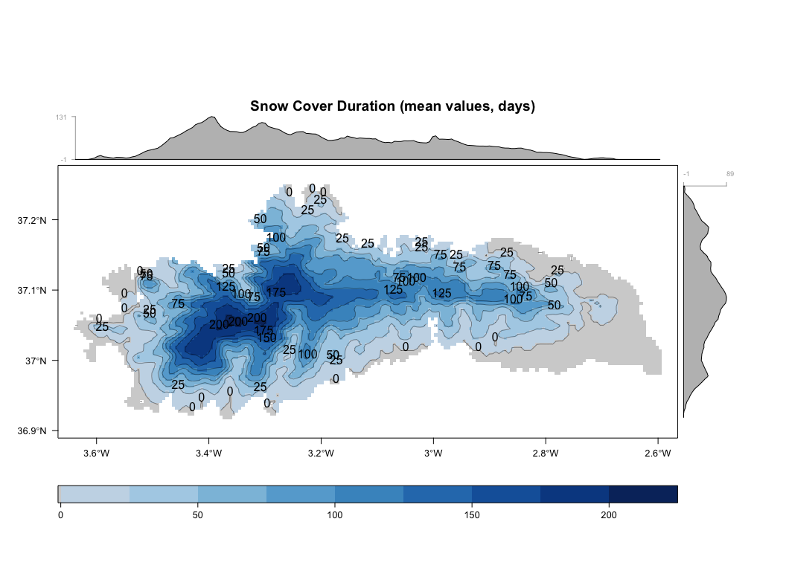
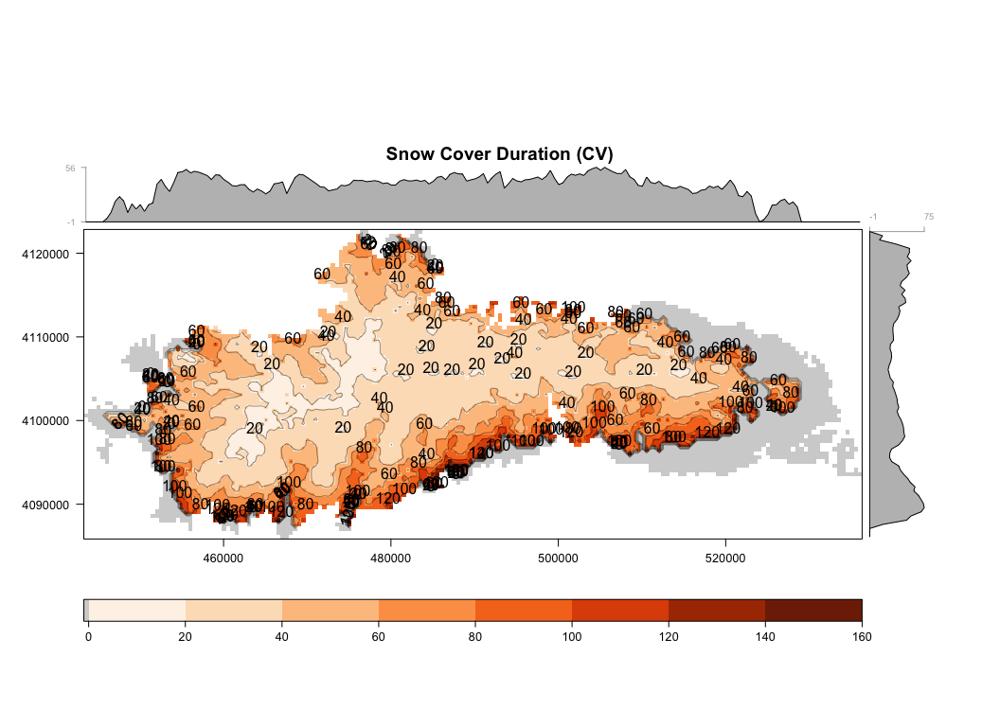
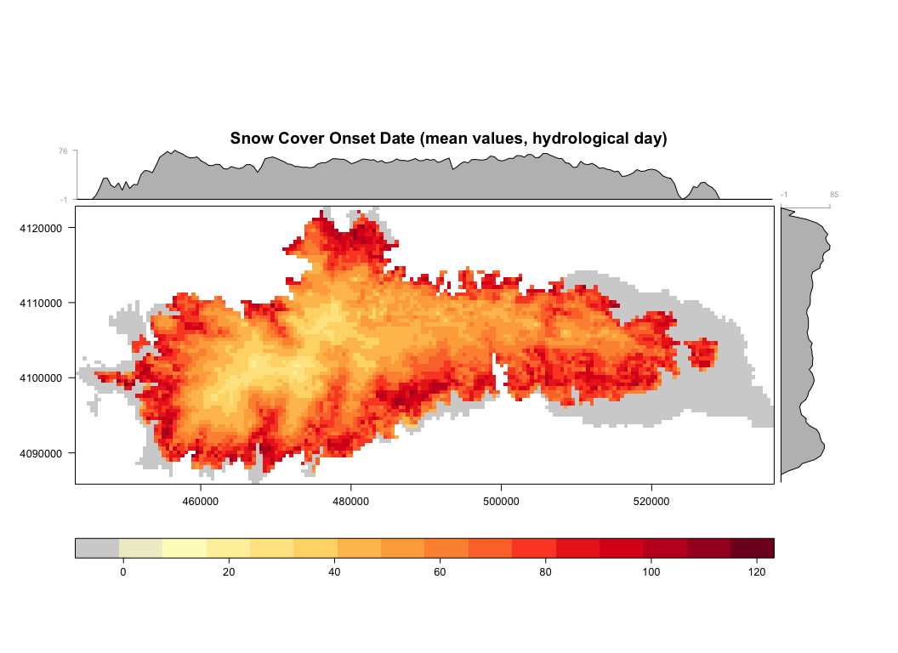
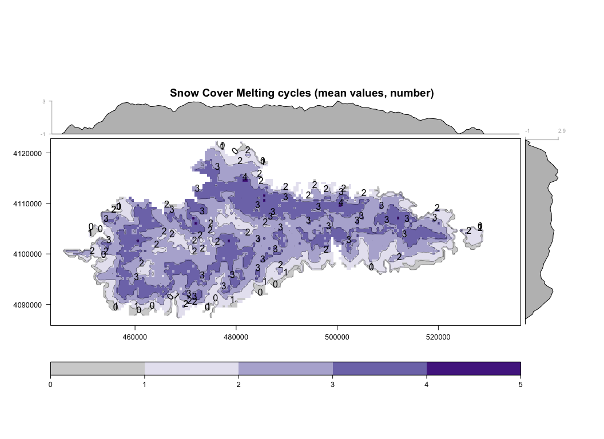
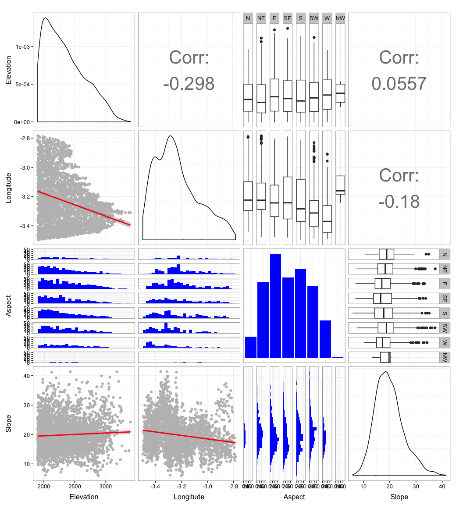
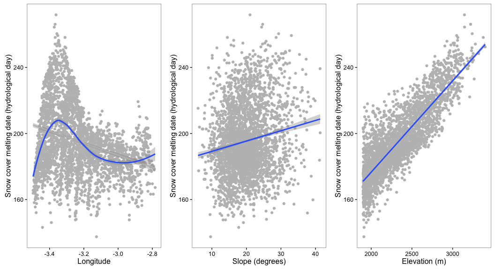

``` r
# Load packages 
library("raster")
library("rgdal")
library("sp")
library("plyr")
library("dplyr")
library("rasterVis") 
library("multcomp")
library("broom") # tidy output models
library("grid") # multiple plots
library("gridExtra") # multiple plots
library("ggplot2")
library("GGally")
library("pander")
library("mclust")
source("http://www.highstat.com/BGS/GAM/RCode/HighstatLibV8.R")
source(paste0(di,"/R/exportpdf.R")) # function to export raster levelplots maps as pdf
```

    ## Loading required package: knitr

Prepare Data
------------

-   Read snow cover indicator data and subset snow cover duration
-   Read topographic data and position (spatial) data
-   Read region data (hydrological basins)

``` r
# Read data (snow cover)
snow <- read.csv(file=paste(di, "/data/raw/snow_sn.csv", sep= ""), header = TRUE) 
# --   

# Read spatial data and Get lat/long
centroides <- rgdal::readOGR(dsn=paste(di, "/data/geoinfo", sep=""),
                             layer = "centroides_selected", verbose = FALSE)
# Select only attributes of interest and rename them
centroides <- centroides[c("id")]

# Create lat/lng by id 
xycentroides <- cbind(centroides@data, coordinates(centroides))
names(xycentroides) <- c("nie_malla_modi_id", "lon","lat")

xycentroides <- filter(xycentroides, nie_malla_modi_id %in% snow$nie_malla_modi_id)

# -- 

# Read Topographic data 
rawtopo <- read.csv(file=paste(di, "/data/topo_nie_malla_modis.csv", sep=""),
                    header=TRUE,
                    sep = ",") 
# function to convert radian to degree 
rad2deg <- function(rad) {(rad * 180) / (pi)} 


topo <- rawtopo %>% 
  filter(id %in% snow$nie_malla_modi_id) %>% 
  mutate(nie_malla_modi_id = id, 
         slope50mean_deg = rad2deg(slope50mean),
         slope50median_deg = rad2deg(slope50median),
         aspect50mean_deg = rad2deg(aspect50mean),
         aspect50median_deg = rad2deg(aspect50median)) %>%
  dplyr::select(nie_malla_modi_id, dem50mean, dem50median, slope50mean_deg, 
                slope50median_deg, aspect50mean_deg, aspect50median_deg) 
# -- 

## Hydrological basin 
basin <- read.csv(file=paste(di, "/data/derived/pixel_region.csv", sep=""),
                    header=TRUE,
                    sep = ",") 
# --


# Create objects with basis statistics for all indicators 
indicadores <- c("scd", "scod", "scmd", "scmc") 

# Loop to create objects with basis stats
for (i in indicadores) { 
  vnames <- c("nie_malla_modi_id", i) 
  aux <- snow %>%
    dplyr::select(one_of(vnames)) %>%
    mutate_(vinterest = i) %>%
    group_by_("nie_malla_modi_id") %>%
    summarise(mean=mean(vinterest),
              sd = sd(vinterest),
              cv = raster::cv(vinterest),
              se = sd / sqrt (length(vinterest))) %>%
    inner_join(topo, by="nie_malla_modi_id") %>%
    inner_join(xycentroides, by="nie_malla_modi_id") %>%
    inner_join(basin, by="nie_malla_modi_id")
  
  assign(i, aux)
} 
```

Elevation filter
----------------

-   Explore the range of elevation to set the filter
-   Explore elevation by hydrological basin

<figure>
<a name="elev_filter"></a>
<figcaption>
<span style="color:black; ">Figure 1: Profile of elevation</span>
</figcaption>
</figure>
-   Select the pixels above 14 days (scd)

``` r
scdfilter <- scd %>% filter(mean > 14)

ggplot(scd, aes(x=dem50mean, y=mean)) + 
  geom_point() + mythemeggplot + 
  geom_point(data=scdfilter, aes(dem50mean, mean), col='blue') + 
  geom_vline(xintercept = 1250, col='red') 
```

<figure>

<figcaption>
</figcaption>
</figure>
``` r
# How many pixels (from filter data) are above 1250 m? 
(nrow(subset(scdfilter, dem50mean > 1250))/nrow(scdfilter))*100 
```

    ## [1] 99.37075

<figure>
<a name="elev_filter_basin"></a>
<figcaption>
<span style="color:black; ">Figure 2: Profile of elevation by basin</span>
</figcaption>
</figure>
<figure>
<a name="elev_filter_basin_col"></a>
<figcaption>
<span style="color:black; ">Figure 3: Profile of elevation by basin</span>
</figcaption>
</figure>
### Spatial pattern of the snowcover indicators

-   Create raster maps of the summary stats for each indicator (`$indicator$`: `scd`, `scod`, `scmd`, `scmc`). Two raster maps will be created:

-   `r_mean_$indicator$`: mean values of the indicator for the pixel in the temporal serie.
-   `r_cv_$indicator$`: coefficient of variation of the indicator for the pixel in the temporal serie.

-   Two additional raster maps will be created, with a mask of the elevation (those pixels above 1000 *m asl*). The names of the raster are: `r_mean_$indicator$_1000` and `r_cv_$indicator$_1000`. Pixels below 1000 masl show a value of `0`. This value can be customized (change `updatevalue=-1` argument of the `mask` function).

-   All these rasters are stored at `./data/derived/`

``` r
# Spatial data
# Reproject to utm and m
centroides <- spTransform(centroides, CRS("+init=epsg:23030"))

# Get projection 
projection(centroides) 
```

    ## [1] "+init=epsg:23030 +proj=utm +zone=30 +ellps=intl +towgs84=-87,-98,-121,0,0,0,0 +units=m +no_defs"

``` r
# Select only attributes of interest and rename them
centroides <- centroides[c("id")]
names(centroides) <-"nie_malla_modi_id"

# Which pixels are in the snow object
pix_comunes <- match(snow$nie_malla_modi_id, centroides$nie_malla_modi_id)

# Create spatial objetc with centroid of Sierra Nevada
centroides_sn <- centroides[pix_comunes,]

# elevation filter
el <- '1250'
el_numeric <- 1250

# Loop to create raster map 
for (i in indicadores) { 
  df <- get(i)
  
  # merge MKT and spatial pixel 
  aux_spatial <- sp::merge(x=centroides_sn, y=df, by="nie_malla_modi_id")
  aux_spatial_elev <- aux_spatial[c("nie_malla_modi_id", "dem50mean")]
  
  # raster auxiliar 
  aux_rast <- raster(aux_spatial, resolution=500)
  
  # raster of Mean values 
  mean_raster <- rasterize(aux_spatial, aux_rast, "mean", fun=mean)
  names(mean_raster) <- i # Set name of the raster layer 
  
  # raster of CV values
  cv_raster <- rasterize(aux_spatial, aux_rast, "cv", fun=mean)
  names(cv_raster) <- i 
  
  # raster of Elevation
  elev_raster <- rasterize(aux_spatial_elev, aux_rast, "dem50mean", fun=mean)
  # Fitler by elevation threshold 
  elev_raster_filtro <- elev_raster
  elev_raster_filtro[elev_raster_filtro < el_numeric] <- NA
  
  # name_elev_raster <- paste("elev_raster", el, sep='')
  # assign(name_elev_raster, elev_raster)

  # valid old
  ## elev_raster1000 <- elev_raster
  ## elev_raster1000[elev_raster1000 < 1000] <- NA
  
  # Mask by 1000
  mean_raster_filtro <- mask(mean_raster, elev_raster_filtro, updatevalue=-1)
  cv_raster_filtro <- mask(cv_raster, elev_raster_filtro, updatevalue=-1)
  
  # mean_raster1000 <- mask(mean_raster, elev_raster1000, updatevalue=0)
  # cv_raster1000 <- mask(cv_raster, elev_raster1000, updatevalue=0)
  
  
  # assign 
  name_mean <- paste("r_mean_",i, sep="")
  name_cv <- paste("r_cv_",i, sep="")
  name_mean_filtro <- paste("r_mean_",i,"_",el, sep="")
  name_cv_filtro <- paste("r_cv_",i,"_",el, sep="")
  
  assign(name_mean, mean_raster)
  writeRaster(mean_raster, file=paste(di, "/data/derived/r_mean_", i, ".asc", sep=""), overwrite=TRUE)
  
  assign(name_cv, cv_raster)
  writeRaster(cv_raster, file=paste(di, "/data/derived/r_cv_", i, ".asc", sep=""), overwrite=TRUE)
  
  assign(name_mean_filtro, mean_raster_filtro)
  writeRaster(mean_raster_filtro, file=paste(di, "/data/derived/r_mean_", i, "_", el, ".asc", sep=""), overwrite=TRUE)
  
  assign(name_cv_filtro, cv_raster_filtro)
  writeRaster(cv_raster_filtro, file=paste(di, "/data/derived/r_cv_", i, "_", el, ".asc", sep=""), overwrite=TRUE)
}
```

Visualization of the Snow Cover indicators
------------------------------------------

For each indicator we plot several maps. See `/images/raster_maps/`

### Snow Cover Duration

<figure>
<a name="scd_mean"></a>
<figcaption>
<span style="color:black; ">Figure 4: Mean values of Snow cover duration</span>
</figcaption>
</figure>
    ## quartz_off_screen 
    ##                 2

<figure>
<a name="scd_cv"></a>
<figcaption>
<span style="color:black; ">Figure 5: Coefficient of Variation of values of Snow cover duration</span>
</figcaption>
</figure>
    ## quartz_off_screen 
    ##                 2

### Snow Cover Onset Date

<figure>
<a name="scod_mean"></a>
<figcaption>
</figcaption>
</figure>
    ## quartz_off_screen 
    ##                 2

<figure>

<figcaption>
<span style="color:black; ">Figure 6: Mean values of Snow cover Onset Date</span>
</figcaption>
</figure>
    ## quartz_off_screen 
    ##                 2

<figure>
<a name="scod_cv"></a>
<figcaption>
<span style="color:black; ">Figure 7: Coefficient of Variation of values of Snow cover Onset date</span>
</figcaption>
</figure>
    ## quartz_off_screen 
    ##                 2

### Snow Cover Melting Date

<figure>
<a name="scmd_mean"></a>
<figcaption>
</figcaption>
</figure>
    ## quartz_off_screen 
    ##                 2

<figure>

<figcaption>
<span style="color:black; ">Figure 8: Mean values of Snow cover Melting Date</span>
</figcaption>
</figure>
    ## quartz_off_screen 
    ##                 2

<figure>
<a name="scmd_cv"></a>
<figcaption>
<span style="color:black; ">Figure 9: Coefficient of Variation of values of Snow cover Melting date</span>
</figcaption>
</figure>
    ## quartz_off_screen 
    ##                 2

### Snow Cover Melting Cycles

<figure>
<a name="scmc_mean"></a>
<figcaption>
</figcaption>
</figure>
    ## quartz_off_screen 
    ##                 2

<figure>

<figcaption>
<span style="color:black; ">Figure 10: Mean values of Snow cover Melting Date</span>
</figcaption>
</figure>
    ## quartz_off_screen 
    ##                 2

<figure>
<a name="scmc_cv"></a>
<figcaption>
<span style="color:black; ">Figure 11: Coefficient of Variation of values of Snow cover Melting cycles</span>
</figcaption>
</figure>
    ## quartz_off_screen 
    ##                 2

Explore patterns of raw values
==============================

:red\_circle: CARPIN!!!!!! TOOOOOOOOOOO
---------------------------------------

Snow Cover Onset Dates
----------------------

-   Analyze the effect of aspect, slope and longtitude on snow cover onset date

<!-- -->

    ## Warning in tidy.anova(drop1(m_scod, test = "Chi")): The following column
    ## names in ANOVA output were not recognized or transformed: Deviance, AIC,
    ## scaled.dev., Pr..Chi.

<table style="width:96%;">
<colgroup>
<col width="31%" />
<col width="6%" />
<col width="15%" />
<col width="8%" />
<col width="19%" />
<col width="13%" />
</colgroup>
<thead>
<tr class="header">
<th align="center">term</th>
<th align="center">df</th>
<th align="center">Deviance</th>
<th align="center">AIC</th>
<th align="center">scaled.dev.</th>
<th align="center">Pr..Chi.</th>
</tr>
</thead>
<tbody>
<tr class="odd">
<td align="center"><none></td>
<td align="center">NA</td>
<td align="center">375417</td>
<td align="center">23104</td>
<td align="center">NA</td>
<td align="center">NA</td>
</tr>
<tr class="even">
<td align="center">lon</td>
<td align="center">1</td>
<td align="center">421278</td>
<td align="center">23449</td>
<td align="center">347.15</td>
<td align="center">1.773e-77</td>
</tr>
<tr class="odd">
<td align="center">aspect50mean_deg_group</td>
<td align="center">7</td>
<td align="center">380547</td>
<td align="center">23131</td>
<td align="center">40.88</td>
<td align="center">8.547e-07</td>
</tr>
<tr class="even">
<td align="center">slope50mean_deg</td>
<td align="center">1</td>
<td align="center">377146</td>
<td align="center">23116</td>
<td align="center">13.83</td>
<td align="center">1.996e-04</td>
</tr>
</tbody>
</table>

-   What about the Variance Inflation factors?

Variance inflation factors

                           GVIF Df GVIF^(1/2Df)

lon 1.109721 1 1.053433 aspect50mean\_deg\_group 1.091876 7 1.006298 slope50mean\_deg 1.050841 1 1.025106

<table style="width:76%;">
<colgroup>
<col width="40%" />
<col width="9%" />
<col width="6%" />
<col width="19%" />
</colgroup>
<thead>
<tr class="header">
<th align="center"> </th>
<th align="center">GVIF</th>
<th align="center">Df</th>
<th align="center">GVIF^(1/2Df)</th>
</tr>
</thead>
<tbody>
<tr class="odd">
<td align="center"><strong>lon</strong></td>
<td align="center">1.11</td>
<td align="center">1</td>
<td align="center">1.053</td>
</tr>
<tr class="even">
<td align="center"><strong>aspect50mean_deg_group</strong></td>
<td align="center">1.092</td>
<td align="center">7</td>
<td align="center">1.006</td>
</tr>
<tr class="odd">
<td align="center"><strong>slope50mean_deg</strong></td>
<td align="center">1.051</td>
<td align="center">1</td>
<td align="center">1.025</td>
</tr>
</tbody>
</table>

<figure>
<a name="ggpair_scod"></a>
<figcaption>
<span style="color:black; ">Figure 12: Explore relationships of covariates (Snow cover onset dates</span>
</figcaption>
</figure>
<figure>
<a name="scod_tukey_aspect"></a>
<figcaption>
<span style="color:black; ">Figure 13: Snow cover onset dates by aspect</span>
</figcaption>
</figure>
    ## Warning in RET$pfunction("adjusted", ...): Completion with error > abseps

<figure>
<a name="scod_tukey_aspect_effects"></a>
<figcaption>
<span style="color:black; ">Figure 14: Snow cover onset dates by aspect (effect sizes</span>
</figcaption>
</figure>
<figure>
<a name="scod_lon_slope"></a>
<figcaption>
<span style="color:black; ">Figure 15: Snow cover onset dates by Longitude and Slope</span>
</figcaption>
</figure>
Snow Cover Melting Dates
------------------------

    ## 
    ## Attaching package: 'pander'
    ## 
    ## The following object is masked from 'package:GGally':
    ## 
    ##     wrap

    ## Warning in tidy.anova(drop1(m_scmd, test = "Chi")): The following column
    ## names in ANOVA output were not recognized or transformed: Deviance, AIC,
    ## scaled.dev., Pr..Chi.

<table style="width:96%;">
<colgroup>
<col width="31%" />
<col width="6%" />
<col width="15%" />
<col width="8%" />
<col width="19%" />
<col width="13%" />
</colgroup>
<thead>
<tr class="header">
<th align="center">term</th>
<th align="center">df</th>
<th align="center">Deviance</th>
<th align="center">AIC</th>
<th align="center">scaled.dev.</th>
<th align="center">Pr..Chi.</th>
</tr>
</thead>
<tbody>
<tr class="odd">
<td align="center"><none></td>
<td align="center">NA</td>
<td align="center">323863</td>
<td align="center">22661</td>
<td align="center">NA</td>
<td align="center">NA</td>
</tr>
<tr class="even">
<td align="center">dem50mean</td>
<td align="center">1</td>
<td align="center">1153804</td>
<td align="center">26486</td>
<td align="center">3826.748</td>
<td align="center">0.000e+00</td>
</tr>
<tr class="odd">
<td align="center">lon</td>
<td align="center">1</td>
<td align="center">324822</td>
<td align="center">22668</td>
<td align="center">8.907</td>
<td align="center">2.841e-03</td>
</tr>
<tr class="even">
<td align="center">aspect50mean_deg_group</td>
<td align="center">7</td>
<td align="center">328542</td>
<td align="center">22690</td>
<td align="center">43.209</td>
<td align="center">3.039e-07</td>
</tr>
<tr class="odd">
<td align="center">slope50mean_deg</td>
<td align="center">1</td>
<td align="center">339838</td>
<td align="center">22804</td>
<td align="center">145.026</td>
<td align="center">2.120e-33</td>
</tr>
</tbody>
</table>

-   What about the Variance Inflation factors?

Variance inflation factors

                           GVIF Df GVIF^(1/2Df)

dem50mean 1.104429 1 1.050918 lon 1.217001 1 1.103178 aspect50mean\_deg\_group 1.098567 7 1.006737 slope50mean\_deg 1.050885 1 1.025127

<table style="width:76%;">
<colgroup>
<col width="40%" />
<col width="9%" />
<col width="6%" />
<col width="19%" />
</colgroup>
<thead>
<tr class="header">
<th align="center"> </th>
<th align="center">GVIF</th>
<th align="center">Df</th>
<th align="center">GVIF^(1/2Df)</th>
</tr>
</thead>
<tbody>
<tr class="odd">
<td align="center"><strong>dem50mean</strong></td>
<td align="center">1.104</td>
<td align="center">1</td>
<td align="center">1.051</td>
</tr>
<tr class="even">
<td align="center"><strong>lon</strong></td>
<td align="center">1.217</td>
<td align="center">1</td>
<td align="center">1.103</td>
</tr>
<tr class="odd">
<td align="center"><strong>aspect50mean_deg_group</strong></td>
<td align="center">1.099</td>
<td align="center">7</td>
<td align="center">1.007</td>
</tr>
<tr class="even">
<td align="center"><strong>slope50mean_deg</strong></td>
<td align="center">1.051</td>
<td align="center">1</td>
<td align="center">1.025</td>
</tr>
</tbody>
</table>

<figure>
<a name="ggpair_scmd"></a>
<figcaption>
<span style="color:black; ">Figure 16: Explore relationships of covariates (Snow cover melting dates</span>
</figcaption>
</figure>
<figure>
<a name="scmd_tukey_aspect"></a>
<figcaption>
<span style="color:black; ">Figure 17: Snow cover melting dates by aspect</span>
</figcaption>
</figure>
    ## Warning in RET$pfunction("adjusted", ...): Completion with error > abseps

<figure>
<a name="scmd_tukey_aspect_effects"></a>
<figcaption>
<span style="color:black; ">Figure 18: Snow cover melting dates by aspect (effect sizes</span>
</figcaption>
</figure>
<figure>
<a name="scmd_lon_slope_elev"></a>
<figcaption>
<span style="color:black; ">Figure 19: Snow cover melting dates by Longitude, Slope and Elevation</span>
</figcaption>
</figure>
Snow Cover Melting Cycles
-------------------------

    ## 
    ## Attaching package: 'pander'
    ## 
    ## The following object is masked from 'package:GGally':
    ## 
    ##     wrap

    ## Warning in tidy.anova(drop1(m_scmc, test = "Chi")): The following column
    ## names in ANOVA output were not recognized or transformed: Deviance, AIC,
    ## scaled.dev., Pr..Chi.

<table style="width:96%;">
<colgroup>
<col width="31%" />
<col width="6%" />
<col width="15%" />
<col width="8%" />
<col width="19%" />
<col width="13%" />
</colgroup>
<thead>
<tr class="header">
<th align="center">term</th>
<th align="center">df</th>
<th align="center">Deviance</th>
<th align="center">AIC</th>
<th align="center">scaled.dev.</th>
<th align="center">Pr..Chi.</th>
</tr>
</thead>
<tbody>
<tr class="odd">
<td align="center"><none></td>
<td align="center">NA</td>
<td align="center">345.8</td>
<td align="center">2053</td>
<td align="center">NA</td>
<td align="center">NA</td>
</tr>
<tr class="even">
<td align="center">dem50mean</td>
<td align="center">1</td>
<td align="center">721.1</td>
<td align="center">4264</td>
<td align="center">2213.2234</td>
<td align="center">0.000e+00</td>
</tr>
<tr class="odd">
<td align="center">lon</td>
<td align="center">1</td>
<td align="center">346.5</td>
<td align="center">2057</td>
<td align="center">6.0407</td>
<td align="center">1.398e-02</td>
</tr>
<tr class="even">
<td align="center">aspect50mean_deg_group</td>
<td align="center">7</td>
<td align="center">354.9</td>
<td align="center">2116</td>
<td align="center">77.5868</td>
<td align="center">4.273e-14</td>
</tr>
<tr class="odd">
<td align="center">slope50mean_deg</td>
<td align="center">1</td>
<td align="center">345.9</td>
<td align="center">2051</td>
<td align="center">0.5956</td>
<td align="center">4.403e-01</td>
</tr>
</tbody>
</table>

-   What about the Variance Inflation factors?

Variance inflation factors

                           GVIF Df GVIF^(1/2Df)

dem50mean 1.104429 1 1.050918 lon 1.217001 1 1.103178 aspect50mean\_deg\_group 1.098567 7 1.006737 slope50mean\_deg 1.050885 1 1.025127

<table style="width:76%;">
<colgroup>
<col width="40%" />
<col width="9%" />
<col width="6%" />
<col width="19%" />
</colgroup>
<thead>
<tr class="header">
<th align="center"> </th>
<th align="center">GVIF</th>
<th align="center">Df</th>
<th align="center">GVIF^(1/2Df)</th>
</tr>
</thead>
<tbody>
<tr class="odd">
<td align="center"><strong>dem50mean</strong></td>
<td align="center">1.104</td>
<td align="center">1</td>
<td align="center">1.051</td>
</tr>
<tr class="even">
<td align="center"><strong>lon</strong></td>
<td align="center">1.217</td>
<td align="center">1</td>
<td align="center">1.103</td>
</tr>
<tr class="odd">
<td align="center"><strong>aspect50mean_deg_group</strong></td>
<td align="center">1.099</td>
<td align="center">7</td>
<td align="center">1.007</td>
</tr>
<tr class="even">
<td align="center"><strong>slope50mean_deg</strong></td>
<td align="center">1.051</td>
<td align="center">1</td>
<td align="center">1.025</td>
</tr>
</tbody>
</table>

<figure>
<a name="ggpair_scmc"></a>
<figcaption>
<span style="color:black; ">Figure 20: Explore relationships of covariates (Snow cover melting dates</span>
</figcaption>
</figure>
<figure>
<a name="scmc_tukey_aspect"></a>
<figcaption>
<span style="color:black; ">Figure 21: Snow cover melting dates by aspect</span>
</figcaption>
</figure>
    ## Warning in RET$pfunction("adjusted", ...): Completion with error > abseps

<figure>
<a name="scmc_tukey_aspect_effects"></a>
<figcaption>
<span style="color:black; ">Figure 22: Snow cover melting dates by aspect (effect sizes</span>
</figcaption>
</figure>
<figure>
<a name="scmc_lon_slope_elev"></a>
<figcaption>
<span style="color:black; ">Figure 23: Snow cover melting dates by Longitude, Slope and Elevation</span>
</figcaption>
</figure>
:red\_circle: por aqui vas carpinto

Cluster
=======

``` r
# Cluster
## Full 
### Model based
clu_full <- Mclust(df_snow_full[,-1])
clu_full
```

    ## 'Mclust' model object:
    ##  best model: ellipsoidal, varying volume, shape, and orientation (VVV) with 5 components

``` r
summary(clu_full)
```

    ## ----------------------------------------------------
    ## Gaussian finite mixture model fitted by EM algorithm 
    ## ----------------------------------------------------
    ## 
    ## Mclust VVV (ellipsoidal, varying volume, shape, and orientation) model with 5 components:
    ## 
    ##  log.likelihood    n df       BIC       ICL
    ##       -92572.23 7994 49 -185584.8 -187528.9
    ## 
    ## Clustering table:
    ##    1    2    3    4    5 
    ## 1331  809 1665 2448 1741

<figure>
<a name="full_model_cluster"></a>
<figcaption>
</figcaption>
</figure>
<figure>

<figcaption>
<span style="color:black; ">Figure 24: Cluster Full Model</span>
</figcaption>
</figure>
    ## 'Mclust' model object:
    ##  best model: ellipsoidal, varying volume, shape, and orientation (VVV) with 9 components

    ## ----------------------------------------------------
    ## Gaussian finite mixture model fitted by EM algorithm 
    ## ----------------------------------------------------
    ## 
    ## Mclust VVV (ellipsoidal, varying volume, shape, and orientation) model with 9 components:
    ## 
    ##  log.likelihood    n df     BIC       ICL
    ##       -75218.09 6390 89 -151216 -155461.2
    ## 
    ## Clustering table:
    ##    1    2    3    4    5    6    7    8    9 
    ##  506  601  440  946  720  756 1340  281  800

<figure>
<a name="1250_model_cluster"></a>
<figcaption>
</figcaption>
</figure>
<figure>

<figcaption>
<span style="color:black; ">Figure 25: Cluster 1250 Model</span>
</figcaption>
</figure>
``` r
## Join all data
df_cluster <- df_snow_full %>% 
  left_join(aux, by = 'nie_malla_modi_id') 

df_cluster[is.na(df_cluster)]<- 0 


# spatial auxiliar
aux_spatial <- sp::merge(x=centroides_sn, y=df_cluster, by="nie_malla_modi_id")

# raster auxiliar 
aux_rast <- raster(aux_spatial, resolution=500)

# raster of cluster full 
clufull_raster <- rasterize(aux_spatial, aux_rast, "clufull")
names(clufull_raster) <- 'cluster'  


# raster of cluster 1250
clu1250_raster <- rasterize(aux_spatial, aux_rast, "clu1250")
names(clu1250_raster) <- 'cluster'  

# save 
writeRaster(clufull_raster, file=paste(di, "/data/derived/r_cluster_full.asc", sep=""), overwrite=TRUE)
writeRaster(clu1250_raster, file=paste(di, "/data/derived/r_cluster_1250.asc", sep=""), overwrite=TRUE)
```

<figure>
<a name="raster_cluster_full"></a>
<figcaption>
<span style="color:black; ">Figure 26: Map of cluster (full)</span>
</figcaption>
</figure>
    ## quartz_off_screen 
    ##                 2

<figure>
<a name="raster_cluster_1250"></a>
<figcaption>
<span style="color:black; ">Figure 27: Map of cluster (1250)</span>
</figcaption>
</figure>
    ## quartz_off_screen 
    ##                 2
