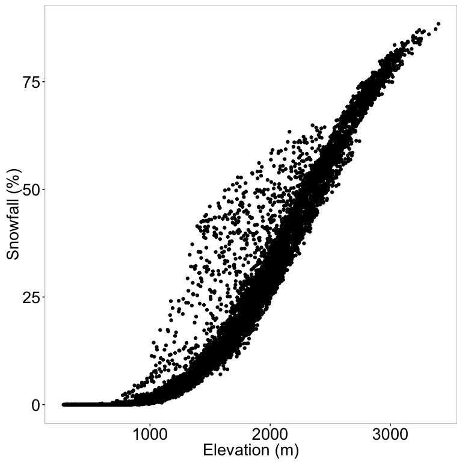
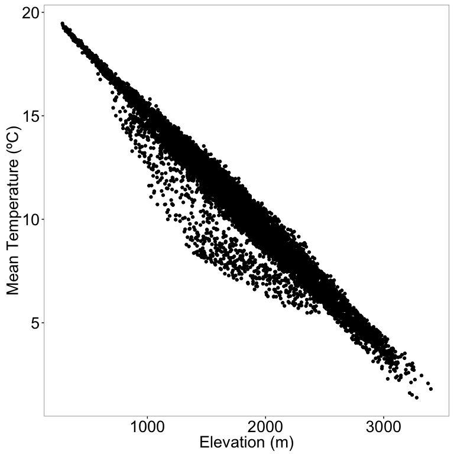
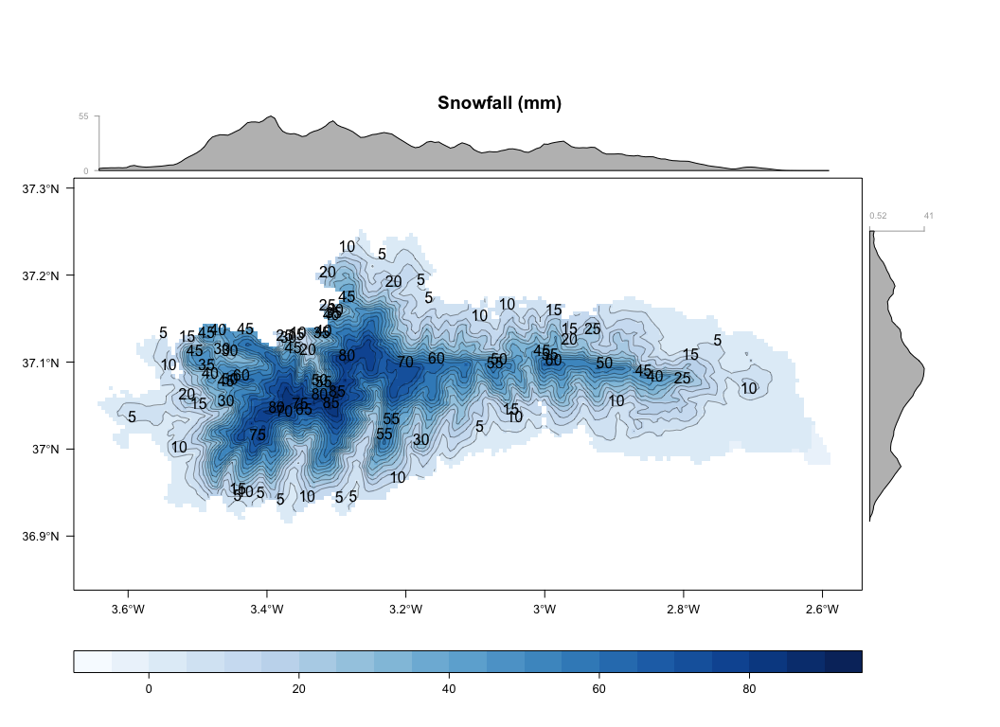
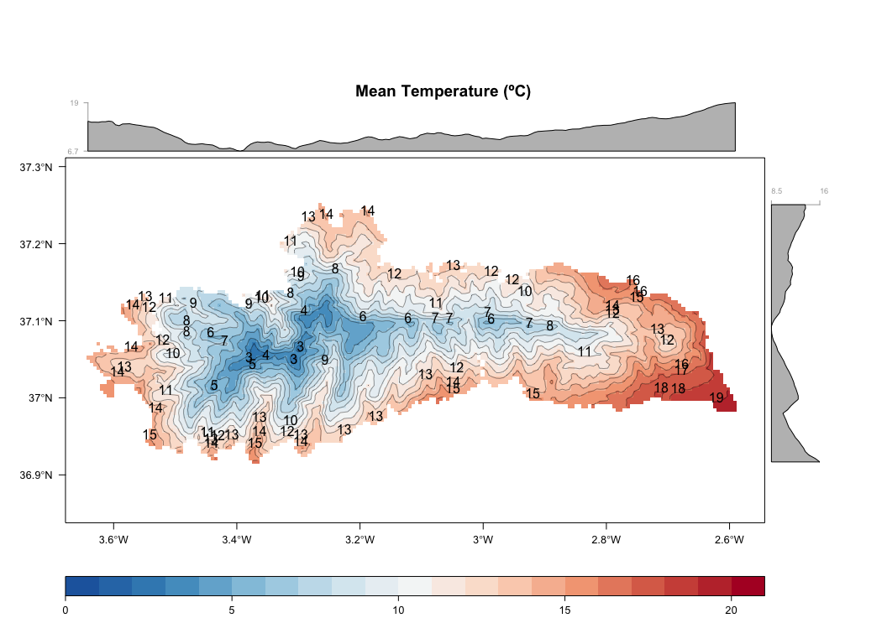

``` r
# Load packages 
library("raster")
library("rgdal")
library("sp")
library("plyr")
library("dplyr")
library("rasterVis") 
library("multcomp")
library("broom") # tidy output models
library("grid") # multiple plots
library("gridExtra") # multiple plots
library("ggplot2")
library("GGally")
library("pander")
library("mclust")
source("http://www.highstat.com/BGS/GAM/RCode/HighstatLibV8.R")
source(paste0(di,"/R/exportpdf.R")) # function to export raster levelplots maps as pdf
```

    ## Loading required package: knitr

Prepare Data
------------

-   Read snow cover indicator data and subset snow cover duration
-   Read topographic data and position (spatial) data
-   Read region data (hydrological basins)

``` r
# Read data (snow cover)
pre <- read.csv(file=paste(di, "/data/raw/PXpxXyear.csv", sep= ""), header = TRUE) 
pre_snow <- read.csv(file=paste(di, "/data/raw/PnXpxXyear.csv", sep= ""), header = TRUE) 
pre_snow_per <- read.csv(file=paste(di, "/data/raw/PorcPnXpxXyear.csv", sep= ""), header = TRUE) 
temp <- read.csv(file=paste(di, "/data/raw/TXpxXyear.csv", sep= ""), header = TRUE) 


# Join Wimmed data
join_aux1 <- inner_join(pre, pre_snow, by=c('id','year'))
join_aux2 <- inner_join(pre_snow_per, temp, by=c('id','year'))
wimmed <- inner_join(join_aux1, join_aux2, by=c('id','year'))

# Set rigth names
names(wimmed)[1] <- "nie_malla_modi_id"


# --   

# Read spatial data and Get lat/long
centroides <- rgdal::readOGR(dsn=paste(di, "/data/geoinfo", sep=""),
                             layer = "centroides_selected", verbose = FALSE)
# Select only attributes of interest and rename them
centroides <- centroides[c("id")]

# Create lat/lng by id 
xycentroides <- cbind(centroides@data, coordinates(centroides))
names(xycentroides) <- c("nie_malla_modi_id", "lon","lat")

xycentroides <- filter(xycentroides, nie_malla_modi_id %in% wimmed$nie_malla_modi_id)

# -- 

# Read Topographic data 
rawtopo <- read.csv(file=paste(di, "/data/topo_nie_malla_modis.csv", sep=""),
                    header=TRUE,
                    sep = ",") 
# function to convert radian to degree 
rad2deg <- function(rad) {(rad * 180) / (pi)} 


topo <- rawtopo %>% 
  filter(id %in% wimmed$nie_malla_modi_id) %>% 
  mutate(nie_malla_modi_id = id, 
         slope50mean_deg = rad2deg(slope50mean),
         slope50median_deg = rad2deg(slope50median),
         aspect50mean_deg = rad2deg(aspect50mean),
         aspect50median_deg = rad2deg(aspect50median)) %>%
  dplyr::select(nie_malla_modi_id, dem50mean, dem50median, slope50mean_deg, 
                slope50median_deg, aspect50mean_deg, aspect50median_deg) 
# -- 

## Hydrological basin 
basin <- read.csv(file=paste(di, "/data/derived/pixel_region.csv", sep=""),
                    header=TRUE,
                    sep = ",") 
# --


# Create objects with basis statistics for all indicators 
indicadores <- c("pre", "pre_snow", "pre_snow_per", "temp") 

# Loop to create objects with basis stats
for (i in indicadores) { 
  vnames <- c("nie_malla_modi_id", i) 
  aux <- wimmed %>%
    dplyr::select(one_of(vnames)) %>%
    mutate_(vinterest = i) %>%
    dplyr::group_by_("nie_malla_modi_id") %>%
    summarise(mean=mean(vinterest),
              sd = sd(vinterest),
              cv = raster::cv(vinterest),
              se = sd / sqrt (length(vinterest))) %>%
    inner_join(topo, by="nie_malla_modi_id") %>%
    inner_join(xycentroides, by="nie_malla_modi_id") %>%
    inner_join(basin, by="nie_malla_modi_id")
  
  assign(i, aux)
} 
```

Explore variables with elevation
--------------------------------

<figure>
<a name="elev_filter"></a>
<figcaption>
</figcaption>
</figure>
<figure>

<figcaption>
<span style="color:black; ">Figure 1: Profile of elevation</span>
</figcaption>
</figure>
<figure>
<a name="elev_filter"></a>
<figcaption>
</figcaption>
</figure>
<figure>

<figcaption>
<span style="color:black; ">Figure 1: Profile of elevation</span>
</figcaption>
</figure>
### Spatial pattern of the wimmed indicators

-   All these rasters are stored at `./data/derived/`

``` r
# Spatial data
# Reproject to utm and m
centroides <- spTransform(centroides, CRS("+init=epsg:23030"))

# Get projection 
projection(centroides) 
```

    ## [1] "+init=epsg:23030 +proj=utm +zone=30 +ellps=intl +towgs84=-87,-98,-121,0,0,0,0 +units=m +no_defs"

``` r
# Select only attributes of interest and rename them
centroides <- centroides[c("id")]
names(centroides) <-"nie_malla_modi_id"

# Which pixels are in the snow object
pix_comunes <- match(wimmed$nie_malla_modi_id, centroides$nie_malla_modi_id)

# Create spatial objetc with centroid of Sierra Nevada
centroides_sn <- centroides[pix_comunes,]

# elevation filter
# el <- '1250'
# el_numeric <- 1250

# Loop to create raster map 
for (i in indicadores) { 
  df <- get(i)
  
  # merge MKT and spatial pixel 
  aux_spatial <- sp::merge(x=centroides_sn, y=df, by="nie_malla_modi_id")
  # aux_spatial_elev <- aux_spatial[c("nie_malla_modi_id", "dem50mean")]
  
  # raster auxiliar 
  aux_rast <- raster(aux_spatial, resolution=500)
  
  # raster of Mean values 
  mean_raster <- rasterize(aux_spatial, aux_rast, "mean", fun=mean)
  names(mean_raster) <- i # Set name of the raster layer 
  
  # raster of CV values
  cv_raster <- rasterize(aux_spatial, aux_rast, "cv", fun=mean)
  names(cv_raster) <- i 


  # assign 
  name_mean <- paste("r_mean_",i, sep="")
  name_cv <- paste("r_cv_",i, sep="")
  
  assign(name_mean, mean_raster)
  writeRaster(mean_raster, file=paste(di, "/data/derived/r_mean_", i, ".asc", sep=""), overwrite=TRUE)
  
  assign(name_cv, cv_raster)
  writeRaster(cv_raster, file=paste(di, "/data/derived/r_cv_", i, ".asc", sep=""), overwrite=TRUE)
  
}
```

Visualization
-------------

For each indicator we plot several maps. See `/images/raster_maps/`

### Pre

<figure>
<a name="pre_mean"></a>
<figcaption>
</figcaption>
</figure>
    ## quartz_off_screen 
    ##                 2

    ## quartz_off_screen 
    ##                 2

<figure>

<figcaption>
<span style="color:black; ">Figure 2: Mean values of Rainfall</span>
</figcaption>
</figure>
    ## quartz_off_screen 
    ##                 2

    ## quartz_off_screen 
    ##                 2

### Pre Snow

<figure>
<a name="pre_snow_mean"></a>
<figcaption>
</figcaption>
</figure>
    ## quartz_off_screen 
    ##                 2

<figure>

<figcaption>
<span style="color:black; ">Figure 3: Mean values of Snowfall</span>
</figcaption>
</figure>
    ## quartz_off_screen 
    ##                 2

    ## quartz_off_screen 
    ##                 2

### Pre Snow Per

<figure>
<a name="pre_snow_per_mean"></a>
<figcaption>
</figcaption>
</figure>
    ## quartz_off_screen 
    ##                 2

<figure>

<figcaption>
<span style="color:black; ">Figure 4: Mean values of Snowfall (%)</span>
</figcaption>
</figure>
    ## quartz_off_screen 
    ##                 2

    ## quartz_off_screen 
    ##                 2

### Temp

<figure>
<a name="temp"></a>
<figcaption>
</figcaption>
</figure>
    ## quartz_off_screen 
    ##                 2

<figure>

<figcaption>
<span style="color:black; ">Figure 5: Mean values of Temp (ºC)</span>
</figcaption>
</figure>
    ## quartz_off_screen 
    ##                 2

    ## quartz_off_screen 
    ##                 2
