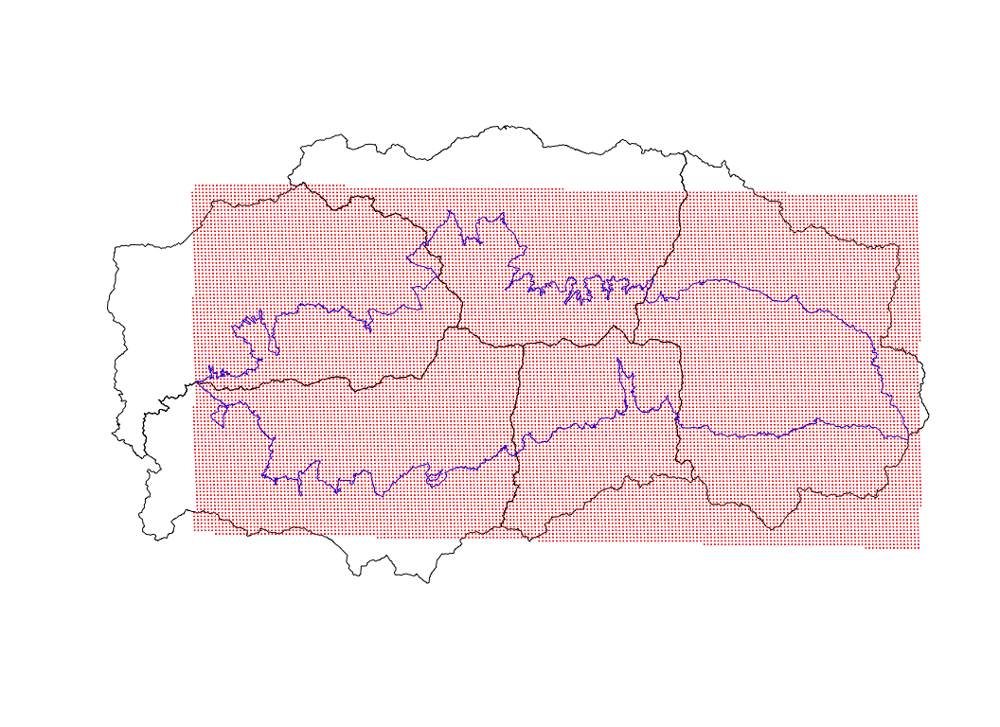
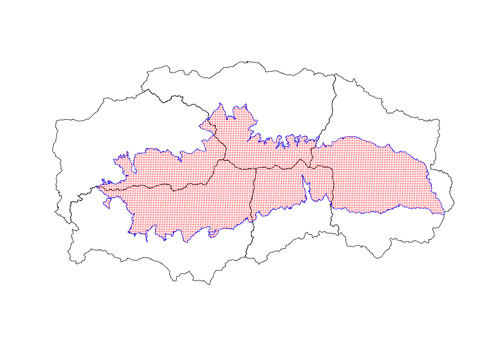
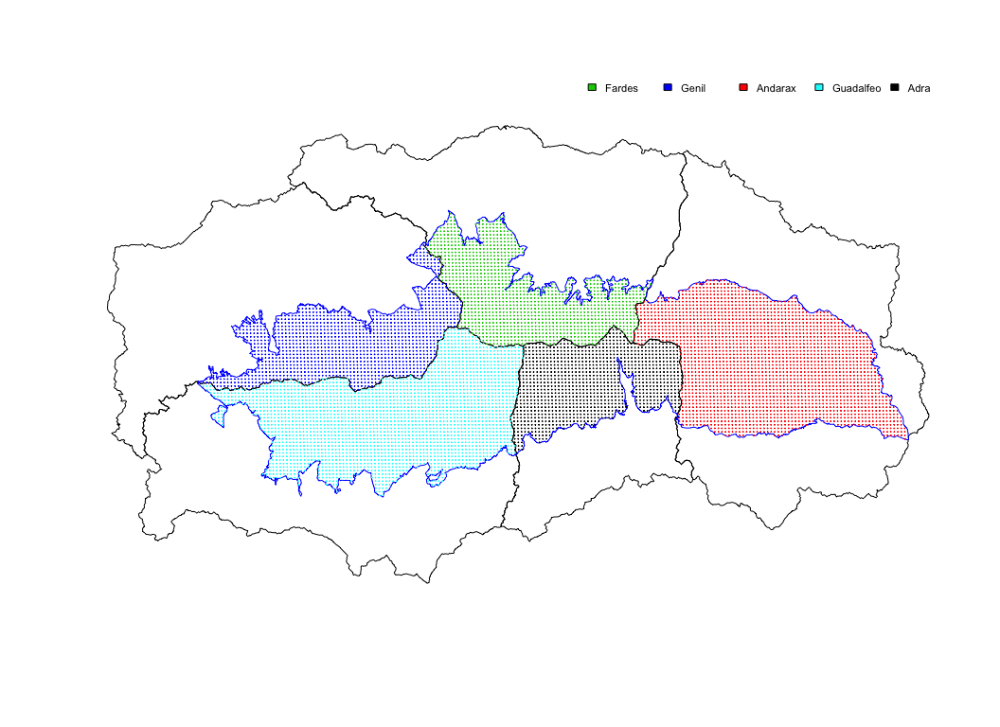

``` r
# Load packages 
library("raster")
library("rgdal")
library("sp")
library("plyr")

library("dplyr")
library("ggplot2")
library("rgeos")
```

    ## Loading required package: knitr

    ## Warning: package 'knitr' was built under R version 3.2.3

Read data and prepare projections
---------------------------------

``` r
## Read region data 
basin_raw <- rgdal::readOGR(dsn=paste(di, "/data/geoinfo", sep=""),
                             layer = "subcuencas", verbose = FALSE)
# Select only basin code (GRIDCODE) and rename
basin_raw <- basin_raw[c("GRIDCODE")]
names(basin_raw) <- "basin_code"
basin_raw@data$basin_code <- as.numeric(basin_raw@data$basin_code)

# Check projection basin layer 
projection(basin_raw)
```

    ## [1] "+proj=utm +zone=30 +ellps=intl +units=m +no_defs"

``` r
# --- 

## Read spatial modis centroids 
centroides <- rgdal::readOGR(dsn=paste(di, "/data/geoinfo", sep=""),
                             layer = "centroides_selected", verbose = FALSE)
# Select only attributes of interest and rename them
centroides <- centroides[c("id")]
names(centroides) <- "nie_malla_modi_id"

# Check projection modis centroides
projection(centroides)
```

    ## [1] "+proj=longlat +datum=WGS84 +no_defs +ellps=WGS84 +towgs84=0,0,0"

``` r
# --- 

## Read pn boundaries 
sn_raw <- rgdal::readOGR(dsn=paste(di, "/data/geoinfo", sep=""),
                             layer = "pnsierranevada", verbose = FALSE)
# Check projection basin layer 
projection(sn_raw)
```

    ## [1] "+proj=longlat +datum=WGS84 +no_defs +ellps=WGS84 +towgs84=0,0,0"

``` r
# --- 

## Reprojection 
# Reproject basin layer to match centroides projection
basin <- spTransform(basin_raw, crs(centroides))

# Reproject sn layer to match centroides projection
sn <- spTransform(sn_raw, crs(centroides))

# Exploratory plot 
plot(basin)
plot(sn, add=TRUE, border='blue')
plot(centroides, add=TRUE, col='red', pch=20, cex=0.1)
```

<figure>
<a name="explora_maps"></a>
<figcaption>
<span style="color:black; ">Figure 1: Plot of basin, protected areas and modis (centroids)</span>
</figcaption>
</figure>
-   The easiest way to get the right pixels is using the `snow_cover` dataset
-   Select the pixels of the centroides that match the `snow_cover` dataset
-   Then apply the overlay opperations

``` r
# Read data (snow cover)
snow <- read.csv(file=paste(di, "/data/raw/snow_sn.csv", sep= ""), header = TRUE) 
# --

# Subset centroides
centroides_sn <- centroides[centroides$nie_malla_modi_id %in% snow$nie_malla_modi_id,]

# Exploratory plot 
plot(basin)
plot(sn, add=TRUE, border='blue')
plot(centroides_sn, add=TRUE, col='red', pch=20, cex=0.1)
```

<figure>
<a name="explora_maps_sn"></a>
<figcaption>
<span style="color:black; ">Figure 2: Plot of basin, protected areas (sn) and modis (centroids) inside SN</span>
</figcaption>
</figure>
Now, we extract info of each region (hydrological basin) by pixel. For each pixel there are two new attributes with info of the region (`basin_code` and `basin_name`). The basin name is:

-   1 = `Genil`
-   2 = `Guadalfeo`
-   3 = `Adra`
-   4 = `Andarax`
-   5 = `Fardes`

At the end, a `csv` file is exported and store at `./data/derived/pixel_region.csv`

``` r
# Extract (overlay)
centroides_sn <- cbind(centroides_sn, over(centroides_sn, basin))

# Create factor with basin names
centroides_sn$basin_name <- as.factor(mapvalues(centroides_sn$basin_code, 
                                  c(1,2,3,4,5), 
                                  c("Genil", "Guadalfeo", "Adra", "Andarax", "Fardes")))

# Exploratory plot
plot(basin)
plot(sn, add=TRUE, border='blue')
points(centroides_sn$coords.x1, centroides_sn$coords.x2, 
       col=centroides_sn$basin_code, pch=20, cex=0.1)
```

<figure>
<a name="explora_maps_sn_pixel"></a>
<figcaption>
<span style="color:black; ">Figure 3: Modis pixel coloured by basin</span>
</figcaption>
</figure>
``` r
# Export table 
write.table(centroides_sn[,c("nie_malla_modi_id","basin_code", "basin_name")], file=paste(di, "/data/derived/pixel_region.csv", sep=""), row.names=FALSE, sep=',')
```
