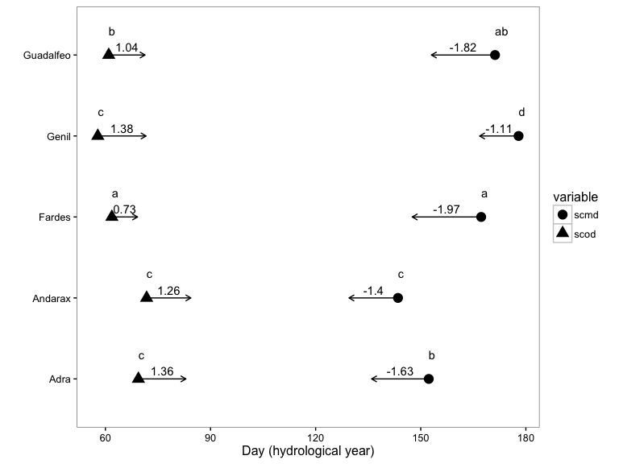
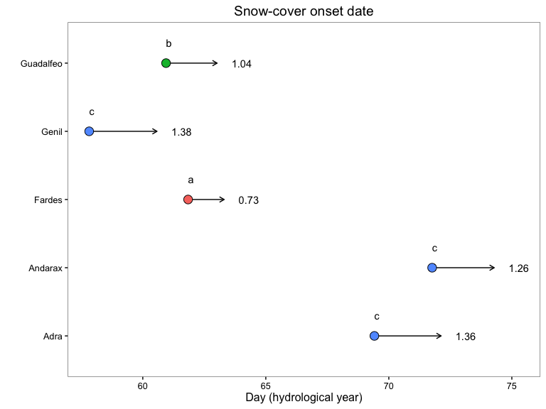

``` r
# Load packages 
library("raster")
library("rgdal")
library("sp")
library("dplyr")
library("ggplot2")
library("GGally")
source(paste0(di,"/R/exportpdf.R")) # function to export raster levelplots maps as pdf
```

    ## Loading required package: knitr

Prepare Data
------------

``` r
# Read data (snow cover)
snow <- read.csv(file=paste(di, "/data/raw/snow_sn.csv", sep= ""), header = TRUE) 
# --   

# Read spatial data and Get lat/long
centroides <- rgdal::readOGR(dsn=paste(di, "/data/geoinfo", sep=""),
                             layer = "centroides_selected", verbose = FALSE)
# Select only attributes of interest and rename them
centroides <- centroides[c("id")]

# Create lat/lng by id 
xycentroides <- cbind(centroides@data, coordinates(centroides))
names(xycentroides) <- c("nie_malla_modi_id", "lon","lat")

xycentroides <- filter(xycentroides, nie_malla_modi_id %in% snow$nie_malla_modi_id)

# -- 

# Read Topographic data 
rawtopo <- read.csv(file=paste(di, "/data/topo_nie_malla_modis.csv", sep=""),
                    header=TRUE,
                    sep = ",") 
# function to convert radian to degree 
rad2deg <- function(rad) {(rad * 180) / (pi)} 


topo <- rawtopo %>% 
  filter(id %in% snow$nie_malla_modi_id) %>% 
  mutate(nie_malla_modi_id = id, 
         slope50mean_deg = rad2deg(slope50mean),
         slope50median_deg = rad2deg(slope50median),
         aspect50mean_deg = rad2deg(aspect50mean),
         aspect50median_deg = rad2deg(aspect50median)) %>%
  dplyr::select(nie_malla_modi_id, dem50mean, dem50median, slope50mean_deg, 
                slope50median_deg, aspect50mean_deg, aspect50median_deg) 
# -- 

## Hydrological basin 
basin <- read.csv(file=paste(di, "/data/derived/pixel_region.csv", sep=""),
                    header=TRUE,
                    sep = ",") 
# --


# Create objects with basis statistics for all indicators 
indicadores <- c("scd", "scod", "scmd", "scmc") 

# Loop to create objects with basis stats
for (i in indicadores) { 
  vnames <- c("nie_malla_modi_id", i) 
  aux <- snow %>%
    dplyr::select(one_of(vnames)) %>%
    mutate_(vinterest = i) %>%
    group_by_("nie_malla_modi_id") %>%
    summarise(mean=mean(vinterest),
              sd = sd(vinterest),
              cv = raster::cv(vinterest),
              se = sd / sqrt (length(vinterest))) %>%
    inner_join(topo, by="nie_malla_modi_id") %>%
    inner_join(xycentroides, by="nie_malla_modi_id") %>%
    inner_join(basin, by="nie_malla_modi_id")
  
  assign(i, aux)
} 
```

Get mean values by basin
------------------------

``` r
scd_basin <- scd %>% 
  filter(dem50mean > 1250) %>% 
  mutate(vinteres = mean) %>%
  group_by(basin_name) %>% 
  summarise(mean=mean(vinteres),
              sd = sd(vinteres),
              se = sd / sqrt (length(vinteres))) %>%
   mutate(variable = 'scd')

scod_basin <- scod %>% 
  filter(dem50mean > 1250) %>% 
  mutate(vinteres = mean) %>%
  group_by(basin_name) %>% 
  summarise(mean=mean(vinteres),
              sd = sd(vinteres),
              se = sd / sqrt (length(vinteres))) %>%
   mutate(variable = 'scod')
  
scmd_basin <- scmd %>% 
  filter(dem50mean > 1250) %>% 
  mutate(vinteres = mean) %>%
  group_by(basin_name) %>% 
  summarise(mean=mean(vinteres),
              sd = sd(vinteres),
              se = sd / sqrt (length(vinteres))) %>%
  mutate(variable = 'scmd')
```

Trends
======

``` r
stats_basin <- read.csv(file=paste(di, '/data/stats_basin.csv', sep=''), header=TRUE) 
```

``` r
df_aux_scod <- stats_basin %>% 
  filter(variable == 'sen_slope_scod') %>%
  mutate(myxend = mean) %>% 
  select(basin_name, myxend) %>%
  inner_join(scod_basin, by='basin_name') 

# See exlore_snow_trends
df_aux_scod$letter <- c('c', 'c', 'a', 'c', 'b') 

df_aux_scmd <- stats_basin %>% 
  filter(variable == 'sen_slope_scmd') %>%
  mutate(myxend = mean) %>% 
  select(basin_name, myxend) %>%
  inner_join(scmd_basin, by='basin_name')

# See exlore_snow_trends  
df_aux_scmd$letter <- c('b', 'c', 'a', 'd', 'ab') 

df <- rbind(df_aux_scod, df_aux_scmd)
```

<figure>
<a name="trend_raw_all"></a>
<figcaption>
<span style="color:black; ">Figure 1: Mean values and trend for Snow cover indicators</span>
</figcaption>
</figure>
<figure>
<a name="trend_raw_scod"></a>
<figcaption>
<span style="color:black; ">Figure 2: Mean values and trend for Snow cover Onset date</span>
</figcaption>
</figure>
<figure>
<a name="trend_raw_scmd"></a>
<figcaption>
<span style="color:black; ">Figure 3: Mean values and trend for Snow cover melting date</span>
</figcaption>
</figure>
