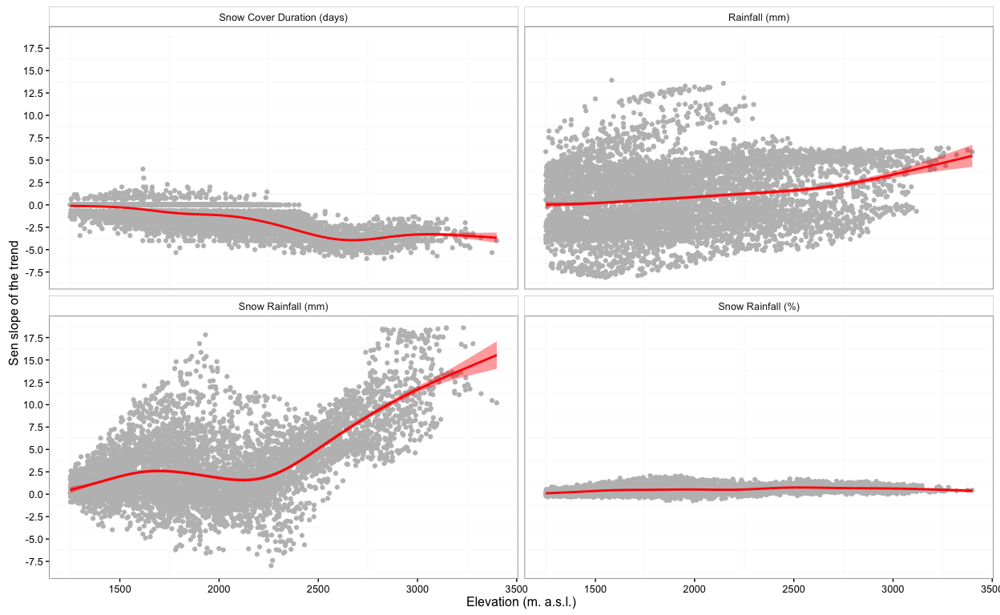
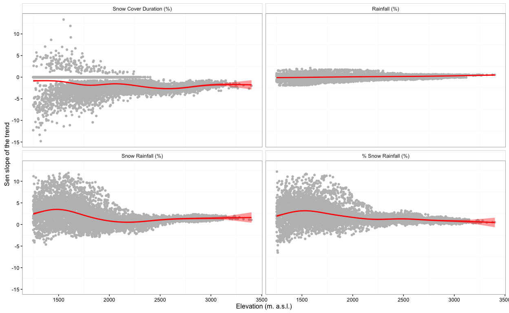
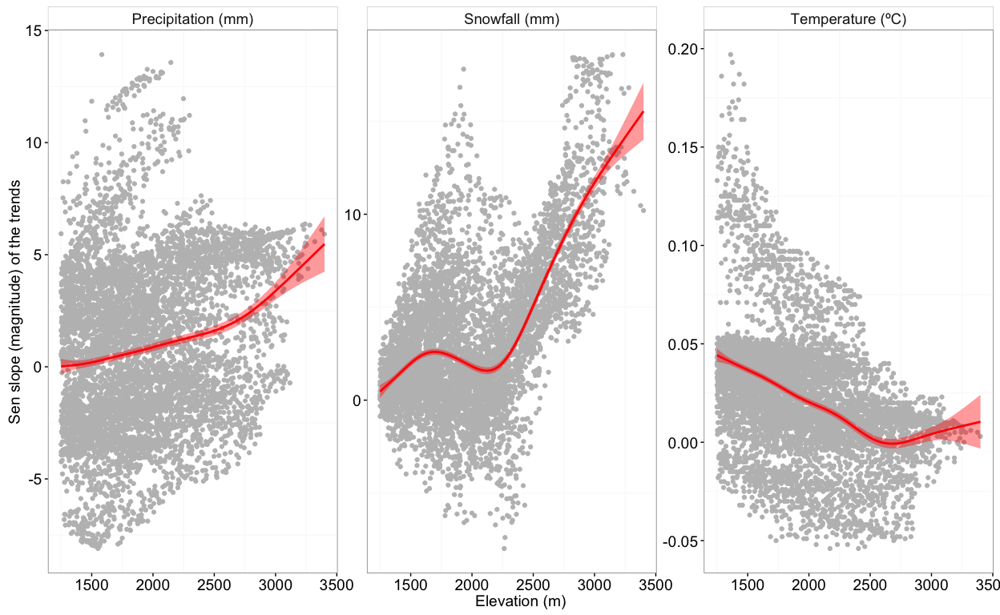
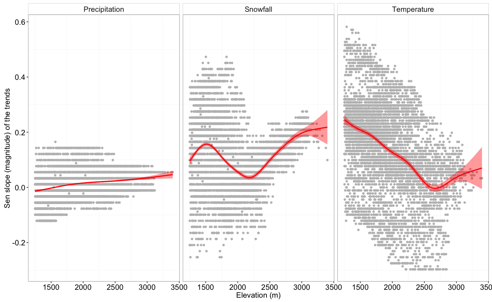

Prepare Data
------------

1.  Read data of Mann-Kendal Sen-Slope for each pixels and snow-cover related indicators (scd, scod, scmd, scmc).
2.  Read data of topographic variable:
    -   Convert radian to deg.
    -   Create categorical variable for elevation (250 m)
    -   Classify aspect into 8 categories

3.  Read data from hydrological basin
4.  Read spatial data:
    -   Select only centroides of interest

5.  Create two dataframes:
    -   **Full Dataframe** with all variables and all pixels (`fulldf`)
    -   **Filter dataframe** with all variables and filter by pixels above 1250 *m.a.s.l.* (`fulldf1250`)

``` r
# Trend analysis data
# Define name of indicators (see variables names)
indicadores <- c("scd", "scod", "scmd", "scmc", "pre", "pre_snow", "pre_snow_per", "temp")

# Loop to read files 
for (j in indicadores){ 
  aux <- read.csv(file=paste(di, "/data/derived/", j, ".csv", sep= ""),
              header = TRUE,
              sep = ',')
  assign(j, aux)
}
# --

# Define pixels of interes 
pixels_interes <- scd$nie_malla_modi_id

# Read Topographic data 
rawtopo <- read.csv(file=paste(di, "/data/topo_nie_malla_modis.csv", sep=""),
                    header=TRUE,
                    sep = ",") 

# function to convert radian to degree 
rad2deg <- function(rad) {(rad * 180) / (pi)} 


topo <- rawtopo %>% 
  filter(id %in% pixels_interes) %>% 
  mutate(nie_malla_modi_id = id, 
         slope50mean_deg = rad2deg(slope50mean),
         slope50median_deg = rad2deg(slope50median),
         aspect50mean_deg = rad2deg(aspect50mean),
         aspect50median_deg = rad2deg(aspect50median)) %>%
  dplyr::select(nie_malla_modi_id, dem50mean, dem50median, slope50mean_deg, 
                slope50median_deg, aspect50mean_deg, aspect50median_deg) 

## Create interval variables (250 m) for dem; and classify aspect into 8 categories 
topo <- topo %>% 
  mutate(dem50mean_group = cut(dem50mean, 
                         breaks = seq(from=0, to=3500, by=250),
                         labels = c("0-250", "251-500","501-750","751-1000",
                                    "1001-1250","1251-1500","1501-1750","1751-2000",
                                    "2001-2250","2251-2500","2501-2750", "2751-3000",
                                    "3001-3250", "3251-3500")),
         aspect50mean_deg_group = cut(aspect50mean_deg, 
                                      breaks= c(22.5, 67.5, 112.5, 157.5, 202.5, 247.5, 292.5, 337.5, 359.5),
                                      labels = c("N", "NE", "E", "SE", "S", "SW", "W", "NW")))


# --

# Read spatial data and Get lat/long
centroides <- rgdal::readOGR(dsn=paste(di, "/data/geoinfo", sep=""),
                             layer = "centroides_selected", verbose = FALSE)
# Select only attributes of interest and rename them
centroides <- centroides[c("id")]

# Create lat/lng by id 
xycentroides <- cbind(centroides@data, coordinates(centroides))
names(xycentroides) <- c("nie_malla_modi_id", "lon","lat")

xycentroides <- filter(xycentroides, nie_malla_modi_id %in% pixels_interes)
# -- 

# Hydrological basin 
basin <- read.csv(file=paste(di, "/data/derived/pixel_region.csv", sep=""),
                    header=TRUE,
                    sep = ",") 
# --


# Create un dataframe con todos los datos
fulldf <- topo %>% 
  inner_join(scod,  by=c("nie_malla_modi_id")) %>% 
  inner_join(scd,  by=c("nie_malla_modi_id")) %>% 
  inner_join(scmd,  by=c("nie_malla_modi_id")) %>% 
  inner_join(scmc,  by=c("nie_malla_modi_id")) %>%
  inner_join(pre,  by=c("nie_malla_modi_id")) %>% 
  inner_join(pre_snow,  by=c("nie_malla_modi_id")) %>% 
  inner_join(pre_snow_per,  by=c("nie_malla_modi_id")) %>% 
  inner_join(temp,  by=c("nie_malla_modi_id")) %>% 
  inner_join(xycentroides, by="nie_malla_modi_id") %>%
  inner_join(basin, by="nie_malla_modi_id")

# Create subset of pixels above 1250 
fulldf1250 <- fulldf %>% 
  filter(dem50mean > 1250)  
```

Explore trends by elevation
===========================

Sen of scd, pre, pre\_snow, pre\_snow\_per
------------------------------------------

``` r
df <- fulldf1250

dfaux <- df %>% select(dem50mean, sen_slope_scd, sen_slope_pre, sen_slope_pre_snow, sen_slope_pre_snow_per)

dfplot <- melt(dfaux, id='dem50mean')

label_variables <- c('sen_slope_scd' = 'Snow Cover Duration (days)', 
                     'sen_slope_pre' = 'Rainfall (mm)',
                     'sen_slope_pre_snow' = 'Snow Rainfall (mm)',
                     'sen_slope_pre_snow_per' = 'Snow Rainfall (%)')


a <- ggplot(dfplot, aes(x=dem50mean, y=value)) + 
  geom_point(col='grey') + 
  geom_smooth(method="gam", formula = y ~ s(x), fill='red', col='red') + 
  facet_wrap(~variable, labeller = as_labeller(label_variables)) +
  xlab('Elevation (m. a.s.l.)') + ylab('Sen slope of the trend') +
  theme_bw() + theme(panel.grid.major=element_blank(),
                       # panel.grid.minor=element_blank(),
                       strip.background=element_rect(fill='white')) +
  scale_y_continuous(breaks = seq(-10,20, by=2.5))
a 
```



``` r
#pdf(file=paste0(di, "/images/plot_sen_slopes_by_elevation_all.pdf"), height = 10, width = 14)
#a 
#dev.off()
```

Sen of scd, pre, pre\_snow, pre\_snow\_per
==========================================

``` r
# Remove pre_snow_per
dfaux <- df %>% select(dem50mean, sen_slope_scd, sen_slope_pre, sen_slope_pre_snow)

dfplot <- melt(dfaux, id='dem50mean')

label_variables <- c('sen_slope_scd' = 'Snow Cover Duration (days)', 
                     'sen_slope_pre' = 'Precipitation (mm)',
                     'sen_slope_pre_snow' = 'Snowfall (mm)')


a <- ggplot(dfplot, aes(x=dem50mean, y=value)) + 
  geom_point(col='grey') + 
  geom_smooth(method="gam", formula = y ~ s(x), fill='red', col='red') + 
  facet_wrap(~variable, labeller = as_labeller(label_variables)) +
  xlab('Elevation (m)') + ylab('Sen slope (magnitude) of the trend') +
  theme_bw() + theme(panel.grid.major=element_blank(),
                       strip.background=element_rect(fill='white'),
                     axis.text = element_text(size = rel(1.2)),
                     axis.title = element_text(size = rel(1.2)),
                     strip.text = element_text(size = 14)) +
  scale_y_continuous(breaks = seq(-10,20, by=2.5))


a 
```


``` r
pdf(file=paste0(di, "/images/plot_sen_slopes_by_elevation.pdf"), height = 4, width = 10)
a 
dev.off()
```

    ## quartz_off_screen 
    ##                 2

Sen slope percentages
=====================

``` r
dfaux <- df %>% select(dem50mean, sen_slope_per_scd, sen_slope_per_pre, sen_slope_per_pre_snow,
                       sen_slope_per_pre_snow_per)

dfplot <- melt(dfaux, id='dem50mean')

label_variables <- c('sen_slope_per_scd' = 'Snow Cover Duration (%)', 
                     'sen_slope_per_pre' = 'Rainfall (%)',
                     'sen_slope_per_pre_snow' = 'Snow Rainfall (%)',
                     'sen_slope_per_pre_snow_per' = '% Snow Rainfall (%)')


ggplot(dfplot, aes(x=dem50mean, y=value)) + 
  geom_point(col='grey') + 
  geom_smooth(method="gam", formula = y ~ s(x), fill='red', col='red') + 
  facet_wrap(~variable, labeller = as_labeller(label_variables)) +
  xlab('Elevation (m. a.s.l.)') + ylab('Sen slope of the trend') +
  theme_bw() + theme(panel.grid.major=element_blank(),
                       # panel.grid.minor=element_blank(),
                       strip.background=element_rect(fill='white')) 
```



Sen of pre, pre\_snow, temp
===========================

``` r
# Remove pre_snow_per
dfaux <- df %>% select(dem50mean, sen_slope_pre, sen_slope_pre_snow, sen_slope_temp)

dfplot <- melt(dfaux, id='dem50mean')

label_variables <- c('sen_slope_pre' = 'Precipitation (mm)',
                     'sen_slope_pre_snow' = 'Snowfall (mm)',
                     'sen_slope_temp' = 'Temperature (ºC)')


a <- ggplot(dfplot, aes(x=dem50mean, y=value)) + 
  geom_point(col='grey') + 
  geom_smooth(method="gam", formula = y ~ s(x), fill='red', col='red') + 
  facet_wrap(~variable, labeller = as_labeller(label_variables), scales= "free_y") +
  xlab('Elevation (m)') + ylab('Sen slope (magnitude) of the trends') +
  theme_bw() + theme(panel.grid.major=element_blank(),
                     strip.background=element_rect(fill='white'),
                     axis.text = element_text(size = rel(1.2)),
                     axis.title = element_text(size = rel(1.2)),
                     strip.text = element_text(size = 14))
a 
```



``` r
#pdf(file=paste0(di, "/images/plot_sen_elevation_pre_snow_temp.pdf"), height = 4, width = 10)
#a 
#dev.off()
```

Tau of pre, pre\_snow, temp
===========================

``` r
# Remove pre_snow_per
dfaux <- df %>% select(dem50mean, tau_pre, tau_pre_snow, tau_temp)

dfplot <- melt(dfaux, id='dem50mean')

label_variables <- c('tau_pre' = 'Precipitation',
                     'tau_pre_snow' = 'Snowfall',
                     'tau_temp' = 'Temperature')


a <- ggplot(dfplot, aes(x=dem50mean, y=value)) + 
  geom_point(col='grey') + 
  geom_smooth(method="gam", formula = y ~ s(x), fill='red', col='red') + 
  facet_wrap(~variable, labeller = as_labeller(label_variables)) +
  xlab('Elevation (m)') + ylab('Sen slope (magnitude) of the trends') +
  theme_bw() + theme(panel.grid.major=element_blank(),
                     strip.background=element_rect(fill='white'),
                     axis.text = element_text(size = rel(1.2)),
                     axis.title = element_text(size = rel(1.2)),
                     strip.text = element_text(size = 14))
a 
```



``` r
pdf(file=paste0(di, "/images/plot_tau_elevation_pre_snow_temp.pdf"), height = 4, width = 10)
a 
dev.off()
```

    ## quartz_off_screen 
    ##                 2
